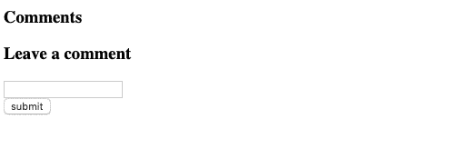

# JavaScript 基础之后是什么

> 原文：<https://betterprogramming.pub/whats-next-after-javascript-fundamentals-16431b88d0a3>


当我第一次开始独自学习 web 开发时，我经常为找到学习的下一步而挣扎。我会在 Coursera、Udemy、Udacity、PluralSight 和 FreeCodeCamp 等热门网站上学习一些 JavaScript 课程。在完成一门基础课程后，我经常会问自己，“接下来是什么？”我经常开始一些过于高深的课程，因为我认为我懂 JavaScript。一个反复出现的主题是，我一直在开始一些课程，要么太基础，要么太高级。下一个正确的步骤在哪里？

自学的最大挑战是不知道自己不知道什么，以及如何填补这些知识空白。最快最直接的路径就是找一个导师帮你填补知识空白。如果你还没有一个编码夏尔巴人，但是你正在成为一名 web 开发人员，这篇文章是为你准备的。这是我希望在完成基础课程后找到的指南。

# JavaScript:大图

让我们看一个与网页交互的例子，以及如何使用 JavaScript。这是我的应用程序的导航条。


1.  用户导航到一个网站。该网站呈现在 HTML 和 CSS 样式。
2.  然后，用户与页面进行交互，比如单击导航栏上的一个配置文件按钮。
3.  页面响应用户的交互。
4.  然后，应用程序在其服务器上发送和存储用户交互信息。

web 编程的核心可以概括为三个阶段。在这篇文章中，我们将通过一个例子简要介绍第一步和第二步，以理解 JavaScript 在 web 开发中是如何使用的。

# Web 编程的核心

> 关联 JavaScript 事件
> 
> 操纵 DOM
> 
> 与服务器通信

# DOM 操作

使用 JavaScript，我们将编写一个简单的表单，在用户单击提交按钮后，该表单将在屏幕上呈现评论。要理解这个例子，建议对 HTML 和 JavaScript 有一个基本的了解。本教程的目标是让您熟悉 DOM 操作流程。看一下我们将在下面构建的示例。



下面的代码显示了我们将在本演练中引用的 HTML 代码。我们将在一个名为`index.js`的不同文件中编写 JavaScript 代码。

## 让我们把它伪代码出来

在整篇文章中，我们将引用这段 HTML 代码并演练这段伪代码。

```
index.js
// Select the Submit Button
// Listen for a click 
// Grab the input from the comment form
// Render the new comment on the page dynamically
```

## 在 DOM 上选择元素

有许多方法可以在 DOM 上选择项目。最方便的方法是使用[查询选择器](https://developer.mozilla.org/en-US/docs/Web/API/Document/querySelector)。文档是一个我们可以调用 querySelector 的对象。querySelector 返回 DOM 中匹配指定选择器或选择器组的第一个元素。如果没有找到匹配，它返回`null`。

在我们的注释示例中，我们可以使用下面的代码通过 ID 选择提交按钮。

```
document.querySelector("#submit");
```

还有其他方法来选择 DOM 中的提交按钮。

```
document.getElementById("submit");
```

注意，在第一个和第二个例子中，我们用元素的 ID 调用 DOM 元素。在第一个例子中，为了调用`querySelector`，我们需要在字符串中包含`#`，以表明该查询是一个 ID。而在第二个例子中，已经通过 ID 显式地搜索了元素。

选择 DOM 元素后，我们需要将该元素赋给一个变量，以便以后引用它。让我们称我们的变量为`submit`。

```
const submit = document.getElementById("submit");
```

## 向元素添加事件侦听器

一旦我们将一个元素绑定到一个变量，我们就有了一种方法来调用这个元素作为一个对象。

```
submit.addEventListener("click", comment);
```

我们现在可以使用 [addEventListener](https://developer.mozilla.org/en-US/docs/Web/API/EventTarget/addEventListener) 在对象上添加一个事件监听器。事件侦听器是一种侦听将触发回调函数的事件的方法。有数百个事件侦听器可以添加到对象中。最常见的事件监听器是`click`、`keydown`和`change`。有关事件监听器的完整列表，请参考此处的文档。

回调函数是事件侦听器上的参数。事件侦听器将等待事件发生，然后回调函数将触发。当这些回调函数被触发时，网页用户交互的神奇酱就发生了。所有的 JavaScript 基础培训都是为了让你达到这一点。

> 回调函数允许你在用户与你网页交互后操作数据来执行特定的行为或者渲染到屏幕上。

## 创建回调函数

让我们创建回调函数注释。我们会用老办法，远离 ES6 的语法糖。

```
function comment(event){
 event.preventDefault()
}
```

我们创建了函数注释，并期待参数事件。请注意，我们没有在事件侦听器中传递事件。默认情况下，会传入事件。我们不会在这里深入讨论合成事件的细节，但是请注意，这就是函数中仍然接收事件的原因。

这条神秘的线是什么？

```
event.preventDefault()
```

本质上，我们监听表单提交按钮，默认行为是使用`REST`约定`POST`数据。如果您想了解更多关于 REST 约定和 HTTP 动词以及它们的作用，这里有一个很好的资源。现在，我们正在开发一个单页面应用程序，我们不想走`POST`路线，所以我们正在防止默认行为。

让我们在这里暂停一下。我们现在需要创建一个`<li>`来显示我们的评论。一个`<li>`元素作为子元素嵌套在一个`<ul>`元素中。看看能不能通过引用上面的 HTML 弄清楚获取`<ul>`元素的代码？回来检查你的答案。

我们继续。如果你有下面的代码或类似的，伟大的工作！

```
const ul = document.querySelector('#comments');
```

## 存储输入元素

为了获取输入，我们需要找到元素。我们可以看到评论的 ID 是`comment`。让我们获取元素的值，并一次性将其赋给一个变量。

```
const comment = document.querySelector('#comment').value;
```

在元素上调用方法值将在提交按钮被触发时获取输入字段，并将字符串存储到变量 comment 中。

## 动态呈现元素

为了在 JS 中创建元素，我们可以使用方法`[createElement](https://developer.mozilla.org/en-US/docs/Web/API/Document/createElement)`并传入我们想要创建的元素的字符串。在这个实例中，我们想要创建一个`<li>`元素。

```
const li = document.createElement('li');
```

我们正在调用文档对象并请求一个`<li>`元素。简单。

接下来，我们想要将用户的输入注入到`<li>`元素中。`innerHTML`允许字符串注释在`<li>`元素中传递。

```
li.innerHTML = comment
```

最后，我们需要将刚刚创建的元素添加到 DOM 上已经存在的框架中。

```
ul.appendChild(li)
```

通过使用`[appendChild](https://developer.mozilla.org/en-US/docs/Web/API/Node/appendChild)`，我们实际上是将刚刚创建的`<li>`元素挂在 DOM 上已经存在的`<ul>`元素上。我们现在已经成功地在单页面应用程序上动态呈现了用户评论。

## 错误处理

回调函数已经完成，并且做了它应该做的事情。然而，为了对我们的用户体验负责，我们需要编写错误处理并清除输入字段。这可以相对简单地完成。下面是回调函数的完整的`index.js`代码。

# 下一步是什么

我想创建这个系列，“下一步是什么”，来帮助那些曾经处在我的位置上的有抱负的开发人员在软件开发的信息海洋中导航。我们已经讨论了 JavaScript 事件和操作 DOM 的基本关联。我建议创建您自己版本的 HTML 和 JavaScript 文件，并按照步骤一和步骤二进行操作。重读一遍，尽你最大的努力去理解网络编程的三个核心步骤，你将会有一个很好的前进路线图。

下一步是通过与您的服务器通信，允许数据持久存储在数据库中。在我的下一篇文章中，我将介绍如何使用 Javascript promises 调用 API 端点，以便我们可以处理您的网页上的数据。