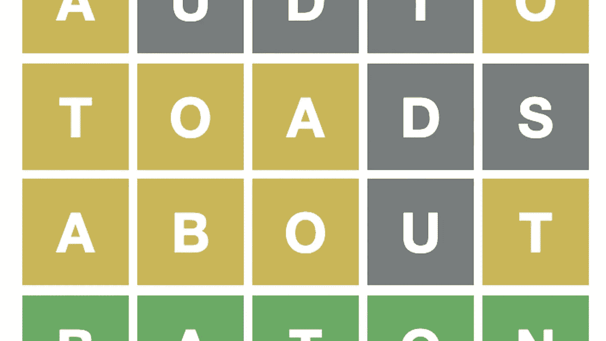
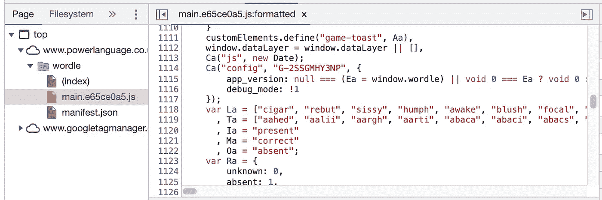
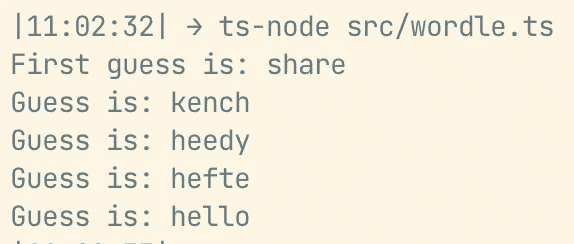

# 给 Wordle 最好的第一个词是什么？

> 原文：<https://betterprogramming.pub/whats-the-best-first-word-for-wordle-bb94db15ad2e>

## **TL；博士**:Wordle 最好的起始词是`'crate'`。请阅读下面的内容，找出原因！



# 介绍

Wordle 是一款风靡全球的在线益智游戏。每天，Wordle 都会给玩家一个新单词让他们猜，玩家有六次猜词的机会来找到答案。随着游戏的流行，许多人一直在争论是否有一个确定的“最佳第一个单词”，可以最大限度地增加他们在最少的步骤中赢得谜题的机会。在这篇博客中，我将向你展示我写的一个基本算法来尝试回答这个问题！

# 步骤 1:构建游戏检查器

第一步是构建一个复制游戏检查器的函数。在 wordle 中，当你猜一个单词时，它会用三种颜色告诉你你的单词与答案的接近程度——灰色、黄色和绿色。

举个例子，假设 ***的答案*** 是`grave`，而你的 ***的猜测*** 是`large`，wordle 会返回这样的东西:


含义:

*   `l`不在话下
*   `a`、`r`、`g`都在字里，但是位置不对
*   `e`在单词中并处于正确的位置

为了实现这一点，我添加了一个类型结果类型:

```
type Result = 'correct' | 'exists' | 'absent';
```

然后我写了一个`evaluateGuess`方法，它接受一个`guess`和一个`answer`，并为猜测中的每个字母返回一个数组`Result`。函数如下:

# 第二步:构建播放器

下一步是构建一个玩游戏的算法，通过基于当前游戏状态建议下一个猜测，然后调用`evaluateGuess`来确定新的游戏状态。

## 获取所有 5 个字母单词

在写算法之前，我们需要一组 5 个字母的单词来选择下一个猜测。幸运的是，我通过查看源代码找到了 Wordle 使用的单词集:



Wordle 的源代码

## 下一个猜测建议者

接下来，我想写一个算法，它将获取当前的游戏状态，并从单词列表中返回下一次猜测的建议。当前游戏状态可以表示为:

*   我们知道的字母目前是`correct`，可以表示为`(string | undefined)[]`
*   我们知道的字母目前是`existing`，可以表示为 *<已知现有字母>* 到 *<已知错误位置>* 的映射，例如`{ [k: string]: number[] }`
*   我们知道的字母目前是`absent`，可以表示为`string[]`

一个示例游戏状态可以是:

```
*{
  currCorrect: ['s', undefined, undefined, 'r', undefined],
  currExisting: { 'a': [1], 'e': [1, 2] },
  currAbsent: ['x', 'c', 'f', 'o', 'w'],
}*
```

一旦我定义了游戏状态类型，我想写一个`makeNextGuess`方法，它:

*   从单词集中随机选择一个单词(单词集被打乱以防止总是从字母`a`开始)
*   检查单词在当前游戏状态下是否合适(例如`currAbsent`中不包含任何字母)
*   返回第一个符合这些条件的单词作为建议的猜测

方法如下:

## 游戏玩家

既然我有了提供下一个猜测的方法，我想写一个游戏运行程序:

*   接受一个`answer`和一个`firstGuess`
*   交替调用`evaluateGuess`和`makeNextGuess`直到`guess === answer`
*   返回算法得出答案所用的猜测列表

以下是`firstGuess: 'share'`和`answer: 'hello'`的预期输出示例



“自动运行游戏”的输出示例

方法如下:

# 第三步:找到最好的第一个单词

现在我们有了一个算法，可以在给定一个`firstGuess`和一个`answer`的情况下自动运行游戏，我可以用它来编写一个`findBestFirstWord`方法:

*   用集合中的每一个单词对每一个其他单词调用`autorunGame`
*   为了准确起见，重复这些呼叫 10 次
*   对于每一个`firstGuess`，计算 ***的平均*** 的猜测次数来寻找答案

一旦我们有了每个单词的平均猜测次数，找出平均*最低的单词。*

*算法是这样的:*

# *结论*

*从运行这个算法，输出的最佳字首字是…`crate`！*

*值得注意的是，有许多方法可以改进这个算法。[不同的文章](https://www.inverse.com/gaming/wordle-starting-words-best-using-math)提供了寻找最佳首字的不同策略，比如计算最常见的字母及其出现频率。*

*感谢阅读！*