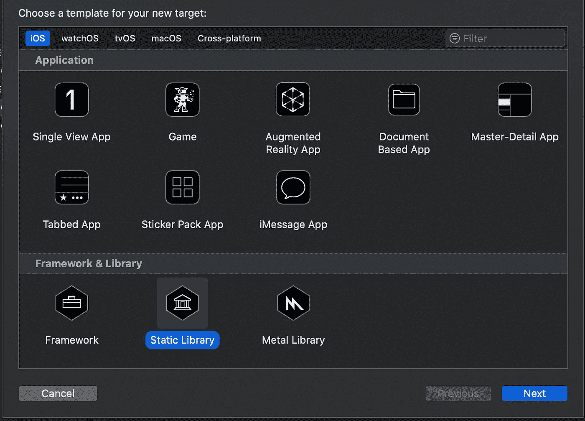
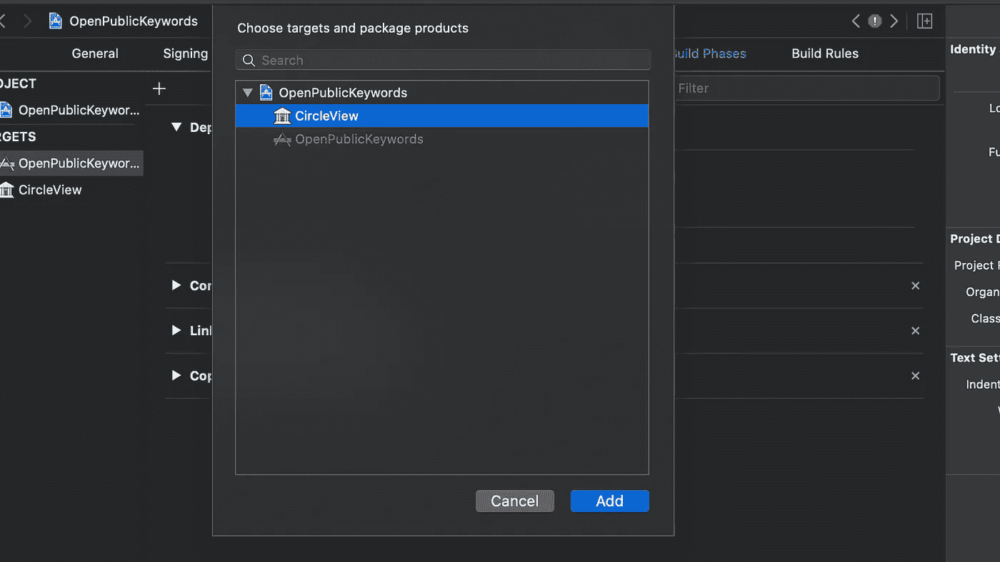
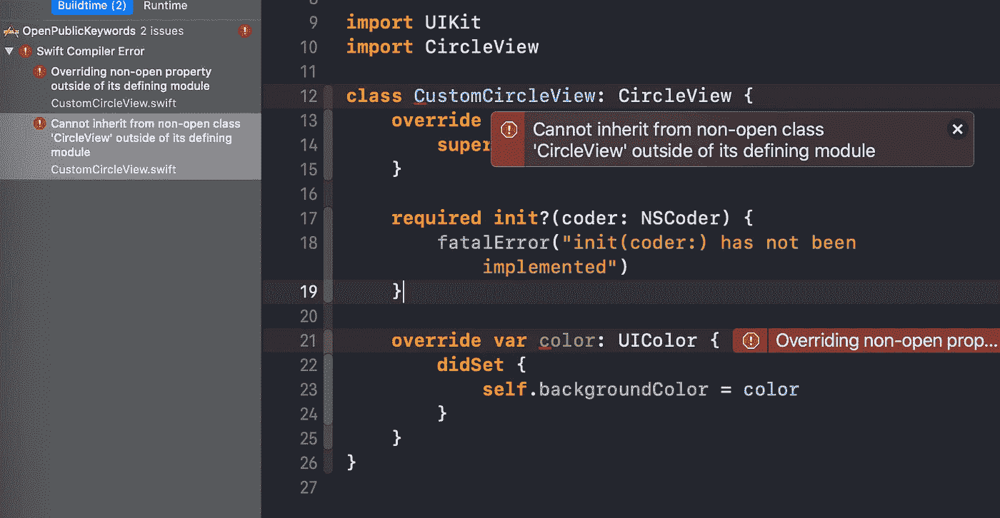

# Swift 中的 Public 和 Open 有什么区别？

> 原文：<https://betterprogramming.pub/whats-the-difference-between-public-and-open-in-swift-945c845ab1bf>

## 了解差异，消除困惑

马库斯·勒夫文伯格在 [Unsplash](https://unsplash.com?utm_source=medium&utm_medium=referral) 上拍摄的照片

今天，我们将快速探索 Swift 中的`public`和`open`关键字之间的区别。

简而言之，当我们在一个模块上工作时，我们使用`open`,这个模块在某个时候会被导入到不同的模块中并被覆盖。

例如，当您正在开发自己的可重用 UI 元素并希望使用 CocoaPods 来分发它时，您可以考虑使用`open`关键字让其他人覆盖您的库的行为。使用`public`，你可以简单地导入框架，但是你*不能*覆盖它。

事不宜迟，我们开始吧。

# 我们开始吧

假设我们正在创建自己的 UI 元素，我们希望它是可重用的和独立的。因此，我们在现有项目中创建了一个新目标，如下所示:

接下来，我们在下拉列表中选择静态库:

我们将其命名为`CircleView`，并创建一个简单的圆形`UIView`:

现在让我们将它导入到我们的主项目中。首先，我们需要转到构建设置并添加一个依赖项:

最后，我们能够将`CircleView`添加到我们的主目标文件中。现在让我们试着在`CustomCircleView.swift`文件中创建一个自定义子类:

我们可以看到我们想要覆盖`CircleView`的`color`属性。但是，会弹出以下错误:

正如错误所暗示的，我们必须将`CircleView`类和属性标记为`open`，以便能够从它继承并覆盖它的属性。让我们修改`CircleView.swift`文件:

现在，如果我们返回到主目标并构建项目，我们将不会看到任何错误。

注意，我们不能将结构标记为`open`；它只适用于类和类成员。

# 包扎

对 Swift 的其他细微差别感兴趣吗？请随意查看我的其他相关作品:

*   [“Swift 中的~=运算符是什么？](https://medium.com/better-programming/what-is-the-operator-in-swift-7f6bc7623023)”
*   [“Swift 中的类和静态有什么区别？](https://medium.com/better-programming/what-is-the-difference-between-class-and-static-in-swift-3493848ed831)”
*   [“Swift 中的带标签语句是什么？](/better-programming/what-is-a-labeled-statement-in-swift-2d245ac7b4e7)
*   [“Swift 中的 OptionSet 是什么，您应该在什么时候使用它？](/better-programming/what-is-optionset-in-swift-and-when-you-should-use-it-419777f3c39)

感谢阅读！