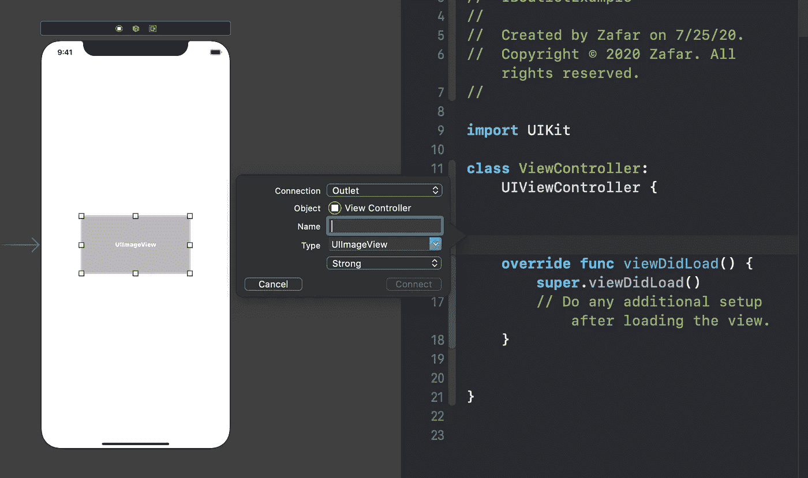
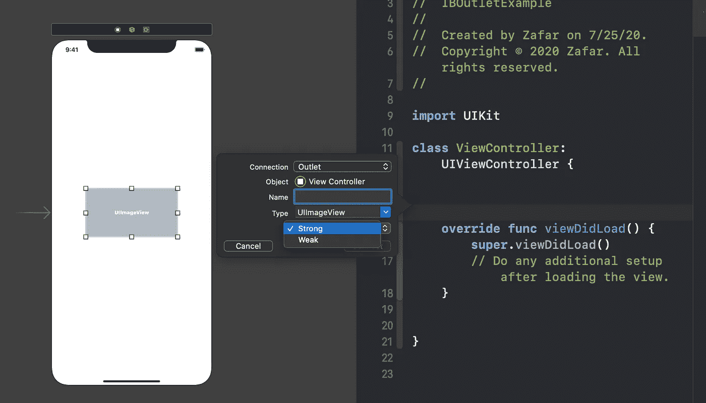

# Swift 中的强 IBOutlets 和弱 IBOutlets 有什么区别

> 原文：<https://betterprogramming.pub/whats-the-difference-between-strong-and-weak-iboutlets-in-swift-9a2149d529fb>

## 了解何时应该使用每一个

Brian McGowan 在 [Unsplash](https://unsplash.com/s/photos/architecture-color?utm_source=unsplash&utm_medium=referral&utm_content=creditCopyText) 上拍摄的照片

在本文中，我们将了解`Strong`和`Weak`插座之间的区别，并消除关于何时使用哪个插座的任何混淆。

# 介绍

如果你曾经需要通过拖放从故事板连接你的`UIView`,那么这个对话框你应该很熟悉:

在底部，我们会看到一个窗口，允许我们选择是使用`Strong`还是`Weak`存储类型。我们为什么需要它？

# 我们开始吧

如果你不熟悉 Swift 中的 ARC(自动引用计数)，那么你应该知道，当我们强引用一个属性*时，在父对象被销毁之前，它是不能被解除分配的。如果两个对象一起强烈引用*，那么两个对象都不会被释放，这会产生内存泄漏。因此，我们在使用*强*引用时应该非常小心。**

*另一方面，如果我们有一个对属性的*弱*引用，ARC 将允许*弱*属性在不再需要时被释放。一个很好的例子是委托设计模式，其中我们将第一个视图控制器存储为第二个视图控制器中的一个弱属性。*

*既然您已经了解了*强*和*弱*的含义，那么是时候决定在使用@IBOutlets 时使用什么存储类型了。*

# *弱还是强@IBOutlet*

*苹果建议总是使用`Strong`而不是`Weak`，除非你的商店强烈引用拥有对象。例如，如果您有一个包含自定义`UIView`的`UIViewController`作为出口，并且这个视图有一个对视图控制器的强引用，那么您必须使用`Weak`来避免引入内存泄漏。此外，通过使用`Strong`，您可以提高性能，所以确保您默认选择它:*

**

# *包扎*

*想了解更多关于 Swift 的信息吗？你可能会发现我的其他故事很有帮助:*

*   *[Swift 中可选协议方法的 2 种方式](https://medium.com/better-programming/2-ways-to-make-protocol-methods-optional-in-swift-f032836a343b)*
*   *[Swift 中的 Public 和 Open 有什么区别？](https://medium.com/better-programming/whats-the-difference-between-public-and-open-in-swift-945c845ab1bf)*
*   *[Swift 中的类和静态有什么区别？](https://levelup.gitconnected.com/better-programming/what-is-the-difference-between-class-and-static-in-swift-3493848ed831)*
*   *[Swift 5 中有哪些关键帧动画？](https://medium.com/better-programming/what-are-keyframe-animations-in-swift-5-55eaf04f7637)*

*感谢阅读！*