# 合成 React 事件和 JavaScript 事件有什么区别？

> 原文：<https://betterprogramming.pub/whats-the-difference-between-synthetic-react-events-and-javascript-events-ba7dbc742294>

## 理解 JavaScript 事件之间的主要区别


罗伯特·哈弗利在 [Unsplash](https://unsplash.com?utm_source=medium&utm_medium=referral) 上拍摄的照片。

# 什么是 JavaScript 事件？

JavaScript 事件是发生在网页上的动作或事件。它们是交互式用户界面的重要组成部分。当用户点击按钮或移动鼠标时，事件就发生了。在许多其他情况下，当网页被加载或卸载时也是一个结果。

HTML 定义了一组事件，JavaScript 使用事件处理程序来管理这些事件。React 还实现了事件处理程序，如`onClick`、`onMouseMove`、`onLoad`、`onError`等。React 的事件处理程序用 camelCase APIs 命名，JavaScript 事件处理程序用小写 API 命名。

我们将解释 React 如何处理事件，以及 React 事件的功能和局限性。

# 事件捕获和冒泡

JavaScript 中定义了四个[事件阶段](https://developer.mozilla.org/en-US/docs/Web/API/Event/eventPhase):

> `Event.NONE (0)`:目前没有正在处理的事件。
> 
> `Event.CAPTURING_PHASE (1)`:事件正在通过目标的祖先对象传播。这个过程从`Window`开始，然后是`Document`，然后是`HTMLHtmlElement`，依此类推，直到到达目标的父元素。这个过程被称为捕获阶段。
> 
> `Event.AT_TARGET (2)`:事件已经到达事件的目标。这个过程被称为目标阶段。
> 
> `Event.BUBBLING_PHASE (3)`:事件以相反的顺序通过目标的祖先向上传播，从父级开始，最终到达包含它的`Window`。这个过程被称为冒泡阶段。

最后三个短语构成了事件传播。

在 React 中，`Event`变量定义如下:

大多数时候，我们使用冒泡事件处理程序，比如`onClick`、`onMouseMove`、`onLoad`和`onError`。

事件捕获对于事件委托很有用，事件委托是一种在公共祖先级别使用单个事件捕获处理程序的方法，而不是将事件处理程序分配给许多子元素。

在 React 中，要为捕获阶段注册一个事件处理程序，只需将`Capture`附加到事件名称上。等价的，还有`onClickCapture`、`onMouseMoveCapture`、`onLoadCapture`、`onErrorCapture`。

两个事件处理程序没有等效的捕获处理程序。分别是`onMouseEnter`和`onMouseLeave`。这种行为与 JavaScript 事件一致。

让我们创建一个例子来说明这个概念。[创建 React 应用](https://medium.com/better-programming/10-fun-facts-about-create-react-app-eb7124aa3785)是一种启动 React 编码环境的便捷方式:

```
npx create-react-app my-app
cd my-app
npm start
```

我们修改`src/App.js`如下:

运行`npm start`，我们看到如下用户界面:

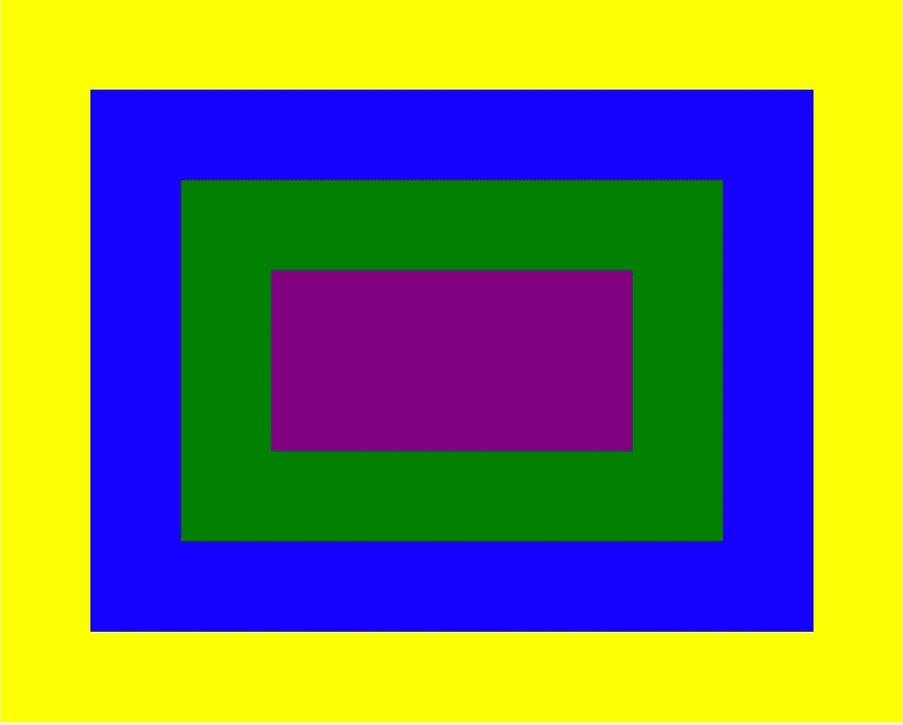

*   点击黄色区域，我们得到这些控制台日志:`captured yellow`和`clicked yellow`。
*   点击蓝色区域，我们得到这些控制台日志:`captured yellow`、`captured blue,`、和`clicked yellow`。
*   点击绿色区域，我们得到这些控制台日志:`captured yellow`、`captured blue`、`captured green,`、`clicked green`、`clicked blue`和`clicked yellow`。
*   点击紫色区域，我们得到这些控制台日志:`captured yellow`、`captured blue`、`captured green,`、`captured purple,`、`clicked purple`、`clicked green`、`clicked blue`和`clicked yellow`。

# 反应事件总是冒泡

在 JavaScript 中，一些事件——比如`focus`、`blur`和`change` ——不会冒泡。然而，React 的团队决定让所有事件都冒泡，不管有没有意义。

下面的`src/App.js`演示了`focus`事件冒泡:

该代码生成以下用户界面:

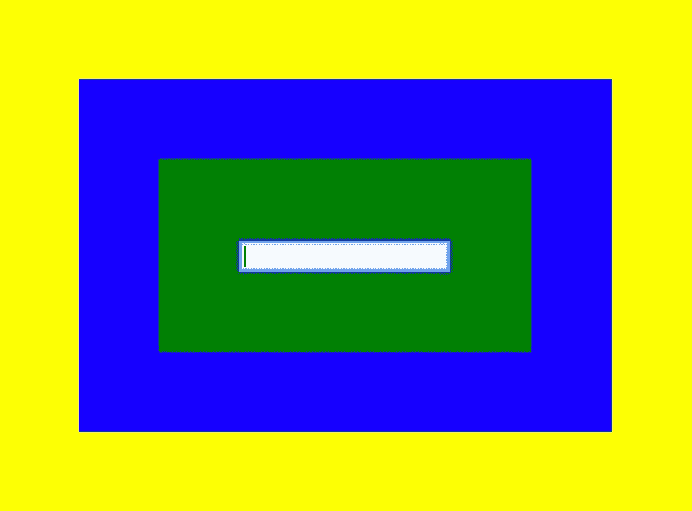

点击输入框，我们得到这些控制台日志:`captured yellow`、`captured blue`、`captured green,`、`captured input,`、`focused green`、`focused blue`和`focused yellow`。

下面的`src/App.js`显示`change`事件冒泡:

在下面的用户界面中，当在输入框中输入“a”时，我们得到这些控制台日志:`captured yellow`、`captured blue`、`captured green,`、`captured input,`、`changed input`、`changed green`、`changed blue`和`changed yellow`。

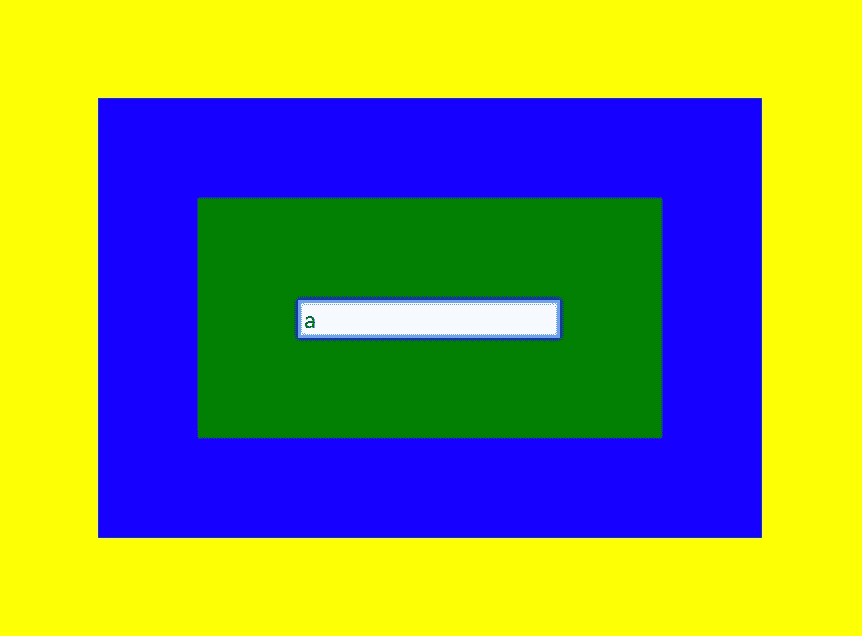

# 合成事件

以下是 React 中的`Event`界面:

我们修改了前面在`src/App.js`中的例子，在第 15 行打印出事件:

> React 17 从 React 中删除了“事件池”优化。如果你想知道它在 React 17 之前的表现，请继续阅读。否则，跳过下一节，直接进入 React 17 后的行为一节。

## 反应前的行为 17

以下是控制台输出:

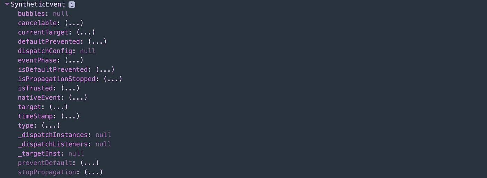

点击`bubbles`值，我们会收到以下警告:

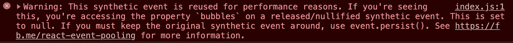

发生了什么事？

在 React 中，一个事件处理程序通过一个`[SyntheticEvent](https://reactjs.org/docs/events.html)`实例传递，这是一个围绕浏览器本机事件的跨浏览器包装器。和浏览器的原生事件有相同的界面，包括`stopPropagation()`和`preventDefault()`。在 React 中，不能返回`false`来防止默认行为。相反，`preventDefault`必须显式调用。合成事件在所有浏览器中的工作方式是相同的，因为它们是根据 W3C 规范[定义的。](https://www.w3.org/TR/DOM-Level-3-Events/)

`SyntheticEvent`被汇集。这意味着在事件回调被调用后，`SyntheticEvent`对象将被重用，所有属性都将失效。这种行为是出于性能原因而设计的。因此，`SyntheticEvent`不能以异步方式使用。单击控制台事件就是异步访问它。

如果取消第 14 行的注释，`e.persist()`将从池中移除合成事件，并允许用户代码保留对事件的引用。现在`SyntheticEvent`打印出活动详情:

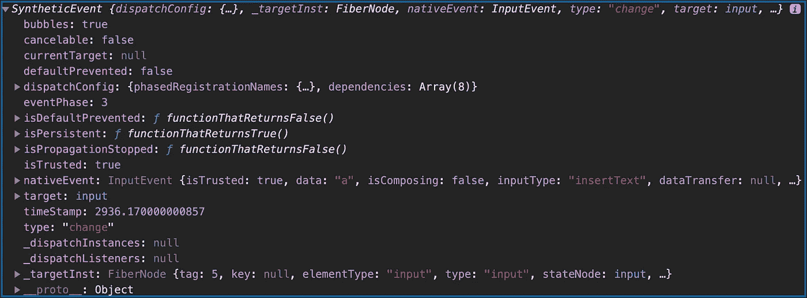

我们可以看到目标被正确设置为`input`。取消对第 16 行的注释将打印出由`<div>` s 换行的`<input>`。

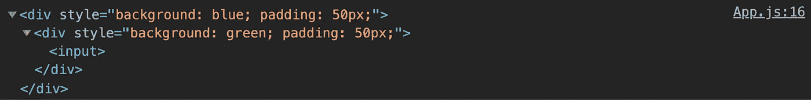

## 反应后的行为 17

`e.persist()`(第 14 行)在 React 17 后没有效果。

第 15 行总是显示正确的目标，`input`。

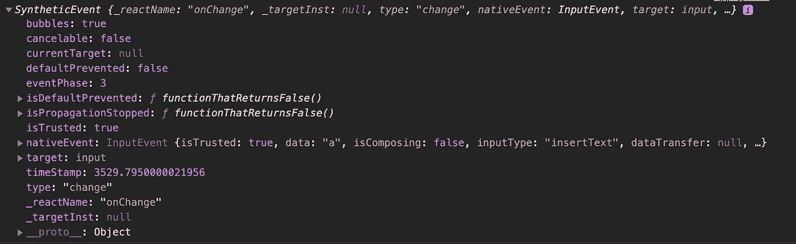

取消第 16 行的注释将只打印出`<input>`。

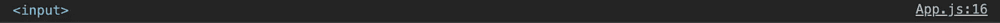

# 停止事件传播

从`Event`接口，我们看到了`stopPropagation()`方法，调用该方法是为了防止事件到达除当前对象之外的任何对象。

`src/App.js`中的以下代码在捕获阶段停止事件传播:

在第 15 行，事件传播在蓝色元素的捕获阶段停止。点击紫色区域，我们得到这些控制台日志:`captured yellow`和`captured blue`。

`src/App.js`中的以下代码在冒泡阶段停止事件传播:

在第 19 行，事件传播在绿色元素的冒泡阶段停止。点击紫色区域，我们得到以下控制台日志:`captured yellow`、`captured blue`、`captured green,`、`captured purple,`、`clicked purple`和`clicked green`。

# React 视频事件匹配 HTML/JavaScript 事件

我们从代码中删除了`stopPropagation()`方法，并用一个视频替换了紫色元素:

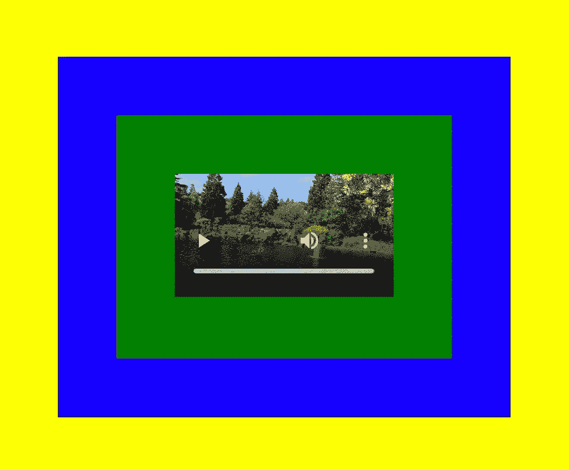

我们把一个视频，`IMG_2313.mp4`(第 30 行)，放在`public`目录下。您可以使用任何 mp4 文件来测试这个例子。

下面是修改后的`src/App.js`:

点击视频，我们在控制台上得到预期的信息:`captured yellow`、`captured blue`、`captured green,`、`captured video`、`clicked video`、`clicked green`、`clicked blue`、`clicked yellow`。

但是，如果我们单击播放按钮或其他控件，则根本没有控制台消息。

[发生了什么](https://github.com/facebook/react/issues/19623#issuecomment-674599338)？

这并不是说 React 的行为有所不同。这正是视频标签的工作原理。单击播放按钮不会触发 click 事件，而是触发播放或暂停事件。React 事件的行为方式与 HTML/JavaScript 事件相同。

为了使这个示例能够工作，我们将 click 事件更改为 play 事件:

点击视频的播放按钮，我们在控制台上得到预期的信息:`captured yellow`、`captured blue`、`captured green,`、`captured video`、`played video`、`played green`、`played blue`和`played yellow`。

如果我们取消第 15 行的注释，事件传播将在蓝色元素的捕获阶段停止。我们在控制台上得到预期的信息:`captured yellow`和`captured blue`。

下面是另一个使用 [React 播放器](https://github.com/CookPete/react-player)的视频例子。

将 react-player 作为`[dependency](https://medium.com/better-programming/package-jsons-dependencies-in-depth-a1f0637a3129)`安装在`package.json`中:

```
"dependencies": {
  "react-player": "^2.6.0"
}
```

React Player 播放各种 URL。除了支持视频的文件路径，它还可以播放来自 YouTube、脸书、Twitch、SoundCloud、Streamable、Vimeo、Wistia、Mixcloud 和 DailyMotion 的媒体。以下是修改后的`src/App.js`以 YouTube 格式播放同一视频(第 22 行):

运行`npm start`会显示如下用户界面:

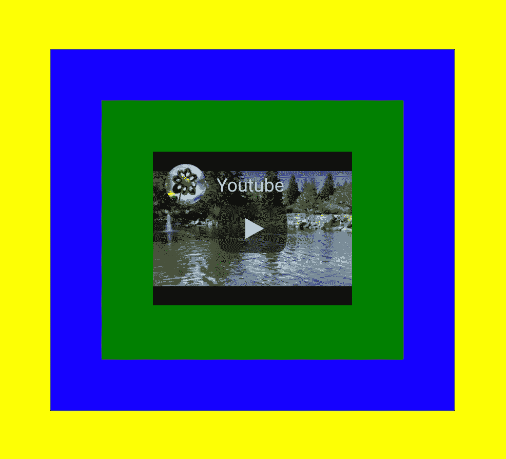

点击视频的播放按钮，我们在控制台上得到一行信息:`played video`。

检查元件。我们可以看到 YouTube 播放器是一个 iframe。正如所料，根据设计，iframes 中的事件不会传播到外部树中。

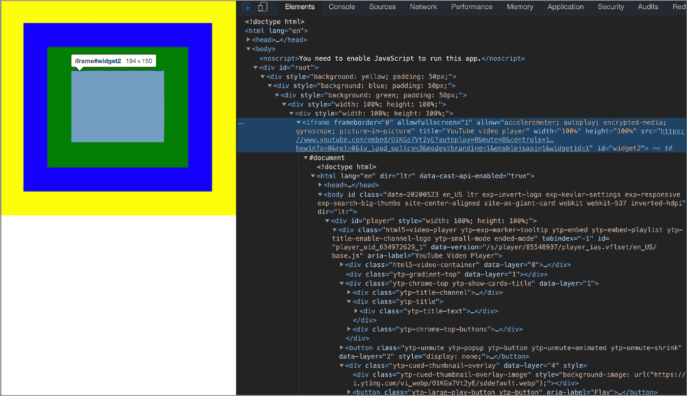

# 结论

React 使用一个合成事件系统，这是一个围绕浏览器本机事件的跨浏览器包装器。在大多数情况下，开发人员可能不会注意到差异，但它们确实存在:

*   React 合成事件在不同浏览器中的工作方式相同。
*   React 事件处理程序使用 camelCase 命名。
*   React 事件处理程序不能返回`false`来防止默认行为。
*   反应合成事件总是冒泡。
*   在 React 17 之前，React 合成事件不能异步使用，除非调用`e.persist()`。
*   React 的视频合成事件系统的工作方式与 HTML/JavaScript 事件相同。

感谢阅读。我希望这有所帮助。你可以在这里看到我的其他媒体出版物。

*注:Jonathan Ma 对本文部分内容有贡献。*