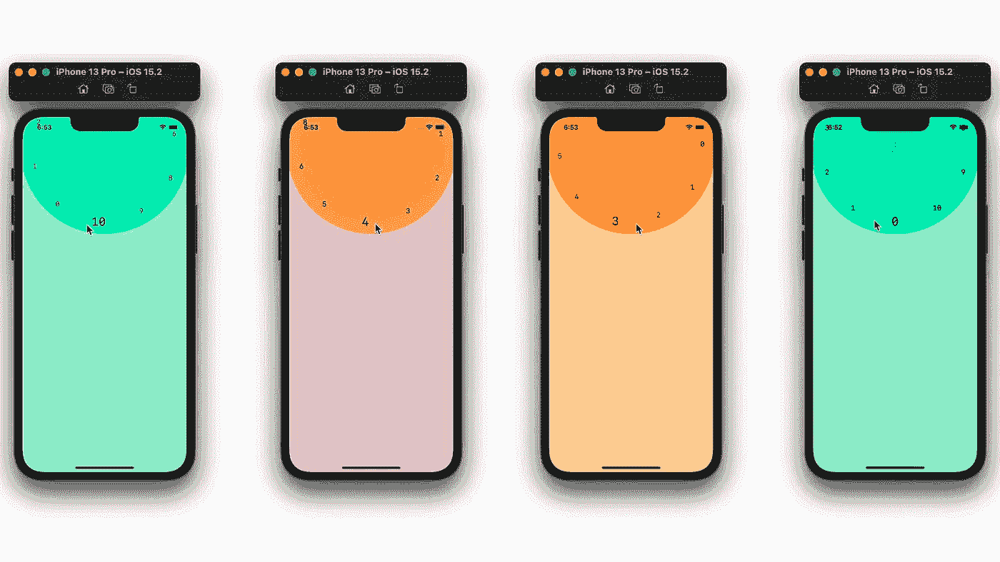
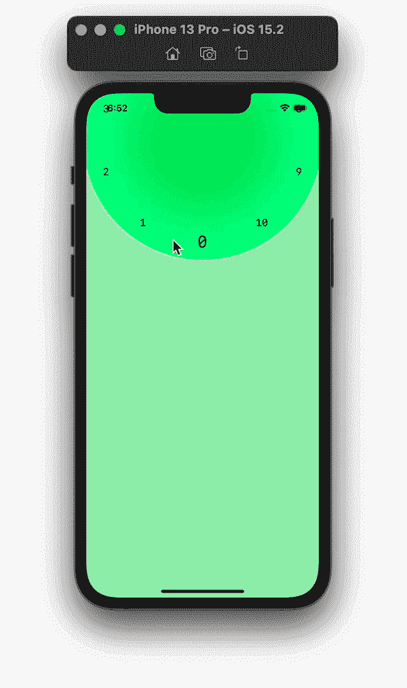

# SwiftUI 中的滚轮选择器视图

> 原文：<https://betterprogramming.pub/wheel-picker-view-in-swiftui-6de7077b4791>

## 如何创建一个滚轮菜单，并获取用户的滑动方向

从您想要在滚轮中显示的数据开始。

如果您想将色轮用作色轮，您可以存储颜色值。

如果您想将它用作一个在滚轮中间带有图像的菜单，那么您可以添加一个图像变量。

在本教程中，我将沿着轮子的侧面显示数字，供用户选择。

用户需要向左或向右滑动才能移动滚轮。为您希望用户拥有的可能移动创建一个枚举。

创建一个视图，并在其中添加以下变量。

*   `radius`:车轮的半径。在从我们的父视图中取出轮子的框架尺寸之后，这个值在外观内部被改变。
*   `direction`:保持用户滑动的方向。
*   `choosenIndex`:存储用户从滚轮上选择的数值。
*   `degree`:滚轮的旋转角度及其内部视图。
*   `array`:这是一个`myVal`的数组；我们上面创建的结构。该阵列用于构建我们车轮内部的内部视图。
*   圆的尺寸:我们的圆的宽度和高度的值。

创建一个函数，在用户滑动的方向上将滚轮移动到我们的滚轮内的下一个值。

通过将 360 除以数组中的值的数量来计算新的度数值。跟踪用户选择的索引。

我们也从一些变量开始。首先，我们需要知道数组中每个值之间的间距/角度。接下来，用`onEnded()`修改器创建一个拖拽手势。

在`onEnded`内，取滑动的 x 起始位置，并与滑动的结束位置进行比较。如果起始值大于结束值，用户向左滑动，反之亦然。在`onEnded()`的底部，调用 moveWheel 函数来移动滚轮。

为了创建轮子，嵌入一个带有`Circle()`的 ZStack。然后循环遍历我们的值数组以添加到轮子中。

现在，计算数组中每个值的角度、x 偏移量和 y 偏移量。

我选择让`Text()`的值从 0 到 10。

对我来说，在您选择的视图中，添加`.rotationEffect()`和我们绑定到父视图的程度。内部视图的移动方向与轮子本身的方向相反。

使用 x 偏移和 y 偏移来偏移循环内视图的 x 和 y 值。

最后，突出显示轮子内的选定值。下面，我为选择的索引使用了不同的字体。

向轮子的 ZStack 添加`rotationEffect()`和我们绑定到父视图的程度。

使用`.gesture()`修改器将拖动手势添加到堆栈中。

# 车轮视野

如需完整代码，请查看以下内容:

# 父视图

在父视图中，添加我们上面创建的`WheelView`。将度数、轮子值数组和圆的大小传递给轮子。我使用偏移修改器将滚轮定位在屏幕的顶部。

感谢阅读！