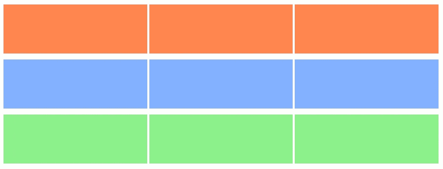
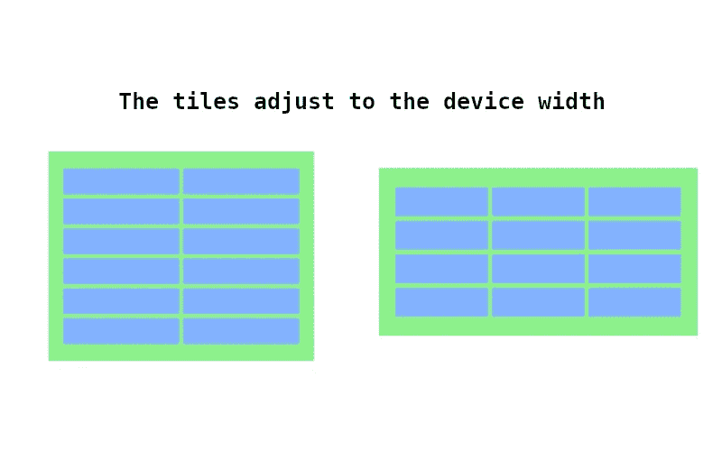
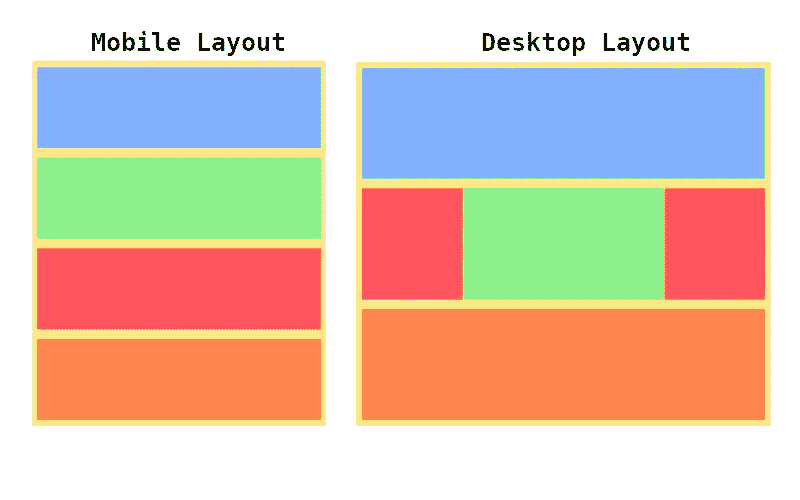
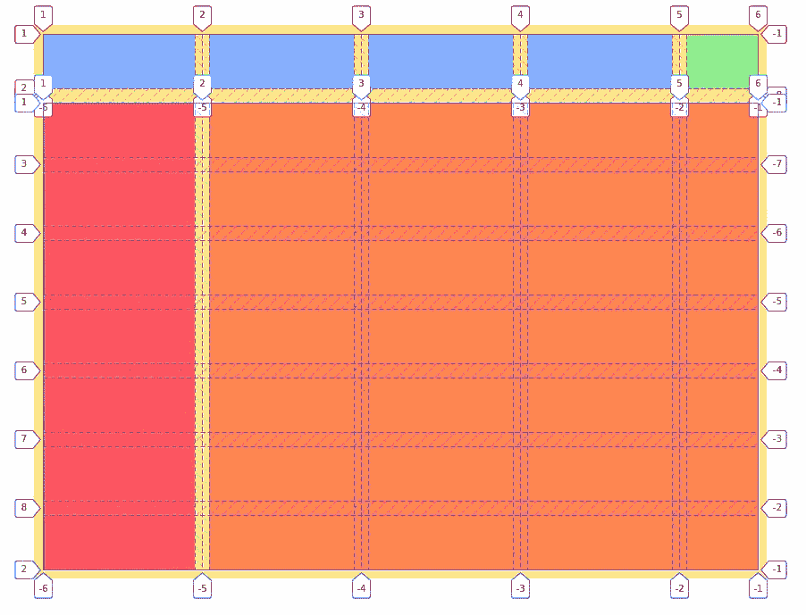
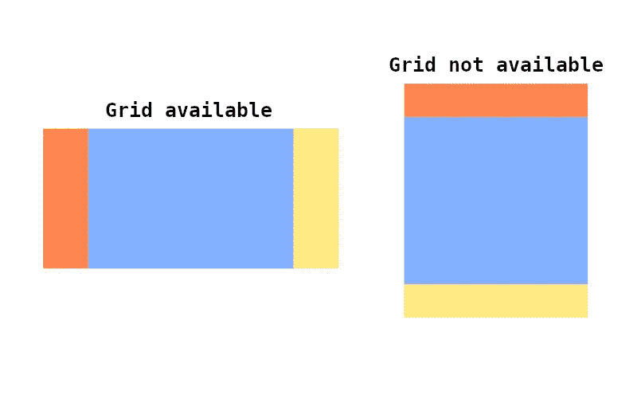

# 在生产中何时以及如何使用 CSS 网格

> 原文：<https://betterprogramming.pub/when-and-how-to-use-css-grid-in-production-1b7c28b150ed>

## 您可能需要使用 CSS 网格的 5 个场景


由作者创建的捕获

使用 CSS 特性时，浏览器分段总是一个问题。假设浏览器可能不支持某些布局特性，我们倾向于使用最受广泛支持的特性。

有一个错误的假设，认为对网格的支持非常低。开发人员有时倾向于使用 Flexbox，因为他们不确定也不愿意离开他们的舒适区。Flex 布局是如此的棒和灵活，以至于你可以用它来构建任何东西。然而，对于正确的工作，它可能不是正确的工具。这将转化为可读性更差的代码和更多的样板文件。

你不应该仅仅因为它有用就使用它，而是因为它意味着解决你的用例。

对网格基本功能的支持大约是 95%。这真是惊人的消息。我们可以假设它已经可以生产了。至少是基本的功能。Grid 的功能还不完善，而且还在不断发展。

什么时候应该使用网格？它带来了什么好处？

在这里，我们将看看何时以及如何使用它。

# 什么时候应该使用网格？

尽管 Grid 和 Flex 一开始看起来有些多余，但 Grid 在某些特定的场景中确实大放异彩。这是一个强大的布局。你可以用几行文字来描述复杂的布局。同样的布局需要大量代码来处理其他 CSS 特性。

理解这个特性和学习在哪里使用它一样重要。你需要为正确的工作使用正确的工具。

在这里，我们将看到五种最常见的使用网格的场景。

# 1.创建复杂的多维布局

网格是一个二维布局系统。那是什么意思？这意味着 Grid 可以在两个方向上布局项目。柔性可以在垂直或水平的一个轴上生长。


一维布局与二维布局

当构建一个复杂的布局网格是你最好的选择。它允许你通过`column`和`row`或者通过`template areas`来定位项目。您不需要在任何其他中呈现项目，您可以通过指定位置来这样做。

# 2.当您需要行/列之间的间隙时

当您想要在行和/或列之间应用一些空间时，网格非常有用。虽然 Flex 确实有一些间隙属性，但它的支持度较低，只有`75%`。所以网格是更好的选择。

*   `row-gap`，增加了行间的空隙。
*   `column-gap`，在列之间添加一个间隙。
*   `gap`，增加行与列之间的间隙。

让我们看一个使用`gap`属性的例子:

让我们看看应用垂直和水平间隙的结果:



具有不同行列间距的网格。

# 3.当您需要动态数量的行/列项目时

Flexbox 布局有助于显示元素并将它们均匀分布在一个轴上。但是，它不能根据可用空间动态地改变项目的数量。

有了 Grid，我们可以使用`min-max` CSS 实用程序，它可以让我们根据一些限制动态地改变内容的大小。

这意味着我们可以在没有媒体询问的情况下创建响应性的布局。

在上面的代码中，我们将创建尽可能多的图块，给定图块至少为`11rem`或`1fr`的约束。



Codesanbox 在这里[可用](https://codesandbox.io/s/min-max-ugsew?)。

# 4.当您想要创建一个直观的复杂响应布局时

与 Flex 相反，Grid 的定位信息可以放在主容器中。这意味着您可以轻松地改变整个布局，而不必修改任何子布局。通过使用`grid-template-areas`特性，您可以用人类可读的格式描述网格的形状。

我们可以结合`grid-template-areas`和媒体查询来创建一个响应性的布局。

让我们来看一个代码示例:

我们可以在下面的截图中观察到我们是如何从一个有四列的布局变成只有一列的布局的。所有这一切都发生在几行代码和没有修改孩子的情况下。



Codesanbox 在此[可用](https://codesandbox.io/s/sub-grid-dc5yn)

# 5.当将多个复杂的布局组合在一起时

传统上，Grid 和 Flex 只对第一级子节点有影响。这意味着有时很难将不同的孩子彼此对齐，因为他们不能使用他们父母的约束。

使用`sub-grid`功能，孩子可以使用他们的父网格布局定位。目前这仅在 Firefox 上受支持，并且它仅代表浏览器支持的`3%`。

让我们看一个例子，其中一个网格块通过使用`grid-template-columns`定义中的`max-content`具有动态列宽。

如上所述，为了让孩子选择加入父母的网格布局，我们可以使用`sub-grid`:

```
/* using subgrid for columns */grid-template-columns: **subgrid;** /* using subgrid for rows */
grid-template-rows: **subgrid;**
```

仅用这一行代码，子网格将与父网格对齐。

请注意，我们有多个彼此完全对齐的网格。它们的内容是动态解析的:`green` tile 有一个最大内容宽度。

下面的截图是使用火狐的网格线可视化。请注意所有网格轨迹是如何正确对齐的。



这里有 codesanbox[(在火狐打开)](https://codesandbox.io/s/big-grid-y32e6?file=/index.html)

# 我们如何建立一个适应性布局？

如前所述，对网格的基本支持是 95%左右。较新的功能将在较少的浏览器中得到支持。您可能希望您的 web 应用程序的布局在所有浏览器上都看起来很棒。

现在我们知道了问题，我们可以使用什么策略呢？

## 定义战略

在使用任何功能之前，我们不能坐在那里等待所有的浏览器都有合适的支持。我们能做什么？我们可以建立适应性布局。那些是什么？这些布局仅在最新功能可用时才使用它们。

我们将遵循两个简单的策略:

*   对于简单的布局，我们可以使用类似的后备版本。
*   在复杂的布局上，我们可以使用仅支持移动的后备版本。

为什么只支持移动设备？因为通常桌面浏览器都是最新的。不具备网格功能的用户访问您的布局很可能是通过旧手机进行的。由于缺乏可升级性和支持，旧设备往往会落后。

让我们看看提供 UI 回退的最常见的技术:

## 1.通过覆盖属性

定义回退最简单的方法是使用 CSS 布局的级联特性。您可以定义从广泛支持到较少支持的布局功能。

让我们看一个简单的例子:

```
#container {
  /* if grid is not available, it will fallback to flex */
  display: flex; /* 🆘 fallback */
  **display: grid;** /* ✅ newest feature */}
```

当只有一个属性的支持度很低时，这很方便:

```
#content {
  /* if sugrid is not available, it will fallback to the Grid's parent column definition */
  grid-template-columns: inherit; /* 🆘 fallback */
  grid-template-columns: **subgrid**; /* ✅ newest feature */
}
```

在上面的例子中，我们的布局将尽力继承父节点的`column`网格系统。如果`subgrid`功能可用，我们将能够产生像素完美的解决方案。

## 2.通过使用 CSS 特征查询

让我们从描述这些是什么开始:

> “功能查询是使用 CSS at-rule [@supports](https://developer.mozilla.org/en-US/docs/Web/CSS/@supports) 创建的，非常有用，因为它们为 web 开发人员提供了一种测试浏览器是否支持某个特定功能的方法，然后提供仅基于该测试结果运行的 CSS。在本指南中，您将了解如何使用功能查询实现渐进式增强。”— [MDN 网络文档](https://developer.mozilla.org/en-US/docs/Web/CSS/CSS_Conditional_Rules/Using_Feature_Queries)

通过使用`@supports`特性，我们可以检查浏览器是否支持任何特定的网格特性。我们能做的是:

*   定义我们的后备布局
*   覆盖布局，以防它支持我们感兴趣的功能

让我们建立一个例子。我们将在适用时显示网格布局，否则我们将使用传统的 Flex 方法，默认为仅移动布局。



Codesanbox 在这里可用

我们可以在上面的图片中看到，我们将如何在可能的情况下呈现网格布局。否则，将通过使用 Flex 呈现回退的仅移动布局。

## 3.通过以编程方式使用 CSS 功能查询

有时你需要更复杂的布局，只有使用 CSS 才能让它变得真正复杂。您可能希望根据浏览器功能显示不同的组件。

幸运的是，CSS 特性 API 可以从 JavaScript 端调用。

让我们来看看实现:

```
function **supports**(property: string, value: string): boolean;
```

让我们用这个特性来通知我们的用户，他们正在使用一个旧的浏览器，他们应该考虑升级到一个新的。

对于某些用例，您可能想要显示一个完全不同的组件。让我们用 React 检查一个例子。不过，这也适用于任何其他视图引擎。

通过使用编程方法，您能够从理想的解决方案中分离出后备解决方案。

这将增加您的代码在复杂场景中的可读性。您将能够隔离后备解决方案。你可以延迟加载它们，减少代码，当不再需要的时候更容易删除。

# 结论

CSS 网格有很多有用的特性，可以帮助你用几行 CSS 代码创建一个强大的布局。您不必担心浏览器支持，因为您可以多填充或依赖可用的浏览器支持。这取决于你的目标受众。

现在是时候走出舒适区，停止到处使用 flexbox 了，因为我们觉得使用它很舒服。

# 想多看作者？

如果你喜欢你所读到的，看看下面这个故事:

[](/top-3-css-grid-features-to-start-using-in-production-b0fe59b2e0f7) [## 开始在生产中使用的 3 大 CSS 网格特性

### 深入探究一些广泛支持的 CSS 网格特性

better 编程. pub](/top-3-css-grid-features-to-start-using-in-production-b0fe59b2e0f7)