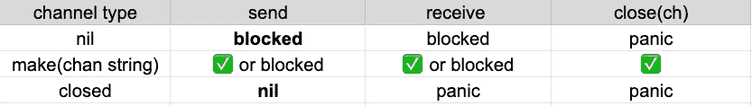
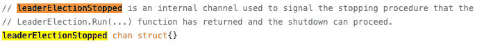
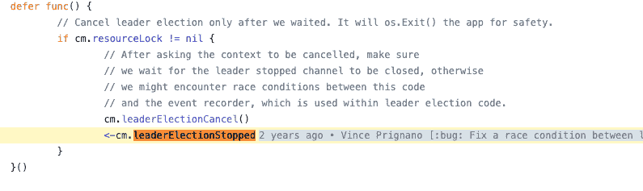
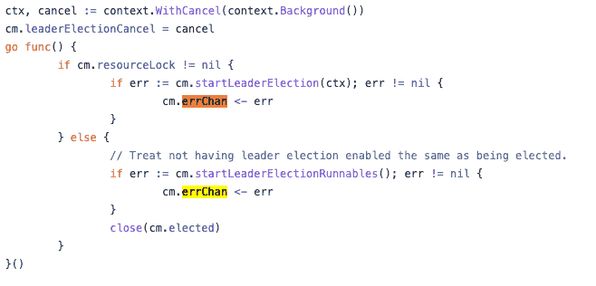
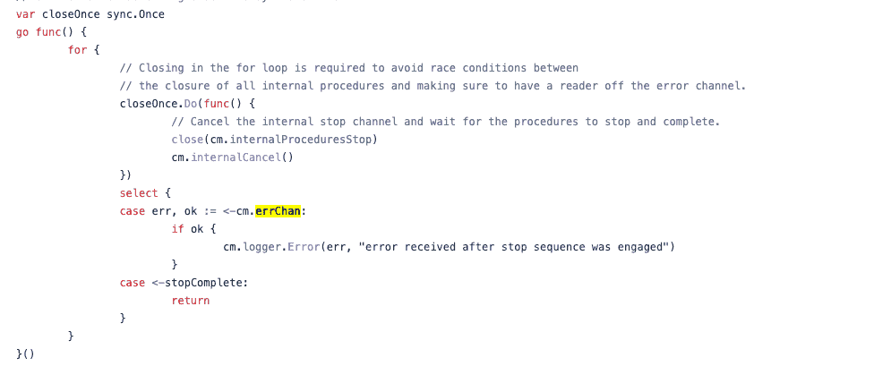
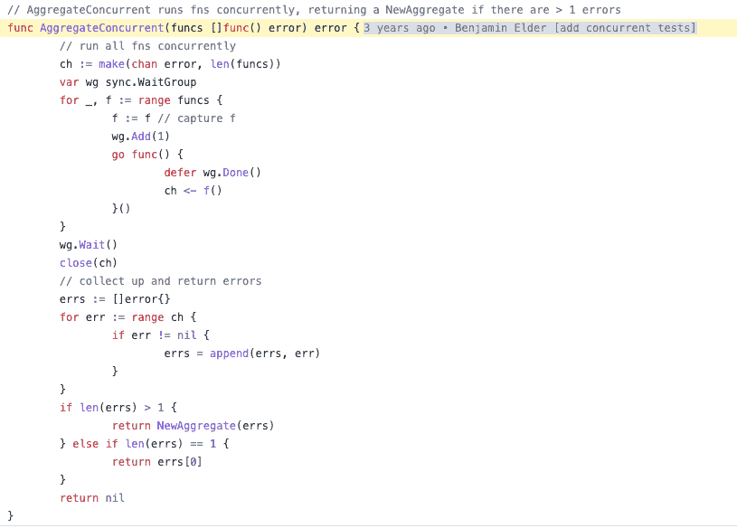
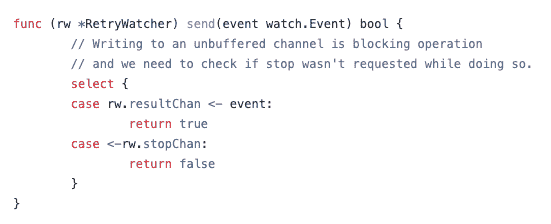
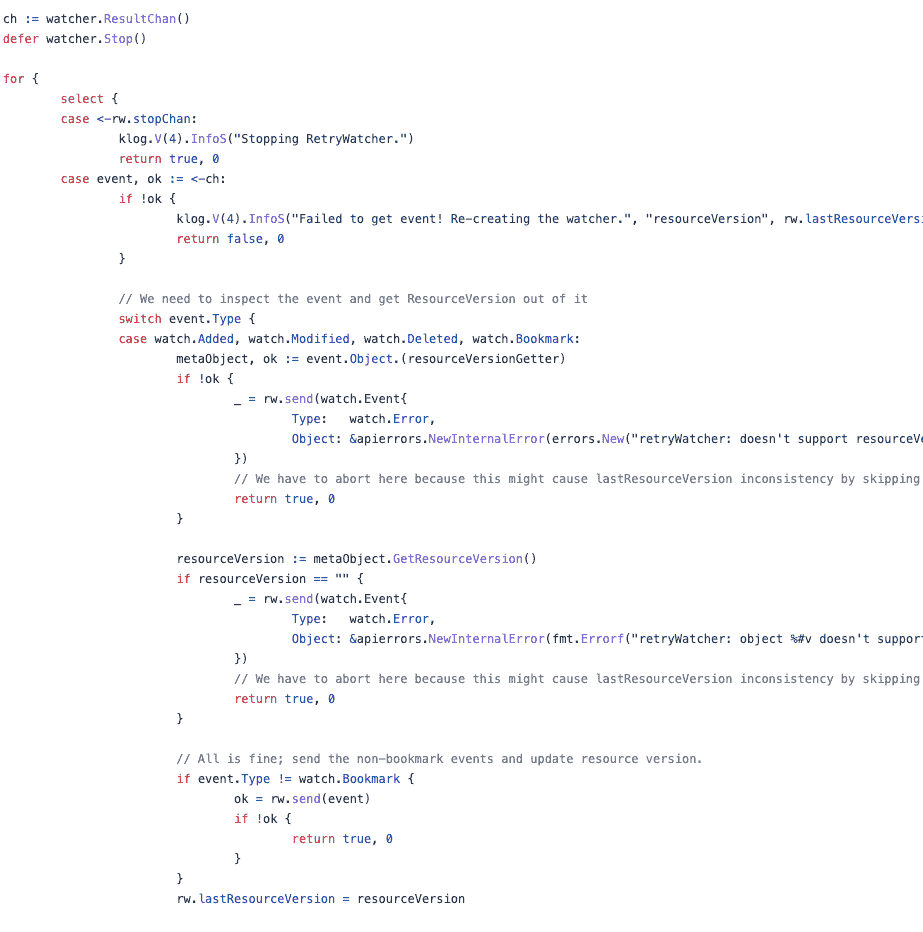
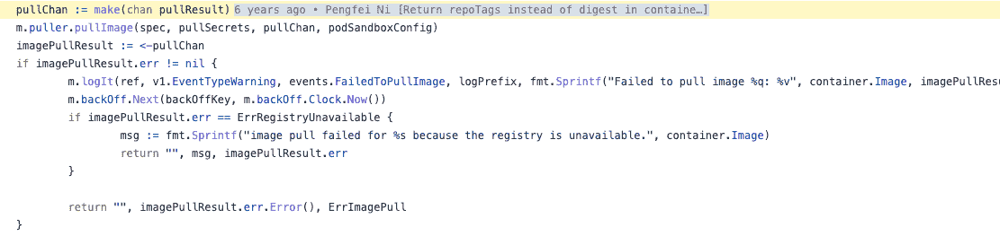
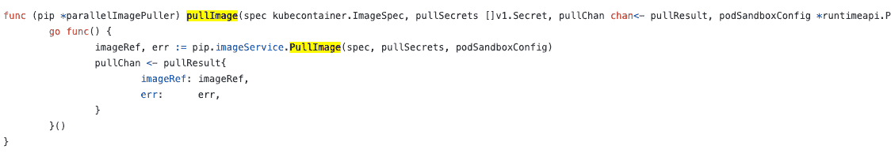

# 何时以及如何使用 Go 频道

> 原文：<https://betterprogramming.pub/when-and-how-to-use-the-go-channel-58f82605156c>

## 通道==信号量+缓冲区


来源:unsplash， [@bdv91](https://unsplash.com/photos/pfDcvn8AX98)

Go 简洁的结构和强大的原生库使我们能够轻松地进入状态。在实现相同功能时比 Java 或 Python 更高效，尤其是它的并发编程，由于它的`goroutine`和`channel`，非常得心应手，广受推崇。

`goroutine`和`channel`有很多可以挖掘的地方，让我们从`channel`开始，我曾经狭隘地认为它是一个在`goroutines`之间传输数据并支持数据同步的消息队列，但它确实拥有一个更大的舞台。

# 通道==信号量+缓冲区

Channel 是类似`slice`和`map`的数据类型，等式`channel == Semaphore + Buffer`揭示了它的本质。信号量是核心概念，其次是两个主要特性，*交付保证*和*状态*。

**交付保证**为 goroutine 扫清了道路，使其不必关注信号是否可以通过通道传输，或者依赖通道是否可以接收信号，而只关注逻辑实现。在下面的例子中，`ch1`和`ch2`的交付保证决定了 goroutine 的成功。

```
go func() {
   for {
      i,ok := <-ch1 // blocked if ch1 is empty
      if ok {
         ch2 <- i*i
      } else {
         break
      }
   }
}()
```

通道是否可以发送或接收数据是由其状态决定的。



*   **Nil** ，未初始化的通道，`var ch chan int`。没有接收或发送任何信号。操作受阻，关闭时死机。
*   **打开**，初始化通道，`ch = make(chan int)`。它可以接收和发送任何信号。
*   **关闭**，关闭通道，`close(ch)`，**只接收信号，发送时死机。**

Buffer 将信道从信号量改为先进先出队列，这很好地解释了“信道”这个名称然而，缓冲区也会危及交付保证并导致错误。如果通道关闭时缓冲器仍有一个以上的项目，这些信号将[无法](https://go.dev/play/p/QpYQINctBWi)传送。

# 通道简化了并发性

并发编程基于多线程的思想:线程独立运行，而数据是共享和同步的。数据处理始终是一个难点，但合理使用通道可以简化并发。

## 定义频道

> channel type =(" chan " | " chan " "element type。

根据内部`recvq`和`sendq`队列是否允许存储相应的等待者，即`goroutines`，通道可以分为发送-接收、只读和仅发送。

通常，只读和只发送通道不直接使用，而是作为函数参数或返回，约束通道在函数中的角色。举个例子，

```
func send(ch chan<- int) {
   for i := 0; i < 5; i++ {
      ch <- i
   }
}

func recv(ch <-chan int) {
   for i := range ch {
      fmt.Println(i)
   }
}

func rc(int n) <- chan int {
   ch := make(chan int)
   go func(){
      *// do some work* ch <- v
   }
   return ch
}
```

如果将`send(ch chan<- int)`改为`send(ch <- chan int)`，代码将无法编译。

## 使用频道

使用通道的方法太多了，如果你想记住所有的模式，效率很低。但关键是要记住使用通道的核心，**go routines**之间的信号传输。

*   至少涉及一个 goroutine。
*   必须有发送者和接收者。
*   发送方和接收方都可以是多路由的。
*   双方都可能发生阻塞。
*   缓冲区可以存储多余的信号量。


根据发送和接收模式，让我们将信道分为 3 组，同步和阻塞，非阻塞和其他。

**同步和闭锁**

通道通过`<-`操作器一个接一个地发送和接收信号。在某些情况下，即使有缓冲区，发送和接收都可能被阻塞，尽管缓冲区可以在某种程度上增强并发性。所以我们经常一起使用`goroutines`和`for`循环。

发送方和接收方可以是一对一、一对多、多对一、多对多，而这里的“一”可以是一个或多个 goroutines，甚至是`for`循环中包含的多个发送和接收。我们根据对并发性的需求选择模式，包括数据量和并发延迟。

*   一对一无缓冲通道。阻挡是不可避免的(可以是看不见的)，但是信号是可以 100%传递的。
*   一对多。使用缓冲区时，它类似于一个工作池，只有在工作负载较重且缓冲区被完全占用时，发送方(生产者)才能被阻塞。当没有缓冲区时，最大并发数是工作线程数(goroutines)。
*   多对一。虽然可以保证执行顺序，但是发送方很可能会被阻止。
*   多对多。这是最高效的设计，具有最快的处理速度和最低的阻塞，但也消耗最多的内存。但是，仍然需要估计发送者和接收者的数量，以实现最高的性能，否则要么发送被阻塞，要么接收“饥饿”

**无阻塞**

`<-`操作符和`for range` 都用于一个通道。而 Go 提供了`select`操作符来方便通道操作。

*   支持同时接收多个频道
*   支持同时发送和接收
*   支持添加超时以防止通道等待时间过长
*   通道满时支持`Drop`信号

**其他**

通道可以与其他 Go 语言特性相结合，以更好地设计并发代码。

*   验证“结束”

通过`if v, ok := <- ch; ok{}`，可以判断通道是否已经关闭，让接收者可以优雅地结束。

*   来保证“结束”

在上面的例子中，我们使用了`time.Sleep`并在`main`方法中等待 goroutine 结束，这显然不符合生产标准。而有了`waitGroup`的结合，`channel`和`goroutine`，这种经典的“生产者-消费者”模式，可以完美收场。

*   取消

像我们在`select`示例中所做的那样，在一定时间后使用`After`取消频道在实践中并不常见。在生产上，我们不是限制渠道，而是限制整个业务的执行时间。这就是`context`的作用:我们使用`context`链接整个逻辑的每个方面，设置一个超时，并决定在`context`结束时结束`channel`块。

当发送的 goroutine 超时并且`main`结束时，我们将缓冲区设置为`1`以避免内存泄漏。

# 何时使用频道

很难判断什么时候使用`channel`，但这主要取决于经验，尤其是您在并发开发方面的经验。

您可以在 Kubernetes 代码库中找到许多用例，但是在这里我只能列出最常见的场景。

*   触发信号，包括结束和开始
*   异步传输数据。非紧急的异步工作进程一个接一个
*   故意阻挡。对于关键步骤，您需要阻塞并等待
*   工人池。工人要么被任务唤醒，要么被长时间阻塞，直到任务到来

## **信号通道**

使用`channel`作为结束某些任务的信号。`{name} chan struct{}`用于定义一个没有任何数据的`channel`，因为`struct{}`占用最低的内存。用`<- {name}`通知结束和关闭频道。

在`kuberentes/controller-runtime`管理器中[被多次使用](https://github.com/kubernetes-sigs/controller-runtime/blob/c7a98aa706379c4e5c79ea675c7f333192677971/pkg/manager/internal.go#L118)。



[发送信号](https://github.com/kubernetes-sigs/controller-runtime/blob/c7a98aa706379c4e5c79ea675c7f333192677971/pkg/manager/internal.go#L561)。



在`controllerManager`中，还有`elected chan struct{}`和`internalProceduresStop chan struct{}`的另外两个*信号通道*。

## **异步处理**

`channel`作为数据通道，也可以传输数据，方便异步处理，比如`controllerManager`中的错误处理。所有错误将被放入`errChan chan error`。



只有当`channel`结束时，该 err 通道才会被清空并异步处理。



异步处理错误在 Go 代码中很常见，在种类[代码中也可以找到类似的处理，](https://github.com/kubernetes-sigs/kind/blob/b6bc112522651d98c81823df56b7afa511459a3b/pkg/errors/concurrent.go#L42)结合`waitGroup`。



## **“挨饿”的工人**

在并发工作器模式中，通道触发任务执行，工作器在没有任务时被阻塞，避免了创建和销毁 goroutines 的开销增加。

让我们看看 Kubernetes 观察器是如何工作的。

*   在收到停止信号之前，将所有事件转发到通道。



*   启动`for`循环`select`等待任务



## **要执行的任务**

另一个常见的例子是异步执行任务并等待完成。这种模式经常应用于代码的关键步骤，比如 kubelet 中的图片[下载](https://github.com/kubernetes/kubernetes/blob/fbffe056dd03bd9c746e8819ad22043d640a4489/pkg/kubelet/images/image_manager.go#L143)。



这里的`pullImage`是一个异步执行的阻塞作业，由 [puller.go](https://github.com/kubernetes/kubernetes/blob/fbffe056dd03bd9c746e8819ad22043d640a4489/pkg/kubelet/images/puller.go#L47) 中的 goroutine 执行，并将结果发送给通道。



你可能会奇怪:为什么要屏蔽？为什么异步？为什么不集成代码并依次执行呢？

我认为这是一个典型的例子，通过通道分割同步任务，并抽象代码，以提高代码的灵活性，满足后续提高并发性的需求。

# 结论

通道简化了并发性并提供了很大的灵活性，但是只有当我们知道如何以及何时使用它时。因此，理解信道=信号量+缓冲区的核心，并确定何时需要信号量或缓冲区，以及在哪些情况下发送和接收被阻塞，这是非常重要的。为了提高编码效率，我们应该将它集成到并发思维中，以使它更好地服务于我们的实践。