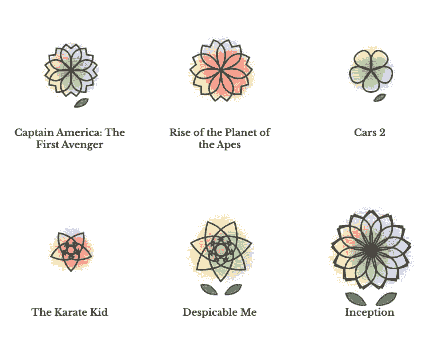
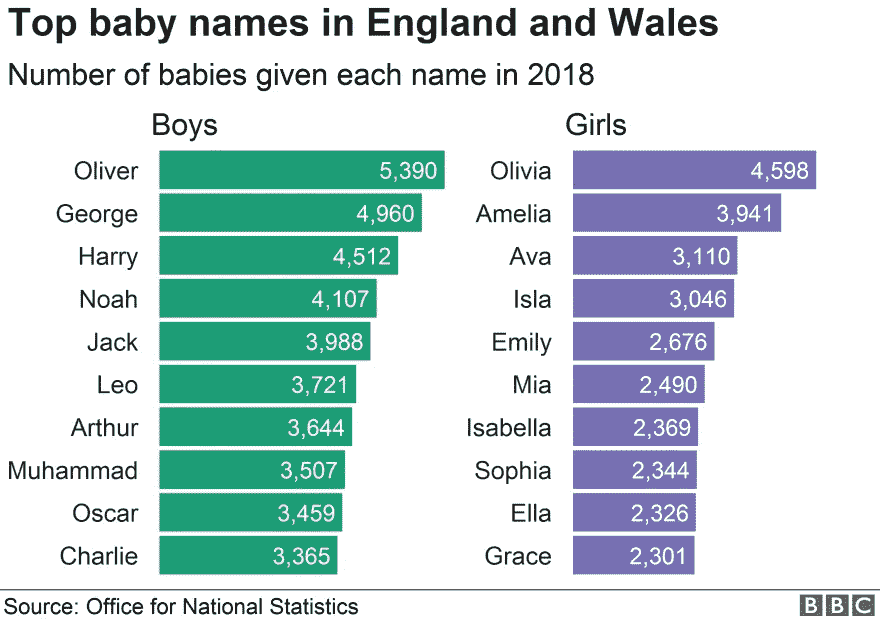
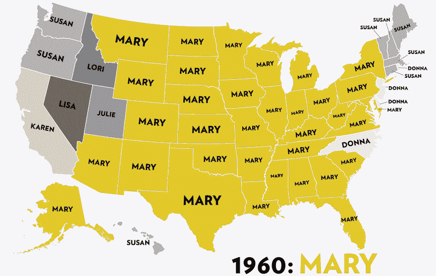
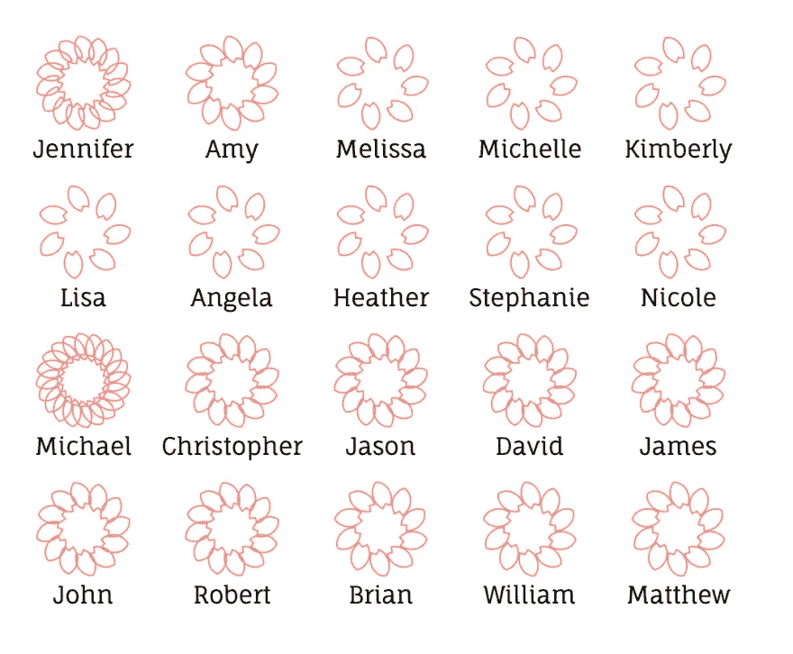
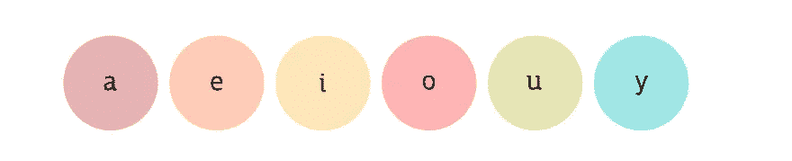
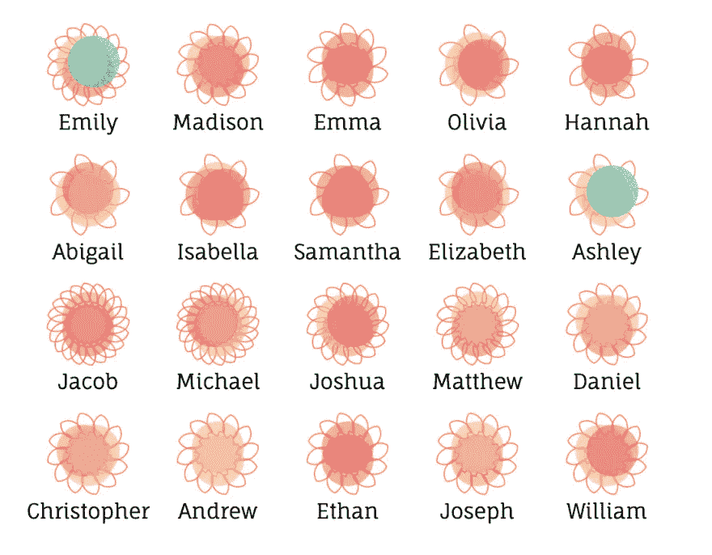
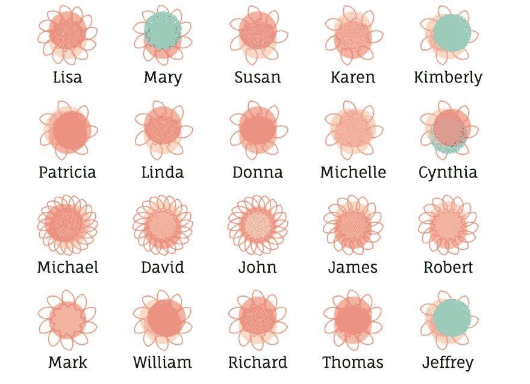

# 当艺术遇到数据:作为视觉隐喻的花

> 原文：<https://betterprogramming.pub/when-art-meets-data-flowers-as-visual-metaphor-3dba3c5f394b>

## 图表是如此的普通。我们可以用更多有趣的方式将数据可视化


[90 年代最热门的婴儿名字](https://baby-name-blossoms.netlify.app/)(作者摄)。

谈到数据可视化，我们已经习惯了古老的图表和地图。我们很少停下来，意识到这些仅仅是作为视觉隐喻的形状，帮助我们更容易地消化信息。

因此，我很高兴地发现了[吴雪莉的电影《花计划](https://sxywu.com/filmflowers/)，它用花作为媒介来呈现夏季顶级大片。



图片来自[片花](https://sxywu.com/filmflowers/)。

当然，它看起来不像简单的图表那么容易理解。但是，从艺术的角度来看，它无疑是数据可视化的一种替代方法。

受到将数据与美学相结合的光辉的启发，我决定将同样的视觉隐喻用于我的第一个 D3 数据可视化。

# 相同的数据集，不同的解释

流行的婴儿名字是我最喜欢的年度报告之一。自然，可视化这些数据的最常见方式是条形图。



我还从 Jezebel 那里找到了这张很酷的地图[，它利用 gif 动画展示了这些年来最受欢迎的名字:](https://jezebel.com/map-sixty-years-of-the-most-popular-names-for-girls-s-1443501909)



# 流行的婴儿名字被重新想象成花朵

与电影《花儿》类似，我的[婴儿名字《花儿》](https://baby-name-blossoms.netlify.app/)项目使用花瓣来量化数据——这些名字的受欢迎程度。



作者照片。

这个可视化背后的魔法是 D3 的[量化尺度](https://github.com/d3/d3-scale/blob/master/README.md#quantize-scales)，它允许我将流行度(`d.count`)转换成花瓣的数量(`numPetalScale`):

```
const countMinMax = d3.extent(data, d => d.count)
const numPetalScale = d3.scaleQuantize().domain(countMinMax).range([7, 10, 12, 15, 20])
```

由于我收集的数据是两种性别的前 10 个名字，这些值比电影《花儿》的 IMDb 投票值有更多的相似之处，因此要显示名字之间的巨大差异有点困难。

那么，我们如何添加特征来区分它们呢？每个名字的独特之处是什么？当我问自己这个问题时，我注意到电影花用颜色来表现每部电影的不同类型。

或许我也可以用颜色？把元音字母画出来怎么样？



作者照片。

这里，我使用 D3 的[序数标度](https://github.com/d3/d3-scale/blob/master/README.md#ordinal-scales)将元音与一系列颜色联系起来:

```
const vowels = ['a', 'e', 'i', 'o', 'u', 'y']
const petalColors = d3.scaleOrdinal().range(['#E44F5D', '#F6B06E', '#EFCB64', '#F8765C', '#E5D35F', '#1DDCCA'])
  petalColors.domain(vowels)
```

然后，在将每个数据集转换为 flower scale 的函数中，我传入了一个包含每个名字元音的新对象:

最后，我在花的内部添加了圆圈。

由于每个名字中的元音不同，现在我们可以看到各个名字之间更多的对比。最终的视觉效果非常令人满意:



作者照片。



作者照片。

# 经验教训

尽管 [D3.js](https://d3js.org/) 很神奇，但还是有很多意想不到的副作用，让我三天的小项目变成了一周。

对我来说，最大的意想不到的挑战是布局。

我最初使用 Flexbox 的[宝宝名字开花](https://baby-name-blossoms.netlify.app/)的 CSS 结构。然而，SVG 元素似乎与 responsive flex 设计不太协调。

由于这是一个 React 项目，我还想到利用任何现有的库，这使我想到了 [react-svg-flexbox](https://github.com/zoopoetics/react-svg-flexbox) 。可惜没有兑现。更糟糕的是，它的 babel-eslint 版本与我项目中的现有版本冲突，导致部署期间的初始错误。

看着电影《花》,它实际上为每个部分设计了特定的宽度，我匆忙地回复到使用相对/绝对定位来完成这个项目。

尽管如此，我对最终产品感到自豪，并将继续探索用艺术思维可视化信息的新方法。