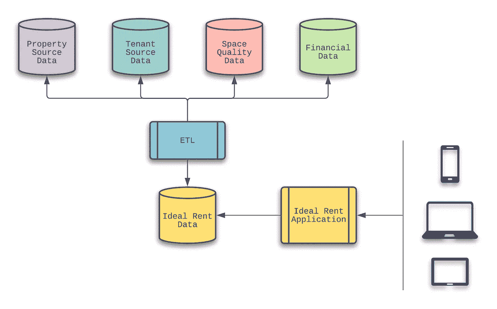
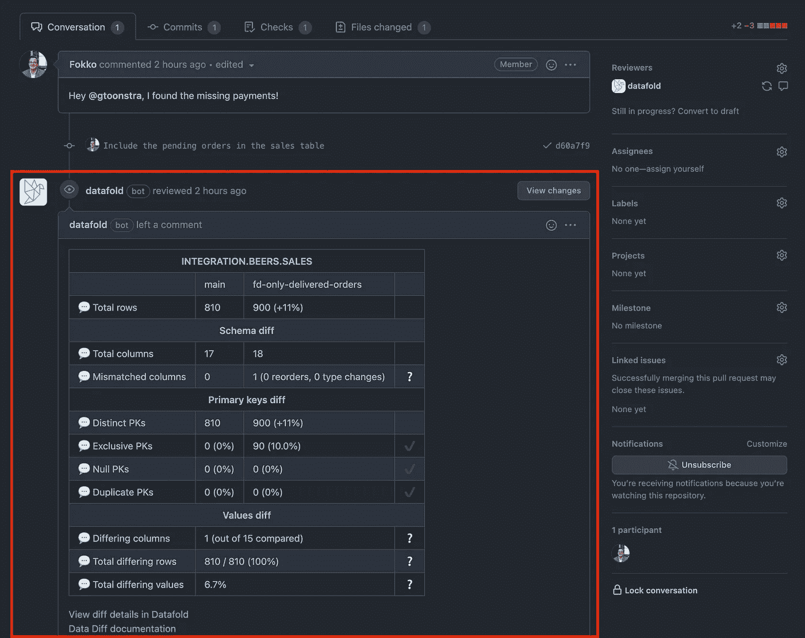

# 当大数据变坏时:恢复数据质量

> 原文：<https://betterprogramming.pub/when-big-data-goes-bad-rehabilitating-data-quality-e1065650835b>

## 在一个数据驱动的世界里，拥有数据来做决定提供了一个强大的优势…除非数据是坏的

我们生活在一个数据驱动的世界。

在过去的十年里，术语[大数据](https://en.wikipedia.org/wiki/Big_data)成为了技术的前沿——尽管这个术语是由[约翰·马什](https://en.wikipedia.org/wiki/John_Mashey)在二十多年前推广的。对大数据的追求促使企业雇佣团队，使用数学分析和归纳统计来揭示关系和依赖性。大数据技术专家的使命是使用数据预测结果和行为，从而带来企业优势。

为了以这种方式利用数据，数据本身必须是可靠的。意思是:试图根据糟糕的数据做出决策实际上比在完全没有数据的情况下做出决策更糟糕。

> “糟糕的数据无法做出好的商业决策。”
> T5【优步】工程

在这篇文章中，我回顾了我学到的一个教训，一位前雇主试图利用数据，后来发现这些数据是坏数据。基于这个教训，我们将快进到现代工程方法，将数据质量作为开发生命周期的一部分。

# 反思房地产业

在大数据出现之前，人们努力利用[数据仓库](https://en.wikipedia.org/wiki/Data_warehouse) (DW)和[商业智能](https://en.wikipedia.org/wiki/Business_intelligence) (BI)技术来洞察企业的业务状态。甚至在此之前，信息技术专家经常(在筒仓中)重新发明轮子，希望使用定制代码来获得竞争优势。

就是在这个时候，我发现自己在和一个房地产行业的领导者一起工作。虽然被认为是其所在行业的领跑者，但与竞争对手保持距离却成了一项挑战。

该公司感兴趣的领域之一是定义、证明和保护他们向租户收取的费用所需的时间。除了收取每平方英尺的基本租金，还有其他数据因素在租金中发挥了作用——双方都认为这个价格是公平的。

以这五个数据点为例:

1.  空间所在物业的质量
2.  物业内空间的位置
3.  靠近物业内的其他租户
4.  租户与房地产公司的现有关系
5.  考虑新租约的租户的稳定性

租赁团队—访问不同的系统—分析并回答了这些问题。

## 提供理想的租赁解决方案

IT 部门采取了一项自筹资金的举措来解决这个问题。我们的目标是引入一个应用程序，我们称之为理想租金，它会要求用户输入一系列信息，如下所示:

*   所需空间的属性和位置
*   提议租赁的开始和结束日期
*   租户名称和使用信息

利用这些信息，该系统将收集并预测一个费率，该费率可以通过为房产和承租人提供同等价值的因素来证明是合理的。概括地说，理想的租赁解决方案采用了以下设计:

完成幕后逻辑的工作相当复杂，因为数据集成产品仍处于 Gartner 炒作周期的技术触发阶段。

## 展示理想的租赁解决方案

当租赁领导第一次审查应用程序时，他们怀疑一个简单的输入表单能否产生以前需要大量人工分析的结果。一旦他们第一次看到应用程序，租赁团队很快就注意到所产生的建议的一些方面不是有效的假设。基本上，技术团队认为他们比租赁过程的所有者有更好的理解。

该系统没有成为达成最佳解决方案的单一点，以便为给定的租赁提供公平的费率。事实上，从这次经历中我们认识到了两个关键的教训:

1.  租赁团队没有完全参与这项工作，这导致对数据缺乏理解。
2.  功能团队不知道上游数据发生的变化。这影响了数据的质量和 Ideal Rent 应用程序提供的建议的下游结果。

# 数据驱动的决策需要高质量的数据

我在以前关于 DZone.com 的文章中讨论过从租赁行业的例子中吸取的主要教训。我最喜欢的一个是我在 2017 年写的“[优秀产品所有者的秘密](https://dzone.com/articles/the-secret-to-a-superior-product-owner)”出版物。它聚焦于一个名叫[的人，迈克尔·金纳德](https://www.linkedin.com/in/michael-kinnaird/)，在我从事信息技术的 30 多年中，他仍然是我共事过的最好的产品负责人。

前面引用的优步工程总结了我们在理想租金例子中学到的第二课。

正如在程序代码到达最终用户手中之前对其进行测试和验证的质量控制工作一样，围绕数据的质量控制也同样重要。在上面提到的例子中，将数据用于其应用程序的团队不知道数据设计的变化。这对提供的结果有负面影响。

我记得当时对这种认识感到惊讶，因为我觉得这些数据是合理的。我也意识到了讽刺，因为我的整个职业生涯都在处理“变化”,这是我特性设计和开发的主要驱动力。

# 如何保证数据质量

当我回想这个用例的时间安排时，我意识到了一些事情。如果理想的租赁应用程序是在令人瞠目结舌的数据变更披露之前发布的，结果将是灾难性的。我只能想象非理想的租金价值会对这家公司在华尔街的未来估值产生怎样的影响。

如果在那时，我们能够像今天这样做数据可观察性和数据质量，我们就会更早地发现我们的数据问题。这本来可以避免尴尬、头痛和沮丧，也可以避免暴露在巨大风险中的可能性。

最近，我偶然发现了 [Datafold](https://www.datafold.com/) ，这是一个帮助公司防止数据事故的数据可靠性平台。他们的 [Data Diff](https://www.datafold.com/data-diff) 特性专注于定位应用程序和流程所使用的源数据中的数据差异。该产品甚至可以处理数十亿(而不是数千甚至数百万)的记录。

为了说明识别数据质量问题的好处，让我们看一下房地产行业中三个简单的数据质量挑战，否则可能难以理解:

1.  采用定制标准行业分类代码系统
2.  改变房产的等级结构
3.  空间质量评级结构的修订

在每种情况下，如果这些数据的消费者不知道影响数据的挑战，结果将对数据质量产生负面影响。

## 采用定制 SIC 代码

[标准行业分类](https://en.wikipedia.org/wiki/Standard_Industrial_Classification)(原文如此)代码系统的建立是为了给每个行业一个四位数的代码。举个例子，如果你决定开一家自行车店，它会落入 3751 SIC 代码。

为了简化示例用例，考虑 SIC 代码过于宽泛而无法反映被占用空间的真实需求的挑战。换句话说，专注于提供不同娱乐选择的商店(如音像店、音乐商店和乐器店)都有相同的 sic 代码。

为了解决这个缺点，让我们假设房地产公司花时间引入了额外的 SIC 代码。这将有助于提供更多关于占据物业空间的潜在业务的详细信息。

然而，试图提供优化租金建议的团队并不知道这一变化。结果，那些没有找到新的定制 SIC 代码的情况退回到未知状态，导致低于标准的计算。此外，SIC 代码被改变用途的情况导致了建议租金值的不利结果。例如，如果自定义 SIC 代码映射到轮胎商店(使用普通 SIC 代码)而不是自定义珠宝商，月租金值将比预期低得多。

## 层级结构的变更

该房地产公司利用分层结构来帮助识别其物业的质量。基本上，一级物业是留给那些被认为是最好的。随着层级的增加，根据公司范围的评估，该酒店在列表中的位置会降低。

虽然 3 级和 4 级房地产处于低端，但它们仍然是相当盈利的实体。然而，这些空间的理想租金低于 1 级或 2 级物业的相同空间。

当在第 1 层引入评估元数据时，IT 团队可能会感到惊讶。让我们假设必须添加子层来回答这个问题，“为什么这个酒店被认为是我们最好的酒店之一？”可能的答案可能包括位置和邻近度、租户质量和产生的财政收入等项目。

当位置和邻近性是层决策背后的理由时，子层将不同地影响理想租金建议。在这种情况下，层级通常是第 2 层或第 3 层。

## 修订空间质量

空间质量背后的商业规则的变化也会影响理想租金的计算。想象一下，如果最初设计的空间质量等级是从 1 到 5，其中值 5 表示该级别最高。然后，该设计被更新以反映四分制，其中 4 是现在的最大值。

除非特性团队知道这个决定或者完全监控生产数据，否则他们不会意识到定义已经被重构了。这将意味着计算的空间质量方面将偏离至少 20%，这将对建议的理想租金产生负面影响。

# 向开发生命周期中添加数据差异

理想的租赁应用程序利用了提取、转换和加载(ETL)服务。换句话说，它从源系统中提取必要的数据，并将其转换成应用程序可以推荐理想租金的格式。正是在这一层，对底层数据的更改没有被注意到，导致对由该数据驱动的决策产生负面影响。

将数据差异引入到流程中只是持续集成(CI)流程中的一个新步骤。在配置了与您的集成相关的数据源之后，然后将 Datafold 添加到您的 [dbt](https://www.getdbt.com/) 配置中，数据差异测试的结果将作为您的拉请求审查过程的一部分显示出来。

因此，所有参与 PR 流程的人员都可以深入了解 Datafold 执行的数据质量分析。

# 但是等等，还有更多

在这一点上，你可能会认为这里仍然有一个缺口。当有代码变更和拉取请求时，数据质量步骤不能仅仅被归入 CI/CD 管道。当理想的租赁应用程序代码没有改变，但是源数据背后的规则改变了，会发生什么？

这就是 Datafold 的列级沿袭特性的用武之地。当工程团队或数据团队正在考虑更改数据规则时，他们可能会问这样的问题:“如果我们的查询也考虑了该表中列的值，那么我们最终计算中使用的数据会受到什么影响？”列级沿袭向团队展示了数据如何通过查询和转换的瀑布流动。在这里做一个改变，看看它将如何影响你的数据集。

团队—无论是数据团队还是工程团队—都将使用 Datafold 的 UI 来可视化和了解上游数据规则的更改如何影响下游数据。这种分析是独立于 CI/CD 管道和代码变更进行的。

请记住，您必须能够在没有相应的代码更改的情况下发现数据质量问题。毕竟，理想的租赁开发环境可能没有与源系统相匹配的所有更改，因此需要有一个安全措施来保护正在做出数据驱动决策的生产用户。

这就是为什么保持数据质量对于任何依赖数据做出明智决策的应用程序都至关重要。数据沿袭工具——如 Datafold 的列级沿袭分析——对此有所帮助。

# 结论

从 2021 年开始，我一直努力按照以下使命宣言生活，我觉得这可以适用于任何 IT 专业人士:

> “将您的时间集中在提供扩展您知识产权价值的特性/功能上。将框架、产品和服务用于其他一切。”
> ——j·维斯特

在本文中，我在职业生涯早期遇到的经历强调了数据质量的重要性。缺乏数据质量总是会对用于数据驱动决策的系统产生灾难性的影响。

使用数据做出关键决策的公司应该考虑专注于维护数据质量的工具，并且该工具应该是软件开发生命周期的一部分。

祝你今天过得愉快！