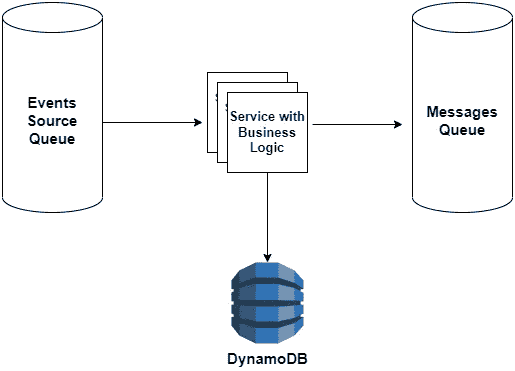
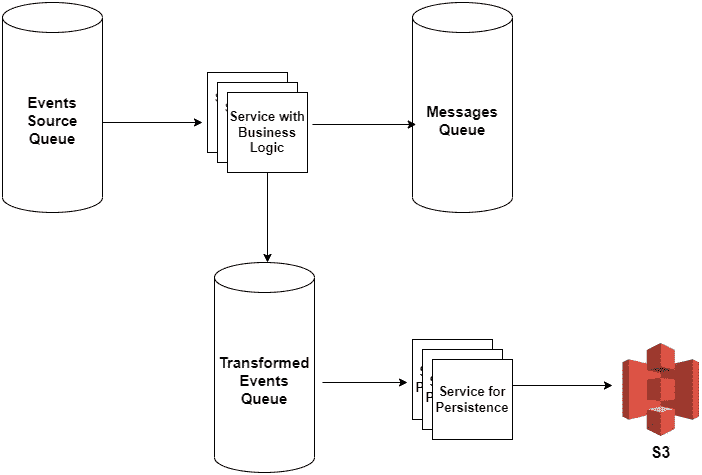
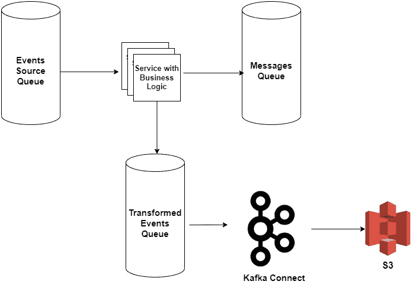

# DynamoDB 比 S3 便宜 10 倍

> 原文：<https://betterprogramming.pub/when-dynamodb-is-10x-cheaper-than-s3-7fae051876ce>

## 令人惊讶地享受着 DynamoDB 的低延迟和低成本


兰迪·塔兰皮在 Unsplash[上的照片](https://unsplash.com?utm_source=medium&utm_medium=referral)

作为使用托管 AWS 解决方案的大数据架构师，我们倾向于将头脑中的存储技术映射为经验法则。相对而言，S3 将属于“便宜又慢”的类别，而 DynamoDB 将属于“快速又昂贵”的类别。嗯，在我发现的某些用例中，使用 DynamoDB 可以变得既便宜又快速。

# **吃蛋糕，不要动它**

在我们的事件流处理系统中，我们每天处理来自源队列的 3 亿个事件。

我们的服务运行一些业务逻辑，包括对源事件的转换和丰富，并且在某些情况下向目标队列输出一条消息。

每个事件都有一个惟一的 GUID，第一个要求是在转换后存储它们，以便我们以后可以通过它们的 GUID 检索它们。

第二个要求是，这些检索只能发生在过去 30 天内摄取的事件上。

听起来很简单，对吗？我们基本上需要一个键值存储，将 GUID 映射到保留 30 天的转换事件。

让我们来分析一下使用 S3 和使用 DynamoDB 的成本。

我将从纯管理成本开始，也就是说，我们将向 AWS 支付多少，然后从更广泛的角度来看更多隐藏的成本(开发、维护和复杂性等)。).

所有费用将根据美国东部地区计算。


基本处理流程

首先，我们需要对我们处理的平均事件大小做一个假设。

在我的用例中，它是 5 KB，但是经过 GZIP 压缩后，我把它变成了 1.6 KB。压缩事件并根据压缩后的大小计算成本是许多工程师容易忽略的事情，这很容易将钟摆从一种技术转移到另一种技术。

# **AWS 每月成本**

每天写 3 亿个事件* 30 天=每月 90 亿个事件。
存储和传输的总数据为`1.6KB * 9B events = 14.4 TB`。
对于我们的用例，我们将假设每月有 5 亿次事件检索。

## **S3**

*   **存储**我们可以将 S3 存储桶配置为 30 天保留策略，因为我们不为 S3 的删除支付费用，所以我们不会对事件的驱逐收取任何额外费用。
*   **写请求***——*S3 标准的 1000 个看跌请求定价为 0.005 美元，合计 45000 美元(！).通常，在坚持 S3 时，您会希望将多个事件批处理成压缩格式或列格式，如 ORC 或 PARQUET。但是，当要求通过 GUID 检索事件时，您必须将它单独存储为一个由 GUID 控制的对象，该对象转换为一个 PUT 请求。
*   **读取请求***—*S3 标准的 1000 个 GET 请求定价为 0.0004 美元，总计 200 美元。

```
*Total =* $331 Storage + $45,000 Write + $200 Read = **$45,531 per month**
```

## **DynamoDB**

*   **存储** *—* DynamoDB 标准表每 GB 售价 0.25 美元，共计 3600 美元。我们可以为每个项目配置 30 天的 TTL，不收取额外的驱逐费用。
*   **写请求** *—* 我将使用调配的容量定价模型进行计算。如果需要，调配的容量还可以自动扩展。在调配模型中，您不为写请求付费，而是为“写容量单位”(WCU)付费。对于最大 1 KB 的项目，一个 WCU 每秒可以执行一个标准写入请求。因为我们的项目平均大小为 1.6 KB，所以我们需要将它四舍五入为每秒每个项目 2 个 wcu。在一个理想的世界中，事件的摄取在一个月中均匀分布，90 亿个事件将导致每秒写入 3，472 个事件，这意味着 6，944 个调配的 wcu。WCU 的价格是每小时 0.00065 美元，总计 3249 美元。如果事件分布不均匀，您需要处理突发事件，您可以配置自动缩放，您可能会付出或多或少相同的代价，这取决于您处理突发事件滞后的速度。
*   **读取请求** *—* 我将使用相同的调配容量模型。这里 AWS 使用一个术语叫做“读取容量单位”(RCU)。对于大小高达 4 KB 的项目，一个 RCU 每秒可以执行一个高度一致的读取请求或两个最终一致的读取请求。为了与自 2020 年 12 月以来一直高度一致的 S3 进行公平比较，我们将使用高度一致的读取价格进行计算。每月 5 亿个事件将导致每秒读取 193 个事件，这意味着 193 个配置的 rcu。RCU 的价格是每小时 0.00013 美元，总计 18 美元。

```
Total = $3,600 Storage + $3,249 Write + $18 Read = **$6,867 per month**
```

# **额外费用和复杂性**

到目前为止，我们已经达到了`$45,531 for S3 VS. $6,867 for DynamoDB`，非常接近我在标题中承诺的 10 倍，但还没有达到。

现在让我们看看更大的画面。作为处理的一部分写入 Dynamo 的标准事件处理管道可能如下所示:



坚持发电机流动

由于写入 DynamoDB 的延迟极低，我想说的是，如果您的服务需要 10 个 pods 来处理事件的吞吐量，同时坚持写入 DynamoDB，那么在写入 S3 时，您可能需要 50-100 个 pods 来处理相同的吞吐量。这将大大增加您的计算成本。

此外，您可能根据服务的业务逻辑需求校准了运行服务的 pod 的 CPU 和内存，仅仅为了 S3 的持久性而扩展更多的 pod 将是巨大的资金浪费。

在这种情况下，您可能更愿意使用不同的服务异步写入 S3，使用更少的 CPU 和 RAM 进行校准，或者如果您的消息传递基础架构是基于 Kafka 的，甚至使用 Kafka Connect S3 Sink 这样的解决方案。



坚持 S3，专注服务



坚持把 S3 与卡夫卡连接起来

在这个解决方案中，我们可以保留服务的原始 10 个 pods 和业务逻辑，如果我们不想自己编写代码，我们可以使用更便宜的 pods 用于持久性服务或使用 Kafka Connect。相对于简单的 S3 持久化流，我们节省了成本，但在计算方面仍然比简单的迪纳摩持久化流付出了更多。

那么复杂性呢？同步流极大地简化了我们的应用程序。它支持快速开发，并加快故障排除和维护。避免写入 S3 造成的延迟的解决方案导致了更复杂的异步流。

我们要么需要启动另一个需要实现和监控的服务，要么启动一个需要自己监控的 Kafka Connect 集群。当我们将流程分解成更多的非事务性活动部分时，我们还会在未来的特性中暴露更多的竞争条件。考虑到所有这些因素，加上我们最初的 AWS 账单，我们可以很容易地说，DynamoDB 解决方案比 S3 解决方案便宜 10 倍以上。

# **总结**

永远不要假设 S3 一定比 NoSQL 的解决方案便宜，看看你的具体使用案例的数字，你可能会得到令人惊讶的结果。

请记住在计算大小之前压缩数据。将解决方案的简单性和潜在的未来用例作为“隐藏”成本计算的一部分。

祝你下次架构头脑风暴会议好运。

```
**Want to Connect?**I'm the Founder and CTO @ [Poker Fighter](https://www.poker-fighter.com/)
```