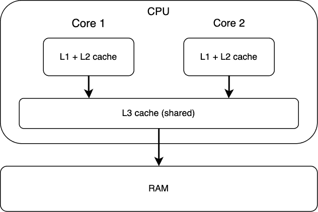
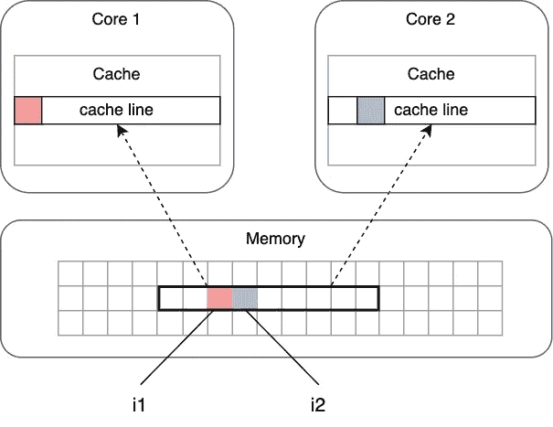

# 当 IO 绑定隐藏在 CPU 内部时

> 原文：<https://betterprogramming.pub/when-io-bound-hides-inside-cpu-e6e7f9df3187>

## 使用 Go 揭示纯 CPU 限制的应用程序中的 IO 瓶颈


克里斯蒂安·威迪格在 [Unsplash](https://unsplash.com/) 上拍摄的照片

我们中的许多人倾向于非常直观地考虑 IO 受限与 CPU 受限的应用程序，判断是 CPU 工作负载还是网络/文件 IO 操作占主导地位。在这个故事中，我将演示发生在 CPU 内部的 IO 工作负载——一种值得了解的特殊 IO。

为了简单起见，我将使用 Go 编程语言，因为 Go 对并发操作有一流的支持。如果您不熟悉它也没关系——代码非常简单！我们走吧！

# 旅程开始了

考虑一个简单的函数，它将一个整数变量递增若干次:

```
func incrementManyTimes(val *int64, times int) {
    for i := 0; i < times; i++ {
        *val++
    }
}
```

这些参数是:

*   指向我们想要增加的整数值
*   `times`表示我们想要增加的次数

这个任务很受 CPU 的限制，对吗？不涉及 IO。

# 并行做事

假设我们有两个需要递增的整数变量。由于任务是受 CPU 限制的，通常在多核机器中，我们只是并行化这样的任务——每个 CPU 内核一个变量。

在 Go 中，这很容易编码:

这里我们只是在两个并行的后台任务中运行最初的`incrementManyTimes`功能。因为 Go 试图利用尽可能多的 CPU 内核，所以它会将每个对`incrementManyTimes`的调用卸载到一个专用的 CPU 内核。

让我们看看它是如何工作的。

首先，我们定义实际的变量(它们将保存增加的值)。我们选择将它们定义为一个结构的一部分，这样它们就不会感到孤独:

```
// define structure type to hold the values
type IntVars struct {
   i1 int64
   i2 int64
}// create the actual values
vars := IntVars{i1: 0, i2: 0}
```

将单个值递增一千次的代码如下所示:

```
incrementManyTimes(&vars.i1, 1000)
```

为了并行增加 2 个值，我们将使用上面实现的`incrementParallel`:

```
incrementParallel(&vars.i1, &vars.i2, 1000)
```

如果我们的建议是正确的——在多核机器中，增加一个变量所需的时间必须与增加两个这样的变量所需的时间相同，因为我们是在不同的 CPU 内核上并行处理事情。

让我们进行基准测试，看看结果:

```
cpu: Intel(R) Core(TM) i7-9750H CPU @ 2.60GHzBenchmarkIncrement1Value              1.408 ns/op
BenchmarkIncrement2ValuesInParallel   2.172 ns/op
```

什么？并行增加 2 个值的时间比只增加一个值的时间多 54%!要么我们关于多核处理的建议是错误的【剧透:不是】，要么**这里有猫腻**。

为了理解为什么我们没有得到预期的结果，我们需要更深入地研究 CPU 缓存的工作原理。

# CPU 缓存

现代的 CPU 是一头野兽。它实际上是如此之快，以至于 RAM 跟不上它，成为一个瓶颈。为了克服这一点，CPU 尽可能使用嵌入式缓存来避免 RAM 访问。

高速缓存是一种更小、更快的内存，位于处理器内核附近。当试图从主存储器中的一个位置读取或向其写入时，处理器检查来自该位置的数据是否已经在高速缓存中。如果是这样，处理器将从高速缓存中读取或写入，而不是从慢得多的主存储器中读取或写入。

大多数 CPU 都有多个缓存级别(L1、L2，通常是 L3，甚至很少是 L4)，即由较大、较慢的缓存备份的小型快速缓存。多级高速缓存通常通过首先检查最快的(L1)高速缓存来操作；如果命中，处理器高速处理。如果较小的高速缓存未命中，则在访问外部存储器之前，检查下一个最快的高速缓存(L2 ),依此类推。每个 CPU 内核通常都有其本地缓存(在 Core-i7 中— L1 和 L2 [2]):



如果你认为拉姆很快，我有消息告诉你。以下是英特尔酷睿 i7 处理器的 CPU 高速缓存与 RAM 的访问时间比较[1，4]:

```
Core i7 Xeon 5500 Series Data Source Latency (approximate)               

L1 CACHE hit               1-2   ns
L2 CACHE hit               3-5   ns
L3 CACHE hit               12-40 ns

local  DRAM                ~60   ns
remote DRAM                ~100  ns
```

CPU 缓存可能比 RAM 快几个数量级！

现在，回到基准测试结果:

```
cpu: Intel(R) Core(TM) i7-9750H CPU @ 2.60GHzBenchmarkIncrement1Value              1.408 ns/op
BenchmarkIncrement2ValuesInParallel   2.172 ns/op
```

这些数字显示了执行一个值的**单次增量**所需的平均时间。1–2 纳秒令人印象深刻！RAM 就是不能给我们提供这样的速度。请确保—这些计算是在 CPU 缓存中完成的。

但问题仍然存在:为什么并行增加 2 个值(使用不同的 CPU 内核)比增加一个值要慢？

答案是“假分享”。

# 虚假分享

CPU 缓存由固定大小的内存区域——“缓存行”组成。CPU 只能缓存来自主存的完整大小的行。例如，如果我们访问 RAM 中的 8 字节整数值，CPU 将缓存整个行区域，这很可能超过 8 个字节(在 Core-i7 缓存行中是 64 个字节)。

当不同的内核访问主内存的同一个区域时，每个内核在本地 CPU 缓存中都有自己的数据副本。当一个 CPU 内核改变该内存时，其他内核的缓存会失效，使它们重新加载缓存行，从而导致性能下降。这种情况称为假共享。

在我们的例子中，事情是这样的。



尽管每个 CPU 内核都在处理不同的值，但它们都共享同一个缓存行，导致每次任何一个变量发生变化时，彼此的缓存都会失效。这正是虚假分享。

## 减轻

为了避免错误的共享，我们需要确保我们的变量不落入同一缓存行。实现这一点的一种方法是在它们之间插入填充:

```
type IntVars struct {
   i1 int64
   _  [56]byte // padding
   i2 int64
}
```

请记住，在核心 i-7 缓存线是 64 字节长。为了保证变量`i1`和`i2`落入不同的缓存行，我们需要确保在内存布局中它们之间至少有 64 字节的距离。为了实现这一点，我们可以在它们之间插入 56 字节的填充(我们不需要插入 64 字节，因为类型`int64`的`i1`已经占用了 8 字节)。

现在让我们重新运行我们的基准测试:

```
cpu: Intel(R) Core(TM) i7-9750H CPU @ 2.60GHzBenchmarkIncrement1Value               1.367 ns/op
BenchmarkIncrement2ValuesInParallel    1.374 ns/op
```

既然我们已经消除了错误共享，并行增加 2 个值与增加一个值一样快。

这种优化非常具体，编译器无法为我们做到这一点，因为我们牺牲了一些内存(56 字节)来填充。所以做这样的优化是程序员的责任。

## 跨架构支持

在上面的示例中，我们专门针对酷睿 i7 CPU 架构优化了并行代码执行，知道了高速缓存行的大小。但是如果我们希望这种填充也能在其他 CPU 上工作呢？

Go 标准库的扩展为此提供了一个特殊的类型:[https://pkg.go.dev/golang.org/x/sys/cpu#CacheLinePad](https://pkg.go.dev/golang.org/x/sys/cpu#CacheLinePad)

为了使我们的代码独立于 CPU 架构，我们可以将填充重写如下:

```
import "golang.org/x/sys/cpu"type IntVars struct {
   i1 int64
   _  cpu.CacheLinePad // padding
   i2 int64
}
```

## 测量 CPU 缓存性能

实际上有一种测量 CPU 缓存性能的方法来证明我们的发现。许多 CPU 都支持硬件性能计数器——一组专用的[寄存器](https://en.wikipedia.org/wiki/Processor_register)来存储硬件相关活动的计数。每个计数器都可以编程为要监控的事件类型，如 L1 缓存未命中或分支预测失误。然后可以使用特殊的汇编指令读取这些计数器。

在 Linux 上，我们可以使用`perf`工具为程序执行读取这样的计数器。让我们尝试并行递增的填充和非填充实现，并查看 L1 缓存未命中的结果(在错误共享期间会发生)。这个程序非常简单，我们只是并行增加 2 个值，1 亿次:

```
func main() {
   a := IntVars{}
   incrementParallel(&a.i1, &a.i2, 100000000)
}
```

让我们测量两种实现的 L1 缓存未命中。

非填充，带有错误共享:

```
▶ perf stat -B -e L1-dcache-load-misses ./test**8,650,268**      L1-dcache-load-misses
```

填充，没有虚假共享:

```
▶ perf stat -B -e L1-dcache-load-misses ./test-padded**205,526 **     L1-dcache-load-misses
```

事实上，由于错误共享，最初的实现会产生 40 倍的 L1 缓存未命中。

# 其他技术

在我们的示例中，通过在内存布局中的值之间添加填充，就可以消除错误共享。取决于算法，可以应用其他技术。例如:

*   大型源数据阵列可以以防止缓存行重叠的方式跨 CPU 内核拆分
*   多维数组的遍历可以以内存线性的方式完成，这是缓存友好的
*   如果内存值被并行例程改变，它们可以将该值复制到它们的本地堆栈中，完成工作，然后将结果合并回原来的内存位置

下面是一些 CPU 缓存优化的真实例子[3]:

> Linux 以大约 30Mbps(有线)的速度路由数据包，无线以大约 30Mbps 的速度。Windows CE 的有线网速仅为 12Mbps，无线网速仅为 6Mbps。我们发现 Windows CE 比 Linux 有更多的指令缓存未命中。在我们改变了路由算法，使之更加缓存本地化之后，我们开始做 35 Mbps[有线]和 25MBps 无线——比 Linux 好 20%。
> 
> 谢尔盖·索利亚尼克(来自微软)。

> 缓存线是关键！毋庸置疑！如果你在数据布局上犯了哪怕一个错误，你将会得到慢 100 倍的解决方案！不开玩笑！
> 
> Dmitriy Vyukov(继电器竞争检测器的开发者)。

# 结论

在这个故事中，我们探讨了什么是错误共享，以及如何利用 CPU 内存架构知识来实现算法实现中的显著性能提升。

您可以使用随附的 Github repo:[https://github.com/glebarez/false-sharing-demo](https://github.com/glebarez/false-sharing-demo)轻松复制结果

> 如果您热衷于代码的速度，那么在设计和实现您的算法和数据结构时，您必须考虑缓存/内存层次结构。
> 
> Jan Gray(微软 CLR 性能团队)。

# 参考

1.  [https://web . archive . org/web/20160315021718/https://software . Intel . com/sites/products/parallels/HPC/vtune/performance _ analysis _ guide . pdf](https://web.archive.org/web/20160315021718/https://software.intel.com/sites/products/collateral/hpc/vtune/performance_analysis_guide.pdf)
2.  【https://www.aristeia.com/TalkNotes/ACCU2011_CPUCaches.pdf 
3.  [https://www . researchgate . net/figure/Intel-Core-i7-cache-architecture _ fig 1 _ 324029106](https://www.researchgate.net/figure/Intel-Core-i7-cache-architecture_fig1_324029106)
4.  [https://stack overflow . com/questions/4087280/approximate-cost-to-access-variable-caches-and-main-memory](https://stackoverflow.com/questions/4087280/approximate-cost-to-access-various-caches-and-main-memory)