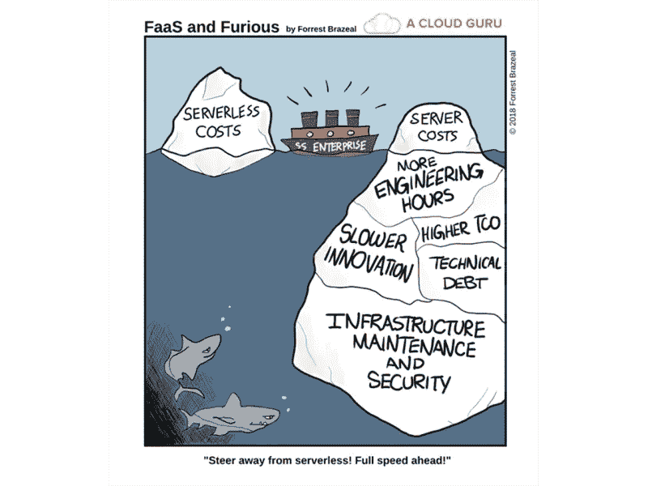
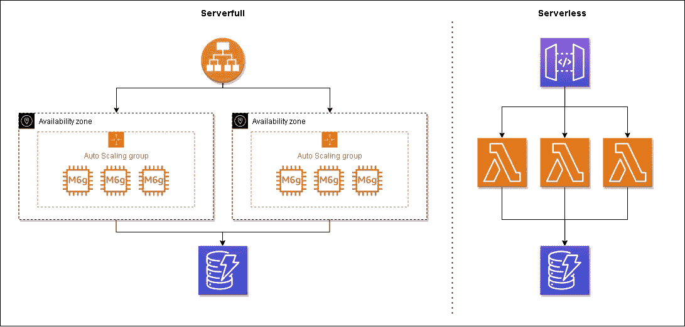
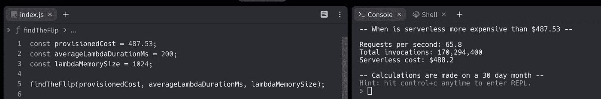

# 什么时候无服务器比容器贵？

> 原文：<https://betterprogramming.pub/when-is-serverless-more-expensive-than-containers-23b318662ce6>

## 一定量的流量使得无服务器在月底的账单更加昂贵


图片由 Freepik 上的[用户 18526052](https://www.freepik.com/free-photo/portrait-unhappy-stressed-beautiful-lady-looking-open-empty-wallet-with-upset-expression_9168091.htm#query=expensive&position=10&from_view=search&track=sph) 提供

我和很多人谈论过无服务器。令人震惊，我知道。

当讨论生产应用程序的无服务器可行性时，我经常遇到同样的两个论点:

“*冷启动太差了，我们不能用无服务器的*”和“*你不担心规模化的成本吗？*

我们已经讨论了[为什么我们应该停止谈论冷启动](/lets-stop-talking-about-serverless-cold-starts-38e4c1fda963)。但是关于规模成本的问题我们还没有涉及到。

这也不是一个非黑即白的论点。

与容器相比，无服务器应用程序提供了显著的总拥有成本(TCO)优势。您不必花费时间(金钱)在服务器维护、安装补丁、在无效状态下重启服务、管理负载平衡器等方面。



[来源](https://twitter.com/acloudguru/status/1070710166813900800)

但是为了便于讨论，我们可以比较一下总账单，把其他因素放在一边。当你还没有向你的观众推销这个概念时，这些很难被客观地证明。

因此，严格比较美元和美分是我们的目标。这又是一个难以证明的概念。将 EC2 这样的预配服务与 Lambda 这样的按使用付费服务进行比较是困难的，但也是不可能的。

我经常听说无服务器在“规模化”方面很昂贵，但是没有人能有效地交流实际的流量是多少。

几周前，我与杰瑞米·戴利和崔琰就这个话题进行了一次很好的讨论。我们都得出结论，某些工作负载在无服务器的情况下运行成本要高得多，但临界点通常很难具体化。我们能做的最好的事情就是用一种启发式的方法来分析我们的花费。

让我们深入研究一些数字。

# 比较 EC2 和 Lambda

*免责声明—我知道在实际实施中会有很大的差异，并且我执行的任何计算都不会符合每个人的使用情形。这是一个概括的示例，显示了无服务器实施导致较高 AWS 账单的相对规模。*

我们将比较的两个应用程序分别是针对计算进行了优化的负载平衡 EC2 机群，以及完全由 Lambda 函数支持的无服务器应用程序。

我们将忽略出口数据费用和 CloudWatch 费用，因为两者都将出现在两个应用程序中。我们正在比较的架构如下:



*我们正在比较的计算机的架构图*

为了模拟一个生产应用程序，EC2 实例群将被部署在多个可用性区域中，并通过一个应用程序负载平衡器进行路由。这些实例将是通用的，并针对微服务的使用进行了优化，所以我选择了 [M6g 实例](https://aws.amazon.com/ec2/instance-types/m6g/)。

M6g.xlarge 实例按需定价为每小时 0.154 美元。在我们的场景中，假设我们在两个 az 24/7 中平均运行两个实例。应用程序负载平衡器的价格是每小时 0.028125 美元，[加上 lcu](https://aws.amazon.com/elasticloadbalancing/pricing/)。假设每秒 50 个连接持续 0.2 秒，每个连接处理 10KB 数据，我们的运行成本大约为:

```
($0.154 EC2 per hour x 24 hours x 30 days x 4 instances + (($0.028125 ALB per hour + $0.01 x 3.3 LCU) x 24 hours x 30 days)= **$487.53**
```

因此，一个由四个通用实例组成的负载平衡机群每月需要 487.53 美元。请记住，这仅用于计算机。我们还没有考虑 EBS 卷、数据传输或缓存等因素。

在为 ALB 定价时，我们假设每秒有 50 个连接，每个连接持续 0.2 秒，因此在计算 Lambda 成本时我们将考虑这个数字。

Lambda 按照 GB/s 和调用定价[。对于我们的计算，我们将假设我们的函数被配置为使用 1024MB 的内存。](https://aws.amazon.com/lambda/pricing/)

每秒 50 个请求(RPS)总计每月 1.296 亿个请求，我们将在下面使用。

*$ . 00000000133 x 200 ms x 129.6m 调用+(129.6m/1M x $ . 2)=****$ 370.65***

因此，在每秒 50 个请求的情况下，无服务器加起来比我们的 EC2 车队的账单要少，但是使用这些计算，我们可以很容易地计算出如果不进行[优化](/quick-optimizations-you-should-make-to-your-serverless-applications-9cc73ec464b9)，账单翻转到 EC2 成为“更便宜”选项的点。



使用[这个小计算器](https://replit.com/@AllenHelton/When-Is-Serverless-More-Expensive#index.js)，我们可以看到，一旦达到平均每秒 66 个请求，无服务器就会变得更加昂贵。

# 比较 App Runner 和 Lambda

AWS App Runner 是一项相对较新的服务，将于 2021 年 5 月推出。它是一种托管服务，可以自动构建、部署、负载平衡和扩展容器化的 web 应用和 API。

与 EC2 相比，App Runner 的定价更简单，变化更小。与 Lambda 类似，您为应用程序消耗的计算和内存资源付费。您需要为每 vCPU 小时支付 0.064 美元，为每 GB 小时支付 0.007 美元。

为了匹配我们上面定价的示例应用程序，我们将配置我们的容器来运行两个 vCPUs 和 4GB 内存。

App Runner 中的每个容器每秒可以处理多达 80 个并发请求。我们的示例应用程序每秒处理 50 个请求，因此我们可以估计单个应用程序运行器容器的成本。

```
($0.064 x 2 vCPUs) + ($0.007 x 4 GB memory) x 24 hours x 30 days x 1 container instance = **$112.32**
```

从上面的例子中，我们已经知道 Lambda 的运行成本更高，为 370.65 美元。所以，在这种情况下，App Runner 的运营成本更低。使用之前的计算器，我们可以确定每秒运行 15 个或更少请求的应用程序在这种配置下在无服务器上运行会更便宜。

# 摘要

最重要的是要记住 TCO。除了每月账单底部的数字，还有更多东西需要花费。持续维护、开发速度慢、网络复杂等。…所有这些都是应用程序实际运行成本的一部分。

上面的例子简单而模糊。它们并不是真实生产应用程序的详细示例。这将是荒谬的复杂和难以遵循的一篇文章。这篇文章的目的是告诉你，当你没有服务器时，计算会变得更加昂贵。*但是有时候，那也可以！*

许多应用程序永远看不到这一转变所需的流量。在我们的 EC2 示例中，我们必须每月超过 1.702 亿个请求才能达到转折点。虽然对一些人来说这肯定是一个可以达到的数字，但对许多人来说可能不现实。早期阶段的初创公司将通过启动无服务器并在达到合理规模时转向 App Runner 来大幅降低成本。

说到 App Runner，我们看到支持相同应用程序的成本约为 EC2 支出的 25%。如果你打算坚持使用容器(我保证这没有错)，考虑 App Runner，而不是一头扎进 EC2 的复杂性中。

如果你想自己做计算，我鼓励你试试我做的 T4 计算器。输入您当前调配的服务支出，调整 Lambda 的配置，然后运行脚本。它会告诉你什么是无服务器的转折点。

准确预测成本和比较如何使用 AWS 是一门完整的科学。当人们告诉您无服务器在规模上更昂贵时，这旨在让您大致了解“在规模上”是什么意思。进行全面成本分析时，还有许多其他重要因素需要考虑。

无服务器成本与使用量成线性关系。你用得越多，它不会变得越贵。通常，[它实际上变得更便宜了](https://aws.amazon.com/blogs/compute/introducing-tiered-pricing-for-aws-lambda/)！遇到无服务器变得过于昂贵的情况，感觉是一个好问题。这意味着你的应用越来越受欢迎，一系列新的挑战开始出现。

编码快乐！