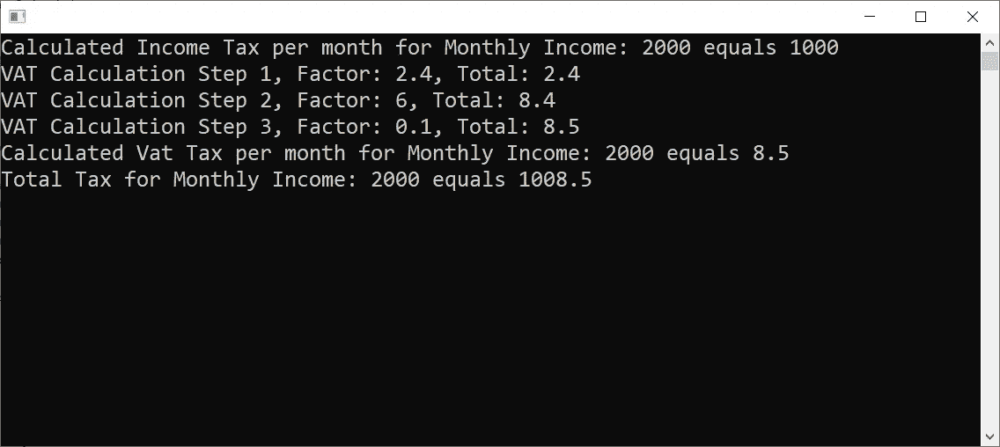

# 中何时不使用 DI、IoC 和 IoC 容器。NET C#

> 原文：<https://betterprogramming.pub/when-not-to-use-di-ioc-and-ioc-containers-f95881d0fe0>

## 最佳实践

## 知道什么时候 DIs 不是正确的解决方案，以及在什么情况下使用更好的设计。NET C#

奥拉夫·阿伦斯·罗特内在 [Unsplash](https://unsplash.com?utm_source=medium&utm_medium=referral) 上的照片

在我多年的软件工程师工作中，我遇到过很多我看不懂代码的情况。

首先，我认为这是源于我缺乏知识或者我的技能不够敏锐，这总是促使我学习更多。

然而，在年复一年的学习和实施之后，我惊讶地发现我仍然不时地面临着同样的问题。为什么当了 12 年多的软件工程师后，我仍然有同样的问题？！

有人可能会回答这个问题，可能你正在看的代码实在是太糟糕了，这就是为什么它对任何人来说都很难理解，甚至对编写它的人来说也是如此。

不幸的是，没有。相信我，我希望这是答案，但这不是我说的情况。我所指的代码实际上，以今天的标准来看，是完美的。

然后呢？！！

 [## 订阅艾哈迈德的时事通讯？

### 订阅艾哈迈德的时事通讯📰直接获得最佳实践、教程、提示、技巧和许多其他很酷的东西…

medium.com](https://medium.com/subscribe/@eng_ahmed.tarek) 

# 这个发现

当我仔细研究它，并投入一些安静的时间做这件事时，我发现了我作为软件工程师一生中最重要的发现之一。

**依赖注入(DI)** 、**反转控制(IoC)** 和 **IoC 容器**是我们的朋友，但就像生活中的一切一样，如果你滥用它们，你会得到你从未希望得到的东西。

在 DI 和 IoC 容器出现之前，管理不同模块/类之间的依赖关系简直是地狱，这就是为什么我们在定义这些依赖关系时更加小心谨慎。在开始实现之前，我们通常会对每个模块/类的依赖性考虑两次甚至更多。

然而，现在有了 DI、IoC 和 IoC 容器之后，定义依赖关系变得像呼吸一样，当你实际上不认识它时，你就隐含地这么做了。

照片由[蒂姆·莫斯霍尔德](https://unsplash.com/@timmossholder?utm_source=unsplash&utm_medium=referral&utm_content=creditCopyText)在 [Unsplash](https://unsplash.com/s/photos/what?utm_source=unsplash&utm_medium=referral&utm_content=creditCopyText) 上拍摄

# 现在怎么办？

为了理解我真正的意思，我将带你看一个实际的例子。我知道你喜欢编码，那么，为什么不开始编码，看看它是如何工作的呢？

## 但是，免责声明！

1.  您将看到的代码并不完美。出于演示的目的，我们有意忽略了一些最佳实践，以便将您的注意力集中在本文中我们所要介绍的其他最佳实践上。
2.  在软件中，总有妥协的余地，90%的时候你可以有自己的设计限制。因此，请研究您会在代码中找到什么，分析它，看看什么适合您自己的情况。
3.  我不是税务方面的专家，对税务也没有任何实际经验。因此，请原谅我在代码中发现的虚假的临时计算🙂

照片由[摄影师](https://unsplash.com/@ffstop?utm_source=unsplash&utm_medium=referral&utm_content=creditCopyText)在 [Unsplash](https://unsplash.com/?utm_source=unsplash&utm_medium=referral&utm_content=creditCopyText) 上拍摄

# 在代码车道上绊倒

我们这里的简单例子是关于计算税收的软件。我们有两种类型的固定税；增值税和收入。

现在，让我们开始实现代码。

## 伊洛格

我们在这里可以注意到:

1.  这是界面`ILogger`。
2.  它代表了我们在解决方案中可能拥有的所有记录器。
3.  它只定义了一个头为`double void LogMessage(string message);`的方法。

## itax 计算器

我们在这里可以注意到:

1.  这是`ITaxCalculator`的界面。
2.  它代表了我们在解决方案中可以使用的所有税收计算器。
3.  它只定义了一个带有头文件`double CalculateTaxPerMonth(double monthlyIncome);`的方法。

## 控制台记录器

我们在这里可以注意到:

1.  这是一个实现`ILogger`的`ConsoleLogger`类。
2.  它包装了`System.Console`类并使用它写入控制台。这并不是完美的实现，但是对于现在来说已经足够了，以便将您的注意力集中在当前的范围上。
3.  如果你想了解更多更好的设计和实现，可以查看这个故事: [**如何全面覆盖。带有单元测试的. NET C#控制台应用程序**](https://itnext.io/how-to-fully-cover-net-c-console-application-with-unit-tests-446927a4a793?sk=63c75b56de78903f09f0d0116df5fe3a) 。

## 收入计算器

我们在这里可以注意到:

1.  这是一个实现了`ITaxCalculator`的`IncomeTaxCalculator`类。
2.  它依赖于`ILogger`来记录一些关于计算的重要信息。
3.  这就是为什么`ILogger`被注入到构造函数中。
4.  在`CalculateTaxPerMonth`方法实现中，我们只是使用注入的`ILogger`进行计算并记录消息。

## 增值税计算器

我们在这里可以注意到:

1.  这是一个实现了`ITaxCalculator`的`VatTaxCalculator`类。
2.  它依赖于`ILogger`来记录一些关于计算的重要信息。
3.  这就是为什么`ILogger`被注入到构造函数中。
4.  在`CalculateTaxPerMonth`方法实现中，我们只是使用注入的`ILogger`进行计算并记录消息。
5.  不同的是，这里的计算更加复杂，需要 3 个步骤来完成计算，并且每一步我们都需要记录重要的信息。

## 程序

我们在这里可以注意到:

1.  这就是`Program`类。它是整个应用程序的主要入口点，顺便说一下，这是一个 C#控制台应用程序。
2.  我们使用的是 **AutoFac IoC 容器**，所以你需要从 Nuget 包管理器安装它。
3.  在`Main`方法中，我们做的第一件事是初始化 IoC 容器，定义我们的抽象-实现对，并创建我们的 IoC 容器范围。
4.  在这个范围内，我们正在解析一个`ILogger`的实例，以及所有可用的`ITaxCalculator`实现的列表。
5.  然后，我们将使用所有的税收计算器来计算所有税收的总和。
6.  最后记录一条消息。

当运行应用程序时，我们将得到下图中的结果。

图片由[艾哈迈德·塔里克](https://medium.com/@eng_ahmed.tarek)拍摄

太好了，应用程序正在按预期工作，我们已经定义了我们的依赖项，我们正在使用 DI、IoC 和 IoC 容器……完美。

好吧，你可能会发现这很完美，而且容易阅读和理解。然而，如果你有太多的模块，太多的记录器，太多的计算器，…

照片由[艾米丽·莫特](https://unsplash.com/@emilymorter?utm_source=unsplash&utm_medium=referral&utm_content=creditCopyText)在 [Unsplash](https://unsplash.com/?utm_source=unsplash&utm_medium=referral&utm_content=creditCopyText) 上拍摄

# 如果呢？

*   你想控制整个记录过程的带宽？每小时记录的行数？
*   您想将您的设计迁移到微服务吗？
*   日志记录服务已关闭，您希望跟踪丢失的日志
*   你想使用类似消息总线的东西吗？

**如果……**

我们有很多“如果”**、**不要误解我的意思，我知道这些不是需求的一部分。所以，我不怪你在设计中没有考虑到这些。

然而，我担心的是:

1.  这种设计还不能满足这些需求。
2.  你需要应用太多的改变来适应新的需求。
3.  即使你没有把记录器和计算器设计成独立的微服务，这也不意味着税收计算器应该依赖于记录器。
4.  计算器可以使用记录器，但是，如果记录器不在，它也应该能够完成它的工作。
5.  我听到有人说，然后我们可以修改实现，使日志记录器为可选的，检查它是通过还是空等等，…
6.  即使我们应用了这个，除了糟糕的实现和检查空值之外，…计算器模块/类仍然知道一些不合逻辑的叫做 logger 的东西。
7.  此外，使用当前的设计，您无法将计算和记录消息分开。此外，没有一个控制点来监控来自所有计算器的信息流。这使您失去了进行聚合、应用阈值等的优势
8.  此外，如果有人新加入团队并开始研究代码，他最终会看到一个巨大的不合逻辑的依赖关系网。

再说一次，我知道你不应该基于对未来 50 年的梦想来应用复杂的设计。然而，当实际应用简单的最佳实践会使整个设计更加健壮和可靠时，我们有时会把事情过分简化。

照片由[莎伦·麦卡琴](https://unsplash.com/@sharonmccutcheon?utm_source=unsplash&utm_medium=referral&utm_content=creditCopyText)在 [Unsplash](https://unsplash.com/?utm_source=unsplash&utm_medium=referral&utm_content=creditCopyText) 上拍摄

# 然后呢？

你能做的只是简单地改变你思考依赖的方式。

是的，我们知道依赖是与实现相联系的，而不是与抽象相联系的。但是，你认为实现`IncomeTaxCalculator`应该依赖于记录器吗？

我可以理解，实现了`IRepository`接口的`SQLDatabaseRepository`类实现将——根据定义——依赖于某个打开和关闭 SQL 数据库连接的模块。这是一件你可以完全信任地轻易说出的事情。

然而，在相同的信任级别下，你不能轻易地说同一个`SQLDatabaseRepository`类实现依赖于一个日志模块，对吗？

照片由 [Silvan Arnet](https://unsplash.com/@silvanarnet?utm_source=unsplash&utm_medium=referral&utm_content=creditCopyText) 在 [Unsplash](https://unsplash.com/?utm_source=unsplash&utm_medium=referral&utm_content=creditCopyText) 拍摄

# 靶心

## 怎么做才是对的？

只要对设计做些简单的改变，我们就能实现它。所以，让我们深入研究代码。

## itax 计算器

我们在这里可以注意到:

1.  我们对`ITaxCalculator`接口进行了修改。
2.  我们定义了一个`TaxCalculationReportReadyEventHandler`类型的委托。
3.  我们在接口中将一个新成员定义为类型为`TaxCalculationReportReadyEventHandler`的事件。
4.  每当任何税收计算器中的日志消息准备就绪时，该事件将用于向任何订阅者发出消息。

## TaxCalculatorBase

我们在这里可以注意到:

1.  我们为所有的`ITaxCalculators`实现定义了新的基类`TaxCalculatorBase`。
2.  该类将提供受保护的`OnTaxCalculationReportReady`方法的通用实现，该方法负责内部触发`TaxCalculationReportReady`事件。这是微软建议的最佳实践之一。

## 收入计算器

我们在这里可以注意到:

1.  现在`IncomeTaxCalculator`类扩展了`TaxCalculatorBase`类而不是`ITaxCalculator`接口。
2.  它不再像在旧实现中那样依赖于`ILogger`接口。
3.  现在，每当它需要报告消息时，就会触发`TaxCalculationReportReady`事件，而不是直接使用`ILogger`接口的实例。

## 增值税计算器

与`IncomeTaxCalculator`类相同的变化。

## 程序

我们在这里可以注意到:

1.  这里的主要变化是为每个`ITaxCalculator`接口实现订阅`TaxCalculationReportReady`事件。
2.  并以集中的`LogTaxReport`方式处理。
3.  现在，关于税收计算和记录需求的知识就在正确的地方。
4.  我们现在可以轻松控制解决方案中的不同模块，收集所有需要的信息，做出集体决策，…
5.  简单地说，把你自己击倒，你可以做任何你想做的事。

运行该应用程序，我们将得到如下图所示的结果:

图片由[艾哈迈德·塔里克](https://medium.com/@eng_ahmed.tarek)

因此，现在我们有了相同的结果，但具有不同的设计和扩展功能。

现在，我们可以轻松地修改设计，添加我们在上面的“假设”部分中希望的新功能，简单明了…

照片由[格雷瓜尔·贝托](https://unsplash.com/@sirtook?utm_source=unsplash&utm_medium=referral&utm_content=creditCopyText)在 [Unsplash](https://unsplash.com/?utm_source=unsplash&utm_medium=referral&utm_content=creditCopyText) 上拍摄

最后，我想强调一点——在软件世界里，你每天都在成长，你应该始终关注下一步该学什么。学习永远不嫌晚。

最后，希望你觉得读这个故事和我写它一样有趣。

# 希望这些内容对你有用。如果您想支持:

如果您还不是**媒介**会员，您可以使用 [**我的推荐链接**](https://medium.com/@eng_ahmed.tarek/membership) ，这样我可以从**媒介**中获得您的一部分费用，您无需支付任何额外费用。
▎订阅 [**我的简讯**](https://medium.com/subscribe/@eng_ahmed.tarek) 将最佳实践、教程、提示、技巧和许多其他很酷的东西直接发送到您的收件箱。

## 想多看作者？

 [## 中的协方差和逆变。NET C#

### 很难理解吗？让我为你简化它。

levelup.gitconnected.com](https://levelup.gitconnected.com/covariance-and-contravariance-in-net-c-c2b8576b2155)