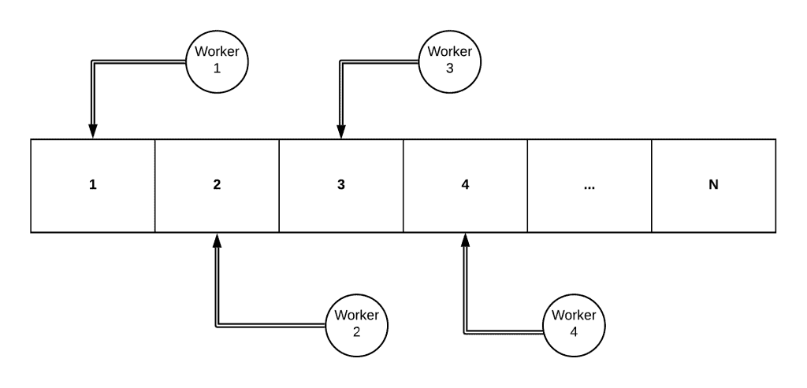
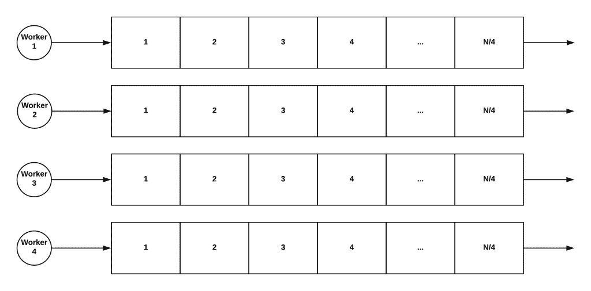
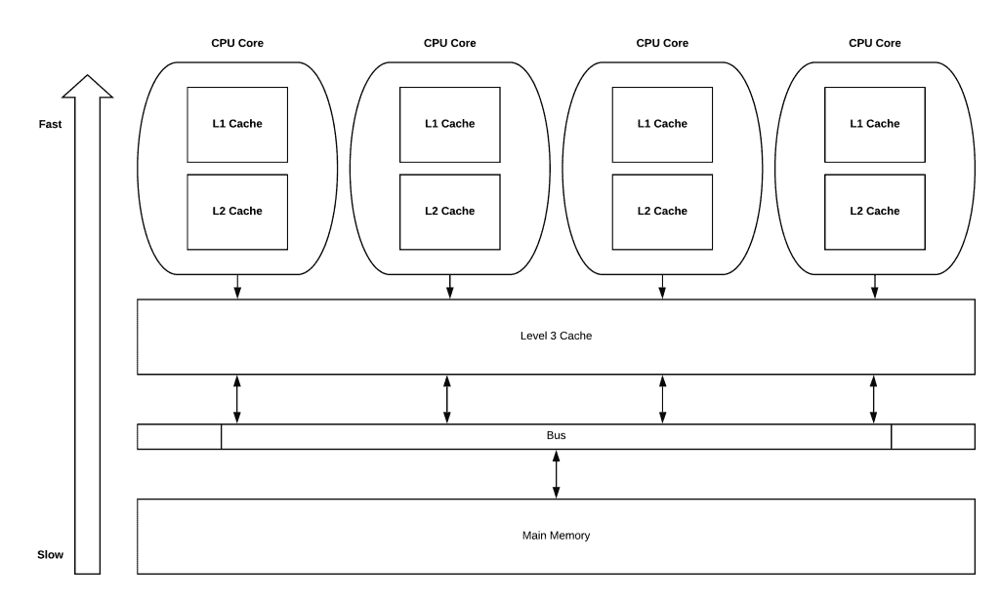
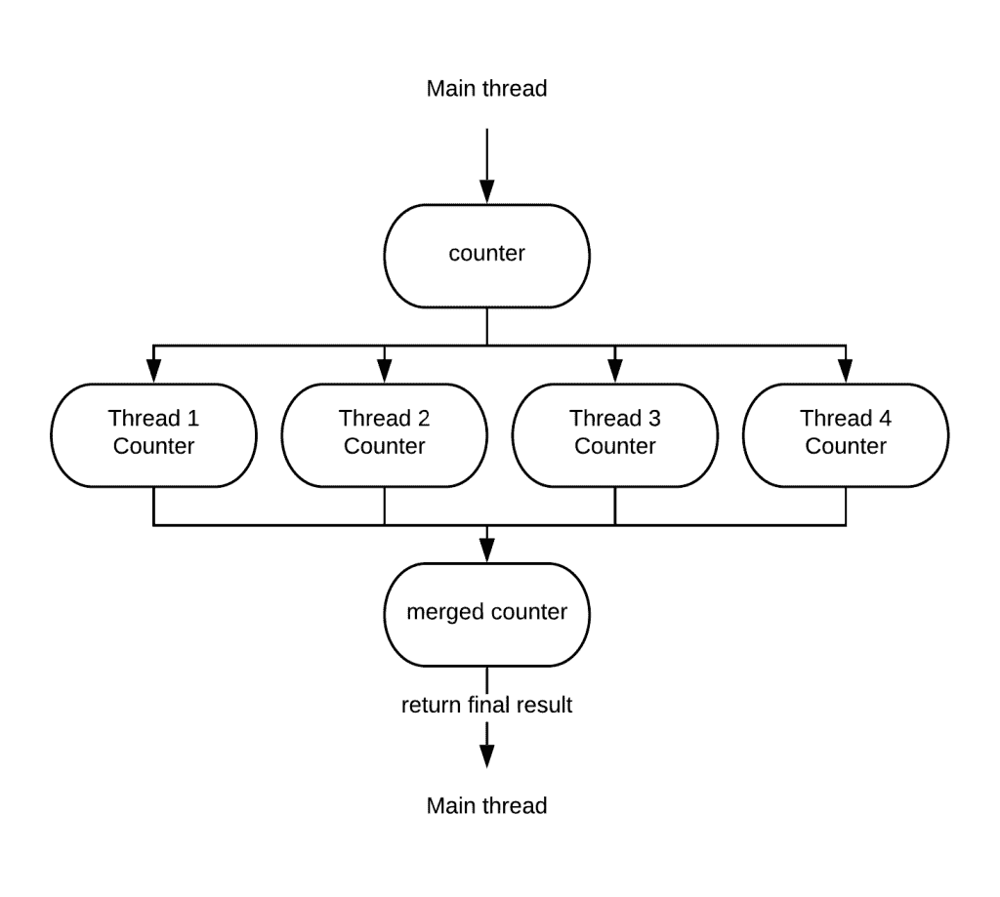
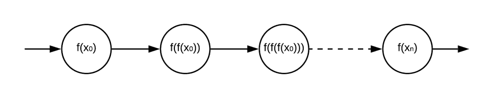
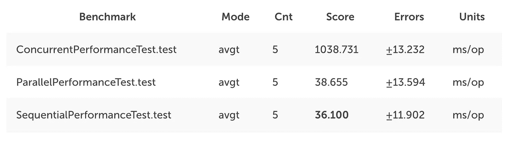
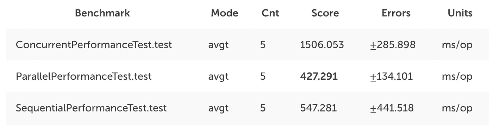

# 当并行性战胜并发性

> 原文：<https://betterprogramming.pub/when-parallelism-beats-concurrency-5f52d7012944>

## 这两者不是一回事

我知道，对你们中的许多人来说，这两个概念可能意味着同样的事情，或者也许你会努力解释它们之间的区别。然而，它们实际上是两个非常不同的概念。这对于理解我们现在处理数据的方式非常重要。

在这两种情况下，我们都试图通过增加致力于特定任务的工人数量来更快地解决问题，但他们分配工作的方式是他们最大的差异所在。

您将会明白，为什么理解它们的差异对于高效、安全、无误地处理数据如此重要。

先从解释这些概念开始吧！

# 介绍

首先，让我们简单了解一下我们应该理解的并发性和并行性。

## 并发

通俗地说，**并发**是这样一种情况，为了解决一个问题，我们以这样一种方式处理它:**一个单一的任务被多个工作者**同时处理；也就是说，让我们想象一个大数组，其中有多个工作线程，每个工作线程处理数组中要处理的下一个元素，直到到达数组的末尾。

当并发发生时，需要一些**同步**，以便访问在所有现有工作者之间共享的资源(在我们的例子中，这是数组)。

在某些情况下，这种方法的复杂性和性能开销可能非常大；我们将在本文的后面尝试演示这一点。

## 平行

另一方面，**并行性**是这样一种情况，为了解决一个问题，我们决定采取一种“[分而治之](https://en.wikipedia.org/wiki/Divide-and-conquer_algorithm)”的方法，将问题分成多个小问题。这允许我们**并行解决多个更小的问题**。

使用我们上面展示的同一个例子会是什么样子呢？假设我们有四个并行的工人。并行解决方案如下所示:

如你所见，差别是实质性的；我们现在有四个可以独立解决的小任务。知道了这一点，我们就可以确认每个工人顺序地处理了**元素！当每个工人完成任务后，我们可以**将他们的结果组合起来，产生一个单一的最终结果**。**

这样做的主要好处是，我们不需要同步工作人员对共享资源的访问；现在，每个工人都有自己独立的工作要处理。

我希望这两者的区别是清楚的，但是还剩下什么呢？我们还有一个案例，相当明显:**顺序处理**。

在标准的顺序流程中，我们将由一个工人按顺序处理我们的任务。这是更常见的方法，在某些情况下，这可能是最快的方法！

如果你需要更好地理解并发和多线程，以及为什么我们用现在的方式做事，我推荐你读一读布莱恩·戈茨 的书 [**【实践中的 Java 并发】。**](https://geni.us/ZVVg)

# 怎么才能解决呢？

如果我们在性能方面比较这三种方法，我们几乎可以保证**在大多数情况下，并发方法的性能要差得多**。这是为什么呢？正如我们之前提到的，线程间同步访问共享资源会导致争用，从而影响性能。

让我们通过一个例子来理解这种性能影响的原因！

# 并行方法

我们要展示的问题是整数集合中所有元素的相加。在并发方法中，我们将使用几个线程来添加每一对元素，以尝试加快速度；那么它看起来像什么？

首先，我们将创建一个接口来实现遵循不同方法的解决方案。

有了它，我们的并发实现将是:

所做的基本上是创建固定数量的线程，其中每个线程每次都将在数组中添加一对元素，直到到达数组的末尾。

你会注意到我们使用了[**Java . util . concurrent . atomic**](https://docs.oracle.com/javase/8/docs/api/java/util/concurrent/atomic/package-frame.html)包中的两个重要 Java 类；我们说的是[原子积分器](https://docs.oracle.com/javase/8/docs/api/java/util/concurrent/atomic/AtomicInteger.html)和[长累加器](https://docs.oracle.com/javase/8/docs/api/java/util/concurrent/atomic/LongAccumulator.html)。

这两个类非常有助于同步对当前位置和最终结果的访问；但是，它们也会对解决方案的性能产生相当大的影响。我们来看看为什么！

## **原子变量内部**

首先，为什么我们已经决定使用 [AtomicInteger](https://docs.oracle.com/javase/8/docs/api/java/util/concurrent/atomic/AtomicInteger.html) 来保持我们当前的位置？

嗯， [AtomicInteger](https://docs.oracle.com/javase/8/docs/api/java/util/concurrent/atomic/AtomicInteger.html) 非常适合那些变量将被多线程修改的情况，但更重要的是，**这个变量将被非常频繁地读取**。

**AtomicInteger** 结合使用了[比较和交换](https://en.wikipedia.org/wiki/Compare-and-swap)和**可变**变量。

“**比较和交换**是对使用“[同步](https://docs.oracle.com/javase/tutorial/essential/concurrency/syncmeth.html)块的改进；然而，如果一个线程试图设置一个已经改变的值，它的写操作将失败，它将不得不重试。

最重要的是，volatile 的使用意味着，在许多情况下，当一个线程访问该变量时，必须从主内存中检索它的值；这是一个相当大的性能影响，因为访问主内存比访问高速缓存级别要昂贵得多。

[长累加器](https://docs.oracle.com/javase/8/docs/api/java/util/concurrent/atomic/LongAccumulator.html)呢？这种类型的类在几个线程写入一个变量，但在操作完成之前不会被读取时很有用。它是如何工作的？ [LongAccumulator](https://docs.oracle.com/javase/8/docs/api/java/util/concurrent/atomic/LongAccumulator.html) 巧妙地利用了一种非阻塞方法，允许多个写操作并行写入各个计数器，然后在进程结束时将它们合并。大概是这样的:

所以在理解了我们的解决方案是如何工作的之后，我们可以肯定**这个实现中的主要瓶颈是不同线程之间的数组当前位置的同步**。

现在让我们来看看我们的顺序实现！

# 顺序方法

顺序方法非常简单——我们只是使用单线程顺序处理每个元素。让我们看看它是什么样子的:

我们使用 Java [流](https://docs.oracle.com/javase/8/docs/api/java/util/stream/Stream.html)遍历元素，并利用 [reduce](https://docs.oracle.com/javase/8/docs/api/java/util/stream/Stream.html#reduce-java.util.function.BinaryOperator-) 方法通过添加每一对来组合元素。

我们也可以使用标准的 Java 循环，迭代遍历每个元素，将总和保存在一个变量中。这种方法会有什么问题？主要问题是它不容易并行化；使用并发方法需要一定程度的同步，才能得到有效的结果。

因此，我们的顺序解决方案还不错，尽管在添加更多线程可以减少工作时间的情况下，它还可以改进。这就引出了我们的最后一种方法:并行方法。

# 平行方法

在过去，实现并行方法要困难得多，但是自从 JDK 8 之后，随着 Java 流的引入，事情变得简单多了。

实际上，由于 Java Streams API，我们的并行实现与顺序方法只有一处不同:

很简单吧？

那么你认为并行执行总是比顺序执行快吗？可能你们大多数人会认为肯定会，但事实是**事情没那么简单！**为什么会这样？

为了能够进行有效的并行处理，我们必须考虑不同的方面；这意味着只有在特定的条件下，并行化我们的代码才能真正提高代码的性能。下面就从这几个方面来看看吧！

# 并行与顺序

正如我们提到的，**并行方法并不总是解决问题的最快方案**。在并行化我们的代码之前，我们必须考虑几个方面:

## **数据是否大到足以有所作为？**

在许多情况下，我们必须处理的数据量是如此之小，以至于当数据被分割并分配给线程时，单线程的顺序执行将会完成！

## **信号源容易分裂吗？**

如果我们不能容易地以平均的方式分割数据，这可能会导致开销，与顺序执行相比，这将使我们失去运行并行工作器的所有好处。

举个例子，如果你的源码是一个[迭代器](https://docs.oracle.com/javase/8/docs/api/java/util/Iterator.html)，你就不能轻易拆分它；然而，从 JDK 8 开始，Java 引入了[拆分器](https://docs.oracle.com/javase/8/docs/api/java/util/Spliterator.html)来拥有一个可拆分迭代器。

## **能否分割成完全独立、孤立的工作块？**

有时，一个步骤中的每一步都依赖于前一步的结果，这就形成了一种无法打破的相互依赖关系。这些任务**本质上是顺序的，**在这些情况下，并行运行我们的任务是完全没有意义的，因为我们看不到任何好处。

## **合并结果便宜还是贵？**

不得不合并整数和不得不合并不同线程生成的多个复杂树是不一样的；那会非常昂贵。我们必须始终考虑这一点，因为在并行化我们的代码时，我们可能会得到意想不到的结果。

## **我们必须保持处理元素的顺序吗？**

在我们必须保持接收元素的顺序的情况下，我们的并行化选择将非常有限。

知道了这一点，我们应该知道 Java 流在知道数据是无序的时候能够进行优化，正如我们在我的文章“[理解 Java 流](https://medium.com/swlh/understanding-java-streams-e0f2df12441f)”中解释的那样，流是如何使用标志进行优化的。

利用这一点的一个方法是使用 [unordered()](https://docs.oracle.com/javase/8/docs/api/java/util/stream/BaseStream.html#unordered--) 来表达我们不关心顺序；这将允许优化许多短路操作，如 [findFirst()](https://docs.oracle.com/javase/8/docs/api/java/util/stream/Stream.html#findFirst--) 、 [findAny()](https://docs.oracle.com/javase/8/docs/api/java/util/stream/Stream.html#findAny--) 或 [limit()](https://docs.oracle.com/javase/8/docs/api/java/util/stream/Stream.html#limit-long-) 。

## **缓存未命中**

我们实现代码的方式可能会对性能产生重大影响；例如，使用基于数组的结构有利于 CPU 缓存中的分配。当我们访问第一个元素时，我们的硬件会分配一个数组块，因为大多数时候，我们会访问数组中更多的元素。这对性能有非常有利的影响，因为缓存访问比主内存访问快得多。

在并行执行的情况下，**如果我们不断得到缓存未命中，我们的线程将被阻塞，等待从内存中提供数据**；这意味着我们将失去运行并行线程的部分好处。

> 对于 Java 流，并行执行几乎是神奇的，但它并不像看起来那么简单！

好了，这些是你在使用并行执行时必须记住的一些事情！现在让我们看看我们的实现的一些性能结果，看看我们所经历的所有理论实际上是否有意义。

# 性能比较

在这一节中，我们将展示针对我们的实现的一些基准执行的结果，以检查这是否与我们到目前为止所研究的相匹配。

JMH 已经被用来轻松地创建基准测试；在 JMH 可用的不同类型的基准测试中，我们选择运行“平均时间”基准测试。

在第一次运行中，我们将选择大小为 1，000，000 的元素；根据结果，我们将看到下一步该做什么。

## 第一个基准:100 万个元素

理解这些测试如何运行的源代码可以在[这里](https://github.com/theboreddev/parallelism-vs-concurrency)找到。

基本上，我们已经运行了两次预热基准测试迭代，给 JIT 编译器足够的时间来进行优化，然后我们在第三次迭代中获得结果。

那么，让我们言归正传——结果是什么？

正如所料，并发方法是迄今为止性能最差的，平均花费了 **1 秒和 38 毫秒**。另一方面，平行和顺序方法有类似的结果。顺序方法以超过 2 毫秒的优势胜出！

正如我们前面提到的，编写高效的并行代码并不容易；我认为原因之一可能是数据不够大。让我们用 10，000，000 来再次运行我们的基准测试。

## 第二个基准:1000 万个元素

添加 10，000，000 个元素的结果是:

**在这种情况下，明显的赢家是并行方法！**我们还注意到并发方法的优势已经大大降低。

因此，我们必须处理多达 10，000，000 个元素才能注意到并行处理的显著改进；然而，这只是一个非常简单的例子，可以考虑其他方面，并可以进一步改进。

我说的就是这些！我真的希望你这次学到了一些东西！

# 结论

我们已经了解到，尽管 Java 流使得切换我们的代码并行执行变得非常容易，但是事情并不总是那么简单。

当性能是我们的业务需求之一时，最好的做法是总是运行性能测试，但是请**不要陷入过早的优化**。如果让你的代码更快对你的组织没有真正的商业利益，那么不要浪费你的时间和精力。

还有一件事很有帮助，那就是很好地理解每一层是如何工作的，从 CPU 到应用程序源代码的最顶层。了解内部机制及其对性能的影响总是有助于预测性能方面可能出现的问题。

 [## 一种新的 Java 并发模型

### 在过去的几年里，我们在并发模型中编写代码的方式发生了很大的变化。在过去…

codeburst.io](https://codeburst.io/a-new-concurrency-model-in-java-975d597dd5e4)  [## 用 CompletableFuture 组合多个 API 调用

### 在我的上一篇文章“新的并发性……”中介绍了 Java 中的新并发范例之后

medium.com](https://medium.com/swlh/combining-multiple-api-calls-with-completablefuture-1d9d27e03bec) 

非常感谢您的阅读！