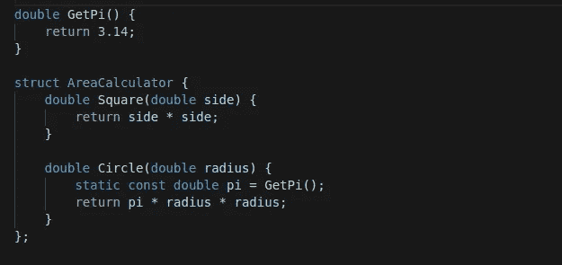

# C++中什么时候应该使用静态局部变量？

> 原文：<https://betterprogramming.pub/when-should-we-use-static-local-variables-in-c-3c08570581e6>

## 理解当我们使用静态局部变量时实际会发生什么，以及何时应该使用它们


照片由[乌代·阿瓦尔](https://unsplash.com/@udayawal?utm_source=medium&utm_medium=referral)在 [Unsplash](https://unsplash.com?utm_source=medium&utm_medium=referral) 上拍摄

# C++存储持续时间

学习 C++时，我们经常忽略的一个基础知识是理解存储持续时间的细节。对象的存储持续时间决定了它的生存期。它还决定了对象将存储在内存的哪个部分，是在堆栈、堆还是数据上。C++中有四种不同的存储持续时间。需要注意的一点是，存储持续时间与作用域不同。

## 自动的

这是在块`{}`内创建的对象的存储持续时间。它只住在那个街区。具有此存储持续时间的对象存储在堆栈中。对象的生存期只在块内得到保证。

它适用于没有`static`、`thread_local`或`extern`关键字的局部变量。当我们将这些关键字中的一个添加到局部变量中时，或者当我们动态分配内存时，存储持续时间会发生变化。

## 静态

具有静态存储持续时间的对象从程序启动到退出都是活动的。它们存储在内存的数据段中，这就是为什么只要程序运行，它们就存在。

它适用于全局变量、静态成员变量和静态局部变量。需要注意的一点是，只有*个对象实例*具有这个存储持续时间。

它们通常在调用`main()`之前被初始化，但是对于静态局部变量，如果用非零或非常量初始化，它们可能在*函数第一次被调用*时被初始化。

## 动态的

这个存储持续时间是针对我们使用`new`操作符或`std::malloc`动态创建的对象的。我们手动控制它们的生存期，它们存储在内存的堆段中。

如上所述，当对象被定义在一个块中时，它的范围可以是局部的，但是如果我们动态地创建它，它的存储持续时间可以是动态的。

在这个例子中，名为`a`的变量的范围在`create_a()`内，但是存储持续时间是动态的，在退出`create_a()`后它仍然是活动的。

## 线

具有线程存储持续时间的对象在线程开始时开始，直到线程结束。每个线程都有自己的对象实例。

## 我们想讨论的是

我们在本文中的重点是，我们想看看当我们使用静态局部变量时，实际上会发生什么。`static`关键字也用于指定链接类型(无链接、内部链接或外部链接)，但这不是我们这里的重点。

# 静态意味着只有一个实例



静态局部变量(图片由作者提供)

正如上面关于存储持续时间的部分所解释的，`static`意味着只有一个实例。仔细想想，这是有意义的，因为具有静态存储持续时间的对象会一直存在，直到程序退出。因此，在成员函数中使用静态局部变量时，我们必须小心。我们来看一个例子，这个例子可能不是很有趣，但是足以很好的展现概念。

假设我们想写一个继承自`MultiplierBase`的类`Multiplier`，如下所示:

它接受一个参数来设置基类存储的`multiplier`(成员变量)。调用`Multiply()`函数时，通过调用`GetMultiplier()`得到乘数。由于我们认为乘数永远不会改变，所以我们希望使它成为`static`和`const`，我们将它存储在一个局部变量中。

但是，问题是当我们有多个`Multiplier`实例时，我们只有一个`multiplier`(局部变量)实例。因此，当客户端代码执行以下操作时:

它打印:

```
4
4
```

我们希望它打印的是:

```
4
6
```

发生这种情况是因为我们只有一个`multiplier`(局部变量)的实例，并且它只在第一次调用函数时初始化一次，在第`5`行。

# 它被初始化一次

为了确保静态局部变量只被初始化一次，我们的代码实际上发生了什么？编译器通过添加一个保护变量来修改我们的函数。我们的功能如下:

由编译器转换为以下内容:

我们可以看到我们的代码越来越长，编译器插入额外的代码，以确保我们的静态变量只初始化一次。

上面的代码仅用于说明，编译器生成的确切代码是特定于实现的。编译器可以实现[双重检查锁定](https://en.wikipedia.org/wiki/Double-checked_locking)模式的变体。

## Const 局部静态是线程安全的

从上面的代码中可以看出，编译器使用了一个保护变量来进行同步。这是为了确保即使在多线程环境中，我们的静态局部变量也只初始化一次。因此，如果我们的静态局部变量是 const 限定的，它就是线程安全的。

# 什么时候应该使用静态局部变量？

众所周知，有许多方法可以编写工作代码，在我们希望对象在整个运行时都存在的情况下，我们有许多选择，比如让它成为静态成员变量、全局变量或静态局部变量。

当我们希望在局部范围内只有一个对象实例时，静态局部变量是有用的，这意味着对函数的所有调用将共享同一个对象。

使用全局变量或静态成员变量也可以达到同样的效果。但是我们应该问问自己，对象是否只在函数内部使用。

例如，我们有一个名为`AreaCalculator`的类，它应该提供计算各种形状的函数，如正方形、矩形、圆形等。像圆周率等常数。，由免费函数提供。

在这种情况下，我们可以选择让`pi`成为一个成员变量，它也可以成为`static`。但是，由于它只被`Circle()`函数使用，我认为最好把它作为一个静态局部变量。

# 摘要

静态局部变量具有以下属性:

*   局部范围，它们只在声明它们的块中可见
*   静态存储持续时间，它们持续到程序退出，并且只有一个实例
*   没有连接，从模块外部看不到，因此没有内部/外部连接
*   可能是惰性求值，它们被初始化一次，如果初始化为非零和非常数，则在第一次调用函数时被初始化

编译器将额外的代码插入到带有静态局部变量的函数中，以确保即使在多线程环境中它们也只被初始化一次。

如果语义上我们的对象只在那个函数中需要，并且在那个函数的所有调用中共享，我们应该选择使用它。