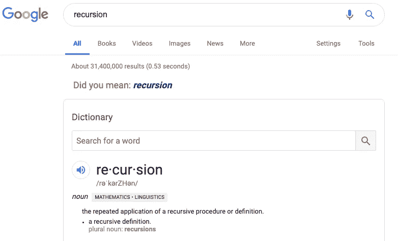
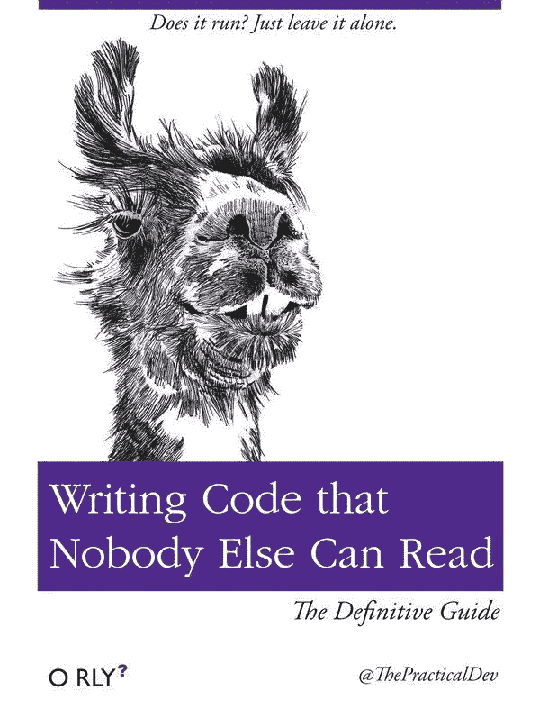
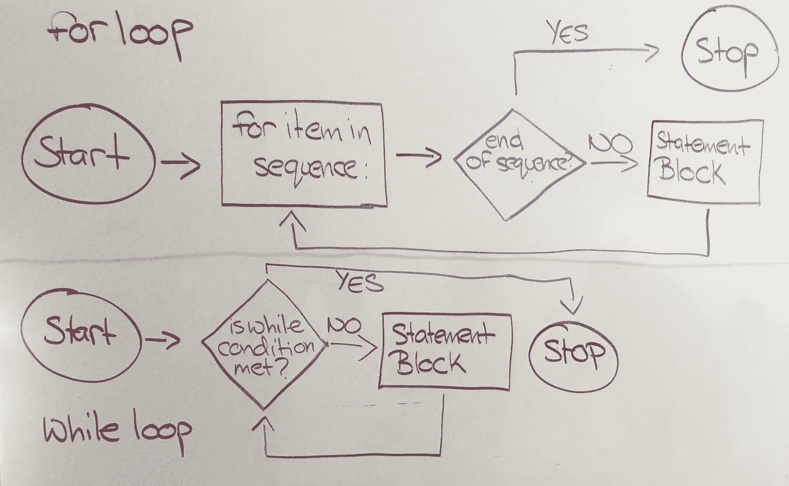
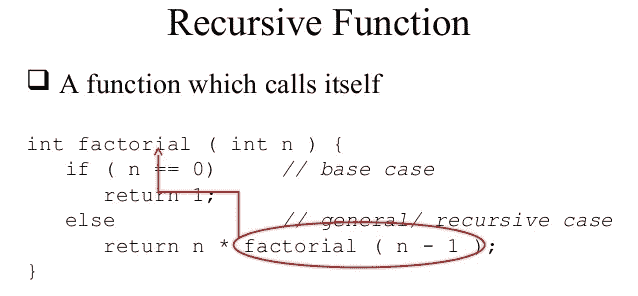
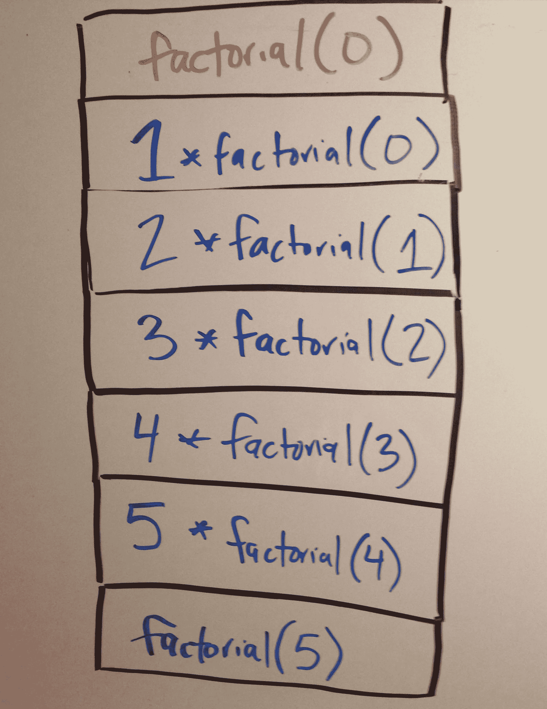
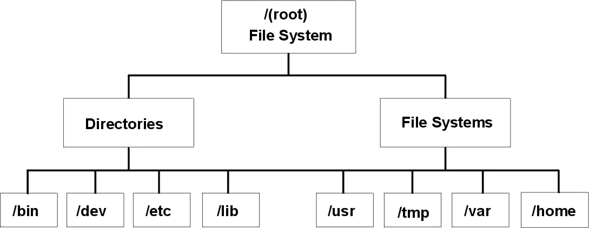

# 何时循环？何时复发？

> 原文：<https://betterprogramming.pub/when-to-loop-when-to-recurse-b786ad8977de>

## 如何充分利用代码中的递归

> *本文中的大多数概念都是在 Python 3 的背景下讨论的，但是它们也可以移植到许多其他语言中。*

以递归为特色的著名谷歌笑话

*破解编码面试*在关于使用递归处理技术面试问题的章节中指出“所有递归算法[也]可以迭代实现……”。

迭代解决 Python 问题可能包括在循环时对或**使用**。在任何编码语言中，这些都是增量式问题解决最常用的工具。循环很棒，因为在很多时候，它们的实现是直观和直接的。****

然而，有时迭代的解决方案会变成几乎不可读的噩梦。

试图用面试官好奇的目光在白板上写下高度嵌套和复杂的代码来检查你的工作，这肯定会让你在技术面试中绊倒。

虽然从循环转换到递归不会总是*让您的代码更好，但它是工具箱中的一个很好的工具。*

*有一阵子，我害怕学习递归。在得知递归解决方案的问题不可避免地也有迭代解决方案后，我专注于尝试用循环来解决每一个技术问题。*

*然而，随着我的技术采访技巧的提高，我遇到了许多 LeetCode 和 HackerRank 的问题，这些问题因其复杂性而迫切需要递归。是时候拓宽我的工具了。*

# *什么是循环？*

**

*for 循环和 while 循环图。*

*循环用于执行程序所需的[重复代码块](https://www.pythonforbeginners.com/loops/for-while-and-nested-loops-in-python)多次。*

*对于循环，如上面例子中的循环，迭代一个序列。当我们知道需要执行一个代码块多少次时，我们通常使用循环。在上面的例子中，我们只需要对`name_list`中的名称数量做第 2 行和第 3 行。*

*我们可能还需要循环不确定的次数，或者直到满足某个条件。这可能是使用 while 循环的好时机。*

*返回不可迭代链表长度的一种方法可能包括使用 while 循环遍历所有节点，如上面的例子。*

# *好的，那么什么是递归呢？*

**

*递归和迭代之间的一个很大的区别在于它们结束的方式。当循环执行代码块时，每次检查它是否在序列的末尾，递归代码没有这样的序列结尾。*

*就像上面恐怖的小熊维尼漫画一样，一个递归函数可以永远继续下去，而没有条件让它脱离苦海。*

**

*显示了阶乘示例中递归函数的基本情况和递归调用。图片来自[https://www . slide share . net/alhazmy 13/data-structures-part 5-recursion](https://www.slideshare.net/alhazmy13/data-structures-part5-recursion)。*

*类似上面的递归函数由两部分组成:T2 递归调用 T3 和 T4 基础用例 T5。*

*基本情况(或者有时是基本情况)是检查我们是否从函数中获得了我们需要的信息的条件。每个递归函数应该至少有一个基本用例，尽管可能有多个。*

*在上面的阶乘例子中，当我们到达数字 0 时，我们已经到达了必要的递归调用的末尾。*

*正如您可能已经怀疑的那样，递归调用是当函数调用自身时，添加到递归调用堆栈中。*

*堆栈是 LIFO(后进先出)对象，这意味着添加到堆栈顶部的最后一个项目是稍后从堆栈中移除的第一个项目。*

**

# *什么时候应该使用递归？*

*递归是用来解决那些可以分解成更小的、重复的问题的。它特别适合处理有许多可能的分支并且对于迭代方法来说太复杂的事情。*

*一个很好的例子就是在文件系统中进行搜索。您可以从根文件夹开始，然后搜索该文件夹中的所有文件和文件夹。之后，您将进入每个文件夹，并在其中搜索每个文件夹。*

**

*递归非常适合这种类型的结构，因为您可以搜索多个分支路径，而不必为每种可能性包含许多不同的检查和条件。*

*对于那些熟悉数据结构的人来说，你可能会注意到文件系统的上图看起来很像一个树形结构。*

*树和图是另一个递归是最好和最简单的遍历方式的时候。*

# *我应该总是使用递归吗？*

*递归似乎真的很有用！也许我应该一直用它？*

*嗯，像任何事情一样，递归是最好的剂量。递归是一个有用的工具，但是它会增加内存的使用。*

*所以让我们回到上面的阶乘调用堆栈图像。每次我们向堆栈中添加一个新的调用，我们都在增加我们正在使用的内存量。如果我们使用大 O 符号来分析算法，那么我们可能会注意到这增加了我们的空间复杂度。*

*有些时候，我们可能想要付出这个代价来获得一个简短、有用的算法，比如当我们遍历一棵树时。但是在其他时候，可能有更好、更有效的方法来解决这个问题。*

*对于许多小项目来说，调用栈不会严重妨碍你的程序。然而，一旦您的程序开始进行许多递归调用，那么您可能需要考虑大型调用堆栈的潜在影响。*

**

*约翰-马克·史密斯在 [Unsplash](https://unsplash.com/search/photos/stack?utm_source=unsplash&utm_medium=referral&utm_content=creditCopyText) 上的照片*

*另一件要考虑的事情是，在迭代解决方案中，理解和阅读代码有时可能更容易。*

*使用递归是很棒的，因为它让你摆脱了许多子问题。*

*但是当你试图完全理解你正在解决的子问题以及它们是如何被解决的时候，实现一个迭代的解决方案可能是值得的。如果这不是一条可行的路线，那么，至少，画出你的代码所进行的递归过程来加深你的知识。*

**你用递归解决过哪些现实生活中的问题？请在下面的回复中告诉我！**