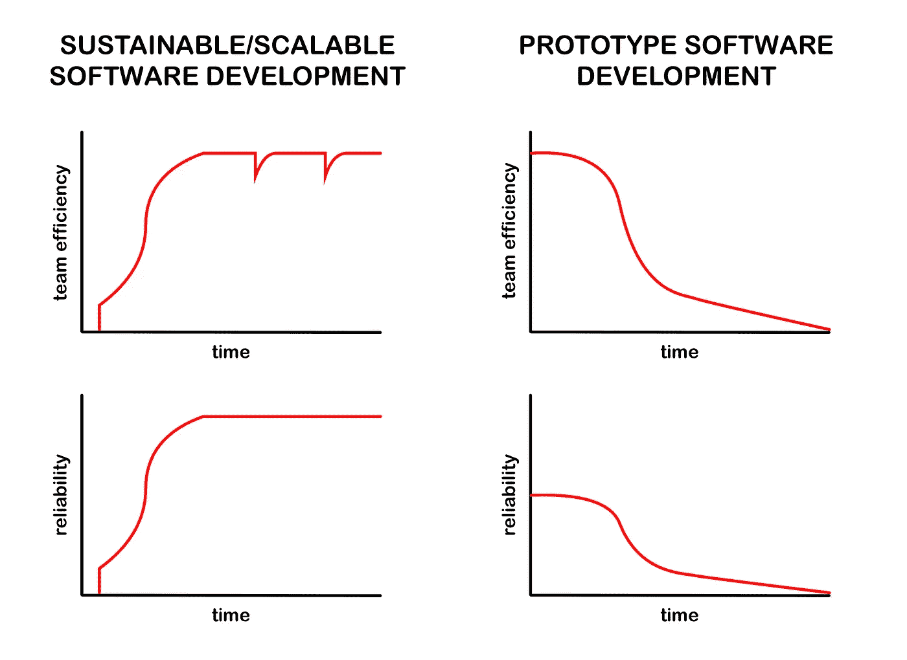

# 何时放弃你的技术债务

> 原文：<https://betterprogramming.pub/when-to-throw-in-the-towel-on-your-technical-debt-b1f6bbb3aa0c>

## 不要陷入重构的地狱

照片由[容婵](https://unsplash.com/@yungnoma?utm_source=medium&utm_medium=referral) g 在 [Unsplas](https://unsplash.com?utm_source=medium&utm_medium=referral) h 上拍摄

> 遭受技术债务的软件很难改变和理解。通过改变来解决这个问题是非常困难的。

我相信，大多数管理者都意识到了技术债务，也意识到它是不好的，但却未能理解其真正的影响。这种误解会导致一些代价高昂的错误。其中一个错误是将代码库保存在过期日期之后。是的，代码库有到期日。

技术债务通常意味着您的代码、抽象、概念或数据模型不再具有最大的逻辑意义。如果您有任何过时的依赖、摩擦区域或缺乏可测试性——这也算。

假设我们有一个有很多技术债务的应用程序。我们如何解决它？我们是重构应用程序，拆分并重新构建，还是完全从头开始？当然，这取决于应用程序是如何编写的，以及你有什么样的技术债务。

为了回答这个问题，让我们看看两种类型的策略:原型开发和可持续/可扩展开发。

图片来自[马克·h·韦纳](https://mhweiner.medium.com)

# 原型开发

原型开发的目标是尽可能快、尽可能便宜地证明(或推翻)一个假设，比如“这项技术可行吗？”。

原型通常不被设计成可扩展的或者长时间保持不变。可观测性、可测试性和昂贵的内部工程师是可选的。对许多人来说，外包是他们唯一的选择。这可能是构建工作软件的最快和最便宜的方法，但是有一些严重的限制——它必须相对简单并且不是任务/安全关键的。这些代码库的保质期也很短——可能只有几周，而不是几个月。

# *可持续/可扩展发展*

如果你已经知道你想要建造什么，以及大致如何建造(并且有资金支持)，这可能就是你要走的路。如果您的应用程序必须快速扩展，或者对任务或安全至关重要，这是您唯一的选择。

> 在设计一个新程序时，所有重要的错误都是在第一天犯的。罗伯特·斯平拉德

可持续发展起步缓慢。无论您使用瀑布还是敏捷，前期工作都是必需的。你不需要马上解决每个问题，但是可持续的软件必须基于良好的假设和抽象。它必须在负载、复杂性和团队规模的基础上进行扩展。最佳实践和可观察性基础设施必须从一开始就存在，否则您将永远无法赶上。

构建和管理这个应用程序的团队也必须经验丰富，并且拥有一套特定的技能和纪律。这不是软件开发，而是软件工程。

偶尔，需要重构来维护团队的效率和可靠性。把这想象成你汽车的换油和预防性维护。如果你不这样做，事情会变得更加昂贵，花费更长的时间。你的车也会变得不那么可靠。其中一些重构的原因可能是假设可能不成立，或者业务需求发生了变化——但这没什么，因为您的软件就是为处理这些而设计的。

对可持续软件的改变是容易和可估计的。

# 回到问题…

让我们先做简单的。

如果你有一个特大号或者长寿的 MVP，那么你别无选择，只能重新开始。你的 MVP 现在已经达到了它的目的(或者它没有被正确地限定范围),并且已经超过了它的有效期。*如果你的 MVP 是由一个廉价的外包团队制作的，那就更是如此。*

如果下列情况之一适用于你:(1)你的软件遵循了可持续发展的道路，但在某个时候偏离了轨道，(2)如果你的软件是使用中间的方法开发的，那么重构可能是有意义的。回答以下问题:

*   超过 50%的代码需要修改来还清债务吗？
*   你的软件是基于糟糕的抽象还是不正确的数据模型？
*   你的大部分软件不是用最佳实践编写的吗？
*   你的技术债务不仅限于解耦的子系统吗？

如果你对以上任何一个问题的回答是肯定的，那么我会强烈地考虑日落而不是重构。

# 遗留迁移/重构

由[马克·h·韦纳](https://mhweiner.medium.com)拍摄

有没有听说过一个遗留系统的重构或者迁移是准时的并且在预算之内的？我也没有。这样做的原因是，您总是在与您试图解决的技术债务的最坏影响作斗争。这项工作不可预测，不可估量，而且风险很大。这是一场管理噩梦。

传统迁移通常需要数年时间，而且许多从未完成。在 Shutterstock 工作时，我了解到一个持续了五年多的迁移项目！他们现在正从一种过时的技术转向另一种。

在这段时间里，你仍然需要继续添加新的功能，并跟上快节奏的环境。这通常意味着一个大型团队(或几个团队)的并行开发，都在同一个代码库上。我们谈论的是对具有高流失和紧密耦合的具有挑战性的代码库的巨大改变。工程师们将很难把这项工作分成小块。这导致了大量的提交、陈旧的分支和可怕的[合并冲突](https://itnext.io/recommendations-to-avoid-merge-conflicts-845ec133676e)。合并冲突导致浪费工作，甚至*更慢的*开发，沮丧，低落的士气，以及回归的风险(bug)。如果你没有把*向后移动*，那你就很幸运了。

想通过扔更多尸体来解决问题吗？不幸的是，这也是科技债务的问题之一——入职糟透了。这段代码只有编写它的工程师才懂(如果真的懂的话)。招聘也遵循收益递减规律；添加的人员越多，管理、沟通和会议的需求就越多。

从事遗留迁移通常并不有趣，所以你可能很难吸引人才。尝试告诉未来的员工，他们将在紧张的期限内从事一个大型的遗留迁移项目。最好的工程师很可能会通过(我经常这样)。

那么公司为什么要这么做呢？

# 不要 HODL 你的代码

这些年来，我看到有些人犹豫要不要扔掉他们的代码，就像抓着咕噜和魔戒一样。我只能猜测，但我认为合理性是因为他们花了数年和大量的钱来开发它，所以它一定非常有价值。也许扔掉它并重新开始是一种浪费或极端的做法。不幸的是，软件不是这样工作的。

问题是，技术债之所以以金融债命名，是因为它类似。债务具有负价值。事实上，你只是为拥有它而付出。每一个。单身。日。而且利率高。

最大的成本之一是机会成本——轻松应对不断变化的业务需求、新功能、新技术、安全问题、缺陷或规模的能力。您的代码是一种负担，它让您付出了高昂的代价。

让它去吧。

# 日落(改为这样做)

从头开始并不意味着你今天必须扔掉所有的代码。事实上，在新版本准备好之前，你可能需要尽你所能保持一段时间。这叫*日落*。

随着日落，你的新系统的展示可以以一种从容不迫的方式完成。新系统一准备好，新用户就可以转移到新系统上，现有用户可以选择随时切换，直到过渡期结束。这给了每个人适应的时间，给了新系统增加负载的时间，也给了识别和解决遗留问题的时间。

最重要的是，在整个过程中，技术债务不会拖你的后腿。

# 结论

就像一个*事件视界*，一个连光都无法逃脱的黑洞的边界，有一个点，你的技术债务变得无法收回。每个代码库都有一个截止日期，根据开发方法和团队的技能和纪律，有些会比其他的更晚。

从头开始可以让你从过去中学习，但是没有包袱。永远不要害怕扔掉你的代码，重新开始。完成后你会松一口气。

想知道更多关于构建可伸缩的、可持续的、可靠的软件吗？阅读我的另一篇文章:

 [## 做这 10 件事来提高你的应用程序的可靠性

### 这也不会损害你的长期生产力或理智。

mhweiner.medium.com](https://mhweiner.medium.com/do-these-10-things-to-improve-your-apps-reliability-fc114b16c2d1)