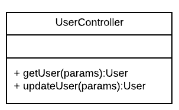
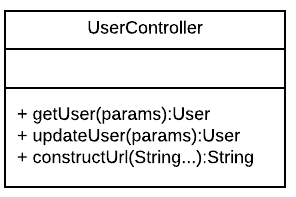
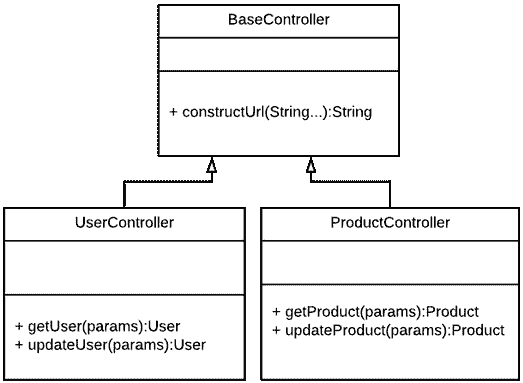
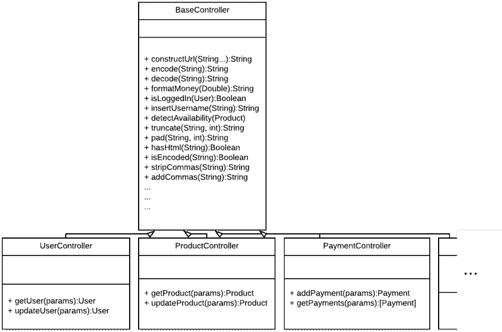
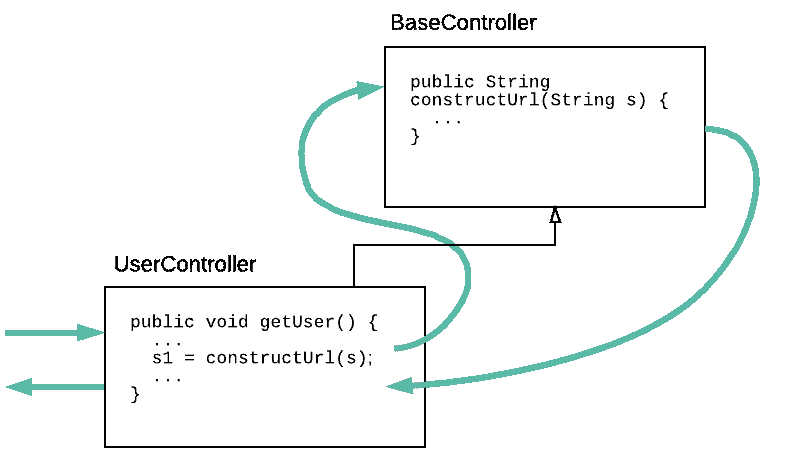
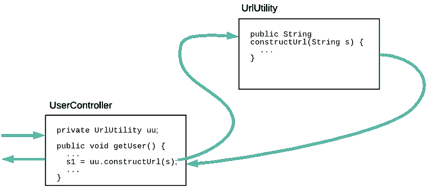
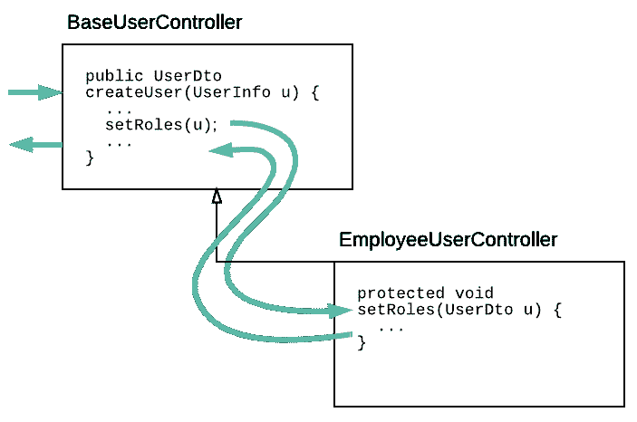

# 何时使用抽象类

> 原文：<https://betterprogramming.pub/when-to-use-abstract-classes-70fe526165ac>

## **抽象类被过度使用和误用。但是他们有一些有效的目的**


[徒步旅行者湾](https://unsplash.com/@hikersbay?utm_source=unsplash&utm_medium=referral&utm_content=creditCopyText)在 [Unsplash](https://unsplash.com/s/photos/abstract?utm_source=unsplash&utm_medium=referral&utm_content=creditCopyText) 上拍摄的照片

抽象类是许多面向对象语言的核心特性，比如 Java。

也许，由于这个原因，它们往往被过度使用和误用。事实上，关于面向对象语言中过度使用继承的讨论比比皆是，继承是使用抽象类的核心。

在本文中，我们将使用一些模式和反模式的例子来说明什么时候使用抽象方法，什么时候不使用。

虽然本文从 Java 的角度介绍了这个主题，但是它也适用于大多数其他面向对象语言，甚至是那些没有抽象类概念的语言。

为此，让我们快速定义抽象类。如果你已经知道什么是抽象类，可以跳过下面的部分。

# 定义抽象类

从技术上讲，抽象类是不能直接实例化的类。相反，它被设计成由具体的类扩展，这些类可以被实例化。

抽象类可以——并且通常会——定义一个或多个抽象方法*,它们本身不包含主体。相反，需要具体的子类来实现抽象方法。*

让我们编造一个简单的例子:

```
public abstract class Base { public void doSomething() {
        System.out.println("Doing something...")
    } public abstract void doSomethingElse();}
```

注意，`doSomething()`，一个非抽象方法，已经实现了一个 body，而`doSomethingElse()`，一个抽象方法，还没有。您不能直接实例化`Base`的实例。试试这个，你的编译器会抱怨:

```
Base b = new Base();
```

相反，您需要像这样子类化`Base`:

```
public class Sub extends Base { public abstract void doSomethingElse() {
        System.out.println("Doin' something else!");
    }}
```

注意所需的`doSomethingElse()`方法的实现。

并不是所有的 OO 语言都有抽象类的概念。

当然，即使在没有这种支持的语言中，也可以简单地定义一个目的是被子类化的类，并定义空方法或抛出异常的方法，作为子类覆盖的“抽象”方法。

# 瑞士陆军主计长

让我们检查一下我经常遇到的对抽象类的滥用。我犯了延续它的罪；你可能也有过。

虽然这种反模式几乎可以出现在代码库中的任何地方，但我倾向于在控制器层的模型-视图-控制器(MVC)框架中经常看到它。出于这个原因，我开始称它为*瑞士军队控制者*。

反模式很简单:许多子类从一个公共的抽象基类扩展而来，这些子类只与它们在技术堆栈中的位置相关。这个抽象基类包含任意数量的共享“实用程序”方法。子类从它们自己的方法中调用实用程序方法。

瑞士军队控制者一般是这样存在的:

1.开发人员开始构建一个 web 应用程序，使用一个 MVC 框架，比如 Jersey。

2.由于他们使用的是 MVC 框架，他们用一个`UserController`类中的端点方法来支持他们的第一个面向用户的网页。



3.开发人员创建了第二个网页，因此向控制器添加了一个新的端点。

一名开发人员注意到两个端点执行相同的逻辑——比方说，在给定一组参数的情况下构造一个 URL 因此将该逻辑移到了`UserController`中一个单独的`constructUrl()`方法中。



4.团队开始在面向产品的页面上工作。开发人员创建了第二个控制器`ProductController`，这样就不会把所有的方法都塞进一个类中。

5.开发人员认识到新的控制器可能也需要使用`constructUrl()`方法。同时，他们意识到:“嘿！那两个班是管制员！”因此必然是自然相关的。

因此，他们创建了一个抽象的`BaseController`类，将`constructUrl()`移入其中，并将`extends BaseController`添加到`UserController`和`ProductController`的类定义中。



6.这个过程一直重复，直到`BaseController`拥有 10 个子类和 75 个共享方法。



现在有大量有用的方法可供具体的控制器使用，只需直接调用它们。那么，有什么问题呢？

第一个问题是设计问题。所有这些不同的控制器实际上互不相关。

它们可能位于我们的堆栈的同一层，并且可能执行类似的技术角色，但是就我们的应用程序而言，它们服务于不同的目的。然而，我们现在已经将它们锁定在一个相当任意的对象层次结构中。

第二种更实际。当你第一次需要从除控制器之外的其他地方使用 75 个共享方法中的一个时，你会意识到这一点，并且你发现你自己正在实例化一个控制器类来这样做。

```
String url = new UserController().constructUrl(key, value);
```

您将创建一个有用的方法库，现在需要一个控制器实例来访问。您的第一个想法可能是这样的:“嘿，我可以让这个方法在控制器中保持静态，并像这样使用它:”

```
String url = UserController.constructUrl(key, value);
```

这也好不到哪里去，实际上，还有点糟糕。即使您没有实例化控制器，您仍然将控制器与其他类绑定在一起。

如果您需要在您的 DAO 层中使用该方法呢？你的 DAO 层应该对你的控制器一无所知。更糟糕的是，在引入一堆静态方法的过程中，测试和模仿变得更加困难。

这里强调交互流程很重要。

在这个例子中，直接调用了一个具体子类的方法。然后，在某个时候，这个方法调用抽象基类中的一个或多个实用方法。



事实上，在这个例子中，根本不需要抽象的基本控制器类。每一个共享的方法都应该被移动到适当的服务层类(如果它负责业务逻辑)或者实用程序类(如果它提供一般的、补充的功能)。

当然，如上所述，实用程序类仍然应该是可实例化的，而不是简单地用静态方法填充。



现在有了一组实用方法，任何可能需要它们的类都可以真正地重用它们。此外，我们可以将这些方法分成相关的组。

上图描述了一个名为`UrlUtility`的类，它可能只包含与创建和解析 URL 相关的方法。我们也可以创建一个包含与字符串操作相关的方法的类，另一个包含与应用程序当前认证用户相关的方法的类，等等。

还要注意的是，这种方法也非常适合于 [*复合继承*](https://en.wikipedia.org/wiki/Composition_over_inheritance) 主体。

继承和抽象类是一个强大的构造。因此，大量的例子充斥着它的滥用，瑞士军队控制器是一个常见的例子。事实上，我发现抽象类的大多数典型用法可以被认为是反模式，很少有好的抽象类用法。

# 模板方法

说完这些，我们再来看一个最好的用途，由 [*模板方法*](https://en.wikipedia.org/wiki/Template_method_pattern) 描述设计模式。我发现模板方法模式是一种鲜为人知但更有用的设计模式。

你可以在很多地方读到这些模式是如何工作的。它最初是在[四人组*设计模式*](https://en.wikipedia.org/wiki/Design_Patterns) 一书中描述的；现在很多描述都可以在网上[找到](https://en.wikipedia.org/wiki/Template_method_pattern)。

让我们看看它与抽象类的关系，以及它在现实世界中的应用。

为了保持一致，我将描述另一个使用 MVC 控制器的场景。在我们的例子中，我们有一个应用程序，其中存在一些不同类型的用户(现在，我们将定义两个:*雇员*和*管理员*)。

创建任一类型的新用户时，根据我们要创建的用户类型，会有一些细微的差别。例如，分配角色需要不同的处理方式。

除此之外，流程都是一样的。此外，虽然我们并不期待新用户类型的爆发，但我们会不时被要求支持新类型的用户。

在这种情况下，我们*会*想要从控制器的抽象基类开始。因为不管用户类型如何，创建新用户的整个过程都是相同的，所以我们可以在基类中定义一次该过程。

任何不同的细节都将被归入具体子类将实现的抽象方法:

然后，我们只需要为每个用户类型扩展一次`BaseUserController`:

每当我们需要支持新的用户类型时，我们只需创建一个新的`BaseUserController`子类，并适当地实现`setRoles()`方法。

让我们将这里的交互与我们看到的与瑞士军队控制器的交互进行对比。



使用模板方法，我们看到调用者(在这种情况下，响应 web 请求的 MVC 框架本身就是调用者)调用抽象基类中的方法，而不是具体的子类。

这一点很清楚，因为我们已经保护了在子类中实现的`setRoles()`方法。

换句话说，大部分工作都是在抽象基类中定义一次。只有对于工作中需要专门化的部分，我们才创建具体的实现。

# 实用的估算方法

我喜欢将软件工程模式归结为简单的经验法则。虽然每条规则都有例外，但我发现能够快速判断我是否在朝着某个特定设计的正确方向前进是很有帮助的。

事实证明，在考虑抽象类的使用时，有一个很好的经验法则。

问问你自己:“你的类的调用者会调用在你的抽象基类中实现的方法，还是在你的具体子类中实现的方法？”

*   如果是前者，您打算只公开在抽象类中实现的方法，很可能您已经创建了一组良好的、可维护的类。
*   如果是后者，调用者将调用在你的子类中实现的方法，这反过来将调用抽象类中的方法，很有可能形成一个不可维护的反模式。

觉得这个故事有用吗？想多读点？只需 [*在这里订阅*](https://dt-23597.medium.com/subscribe) *就能把我的最新故事直接发到你的收件箱里。*

*你也可以通过* [*成为今天的*](https://dt-23597.medium.com/membership) *媒体会员来支持我和我的写作，并获得无限量的故事。*