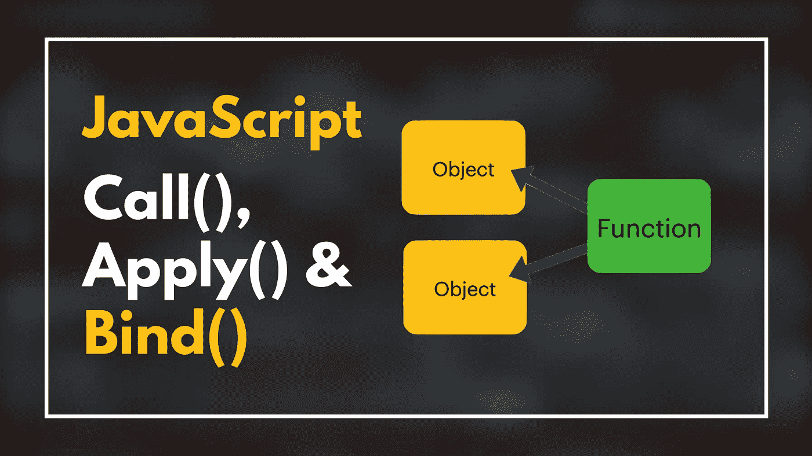
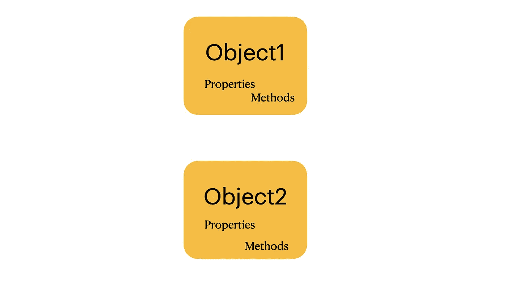
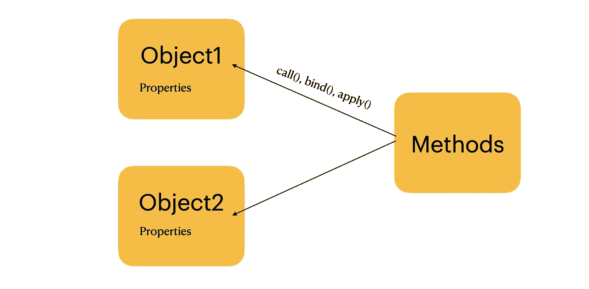

# JavaScript 中何时使用 Bind()、Call()和 Apply()

> 原文：<https://betterprogramming.pub/when-to-use-bind-call-and-apply-in-javascript-1ae9d7fa66d5>

## 了解如何用 JavaScript 创建对象绑定函数



马库斯·斯皮斯克的原始照片。作者编辑

传统上，在 JavaScript 中，对象可以有自己的属性和方法。例如，`object1`不能使用`object2`的方法，反之亦然。



作者图片

但是有一种方法可以克服这个限制。

您可以使用`call()`、`apply()`和`bind()`方法将一个函数绑定到一个对象中，并调用该函数，就好像它属于那个对象一样。



作者图片

让我们逐一查看这三种方法，并查看一些用例。

# JavaScript 中的 Call()方法

`call()`方法调用具有指定上下文的函数。换句话说，您可以将一个函数绑定到一个对象中，就好像它属于该对象一样。

## 例子

让我们创建一个对象`obj`和一个函数`add()`，用于将一个数与另一个数相加:

```
var obj = { num: 2 };function add(a){
  return this.num + a;
}
```

现在，`add()`有问题了。它试图返回`this.num` +某个值。但是函数内部没有属性`num`。因此调用`this.num`失败。

但是正如你所看到的，对象`obj`有一个属性`num`。如果您可以调用该对象上的函数`add()`,就好像它属于该对象一样，会怎么样？

这确实是可能的。为此，使用`call()`方法将函数`add()`暂时绑定到对象`obj`:

```
add.call(obj, 3);
```

*   现在函数`add()`从它被绑定到的`obj`中获取它的`**this**`。
*   当`add()`功能被调用时`this.num`是指`obj`的`num`。
*   因此调用返回`5`，因为`2 + 3 = 5`。

## 使用带有多个参数的 Call()

您也可以将`call()`用于接受多个参数的函数。

例如:

输出:

```
10
```

# JavaScript 中的 Apply()方法

`apply()`方法的作用与`call()`完全相同。不同之处在于，`call()`接受一个参数列表，而`apply()`接受一个参数的**数组**。

例如:

输出:

```
10
```

# JavaScript 中的 Bind()方法

你之前已经学习了`call()`和`apply()`方法的作用。如您所见，它们在被调用时会立即执行该函数(并返回一个值)。

`bind()`方法让人联想到`call()`和`apply()`。但是，`bind()`不是立即执行一个函数，而是返回一个可以稍后执行的函数。

让我们修改前面的例子来使用`bind()`:

所以调用`add.bind(obj, 3, 5)`返回一个函数。在这种情况下，您将它赋给一个名为`func`的常量，然后运行它。

这里调用`func()`就是用`3, 5`的参数在对象`obj`上调用`add()`函数。

现在你明白什么是`call()`、`apply()`和`bind()`以及它们是如何工作的了。这里有一个总结，告诉你如何在前面看到的相同的对象函数设置中使用它们。

输出:

```
10 10 10
```

# 当在 JavaScript 中使用 Call()时

让我们看看在现实生活中如何使用`call()`方法的例子。

## 使用 Call()链接对象构造函数

例如，让我们创建一个`Item`对象。`Item`的构造器由`name`和`price`定义。

让我们也创建属于`Items`的`Car`和`Fruit`对象。现在，你可以使用`Item`对象来初始化它们，而不是像`Item`一样初始化它们。这通过`call()`方法实现:

## 使用 Call()调用匿名函数

让我们创建一个匿名函数，并使用`call()`为数组的每个对象调用它。

匿名函数为每个数组对象添加一个`displayInfo()`函数。这是为了让它打印队列中每个人的正确位置:

输出:

```
Position 0: Matt
Position 1: Jack
```

## 使用 Call()运行带有对象的函数

在定义`call()`时，您已经看到了一个这样的例子。

您可以通过`call()`方法将一个函数绑定到一个对象中。这样，您可以像调用属于对象的函数一样调用它:

# 当在 JavaScript 中使用 Apply()时

## 使用 Apply()将数组追加到另一个数组

您可以使用`push()`方法将元素添加到数组中。

如果将一个数组传递给`push()`方法，它会将整个数组作为一个元素添加到数组中。这意味着数组中有数组。这里你可以使用`concat()`，但是它创建了一个新的数组。

如果你想把一个数组作为一个整体添加到一个现有的数组中，使用`apply()`。

例如:

```
const numbers = [1, 2, 3];
const moreNumbers = [4, 5, 6];numbers.push.apply(numbers, moreNumbers);
console.log(numbers);
```

输出:

```
[1,2,3,4,5,6]
```

## 使用 Apply()链接对象构造函数

类似于用`call()`链接构造函数，可以用`apply()`链接对象构造函数。这一次，您将一个细节数组传递给对象构造函数来初始化对象。

# 当在 JavaScript 中使用绑定时

## 用 Bind()创建绑定函数

您可以使用`bind()`创建一个绑定到对象的函数。这样，无论何时以何种方式调用它，它都是用它所绑定的对象来调用的。

前面的一个例子就是这样做的。

## 使用 Bind()使 SetTimeout 工作

这段代码有一个问题:

它不打印名称`“John”`。而是打印`undefined`。

为了理解为什么会发生这种情况，让我们用另一种等价的方式重写最后一行:

```
let func = person.getName;
window.setTimeout(func, 1000);
```

当`window`调用其`setTimeout()`方法时，其`this`对象就是`window`对象。因此，当`setTimeout()`调用引用`person.getName()`的`func`时，它不知道这个人的名字是什么。为了克服这个问题，使用`bind()`方法将函数绑定到 person 对象。这样无论你在哪里调用这个函数，它仍然可以访问`person`的`name`。

```
let func = person.getName.bind(person);
setTimeout(func, 1000);
```

输出:

```
John
```

这行得通，因为现在

*   `person.getName`方法被分配给一个绑定到`person`对象的函数`func`。
*   现在`func`已经指向了`this`对象`person`。当你将绑定的函数传递给`setTimeout()`时，`func`仍然知道如何获取`person`的`name`。

# 结论

在 JavaScript 中，您可以使用`call()`、`apply()`和`bind()`方法将函数与对象耦合。这样你就可以调用对象上的函数，就好像它属于这个对象一样。

*   `call()`和`apply()`是非常相似的方法。它们都立即在对象上执行绑定函数。
*   `bind()`方法不会立即执行该功能。相反，它创建并返回一个可在以后执行的绑定函数。

此示例使用这些方法进行总结:

感谢阅读。我希望你喜欢它。编码快乐！

附注:一定要把我的新帖子收进你的收件箱。 [***在这里做***](https://artturi-jalli.medium.com/subscribe) *！还有，在 Medium 上阅读更多世界级的故事，可以考虑* [***成为会员***](https://artturi-jalli.medium.com/membership) *。每月只需 5 美元。此外，你的写作也能赚钱。当我开始做* ***的时候，我用编程文章在前 6 个月赚了 5000 美元*** *。通过注册* [***和这个***](https://artturi-jalli.medium.com/membership) *链接，你可以用你的一部分费用来支持我，不需要额外的费用。如果你这样做了，非常感谢！*

# 资源

[](https://developer.mozilla.org/en-US/docs/Web/JavaScript) [## JavaScript | MDN

### JavaScript (JS)是一种轻量级、解释型或即时编译的编程语言，具有一流的…

developer.mozilla.org](https://developer.mozilla.org/en-US/docs/Web/JavaScript)