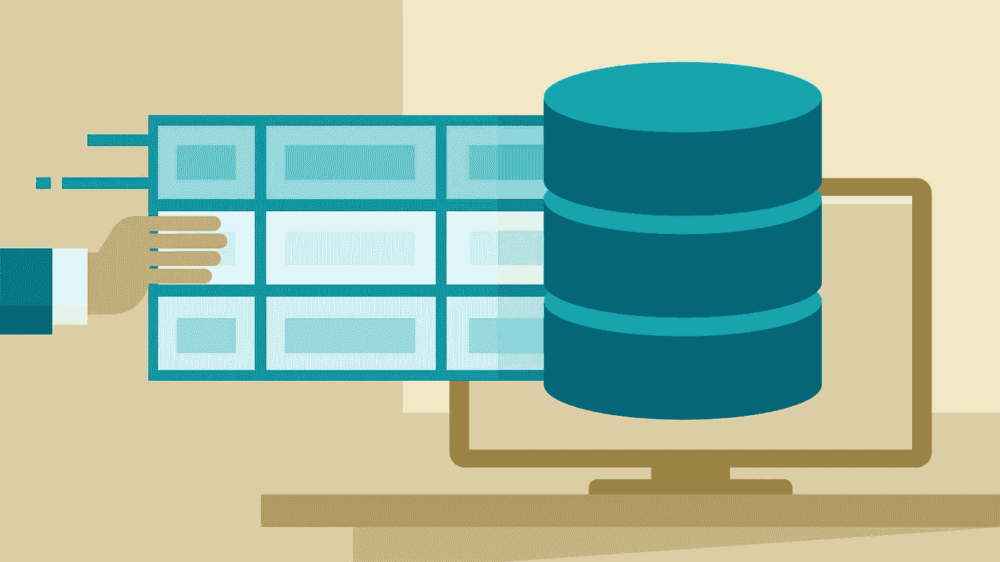
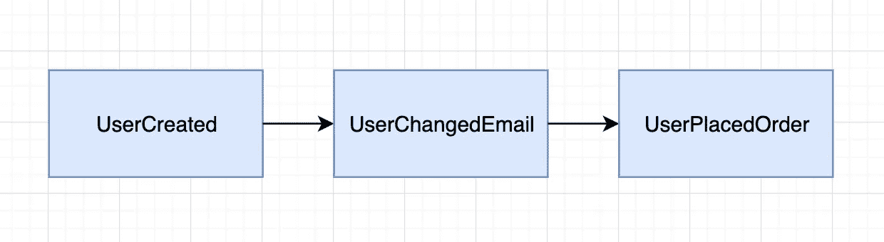

# 何时使用事件来源

> 原文：<https://betterprogramming.pub/when-to-use-event-sourcing-d001e4bab691>

## 事件源可能很棒，但是它确实增加了系统的复杂性



# 什么是事件采购？

大多数 web 应用程序将系统的*状态*存储在数据库中。

假设你被要求设计一个网店的数据库。最有可能的是，传统的 sequel 数据库设计会有一个`users`、`products`和`orders`表——代表系统的*状态*。

让我们假设你开始编码，并最终推出网上商店。几周后，产品负责人想知道用户平均更新电子邮件地址的次数。

在这种传统的数据库设计中，当用户更新他们的电子邮件地址时，会执行如下所示的查询:

```
UPDATE users SET email='newemail@mail.com' WHERE id=1
```

问题是在传统的 sequel 数据库中没有存储这种变化的事件日志。

您可以构建一个额外的列`event_log`，并在每次用户更新其电子邮件地址时添加一个“用户更改的电子邮件”。然而，这有几个问题:

*   构建该功能需要额外的工作。
*   这使得数据库设计更加复杂。
*   您只能从实现该特性的那一刻起生成这些事件，没有办法追溯生成这些事件。

这是一个很好的例子，说明活动采购是多么的棒！

使用事件源设计，您不需要存储系统的*状态*。相反，您存储的是*事件*。

例如，当用户注册时，会存储一个`UserCreated`事件。然后，当用户更新他们的电子邮件地址时，会存储一个`UserChangedEmail`事件。



事件源系统中的示例事件

# 为什么使用事件采购

## 代表了我们的思维方式

在现实世界中，人们在事件中思考。当有人问你今天过得怎么样时，你很可能会告诉他们发生的有趣的事情。而且你很可能不会描述 x 时刻世界的确切状态。

类似地，一个领域专家在描述一个过程时可能会谈到一系列事件。当您使用事件源时，在您的系统中对此建模变得更加容易。

## 生成报告变得很容易

想知道用户更改电子邮件地址的次数吗？通过事件源，您已经存储了所有这些数据。

想知道一个商品从用户的购物车中移除了多少次？简单统计一下`EventRemovedFromCart`事件。

借助事件源，您可以更深入地了解数据，并且可以追溯性地生成报告。

## 您有可靠的审计日志

您可以生成一个审计日志，准确地显示系统是如何进入一种状态的。

例如，想想你的银行账户。Event sourcing 会生成一个交易事件日志，让我清楚地知道为什么每个月底我会破产。

# 为什么不使用事件采购

听起来不错，但是有什么问题呢？

我个人对事件源的经验是，它给你的系统增加了额外的复杂性。更复杂意味着更难引入新的开发人员，需要更长的时间来添加新功能，并且更难维护。

如果您正在构建一个相对小规模的系统，不需要安全的审计日志，实现这一点可能会比它的价值更麻烦。

如果你想了解更多关于活动采购的信息，我推荐格雷格·杨的演讲。