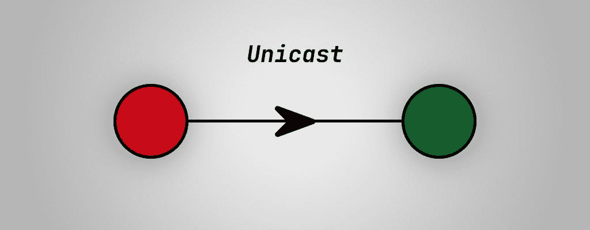
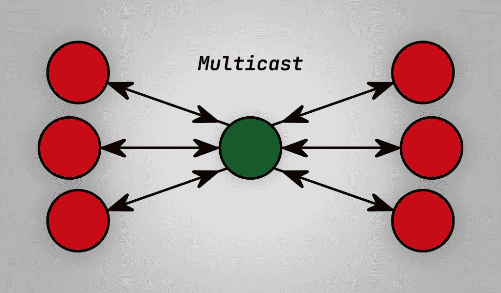

# Angular 中何时使用 RxJS Subject、BehaviourSubject、ReplaySubject、AsyncSubject 或 Void Subject

> 原文：<https://betterprogramming.pub/when-to-use-rxjs-subject-behavioursubject-replaysubject-asyncsubject-or-void-subject-in-angular-c2e9db61b4a0>

## 力量在于细节


照片由[莎伦·麦卡琴](https://unsplash.com/@sharonmccutcheon?utm_source=medium&utm_medium=referral)在 [Unsplash](https://unsplash.com?utm_source=medium&utm_medium=referral) 拍摄

Angular 有许多你可以使用的观察类型。也许你在角形例子中看到过主语、`BehaviourSubject`、`ReplaySubject`或`AsyncSubject`，想知道它们是什么，什么时候可以使用它们。

在这篇文章中，我想深入探讨这些类型的主题是什么，以及何时应该使用它们。所以系好安全带，享受旅程。

# 什么是主题？

RxJS 负责以角度表示的反应性。主题是 RxJS 库中一种特殊类型的可观察对象。

如果你不知道什么是可观测量，可以查看 LogRocket 博客上的“[了解 RxJS 可观测量以及你为什么需要它们](https://blog.logrocket.com/understanding-rxjs-observables/)”这篇文章。

## 单播



图片由 [DevByRayRay](http://blog.byrayray.dev) 提供

可观察的是单播。观察者和它的订阅者是一对一的关系。每个订阅的观察者拥有可观察对象的独立执行。

## 多点传送



与常规的可观察对象相比，主题允许将值多播给许多观察者。主题和它的订阅者有一对多的关系。

主体既可以是观察者，也可以是被观察者。它们拥有多个可观察对象的许多侦听器的注册表。

# 代码中的可观察对象与主体

可观察对象和主体共享它们的 API。它们都有相同的方法，以及你如何创建它们。但是他们的行为彼此非常不同。

## **可在代码**中观察到

在这里，您可以看到数据被发送到第一个订户，并将在继续发送到下一个订户之前完成。

在 [RxJS 文档](https://rxjs.dev/guide/observable#subscribing-to-observables)中，他们描述了“对`observable.subscribe`的每个调用都会触发其针对给定订户的独立设置。”

这就是为什么每个用户都是相互独立运行的。但是 RxJS 团队提供了一种创建“[多播可观察对象](https://rxjs.dev/guide/subject#multicasted-observables)”的方法

## 代码中的主题

有了主语，可以看到主语带头。它向两个订户发送消息，而不是等待。在我看来，这清楚地表明了一个常规的可观察对象和一个主体之间的区别。

RxJS 文档对订阅主题做了如下说明:

> 在主题内部，subscribe 不调用传递值的新执行。它只是在观察器列表中注册给定的观察器，类似于 addListener 在其他库和语言中的工作方式。

# 科目

我们知道一个`Subject`是一个`Observable`。但是它们可以同时向多个用户发送数据，而不是向一个用户发送信息(它们是组播)。

一个`Subject`有三种方法你可以使用:

*   `subscribe`通过这种方式，您可以激活新用户的套餐。
*   `next`用这个方法，你可以传递新的值。所有当前订户都将收到此邮件。
*   `complete`用这种方法，你关闭了对该主题的所有订阅。

一个重要的细节是主题没有初始值。用`next`方法传递的每个值都将发送给所有订阅者。

但是，如果在订阅者订阅之前已经发送了该值，它将不会接收到该数据(*单击“运行”按钮以查看其工作情况*)。

# 行为主体

`BehaviourSubject`是`Subject`的变体。这个变量知道当前值，而普通的`Subject`不知道。

当已经有数据发送给当前订户时，这个主题就变得非常有用。但是另一个用户在稍后被介绍。有时您希望将当前值传递给该订户。使用`BehaviourSubject`您可以做到这一点(*单击“运行”按钮查看其工作情况*)。

因此，使用`BehaviourSubject`向订户提供`Observable`的最新已知值。但是，如果您想要比前一个值多一点呢？

# 重播主题

`ReplaySubject`按它说的做。它可以向新订户重放固定数量的值。

想象一个 DJ 正在播放的在线播放列表。但是你想回到那条小溪里。`ReplaySubject`可以确保您可以还原三首曲目，并从那里开始收听(*单击“运行”按钮以查看它的工作情况*)。

正如您在创建`ReplaySubject(2)`时看到的，我传递了数字 2，它告诉`Subject`它需要将最后两个值发送给每个新订户。

当新订户接收到传递的值时，它将与另一个订户保持同步，这非常好。

但是为了确保`ReplaySubject(10000)`不会将常量值传递给每个新订户，我们可以给它一个时间限制。下面的示例定义了它可以在内存中保存 100 个值，并将其传递给新订户，但是这些值的有效期为 500 毫秒。

```
const subject = new ReplaySubject(100, 500);
```

这个特性提供了很多可能性，所以要聪明地使用它。

# async 主语

当我看到`AsyncSubject`并看到它只在完成时向订户发送最新的值时，我想，“为什么我要使用它？”。直到我在 Medium 上看到[这个帖子。](https://satyapriyamishra111.medium.com/all-you-need-to-know-about-async-subject-2cd72ea646ea)

所以这给了我一个想法，T4 是 Ajax 请求的一个很好的候选。因为对于大多数 GET 请求，你只需要等待一个响应。

当您单击上面的“run”按钮时，您会看到`AsyncSubject`将传递多个值，但是只有在调用`complete()`方法之前的最后一个值会提供给订户。

# 无效主题

在大多数对订阅者使用`Subject`的场景中，访问已经传递的值是很重要的。但是，如果您不需要实际值，而只想挂钩到事件中，并且不需要值，该怎么办呢？那就是你使用空主语的时候。

`Subject`的默认行为就是这样(*点击“运行”按钮，查看它的工作情况*)。

# 结论

让我们总结一下，当你需要一个普通的`Observable`或者一个`Subject`类型的时候。

## 当…时使用可观察值

当您只需要一个订户时，应该使用常规的`Observable`。或者您不关心首先到达的订户将首先完成，直到第二个订户获得其值。

## 当…时使用主语

当您需要多个订阅者并关心所有订阅者同时获得它们的新值时，您需要一个`Subject`。

*   当需要最后一个给定值时，使用`BehaviourSubject`。
*   当你需要超过上一个给定值时，使用`ReplaySubject`(例如，前五个值)。或者您希望设置一个时间窗口，以便将值有效地发送给订阅者。
*   当您只想将最后一个值传递给订阅者时，请使用`AsyncSubject`。
*   如果您不想传递任何值，而只想挂钩到事件中，请使用 Void `Subject`。

希望这能帮助你做出正确的选择！

> 如果你想了解更多关于冷热可观测量的信息，我推荐你阅读这篇由 [Ben Lesh](https://medium.com/u/da6839d28258?source=post_page-----c2e9db61b4a0--------------------------------) 写的文章[冷热可观测量](https://benlesh.medium.com/hot-vs-cold-observables-f8094ed53339)。

# 谢谢！


读完这个故事后，我希望你学到了一些新的东西，或者受到启发去创造一些新的东西！🤗

如果我给你留下了问题或一些要说的话作为回应，向下滚动并给我键入一条消息。如果你想保密，请在 Twitter @DevByRayRay 上给我发一条 [DM。我的 DM 永远是开放的😁](https://twitter.com/@devbyrayray)

## [通过电子邮件获取我的文章点击此处](https://byrayray.medium.com/subscribe) | [购买 5 美元的中级会员资格](https://byrayray.medium.com/subscribe)

# 阅读更多


[雷雷](https://byrayray.medium.com/?source=post_page-----c2e9db61b4a0--------------------------------)

## 荒诞的故事

[View list](https://byrayray.medium.com/list/angular-stories-24674407532a?source=post_page-----c2e9db61b4a0--------------------------------)6 stories

[雷雷](https://byrayray.medium.com/?source=post_page-----c2e9db61b4a0--------------------------------)

## 最新的 JavaScript 和 TypeScript 故事

[View list](https://byrayray.medium.com/list/latest-javascript-typescript-stories-0358ad941491?source=post_page-----c2e9db61b4a0--------------------------------)14 stories