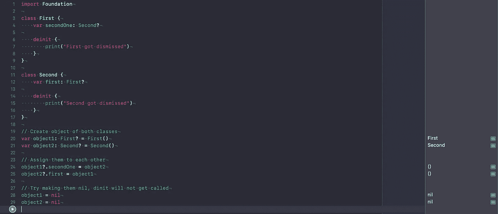
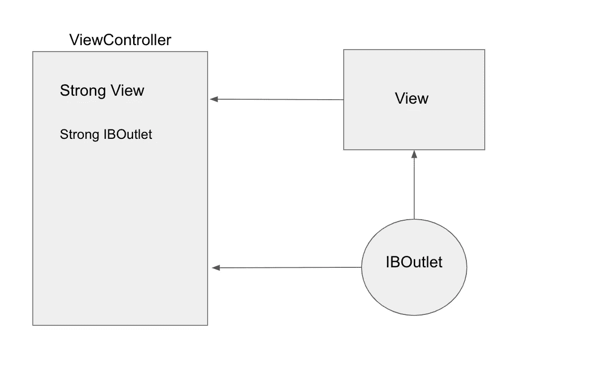

# 在 Swift 中何时使用强引用而非弱引用

> 原文：<https://betterprogramming.pub/when-to-use-strong-references-over-weak-references-in-swift-6238bf8e58bf>

## 让我们避免过度使用*弱* 引用


希瑟·福特在 [Unsplash](https://unsplash.com/s/photos/be-strong-coffee?utm_source=unsplash&utm_medium=referral&utm_content=creditCopyText) 拍摄的照片

# 概观

如果我们谈到内存泄漏，我们首先要检查的是保留周期。为了避免这种情况我们声明属性或者`self` 一个*`weak`*。**

*因为声明`weak`已经成为我们容易的逃避方式——有时我们开始声明`weak`，即使没有保留循环发生。我们将讨论几个我们误解用例的场景。*

# ***保持循环***

*在开始之前，让我们了解一下什么是保留周期以及内存泄漏是如何发生的。*

*让我们通过一个例子来研究保留周期:*

**

*我们创建了两个类的对象，`First`和`Second`，并让它们持有彼此的引用，因此每个引用计数增加到`2`。*

*当我们尝试释放内存时，`deinit`没有被调用，因为没有删除所有的引用。我们现在可以发布了吗？不，因为它们不可访问，导致内存泄漏。*

*所以内存泄漏是不可访问的内存，当我们无法释放对象时就会发生。*

*我们通过手动处理释放来解决这个问题:*

```
*/// 1\. By manual handlingobject1?.secondOne = nil
object2?.firstOne = nilobject2 = nil
object1 = nil*
```

*并制作其中一个属性`weak`:*

```
*weak var firstOne: First? // changing line 12///// 2\. By Weak approachobject2 = nil
object1 = nil*
```

*很好—我们知道如何避免保留周期，但有时我们会误解它是否真的在发生。*

# *四种可以变强的情况*

## *1.处理视图动画时。*

*让我们来学习一下`ViewAnimation`类:*

```
*class ViewAnimation {func viewAnimate() {// weak self not required below
UIView.animate(withDuration: 0.3) { [weak self] in
    self?.doSometing()
  }
}func doSometing() {}}*
```

*这里您可能使用了`weak self` 也可能没有，但是让我们来理解为什么没有内存泄漏。*

*这个闭包无疑强烈地捕捉到了`self`，但是这些行是写在函数体内部的——类`ViewAnimation`是*而不是*持有闭包`strongly`。*

*一旦这个闭包被执行，`ViewAnimation`将被释放，因为`animate`函数将临时保存引用直到被执行。*

## *2.处理 DispatchQueue 时。*

*让我们给这个类添加另一个函数— `ViewAnimation`:*

```
*func whenDispatchHappens() {DispatchQueue.main.asyncAfter(deadline: .now() + 20) { [weak self] in
  self?.doSometing()
  }
}func doSometing() {}*
```

*这类似于上面讨论的情况`1`。`DispatchQueue`范围是本地的，按职业没有据点`ViewAnimation`。因此，在闭包之后，执行引用被释放——在本例中，是在`20`秒之后。*

****注:*** *并非所有病例的局部范围都与病例*`*1*`*`*2*`*相同。* `*NotificationCenter*` *则相反，一旦执行就不会释放* `*self*` *。KVO 类型的实现是不同的，不应该与这些例子混淆。***

## **3.在处理授权时**

**是的——不是所有的授权场景，但这里有一个我们安全行事的案例。**

**考虑一个常见的模型展示场景，其中点击一个按钮，`PresentingViewController`试图展示一个`NewViewController`。回到`PresentingViewController`我们通常实现一个委托模式。让我们检查下面的示例代码:**

```
**@IBAction func onTapOfShowCities(_ sender: Any) {guard let vc = UIStoryboard(name: "Main", bundle: nil)
.instantiateViewController(identifier: "NewViewController") as? NewViewController else { return }// The below delegate property can declared strong
vc.delegate = selfself.present(vc, animated: true, completion: nil)}**
```

**这里，`NewViewController`的委托属性不必是`*weak*` *。*没有保持周期，因为`PresentingViewController`没有强有力地保持住`NewViewController`，它的作用域是局部的。**

**行`self.present(vc, animated: true, completion: nil)` —该引用由苹果公司内部管理，并在解散`ViewController`时被移除。**

## **4.与 IBOutlets 打交道时**

**`@IBOutlet weak var showCities: UIButton!`**

**你可能想知道，苹果的默认，`IBOutlets`，在拖动和连接的时候是不是很弱。**

**嗯，就像`Show Blame`怎么变成了`Author`(物换星移，感情受伤)。这正在考虑中，但可能需要一些时间来反映。**

**但是，*没有*涉及到`IBOutlets`声明为强的。**

**让我们来研究下图:**

****

**Tt 清楚地暗示了`IBOutlet`在两个地方被提及，`view`和`ViewController`。但是他们没有形成一个依赖循环(又名保留循环)。**

**让我们来看看视图控制器的释放过程:**

*   **首先`View controller`将尝试解除分配它所有的`subviews`和`properties`。**
*   **`view`是要释放的——所以`view`先释放`IBOutlet`的一个引用。**
*   **现在，按照`ViewControllers`解除分配过程，剩余的属性也被释放，从而释放`IBOutlet.`的第二个引用**

**由于`IBOutlet`没有保持住`view`或`ViewController`，保持循环将不会发生。**

**太好了——我希望我们消除了误会。虽然`weak self`是一种安全措施，但我们应该清楚使用案例。**

# **关于这一主题的进一步讨论**

*   **[IBOutlets 一样强](https://stackoverflow.com/questions/7678469/should-iboutlets-be-strong-or-weak-under-arc)**
*   **[强自封闭调度队列](https://stackoverflow.com/questions/41991467/where-does-the-weak-self-go)**

# **一些疯狂的实现**

**[](https://medium.com/better-programming/building-a-custom-transitioning-for-viewcontroller-in-ios-13-cbf9b4de3d9b) [## 在 iOS 13+中为 ViewController 构建自定义过渡

### 让我们在应用程序中构建自定义过渡

medium.com](https://medium.com/better-programming/building-a-custom-transitioning-for-viewcontroller-in-ios-13-cbf9b4de3d9b) [](https://medium.com/better-programming/building-an-animating-navigation-bar-in-ios-13-96355c6822ce) [## 在 Swift 中构建一个动画 UINavigationBar

### 超越默认的导航栏功能

medium.com](https://medium.com/better-programming/building-an-animating-navigation-bar-in-ios-13-96355c6822ce)**