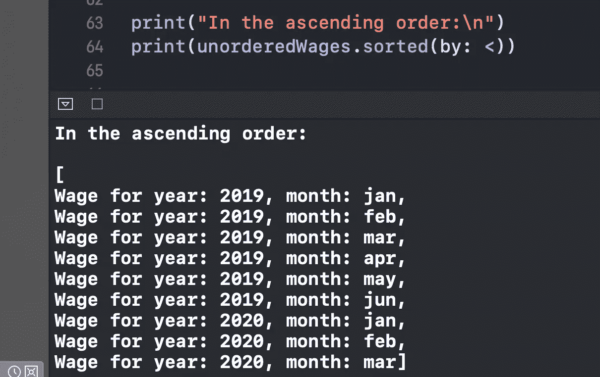
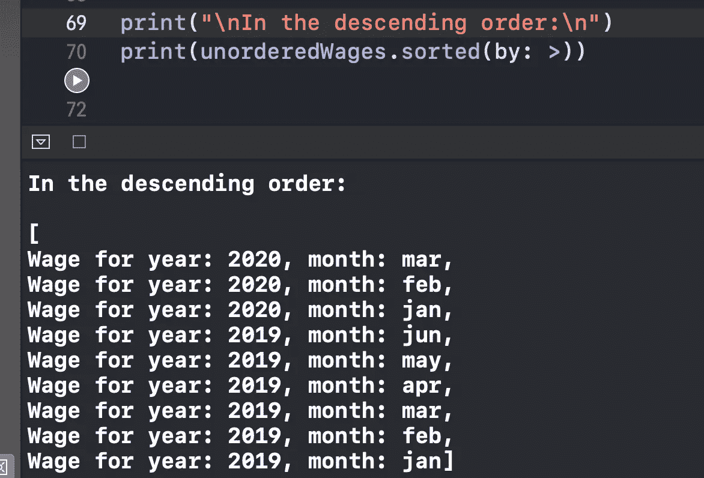

# 何时在 Swift 中使用类似协议

> 原文：<https://betterprogramming.pub/when-to-use-the-comparable-protocol-in-swift-b9f137b07413>

## 这个协议对于定制数组的排序非常方便

照片由 [Kolar.io](https://unsplash.com/@jankolar?utm_source=medium&utm_medium=referral) 在 [Unsplash](https://unsplash.com?utm_source=medium&utm_medium=referral) 上拍摄

在这个简短的教程中，我们将快速探索和掌握 Swift 中的可比协议。

Comparable 协议是有用的，因为一旦我们的定制`Array`符合它，它就允许我们获得免费的排序功能。

# 我们开始吧

假设我们有一个工资跟踪应用程序，因此我们创建了`Wage`模型:

首先，我们用类型为`Int`的`rawValue`定义了一个`Month`枚举，这意味着我们将每个相应的月份对应于一个整数(例如，一月等于 1，二月等于 2，等等)。

接下来，我们创建一个包含`year`和`month`属性的`Wage`结构。

出于调试目的，我们遵循`CustomStringConvertible`协议。如果你不熟悉它，我建议你看一下我的[文章，在那里我用两分钟](https://medium.com/better-programming/what-is-the-customstringconvertible-protocol-in-swift-4b7ddbc5785b)解释了它。

现在让我们创建一个由`Wage`组成的样本数组，并对其进行洗牌，这样我们就有了一个随机集合:

最后，让我们实现`Comparable`协议，为我们的`wages`数组提供排序功能:

我们提供了一个`<`方法来按照自定义的升序对集合进行排序。

注意，因为我们已经实现了`<`方法，所以我们不需要定义下降的`>`方法。太好了！

排序完成后，让我们编写代码来调试我们的实现:

现在我们已经按照升序打印了数组:

按照降序排列:

# 包扎

有关更多信息，请访问 Apple 官方文档:

 [## 可比较的

### Comparable 协议用于具有固有顺序的类型，如数字和字符串。许多类型在…

developer.apple.com](https://developer.apple.com/documentation/swift/comparable) 

感谢阅读！