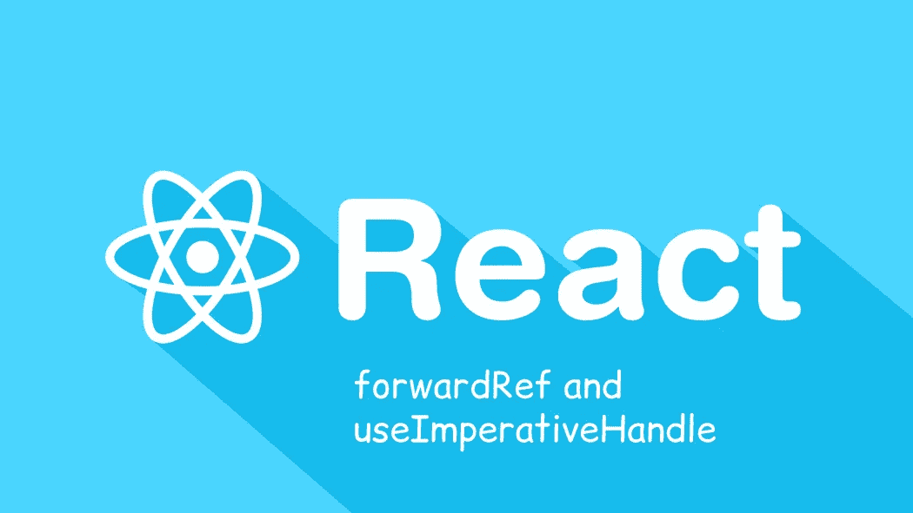
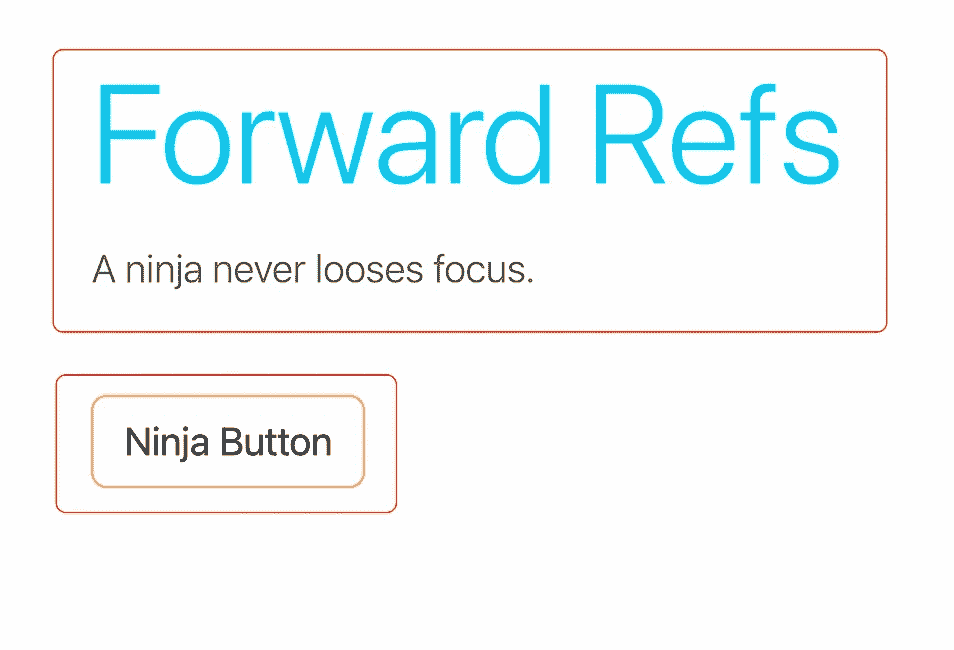
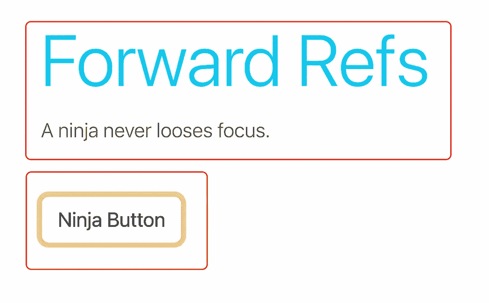
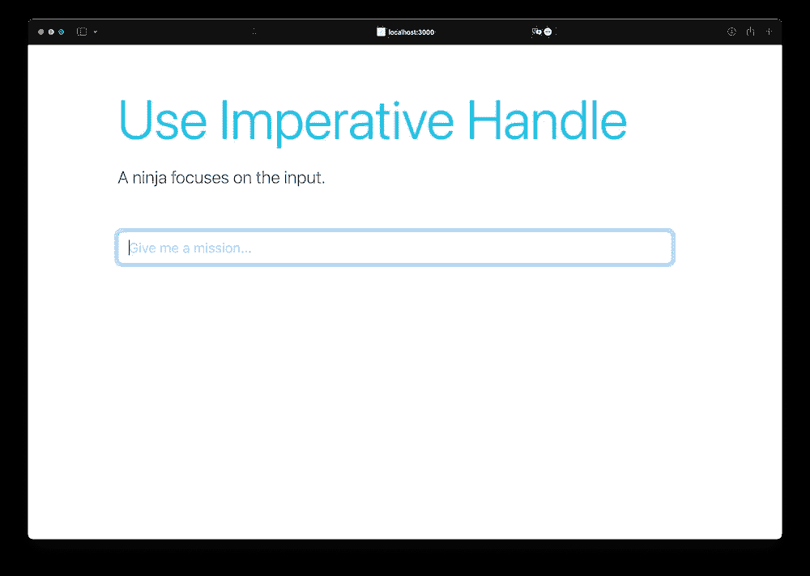
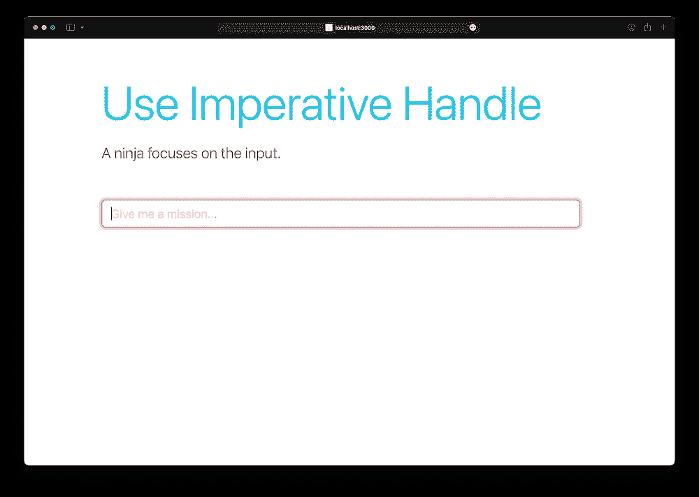
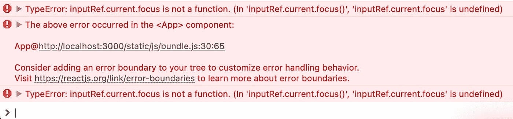

# React 18 中何时使用“useImperativeHandle”和“forwardRefs”

> 原文：<https://betterprogramming.pub/when-to-use-useimperativehandle-and-forwardrefs-in-react-18-89cce42b3309>

## 有时候，你必须拿出大枪



作者的标题图像

本文是[https://better programming . pub/react-v 18-demystifying-useref-forward ref-and-useimperativehandle-feec 2 fc 5 b 2 f 6](/react-v18-demystifying-useref-forwardref-and-useimperativehandle-feec2fc5b2f6)的延续，在那里我们看到了什么是 ref 以及它们是如何操作的。有了上一篇文章中获得的知识，让我们深入一点更复杂的理解，这在具有大量组件嵌套和一点真正的基于 DOM 的需求的真实项目中会派上用场。

# 正向参考

没有问题的解决方案是什么，对吗？所以，让我们来定义一个普通裁判不能完成工作的情况。如果我们有一个父组件想要引用子组件中定义的一个元素并修改焦点状态，该怎么办？让我们创建这样一个例子。



父组件控制子组件中定义的按钮的焦点。

正如您在上面看到的，父组件控制子组件按钮上的焦点。这并不像将父元素中定义的 ref 作为道具传递给子元素那么简单。在我们的例子中，ref 是一个特殊的属性，它定义在要改变焦点的 HTML 元素上，而不是子组件包装器上，因为它只是一个函数。

我们可以通过将我们的子组件包装到 React 提供的`forwardRef` 函数中来获得期望的行为，该函数将处理这种委托。这个函数应该传递发送的道具，并允许组件上有一个额外的道具，这就是我们的“ref”代码如下:

React 中如何使用 forwardRef？

# useImperativeHandle

看起来，我们在上一节中取得的成果对于复杂的情况来说已经足够了。尽管如此，有时您可能想在组件中定义一个自定义的 ref 功能，该功能将向使用它的组件公开。让我们试着创建一个需要这种细粒度控制的场景。

默认情况下，输入的焦点颜色是`blue`，但是假设我们的忍者应该得到一个超临界的 jonin 级任务，那么输入区域应该聚焦在`red`上。



父组件可以控制子组件的输入所关注的颜色。

为了说明`useImperativeHandle`在这种情况下的用法，让我们脱离常识，构建两个通过 ref 绑定到输入组件的自定义方法。这次，我们将有两个自定义方法`focusRed()`和`focusBlue()`，而不是默认的聚焦方法。

我们仍然需要使用`forwardRef`将 ref 传递给子组件，但是在子组件内部，我们将在`useImperativeHandle`钩子的帮助下创建这些新函数。代码如下所示:

我们正在使用 useImperativeHandle 向 ref 添加自定义方法。

> 需要注意的一件重要事情是，在上面的代码中，我们没有像前面的情况那样扩展默认可用的方法，而是创建了一组全新的方法。因此，`*default focus()*` 方法对我们来说不再可用，调用它会给我们带来甜蜜的错误。



使用命令式句柄时，focus 方法不可用。

# 结论

总而言之，我将重复我在上一篇文章中说过的话:在进行基于虚拟 dom 的开发时，不应该使用对 DOM 的引用本身，因为您在真实 DOM 中所做的更改不会正确地转移到 vDOM 设置中，这会导致意外的反应。

我选择`focus`作为本文的中心话题，只是因为它是需要召唤裁判时的主要需求之一。React 提到了一组有限的引用用例，你可以在这里看到:[https://react js . org/docs/refs-and-the-DOM . html # when-to-use-refs](https://reactjs.org/docs/refs-and-the-dom.html#when-to-use-refs)。

```
**Want To Connect?**LinkedIn: [https://www.linkedin.com/in/sameerkumar1612](https://www.linkedin.com/in/sameerkumar1612/)
```