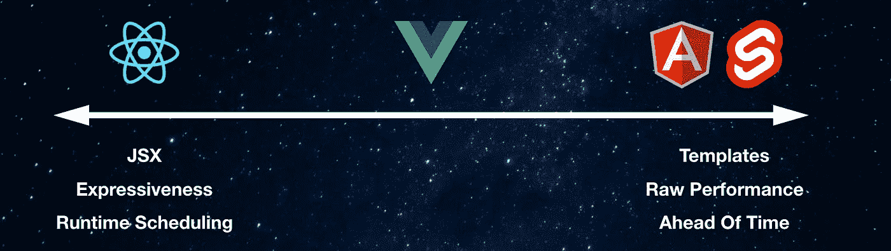

# 何时使用 Vue Over React

> 原文：<https://betterprogramming.pub/when-to-use-vue-over-react-9a4e0f01e064>

## 这是一篇非常有见解的文章，基于我过去四年作为前端 web 开发人员的经验

Javier Allegue Barros 在 [Unsplash](https://unsplash.com/s/photos/choices?utm_source=unsplash&utm_medium=referral&utm_content=creditCopyText) 上拍摄的照片

在我目前的工作中，我专业地使用 [React](https://reactjs.org/) ，但是对于所有个人项目，我选择 [Vue](https://vuejs.org/) 。这是我首选的框架。我在之前的上市公司中使用过 Vue，它的扩展性非常好。

任何经验丰富的开发人员都会告诉你，软件都是关于权衡取舍的，抛出“框架 x 比框架 y 更好”这样的客观陈述通常是没有意义的。用什么标准？在谁看来？出于这个原因，我将比较 Vue，并对三个主要问题做出反应，这三个问题通常是相互竞争的权衡。

1.  表演
2.  可量测性
3.  工作市场

# 表演

当讨论框架或语言时，性能通常是人们想要开始的地方。每个写软件的人都在打造下一个 FAANG 公司，每一纳秒的性能都要从我们的代码中提取出来。

我将从性能的两个方面比较这两个框架，即硅时间和碳时间。*芯片时间*指的是原始执行性能——它在浏览器中运行的速度。*碳时间*是指开发者在代码中构建产品的速度。

## 硅时间比较

JS 框架对性能的权衡

React 利用了 JSX，这给了开发人员很大的权力来构建任意复杂的逻辑。我们可以利用 JavaScript 的图灵完备能力，将视图视为数据。类似 Svelte 的东西利用了为视图层提供刚性结构的标记模板。

React 和 Vue 都使用一个[虚拟 DOM](https://stackoverflow.com/questions/21965738/what-is-virtual-dom) (VDOM)，虽然实际上足够快，但固有的昂贵和[几乎纯粹的开销](https://svelte.dev/blog/virtual-dom-is-pure-overhead)。Svelte 将模板代码编译成原始 JS 并直接操作 DOM，这意味着它没有维护 VDOM 的性能开销。

我喜欢 Vue 的一点是它有点对冲赌注。使用 Vue 最常见的方法是在[单文件组件](https://vuejs.org/v2/guide/single-file-components.html)中使用模板。这使得 Vue 团队可以在即将到来的 Vue 3 版本中做一些非常聪明的事情，提前(AOT)进行优化。

模板的结构化本质意味着编译器可以了解你的代码并执行优化。Vue 引入的主要优化是删除 VDOM 差异中的所有静态数据。VDOM 性能直接受到它必须跟踪的节点数量的影响。通过从这个 VDOM 差分过程中过滤掉静态数据，我们可以减少被跟踪的节点数量。这使得代码运行得更快，因为它不必在每个渲染周期比较任意节点的递归树。

虽然 Vue 看起来在大多数情况下使用模板，但编译器实际上在幕后为您将这些模板变成了[渲染函数](https://vuejs.org/v2/guide/render-function.html)。这意味着任何时候 Vue 的模板化妨碍了你，你可以直接下拉并编写渲染函数，就像在 React ***中一样。*** 这意味着您可以获得渲染功能和 JSX 的所有灵活性，并从 Svelte 这样的模板化框架中获得一些性能优势。显然，如果你写一个 100%渲染的 Vue 应用程序，你会失去所有的模板优化。

在我看来，代码基准测试有点浪费时间，但一些测试显示 Vue 2 比默认反应快 2.5 倍，Vue 3 的基准测试比 Vue 2 快 3-5 倍。实际上，您使用的 JS 框架将是应用程序的一个很小的组件，这些基准几乎没有意义。然而，如果你构建的模板将利用 Vue 3 的 AoT 优化模板，那么同样的应用程序在 React 中是不可能写得更快的。

**获胜者:** Vue

## 碳时间性能

软件开发的碳成本与硅成本

一个高级开发人员将花费你大约 150 美元/小时，这取决于你在世界的哪个地方。即使是初级到中级的开发人员也挣得足够多的薪水，以至于你想把开发时间和成本考虑到你的技术堆栈中。这就是为什么 PHP、Python、Node、Ruby 等语言。非常受欢迎，我们不只是用 c 写所有的东西。

对于前端应用，我们受到浏览器、设备资源和网络延迟的限制，因此芯片性能仍然是一个影响因素，但碳性能也应该是任何首席技术官考虑的首要问题。

在我看来，Vue 成功的一个最大的贡献因素是它平易近人的文档、资源和简单易学。我同时学习了 React 和 Vue，Vue 显然更容易上手。如果你知道 HTML、CSS 和 JS 的基本知识，你可以用 Vue 构建一个应用程序。我花了半天时间和一个设计团队在一起，让他们在 Vue 中将更改发送到生产前端。这为开发团队腾出了大量时间，并允许设计人员实施 A/B 测试和设计更新，而不会受到软件积压的阻碍。

我喜欢 Vue 的一点是它的选择加入工具的分层设计。可以从通过 CDN 拉入 Vue 开始。这意味着您可以使用它，而无需经历复杂的构建步骤(webpack/Babel config、npm 等)。然后，您可以进入 Vue CLI 并构建基本应用程序。如果您需要状态管理解决方案，Vuex 中有官方支持和记录的解决方案。同样，Vue 路由器是官方认可和支持的 Vue 路由器解决方案。

另一方面，React 引入了选择的[悖论，](https://en.wikipedia.org/wiki/The_Paradox_of_Choice)会给新来者造成困难。

React 是一个小范围、单一用途的库，它引入了一个接收道具并返回 VDOM 树的组件模型。这提供了很大的灵活性，React 社区已经在这个简单的库之上构建了许多复杂的系统。

有一个庞大的生态系统，有很多很多解决任务的选择。这些由用户独立维护。这种模型为人们提供了很多机会，可以在 React 之上构建东西，构建流行的库和工具。

这也使得东西很难找到和学习。您不得不选择状态管理、路由或配置新应用程序的最佳选项。以我的经验来看，这也使得雇佣 React 开发者更加困难。当有多种方法做事情时，让新成员加入 React 项目比加入 Vue 项目会有更多的摩擦。

**获胜者:** Vue

# 可量测性

我对这些框架可伸缩性的大部分想法在性能部分都有所涉及。可伸缩性通常与性能有着内在的联系，所以这并不奇怪。

我通常从以下方面考虑可伸缩性:

## **扩展应用中视图/组件/工作流的数量**

就扩展组件数量而言，我非常喜欢单文件组件(SFC)。组件的逻辑分组对我来说很有意义。许多人不同意这一点，这是一个观点而不是一个客观的说法。

我喜欢 sfc 的原因是因为它们提供了一种很好的方式来加强关注点的分离。有些人认为混合 HTML、CSS 和 JavaScript 与分离关注点背道而驰。我已经改变了我在前端思考这个原则的方式，很大程度上是因为我痴迷于采用[的 Tailwind CSS](https://tailwindcss.com/) 来设计我的组件。

Adam Wathan 写了一篇关于 SoC 的概念以及它如何应用于 HTML 和 CSS 的伟大文章。我以类似的方式思考我的前端组件。在我看来，组件就是它看起来如何(HTML/CSS) *和*如何工作。对我来说，将标记从 JS 中分离出来是武断的。如果你认为你的观点是数据，那么(对我来说)把它们和你的数据放在一起是有意义的。

甚至不要让我开始谈论 JSX 和 CSS-in-JS。HTML 和 CSS 没有死。它们是网络不可思议的强大构件。使用它们！

官方支持的常见问题解决方案的好处在大规模使用时也很方便。如果你在扩展一个 Vue 应用程序时遇到了困难，那么有可能任何其他的 Vue 应用程序都使用了相同的架构，你将能够找到建议和帮助。你不需要担心别人说“用钩子/[MobX](https://mobx.js.org/README.html)/[Redux](https://medium.com/p/9a4e0f01e064/edit)/[Redux-Saga](https://redux-saga.js.org/)就行了。”

## **扩大团队中开发人员的数量**

我已经提到过，我曾经见过一个设计团队，在几个小时的帮助下，就可以将变更推向生产。对于任何面向消费者的应用程序来说，这都是一种疯狂的生产力提升。

普遍的共识是 Vue 更容易学习，这也意味着你可以更快地培训初级开发人员，这对团队有好处。你也可以不费吹灰之力就搭载一个 React 开发者(假设他们懂 HTML 和 CSS)。

同样，对常见问题有一致的解决方案使得团队中的每个人更容易对大型代码库进行代码审查和推理。

这两者的关键是保持开发速度，同时保持满足用户需求的高性能应用程序。在我看来，Vue 在这里达到了完美的平衡。

**获胜者:** Vue

# 就业市场

好吧，我已经说服你 Vue 比 React 在每一个可以想象的方式。但如果你拿不到工资(或者找不到开发人员来雇佣)，这就没有意义了。

React 在就业市场的份额要高得多(至少在澳大利亚和美国)。如果你在大部分的工作论坛上看到，相对于 Vue 来说，React 的招聘数量是相当可观的(根据 10 秒钟的工作论坛搜索，React 的招聘数量是我写这篇文章时的近 8 倍)。

虽然 React 似乎在这个指标上赢了，但我拒绝让 React 在棋盘上得分，所以我将提出以下(无懈可击的)论点。

React 和 Vue 在就业市场上都有机会。使用 Vue 或 React 的公司都发现很难招到人，而且，以我的经验来看，这两家公司都缺乏技能。作为一个正在找工作的人，你可以比使用 React 更快地掌握 Vue。这意味着你将获得一条通往高薪的捷径。你在面试时的竞争也会更少，因为 React 仍然是许多开发者最受欢迎的选择，他们目前是沉没成本谬论的受害者。

作为一家担心在当前市场上争夺人才的公司或招聘经理，Vue 提供了一个机会，可以利用每种资源生产更多产品(Vue 的碳时间优势)并培养自己的人才(更快的学习曲线)。在招聘时，为绿地项目或新的创业公司选择 Vue 可能是你做过的最好的决定。

随着越来越多的公司意识到 Vue 的好处，我相信它将继续吞噬市场份额——甚至可能在未来取代 React 成为首选框架。

**胜者:**平局

# 结论和结束语

这是一篇关于 Vue 的半开玩笑的文章，以及为什么我认为反应是最好的。我认为 React 是构建前端的一个非常合理的工具，我并不是说它不好。我只是相信 Vue 在框架设计上取得了更好的平衡。

在以下情况下，我会选择 React 而不是 Vue:

*   你想在使用 React 的地方工作，例如脸书
*   你有一个经验丰富的 React 开发团队
*   在你所在的地区雇佣 React 更容易

老实说，我不认为有任何一个技术原因让我选择 React 而不是 Vue 来开发我构建或工作的应用程序。这并不意味着一个不存在，但我只是没有遇到一个。

Svelte 和 Elm 都是令人难以置信的有趣选项，我正在密切关注，但我不确定它们在这个时间点上对于大规模企业应用程序的可行性。

如果你想学习 Vue，我强烈推荐[这个由神奇的 Jeffrey Way 提供的免费课程](https://laracasts.com/series/learn-vue-2-step-by-step)。