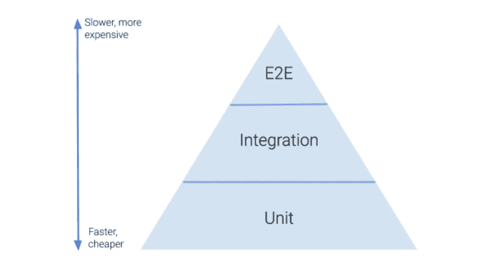
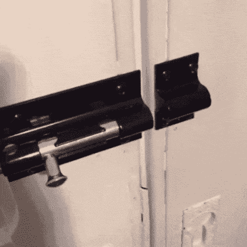

# 何时编写端到端测试

> 原文：<https://betterprogramming.pub/when-to-write-end-to-end-tests-246d43b166d0>

## 深入了解测试金字塔

杰瑞米·毕肖普在 [Unsplash](https://unsplash.com?utm_source=medium&utm_medium=referral) 拍摄的照片。

编写软件时，可以在许多不同的级别测试代码:单元测试、集成测试和端到端(e2e)测试。

所以问题是，对于任何给定的功能，您应该在哪里以及如何测试您的代码？

在本文中，我们将看看不同类型的测试，测试金字塔，以及一个将它们联系在一起的真实世界的例子。

# 测试类型

## 单元测试

单元测试确保一个单独的东西能够正常工作。您通常会编写单元测试来验证函数、后端 API 端点或 UI 组件之类的东西。当你测试的东西有清晰的输入和输出时，单元测试是完美的。

例如，纯函数是确定性的，当给定相同的输入时，总是返回相同的输出。您可以为一个将两个数相加的函数编写单元测试，以验证它是否返回正确的和。

您可以为 API 端点编写一个单元测试，它接受一个`userId`并返回一个包含用户信息的对象，以确保它发送正确的响应。

或者，您可以为 React 按钮组件编写一个单元测试，以确保按钮文本被显示，并且按钮在被单击时会做出适当的响应。

## 集成测试

集成测试确保一些事情能够一起正常工作。但是，您仍然排除了系统的一部分，或者潜在地嘲笑了一些数据。

Kent Dodds 的 [React 测试库](https://testing-library.com/docs/react-testing-library/intro/)是如何利用集成测试的一个很好的例子。当您使用 React 测试库呈现组件时，它会呈现完整的组件树。因此，如果一个组件呈现其他子组件，这些子组件也会被呈现和测试。这与“浅层渲染”的概念形成对比，后者是使用[酶](https://github.com/enzymejs/enzyme)测试组件时的常见做法。

例如，您可能有一个简单的表单组件，显示用户的名、姓和电子邮件地址的文本输入。它还呈现一个“提交”按钮。当您为表单编写测试时，您可以验证按钮和所有输入是否都呈现在屏幕上，您是否可以填写表单，以及单击“Submit”按钮是否可以提交表单。

然而，在这种情况下，仍然有一些应用程序没有被测试。当表单被提交时，它不会真的碰到 API 端点。而且整个应用程序不会旋转，因为只呈现表单组件。

## E2E 测试

E2E 测试确保完整的工作流程正常运行。这些工作流通常由“用户旅程”或用户在使用应用程序时可能执行的常见任务来表示。E2E 测试让你的整个应用程序旋转起来，并使用类似于 [Cypress](https://www.cypress.io/) 或 [Selenium](https://www.selenium.dev/) 的测试框架来执行用户会采取的实际行动。

例如，您可以编写一个 e2e 测试来验证用户是否可以在您的站点上创建帐户。您的测试将启动您的应用程序，导航到注册页面，填写表单，然后提交它。这将触及一个真实的 API 端点，并将一个真实的用户插入到一个真实的数据库中。然后，您可能还要验证用户在注册后被导航到一个新页面，并且您可以在页面的某个地方看到他们的用户头像或用户名。

# 测试金字塔

现在我们已经了解了每种类型的测试是什么，让我们检查一下什么时候应该编写它们。单元测试、集成测试或 e2e 测试应该占多大比例？

这里公认的哲学是所谓的测试金字塔。请看下图:

来源:[梁咏琪](https://medium.com/better-programming/the-test-pyramid-80d77535573)

正如您所看到的，测试金字塔建议您进行大量的单元测试、中等数量的集成测试和少量的 e2e 测试。

然而，e2e 测试在完全验证整个工作流程或用户旅程正常工作方面要优越得多。

请看一个经常在 Imgur 和 Reddit 上流传的 GIF 示例:

为什么集成测试和 e2e 测试很重要

锁本身功能正常，对吗？您可以将其从左侧的解锁位置移动到右侧的锁定位置。

门自己也能正常工作。它可以滑动打开和关闭，让人们进出房间。

但是这两块一起用就不能正常发挥作用了！锁假定它所在的门*摆动*打开和关闭，而不是*滑动*打开和关闭。这显然是一个糟糕的假设，导致门实际上不能被锁上。

一个好的集成测试或 e2e 测试应该可以发现这一点！

# 为什么不总是使用 E2E 测试呢？

所以，这个例子回避了下面的问题:为什么不总是使用 e2e 测试？它们更好地代表了应用程序实际上是如何运行的，不要依赖于任何你可能已经错了的假设。

如果你回头看看测试金字塔图，答案是 e2e 测试速度更慢，成本更高。

由于他们使用实际的应用程序，他们需要一个工作服务器、前端、后端和数据库。如果您在每个合并请求上运行这些测试作为持续集成管道的一部分(您应该这样做！)，那么这意味着对于每个新的合并请求，您必须在云中为您的服务器和数据库提供资源。那可能会积欠一大笔帐！

当您与应用程序交互时，创建新用户、渲染应用程序以及等待 API 请求响应也需要时间。单元测试和集成测试要快得多，因为执行一个简单的功能通常只需要几毫秒的时间。

现在，把这个时间乘以 1000。1000 个单元测试比 1000 个 e2e 测试快多少？确切的答案取决于代码和应用程序的性质，但是可以相当肯定地说，你的单元测试可以在一分钟内完成，而 e2e 测试可能需要一个小时或更长时间。

# 什么情况值得进行 E2E 测试？

这个故事的寓意是，当你决定编写 e2e 测试时，你需要有所选择。E2E 测试应该只保留给关键的工作流。

例如，您肯定希望确保用户可以在您的站点上创建新帐户，或者现有用户可以登录到他们的帐户。如果你是一家电子商务公司，你肯定希望确保用户能够完成结账过程，在你的网站上购物。

这些用户旅程对你的业务至关重要，所以 e2e 测试需要的额外成本和时间是值得的。

如何验证屏幕上呈现的某些内容？您会编写一个 e2e 测试来确保主页显示正确的欢迎文本吗？大概不会。这可以使用单元测试进行充分的测试。

# 真实世界的例子:面包屑

Pierre Bamin 在 [Unsplash](https://unsplash.com?utm_source=medium&utm_medium=referral) 上拍摄的照片。

让我们看一个真实世界的例子。最近，我们的团队正在重新设计我们应用程序中面包屑的工作方式。后端 API 基本保持不变，但是前端 UI 的外观和行为会有所不同。

在我们进行这项工作时，我们编写了以下测试:

*   各个面包屑组件的单元测试(前端)
*   breadcrumb UI 整体的集成测试(前端)
*   API 端点的单元测试(后端)

通过这些测试，我们可以确保给定一些模拟面包屑数据，我们的前端看起来和行为都符合预期。我们还可以确保带有给定请求参数的 API 请求将返回正确的面包屑响应数据。

但是，我们不能保证前端和后端能够很好地协同工作。如果前端组件期望的数据格式与后端提供的数据格式不同，那该怎么办？

当然，我们能够手动验证完整体验是否正常，但我们没有 e2e 测试来自动进行验证。

我们权衡了包含或不包含 e2e 测试的利弊。

编写一个 e2e 测试将意味着我们的工作流将被 100%覆盖。但是这也意味着在运行我们的测试套件时需要额外的资源成本和额外的时间。

不编写 e2e 测试将节省我们在测试管道作业运行期间的额外时间，但它也将留下前端和后端在将来的某个时候不能完美地一起工作的可能性。

最后，我们决定面包屑不是关键用户旅程的一部分，因此不值得编写 e2e 测试。我们有意识地接受风险，即前端或后端 API 合同可能会改变，以有利于不使我们的 CI 渠道变慢。

# 结论

人们很容易认为多添加一个 e2e 测试只会给整个测试套件的运行时间多增加几秒钟，那么为什么不直接添加呢？然而，随着你的工程组织和应用程序的增长，那些“这只是又一个 e2e 测试”的事件将会一周接一周地增加。

如果您在添加 e2e 测试时不认真，您很快就会被慢得离谱的测试套件所拖累，让您的组织损失大量的时间。相反，测试应该写在测试金字塔尽可能低的位置。

所以请记住:E2E 测试只适用于关键的工作流程。