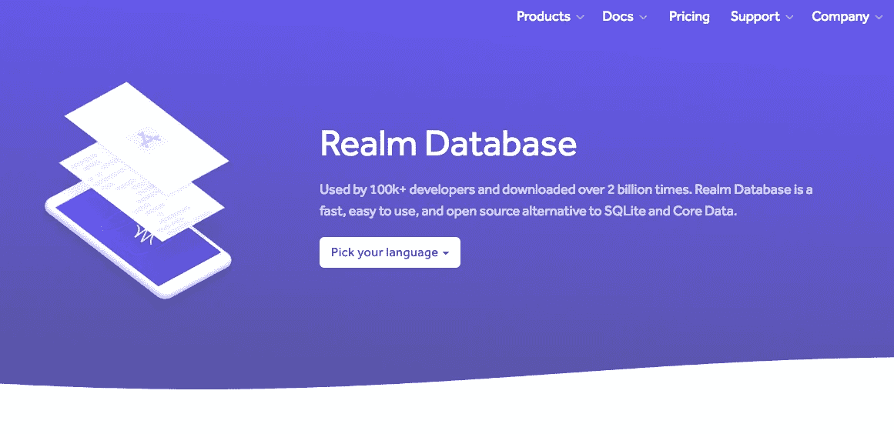
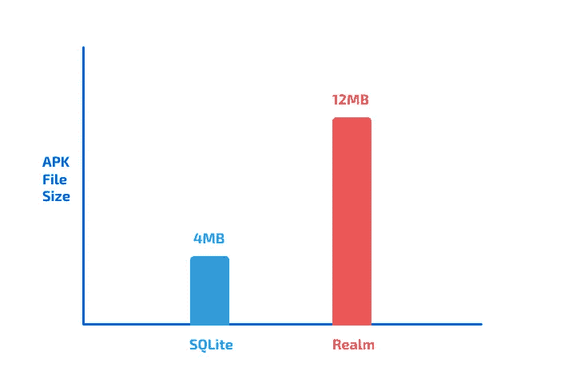
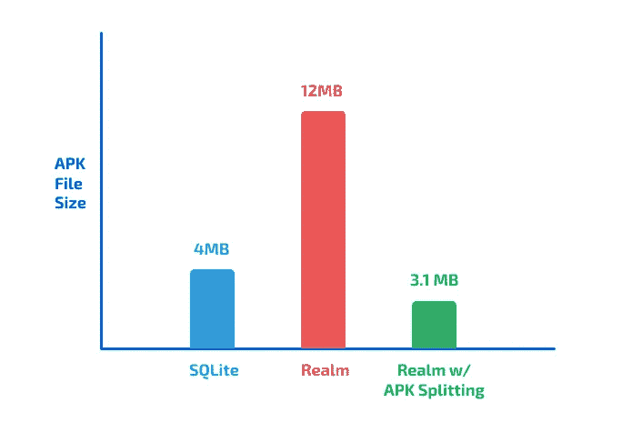

# 如何减少你的应用程序的 APK 大小，即使你使用 Realm

> 原文：<https://betterprogramming.pub/when-using-realm-for-android-makes-your-app-heavy-93c56c0d1c98>

## 轻薄的应用程序意味着更快的下载速度，这意味着更快乐的用户

图片来自官网: [realm.io](http://realm.io)

这篇文章是写给那些听说过或者一直在他们的 Android 应用中使用 Realm Database 的开发者的。

这是一个教程，旨在帮助你以一种比平常占用更少空间的方式设置你的 Android 项目。

在这篇文章中，我将把我的应用程序 [SilverScreener](https://play.google.com/store/apps/details?id=bapspatil.silverscreener) 作为一个案例研究。

您可以在 Github 上找到源代码:

 [## bapspatil/银屏

### 一个功能丰富的电影指南应用程序。

github.com](https://github.com/bapspatil/SilverScreener) 

# 王国之前的时代…

让我们回到我在应用程序中实现一个普通、无聊的 [**SQLite 数据库**](https://developer.android.com/training/data-storage/sqlite) 的时候。该应用的 APK 大小为 **4MB** 。

但是正如你们大多数人所知，编写 SQLite 数据库是非常无聊的，并且包含许多样板代码。改变数据库模式意味着在代码的其他部分也要做很多改变。

# 进入，领域

当我第一次从 Reddit 上的某个人那里听说 Realm 时，我被它的设置和运行数据库的简单程度震惊了，它甚至附带了云同步功能！很容易对数据库模式进行修改，而不必修改我已经编写的大部分代码。

执行 CRUD 操作非常简单快捷。领域代码的每一行都很容易阅读和理解，即使对新手来说也是如此。使用线程也很容易。数据库加密？只要多写两行代码就大功告成了！

当然，现在这篇文章既不是 Realm 的广告，也不是 Realm 的教程。所以让我们继续讨论使用 Realm 的问题。

# 境界怎么了？

一旦我在我的应用程序中添加了 Realm 的依赖项，设置了 Realm，并删除了所有 SQLite 代码，我的应用程序的 APK 大小从 **4MB** 增加到了 **12MB** ！现在，对于像我这样的简单应用程序，这种差异可能不是很多。但是，如果您的应用程序有一个包含许多实体的巨大数据库，会怎么样呢？增量会高得多。

SQLite 与 Realm: APK 规模比较

# 原因

Android 手机的处理器支持以下架构:

*   `x86`
*   `x86_64`
*   `armeabi-v7a`
*   `arm64-v8a`
*   `armeabi`(已废弃)
*   `mips`(过时)
*   `mips64`(已废弃)

当您构建应用程序的 APK 时，领域库会针对所有这些架构进行编译。这就是 APK 尺寸如此巨大的原因。

Android Studio 正在开发的 APK 拥有上述所有架构的*原生领域代码。但是你的用户的手机只需要一个应用程序，这个应用程序有他们处理器架构的本地代码。他们不需要为所有架构编译 Realm 的应用程序。那只会增加他们必须从 Play Store 下载的应用程序的大小。*

# 解决方案

这可以通过两种方式实现:

1.  **ABI 滤波器**(不太有效)
2.  **APK 劈**(更有效)

为了简洁起见，在本文中，我将只讨论 APK 分裂。这就是它的真正含义:

*APK 拆分是为你的应用构建多个特定于每个架构的 APK。*

这可以在你的 Android 项目的 app 级`build.gradle`文件中完成。

由于`armeabi`、`mips`和`mips64`架构现在已经过时，让我们专注于为`x86,`、`armeabi-v7a`和`arm64-v8a`架构构建单独的 apk。

## 如果您正在为需要上传到 Play Store 的应用程序执行此操作:

由于将生成多个 apk，因此所有 apk 的版本代码需要不同，因为 Google Play 控制台不允许您上传具有相同版本代码的 apk。

因此，如果你的单个 APK 的当前版本代码是 1，那么你的具有多个 apk 的应用的下一个版本不应该是 2 ( `x86`)、3 ( `x86_64`)、4 ( `armeabi-v7a`)和 5 ( `arm64-v8a`)。这是一种不好的做法，对你来说会更难管理。

相反，最好有一个巨大的十进制数，并为每个架构分配“代码”，如下所示:

*   `x86` : 0
*   `x86_64` : 1
*   `armeabi-v7a` : 2
*   `arm64-v8a` : 3

然后，您的应用程序的版本代码将看起来像 2000 ( `x86`)、2001 ( `x86_64`)、2002( `armeabi-v7a`)和 2003( `arm64-v8a`)，下一个版本代码将是 3000、3001、3002 和 3003。你明白了。

## 现在，让我们进入实际部分，深入我们的应用程序级`build.gradle`文件:

下面是您的应用程序级`build.gradle`文件，启用了 APK 分割应该是什么样子:

现在，生成您的新 apk，您应该会看到单个的、特定于体系结构的 apk 的大小显著减小！

您可以将生成的 4 个 apk 上传到 Google Play 控制台，因为它们都有不同的版本代码。

用户将只能从 Play Store 下载特定于他们手机架构的 APK 版本，这一切都是在幕后进行的，这要感谢 Google Play 控制台的魔力。

最精彩的部分？我的应用 SilverScreener 的 APK 大小现在是 **3.1MB** ！

以下是 APK 拆分前后的对比:

SQLite vs Realm vs 带 APK 分裂的 Realm:APK 大小比较

# 外卖

Realm 是一个很棒的数据库，但它也是一个显著增加 APK 大小的数据库。

继续，开始在你的应用程序中使用 APK 分裂，而不影响文件大小。