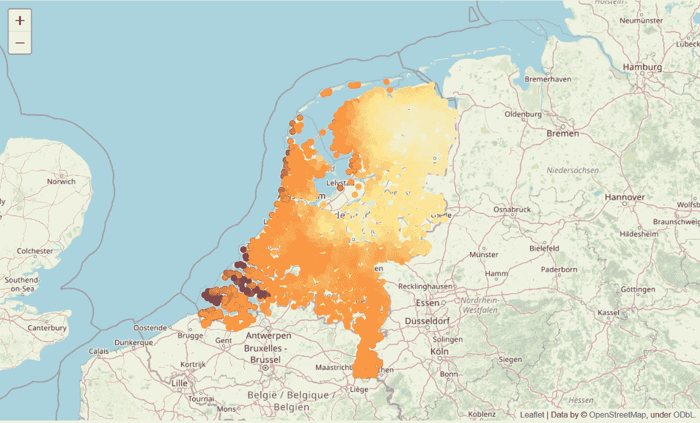
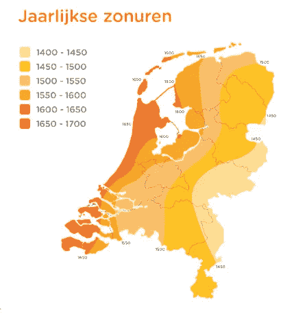

# 一个国家哪里的太阳能电池板产量最高？

> 原文：<https://betterprogramming.pub/where-do-solar-panels-yield-the-most-in-a-country-7e21d56cf4e4>

## 太阳能电池板的产量在全国并不一致。荷兰哪里的产量最高？

照片由[乔纳森·博尔巴](https://unsplash.com/@jonathanborba?utm_source=medium&utm_medium=referral)在 [Unsplash](https://unsplash.com?utm_source=medium&utm_medium=referral) 上拍摄

太阳能电池板的效率在很大程度上取决于日照时间。这个数字各地不一样。但它也与一天中的什么时间和一年中的什么部分有阳光照射有关。这两个因素决定了太阳辐射的功率，从而决定了发电量。

在这篇文章中，介绍了一个计算方法来确定荷兰最适合居住的地方。如果太阳能电池板的效率是唯一的标准。可能不是，但是做计算还是很有趣的。

# 查找所有地点

我们需要计算全国不同地点的太阳能电池板发电量。我们可以在全国范围内使用一个边界框，并生成一个位置网格。这种方法将在德国和比利时的海里增加许多位置。由于我们只对荷兰感兴趣，我将使用该国所有地方的列表，并以此作为计算的基础。

国家 CBS(荷兰统计局)可以获得所有地方的列表。CBS 提供的所有数据都可以下载。为了简化下载，可以使用一个名为[CBS data](https://github.com/J535D165/cbsodata)的 Python 包。搜索 CBS 网站( [statline](https://opendata.cbs.nl/#/CBS/nl/) )，我们在数据集中找到 ID 为`84992NED`的所有地方。

使用正确的工具，很容易获得数据帧形式的表:

第 5 行从 CBS 下载表格，并将其转换为 Pandas 数据帧(该方法以 JSON 格式返回数据)。我们只对列`Woonplaatsen`和`Naam_2`中的地名感兴趣，所以我们只保留这两列，并在数据帧`places`中将它们合并成一列(第 6 -7 行)。

## 地理编码地点

现在我们有了这个国家的所有地方，我们需要对它们进行地理编码，以确定纬度和经度。这可以通过 [OpenStreetMap](http://nominatim.openstreetmap.org) 的搜索 API 来完成。这是一个 OSM 搜索引擎的调试界面。在之前的项目中，我已经有了对一个<街道、城市、国家>元组进行地理编码的代码，所以围绕这个函数的一个简单包装器(只需要一个城市名)就足够了:

`get_lat_long_city`方法以两个独立的值返回该地点的纬度、经度位置。第 29 行使用 dataframe 的`map`函数调用将`name`列作为参数的`get_lat_long_city`方法。使用`zip`函数，它们被插入到两个新列中。如果同一个位置有重复的名称，重复的地理位置将被删除。

## 确定太阳能电池板性能

在我的上一篇文章[太阳能电池板发电分析](https://towardsdatascience.com/solar-panel-power-generation-analysis-7011cc078900)中，我描述了用于太阳能电池板计算的 [pvlib](https://pvlib-python.readthedocs.io/en/stable/) 库的用法。对于此分析，我们将计算所有位置的 1 KW 太阳能电池板平躺在地面上，面向南方时产生的功率。我们在所有地点都使用这种配置，这样我们就可以比较结果。

数据帧使用生成的功率扩展，如下所示:

`obtain_panel_power_data`与上一篇文章中的相同。`obtain_power_for_location`是一个只需要地理位置的包装器，默认为提到的太阳能电池板(平面)。第 25 行为每一行调用该方法，并将结果存储在新列'`P`'中。使用一年(2020 年)的发电量。

## 标绘结果

所以现在我们有了地理位置和一年的发电量。最后一步是将它绘制在地图上。[叶子](https://python-visualization.github.io/folium/)让用 Python 绘制地图变得简单。我们将用色标标出所有位置，以显示产生的能量。要将产生的能量转换为色标，我们需要将其归一化到范围[0，1](第 6–7 行)。这可以通过 matplotlib 映射到色标。为此，我们将使用黄色到红色的标度(第 10-14 行)。

计算地理位置和颜色后，可以将它们绘制到地图上(第 20-24 行):

将范围映射到色标会产生一个需要转换为 RGB 的四倍值(第 13 行)。因为第四个值是 alpha 通道，所以我们不需要它。

此代码会导致以下绘图:

太阳能电池板效率(图片由作者提供)

效率最高的在泽兰(Zoutelande)；德伦特最低。(Aa en Hunze)。相差 20%。比我想象的要多得多。

本文开头已经提到日照量是一个关键因素。这和每年日照时数的地图是一样的吗？

Jaarlijkse zonuren(图片来源:[联合消费者](https://www.unitedconsumers.com/energie/zonnepanelen/opbrengst-zonuren-nederland.jsp)

这些地图上的高度大致相等，但特别是在北方，差异是显著的。日照时数比东部高，但发电量较低。

# 结论

当你搬到西南部时，你的太阳能电池板会喜欢你的。大概是海风的缘故，阳光更多的照射在海岸线周围。但这可能不会影响你搬到哪里。

本文的目标是展示一些方便的包和 API(CBS odata、OSM、pvlib 和 follow)可以非常容易地洞察地理数据。目标是启发你做出自己的见解。

我希望你喜欢这篇文章。要获得更多灵感，请查看我的其他文章:

*   [太阳能电池板发电分析](https://towardsdatascience.com/solar-panel-power-generation-analysis-7011cc078900)
*   [对 CSV 文件中的列执行功能](https://towardsdev.com/perform-a-function-on-columns-in-a-csv-file-a889ef02ca03)
*   从你的活动跟踪器的日志中创建一个热图
*   [使用 Python 实现并行 web 请求](https://towardsdatascience.com/parallel-web-requests-in-python-4d30cc7b8989)
*   [所有公共交通工具都通向乌得勒支，而不是罗马](https://towardsdatascience.com/all-public-transport-leads-to-utrecht-not-rome-bb9674600e81)

*免责声明:本文包含的观点和看法仅归作者所有。*