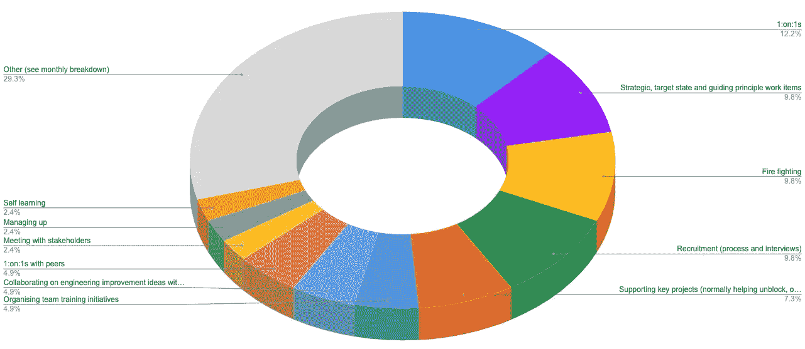
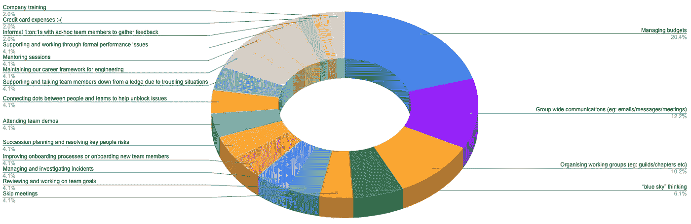

# 一个软件工程主管把时间投资在哪里？

> 原文：<https://betterprogramming.pub/where-does-a-head-of-software-engineering-role-invest-its-time-bd8b796d50ee>

## 基于我如何投入时间领导一个由 15 个团队约 125 名工程师组成的团队

在 [Unsplash](https://unsplash.com?utm_source=medium&utm_medium=referral) 上[空中聚焦](https://unsplash.com/@airfocus?utm_source=medium&utm_medium=referral)拍摄的照片

软件工程主管的角色在不同的组织中看起来是不同的。这是由于团队规模、组织结构、直接经理的偏好以及已经存在的辅助角色。

这不是一份朝九晚五的工作，但这也不意味着它是一周 70 小时的工作。当一个角色领导越来越大的团队时，它被拉向许多方向，这可能会令人筋疲力尽。需要在日常工作、战略工作、学习时间以及个人时间之间找到平衡。

在过去的两个季度中，我跟踪了我在领导一个由 15 个团队的 125 名工程师组成的团队时投入的时间。为什么？我很好奇我的时间到底花在了哪里(除了直觉)，最终，我把时间投入到了正确的领域。我决定写博客，有两个原因:

*   让有兴趣成为软件工程主管的人，了解这个角色可能会是什么样子。
*   开始一个对话，讨论一个软件工程负责人还应该在哪些方面投入时间(或不投入时间)。

# 角色的责任

首先，让我们讨论一下软件工程主管角色的成果。我把它分成三个部分:

## 战略的

*   确保团队和更广泛的工程团队有一个技术目标状态，这样每个人都朝着一个共同的北极星前进
*   确保指导性的工程原则得到定义、协作和了解，这样团队可以在没有混乱(或减少混乱)的情况下进行扩展
*   促进目标设定，以便团队了解如何衡量他们
*   识别和提升工程实践以提高团队效率
*   协调产品和工程之间的成果和路线图
*   定义工程度量来衡量团队的成功

## 人

*   指导和训练工程领导者，使他们能够在其职责范围内成长，同时传递组织价值
*   专注于识别关键人员风险和不必要的知识孤岛，并帮助解决
*   确保听取所有工程团队成员的意见，并切实实施相关改进
*   在相关和可能的情况下实施继任计划
*   确保个人在其角色中发挥作用并接受挑战

## 组

*   实施流程以鼓励团队层面的[决策](https://medium.com/@dionbeetson/empowering-software-engineering-teams-8158ac5a93e)。
*   简化招聘和入职流程(并成为流程的一部分)
*   成为工程团队在组织中的代言人(并指导团队中的领导者也这样做)
*   确定团队内部的差距和弱点，并推动这些领域的提升
*   发起或管理跨团队知识共享和协作的工作组
*   努力在团队之间建立联系和一致性，并减少不必要的孤岛
*   管理您团队内的升级，或进入您的团队(如果您无法控制升级，这可能是最累人的任务之一)

# 时间都花在哪里了？

有了上面的细分定义，作为软件工程的负责人，一周和一个月会是什么样子？

声明:我忽略了年度项目，如财政预算规划、财政年度正式绩效对话等…

## 每周分解(平均 40 小时)

*   5 小时 1:开:1 秒
*   战略、目标状态和指导原则工作项目 4 小时
*   4 个小时的灭火
*   4 小时的招聘(流程和面试)
*   3 小时支持关键项目(通常帮助疏通或推进项目)
*   2 小时组织团队培训活动
*   与团队成员就工程改进想法合作 2 小时
*   与同行进行 2 个小时的一对一交流
*   与利益相关方的 1 小时会议
*   1 小时管理
*   1 小时自学
*   12 小时‘其他’(见下面的每月细分)

在过去的 6 个月里，招聘波动很大，所以我取了一个平均值。除此之外，出于显而易见的原因，一些招聘会在下班后进行。

## 每月细目

每周细目中的 12 小时“其他”相当于每月约 50 小时，细分如下。

*   10 小时管理预算
*   6 小时用于集团范围的沟通(例如:电子邮件/消息/会议)
*   5 小时组织工作组(例如:行会/分会等)
*   3 小时的“蓝天”思考
*   两个小时的会议
*   2 小时回顾和制定团队目标
*   2 小时管理和调查事件
*   2 小时改进入职流程或新团队成员入职
*   2 小时的继任计划和解决关键人员风险
*   2 小时参加团队演示
*   2 小时连接人员和团队，帮助解决问题
*   2 个小时支持和说服团队成员从困境中下来
*   2 小时维护我们的工程职业框架
*   2 小时的辅导课程
*   2 小时支持和解决正式的绩效问题
*   与临时团队成员进行 1 小时的非正式一对一会谈，以收集反馈
*   1 小时刷卡消费:-(
*   1 小时的公司培训

# 从以上数据中我了解到了什么？

我花在消防任务上的时间比我想的要多。这些时间最好用在推动行动上。我现在的目标是在接下来的两个季度中减少 50%。

我一直在管理团队财务上花费比我想的更多的时间。我从事的一些工作可以实现为自助服务功能，以及自动化手动报告，我已经推迟了多年。虽然我预计财年预算规划会投入大量时间，但我的目标是将这个时间从每月 10 个小时减少到 4 个小时。

我需要增加花在管理上的时间。为什么？尽管每个人都有责任成为软件工程的代言人，但责任不仅仅止于我的角色。我在组织中分享团队胜利、支持团队、分享关键项目的进展、分享即将到来的路线图计划的机会越多，整个组织对软件工程团队的看法就越好。这还支持在软件工程团队和更广泛的组织之间建立信任。我的目标是将这个时间增加两倍，达到每周 3 小时，其中包括指导其他软件领导者如何做同样的事情。

我希望在管理工程范围的工作组上花费的时间有小幅增加。我的目标是增加到 7 小时。也有机会将更多的软件领导者带入核心圈子，领导更多的团队。

虽然我想把更多的工作时间分配给自学，但我已经意识到这将继续是我业余时间的投资。目前，我的目标是(而且经常)在工作之外每周花 6 个小时自学。

我通过我的日历追踪我所做的一切——这是一个适合我的过程。它让我能够分析我每周和每月在这个博客上分享的时间投资，然而，它也让我能够为重要的工作项目划出时间，例如:

*   从事战略项目
*   自学时间
*   组织工作组

如果没有这种方法，我会发现我的日子被不太重要的会议填满了。当时间被封锁时，组织中的成员通常会尊重这一点。如果他们没有，也许要想想你是否在正确的组织里。

总之，当领导多个团队时，会有大量的环境变化，这与通常专注于领导特定团队的工程经理角色有很大不同。重要的是接受这一点，并改进你的日常工作方式，以确保你无情地保护你的时间。这将增加你获得更平衡角色的机会，使你能够将时间投入到长期战略计划和自我学习上，最终减少陷入日复一日的困境。

如果你是一个类似的软件领导角色，请随意分享你的观点。