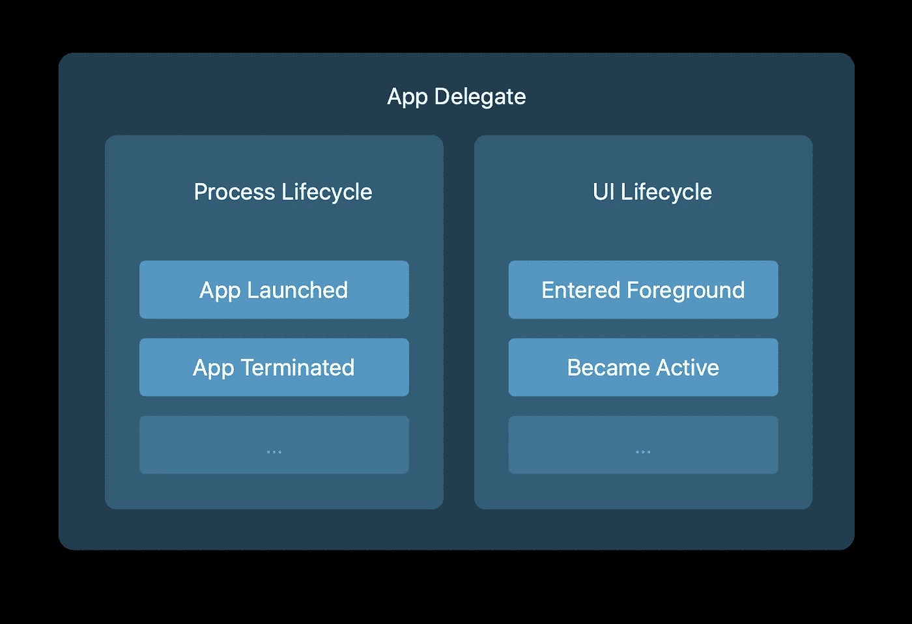
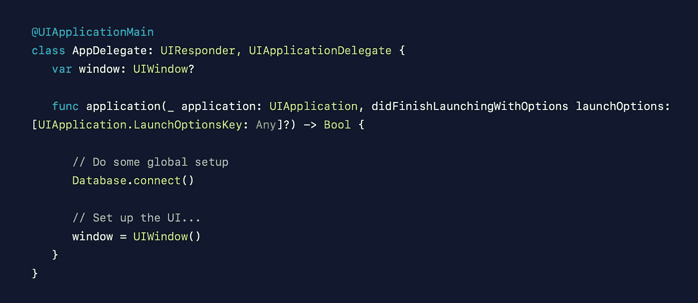
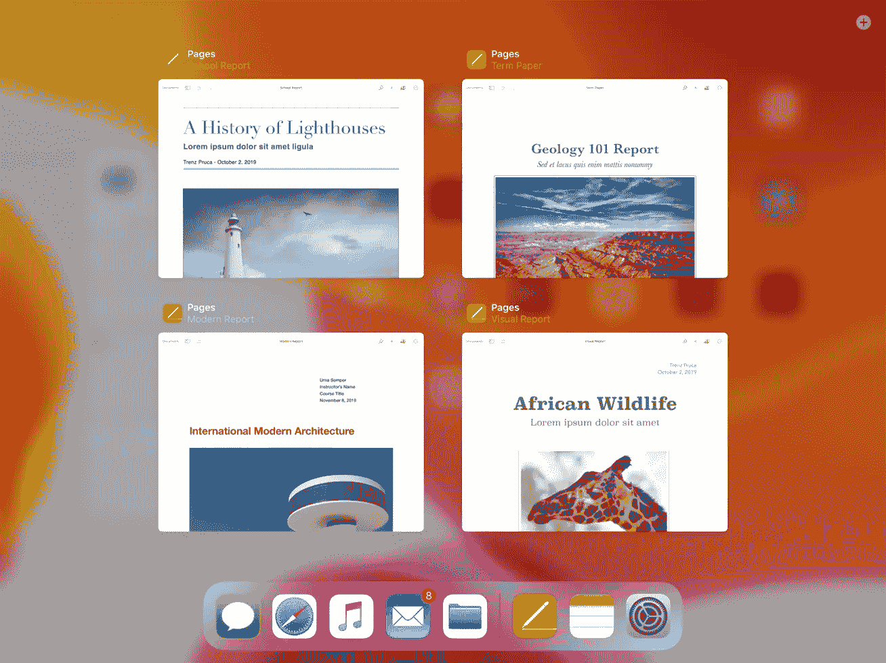
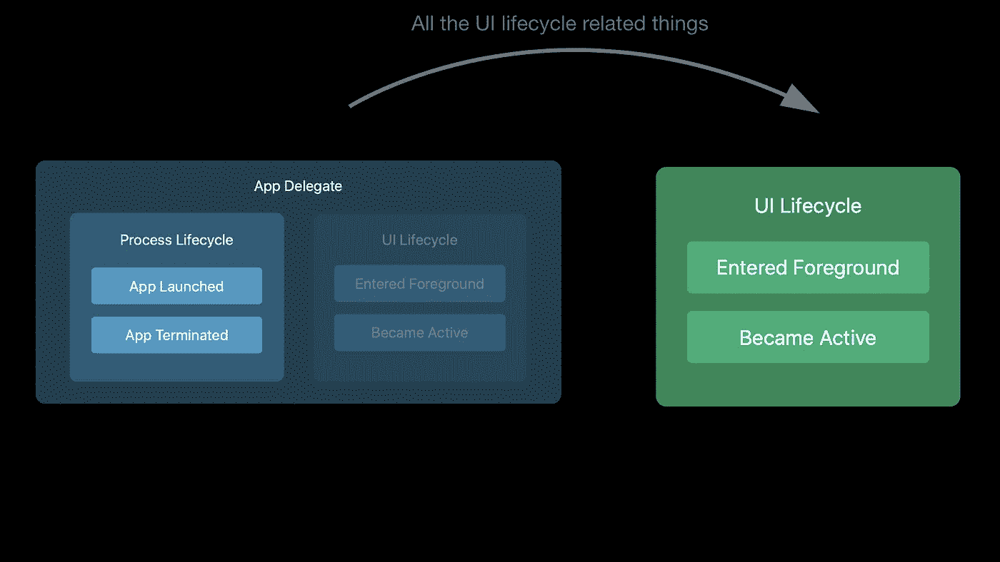
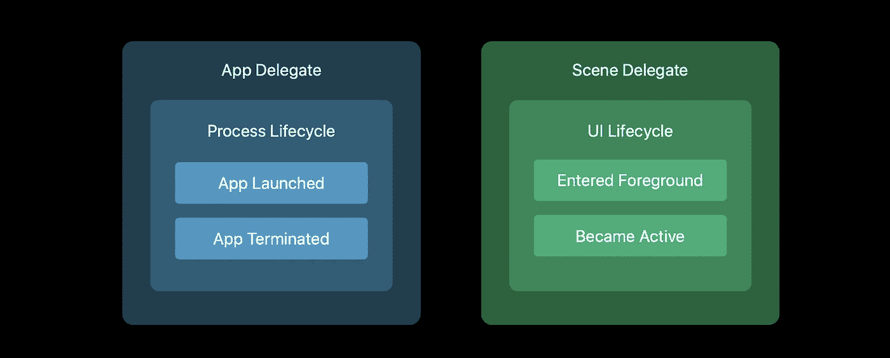

# SceneDelegate 来自哪里？

> 原文：<https://betterprogramming.pub/where-does-this-scenedelegate-come-from-fb93ed5cb49d>

## 首先是 AppDelegate，现在是 SceneDelegate

AppDelegate 的角色(图片由鹤山 Yodagama 提供)

先说一下 iOS 12 及之前版本中`AppDelegate`的一些角色和职责。`AppDelegate`有两个主要角色:

*   向应用程序通知进程级事件。当您的进程启动或即将终止时，系统会通知您的应用程序代表。
*   通知应用程序其用户界面的状态。通过`EnterForeground`和`willResignActive`等方法，系统会让你知道你的 UI 状态。

这在 iOS 12 和之前的版本中完全没问题，因为应用程序只有一个进程，也只有一个用户界面实例与之匹配。

`AppDelegate`在 iOS 12 及之前

`AppDelegate`在 iOS 12 中大概看起来是这样的(除了可能没这么短)。

当您完成启动选项时，您需要做几件事情。

*   您做一些一次性的、非 UI 的全局设置，比如连接到数据库或初始化您的数据结构。
*   你设置你的用户界面。

这在 12 及之前完全有效，但 iOS 13 的模式无效。为什么？

因为 iOS 13 及以上版本的应用只是共享一个进程(如 iOS 12 中)但可能有多个用户界面实例或场景会话(在 iPad 上，而不是在 iPhones 上)。

苹果平板电脑

苹果平板电脑

这意味着`AppDelegate`的职责需要改变一点。它仍然负责流程事件和生命周期，但不再负责与 UI 生命周期相关的任何事情。相反，这些都将由你的`UISceneDelegate`来处理。

那对你来说意味着什么？您过去在`AppDelegate`中进行的任何 UI 设置或拆卸工作现在都需要迁移到`SceneDelegate`中相应的方法。(IOs 12 I*↠*OS 13)——(设置你的应用的第一个视图控制器，称为*根视图控制器，*配置启动组件，比如日志和云服务。)

接下来:“[使用场景委托](https://medium.com/@yodagamaheshan/using-the-scenedelegate-21631ccaa137)”