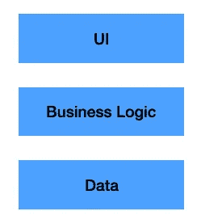
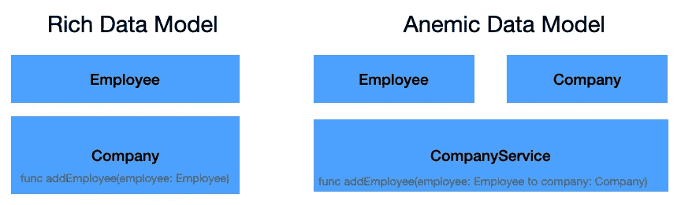
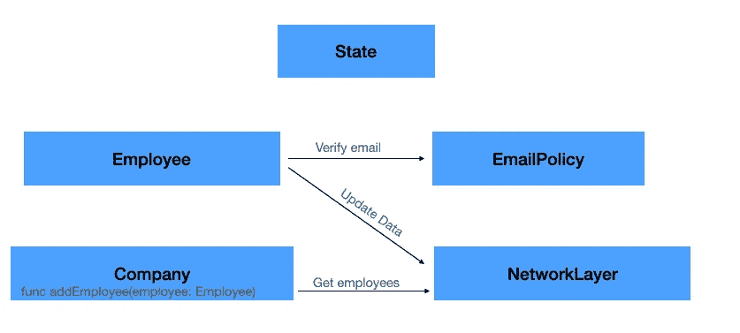

# 嘿应用开发者:我的逻辑在哪里？

> 原文：<https://betterprogramming.pub/where-is-my-logic-afbeb84ae3c6>

## 丰富的数据模型与贫乏的数据模型

“向我描述一下你的应用架构”。

“哦，这很容易。我用 MVVM。”

我总是说，应用程序的创建在其边缘更简单，但在内部非常复杂。

我的意思是，我们不仅知道如何创建出色的 UI，而且我们也一直在谈论它——swift UI/UI kit、MVVM、自动布局等等。有数以百万计的关于这些主题的教程和文章。

此外，底层也相对简单——数据和网络层基于我们都使用和喜爱的众所周知的模式。

但是我们如何处理我们的业务逻辑呢？如何处理呢？

# 商业逻辑到底是什么？

首先，让我们尝试与移动应用程序中的业务逻辑的真正含义保持一致。

一般来说，大多数项目都是由三层构成的——数据、业务逻辑和 UI。

使用 MVVM 设计模式是 UI 层的一部分，而不是业务逻辑。

那么，什么是业务逻辑的一部分呢？基本上，任何与数据操作、验证和处理相关的东西。

例如，如果我们需要创建一个特定的实体，验证其属性，并进行一些计算——这是业务逻辑的一部分。

业务逻辑层需要服务于 UI 层，并且基于数据层，数据层包含数据库和网络服务(以及更多的服务)。

我们需要考虑的另一件事是应用程序状态，我们将在后面讨论。

# 经理们来了

此时，您可能会想到您的项目，并记得您将自己的逻辑塞进了一个名为“`<entity Name>Manager`”/`<entity Name>Logic`/`<entity Name>Service`/`<entity Name>Handler`的专用类中。

不要不好意思。我们都经历过(现在仍然是！).

我们说服自己`<entity Name>Service`比`<entity Name>Manager`好，因为它是一个`service`。(“不一样”)。

抱歉，伙计，但这完全是一回事(“我们年轻，需要钱”)。

我们这样做，并剥夺我们的实体可能有的任何逻辑。

别担心。这种(反)模式实际上有一个名字——它被称为“贫血数据模型”，这是移动开发人员中的一种典型设计模式。

所以——把逻辑放在一个叫做“贫血数据模型”的“管理器”中，当逻辑是实体类的一部分时，就叫做“富数据模型”。

很多 iOS 开发者更喜欢“贫血的数据模型”，我们深究一下就能明白为什么了。

# 贫血数据模型

ADM 设计模式显然有其优点。让我们列举其中的一些。

关注点分离——当我们将逻辑从实体中提取到一个专用的类中时，我们执行了项目关注点的另一次分离。在某种程度上，任何这样的分离都会带来更多的灵活性和更小的副作用。

依赖关系更简单——如果实体彼此不“了解”,那么它们之间的耦合也更少。唯一协调它们的类是“服务”类。

这种方法使得处理依赖关系更加易于管理，并且可以帮助我们的项目更加模块化。

状态处理——现在我们有了一个存储逻辑的中心位置，它也可以动态地处理状态。

当我们的实体内部有逻辑时，并不是说我们没有解决方案。只是有了服务类就简单多了。

# 贫血数据模型的问题

贫血数据模型看起来简单直观，但并不意味着它没有危害。

这种方法有一个致命的缺点——“服务”可以以他们想要的方式操纵实体，这也意味着应用程序上的任何类都可以这样做。

想想看——你的实体是完全可变和脆弱的。

请看下面的代码:

现在，这是一个遗憾。我们想要分离我们的逻辑并编写干净的代码，最终，我们在代码中制造了漏洞。

原因是拥有一个服务需要我们使我们的实体对于外部变化是可变的。

那么，有什么解决办法呢？

# 扩展我们的规则

关键是平衡。

学校对此没有答案，但我们可以为如何分离我们的逻辑建立新的规则。

数据操作——数据操作应该始终是实体职责的一部分。我们需要努力使我们的实体尽可能不可变，以防止外部变化。

验证—验证逻辑可以位于名为“Policy”的单独类中。原因是通常情况下，验证不需要数据操作，并且可以在不同的实体之间共享。

如果共享逻辑是必不可少的，那么使用泛型和协议可能是一个好的解决方案。

网络——现在，这是一个棘手的问题，取决于你如何管理数据传输。我们一致认为管理网络请求的单例是一个好主意。但是谁叫那是单身呢？嗯，如果一个实体需要执行一个网络请求来获取相关数据或更新它的更改，它可以调用网络层来执行这些操作。

但是，如果我们有一些一次更新几个项目的逻辑，比如某种通用的同步机制，使用“同步管理器”可能是个好主意。

状态——应用程序状态不是实体的一部分。一种解决方案是在一个中心位置管理状态——一种包含动作和 Redux 样式。

即使 Redux 与 RDM 或 ADM 无关，它也是我们在项目中需要进行的另一项分离。

# 结论

遵循好的模式永远是最好的，但不要盲目追随。对于架构问题，我们没有现成的答案，因为分色取决于您的应用需求。

放聪明点！