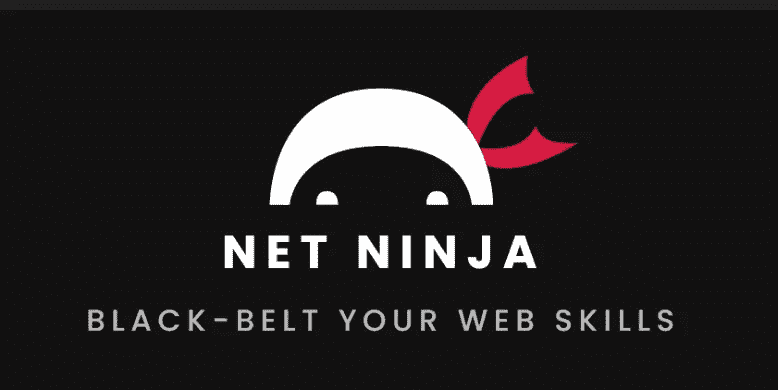
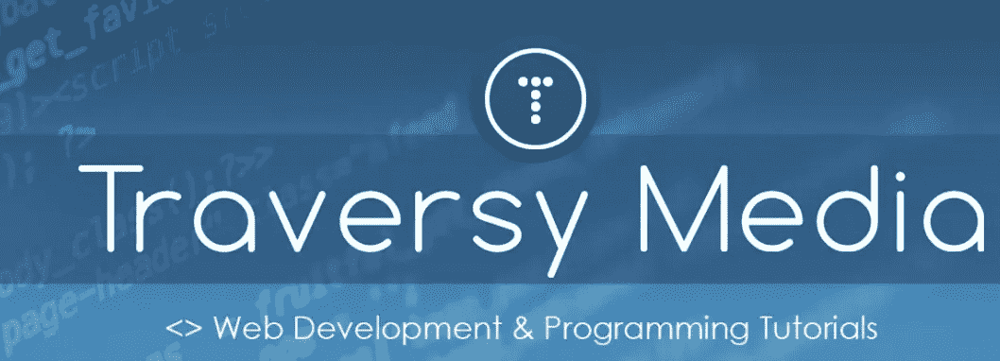
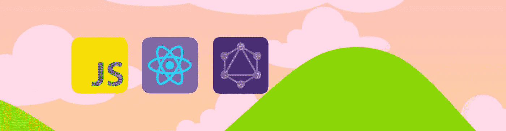
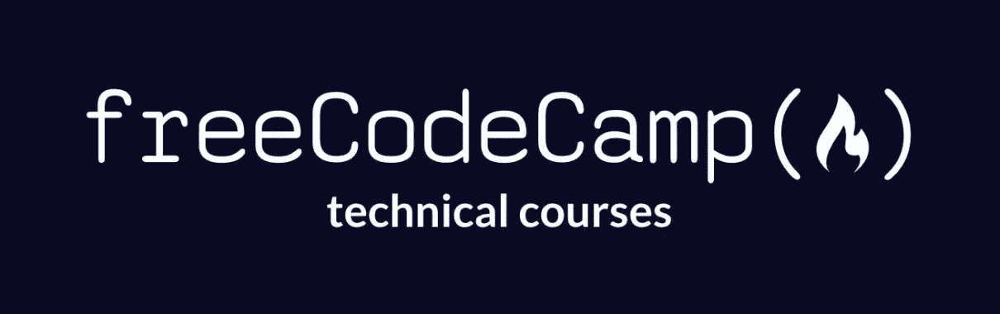

# 在 YouTube 上从哪里开始学习 JavaScript

> 原文：<https://betterprogramming.pub/where-to-start-learning-to-code-on-youtube-c1e0a9853851>

## *YouTube 上的初级 JavaScript 编程资源集合*

提高你的网络开发技能。演职员表:[穆罕纳德·阿贾恩](https://unsplash.com/@isword)

这个是面向初学者的。你是否在想:“开始制作网站的最好方法是什么？”别再看了。作为一个正在康复的教程迷，我收集了一些我最喜欢的学习初级(和中级)JavaScript 的渠道(还有 [React](https://reactjs.org/docs/getting-started.html) )。

注意:当你开始编码时，不要只看教程。事实上，尽快把它们留在身后。

对您想要创建的项目有一个愿景，并在学习 JavaScript 语言的来龙去脉的同时开始创建它们。我保证你会更快地处理你所学的东西，并且你会记住更多你所学的东西。

如果您有兴趣开始前端开发人员的职业生涯，但不知道从哪里开始，有大量的信息在您的指尖。YouTube 提供了大量的资源。

TL；博士，只是链接:

*   [免费代码营](https://www.youtube.com/channel/UC8butISFwT-Wl7EV0hUK0BQ)
*   [网络忍者](https://www.youtube.com/channel/UCW5YeuERMmlnqo4oq8vwUpg)
*   [移动媒体](https://www.youtube.com/channel/UC29ju8bIPH5as8OGnQzwJyA)
*   阿尼亚·库博夫
*   [聪明的程序员](https://www.youtube.com/channel/UCqrILQNl5Ed9Dz6CGMyvMTQ)

如果你想看我推荐的一些视频，请向前滚动。

# 网络忍者

[来源](https://www.youtube.com/c/TheNetNinja/featured)

他为什么好？

他保持他的内容新鲜，总是有新的东西要学。在你完成前一门课程之前，他已经准备好了另一门课程。他以一种古怪有趣的方式传授知识。

该频道由现代 JavaScript 的基础和更适合基于项目的学习的系列组成，例如使用一种新的(有点)web 技术栈，如 [JAMStack](https://jamstack.org/what-is-jamstack/) 。

我最喜欢的一些:

*   [现代 Javascript](https://www.youtube.com/watch?v=iWOYAxlnaww&list=PL4cUxeGkcC9haFPT7J25Q9GRB_ZkFrQAc)
*   [Next.js &心满意足](https://www.youtube.com/watch?v=m9mNsYJbkNg&list=PL4cUxeGkcC9jClk8wl1yJcN3Zlrr8YSA1)
*   [带有帧运动的动画](https://www.youtube.com/watch?v=2V1WK-3HQNk&list=PL4cUxeGkcC9iHDnQfTHEVVceOEBsOf07i)

# 布拉德·特拉弗斯

[来源](https://www.youtube.com/c/TraversyMedia/featured)

他为什么好？

Brad 是 YouTube web 开发社区的创始人之一。他从事这项工作已经有一段时间了，他收集的教程从 WordPress 和 PHP 教程到 JavaScript，一直到现有的和更新的花哨框架和技术:React、Vue 和 Svelte。

我最喜欢的一些:

*   看看布拉德的普通项目 JavaScript 播放列表，这是纯金的
*   [2021 年的网络发展——实用指南](https://www.youtube.com/watch?v=VfGW0Qiy2I0)
*   [自学软件开发指南](https://www.youtube.com/watch?v=J6rVaFzOEP8)
*   [React JS 速成班 2021](https://www.youtube.com/watch?v=w7ejDZ8SWv8)

# 阿尼亚·库博夫

[来源](https://www.youtube.com/c/AniaKub%C3%B3w/featured)

她为什么好？

她的内容是多才多艺的，她的表达是乐观和有感染力的，你一定会学到新的技能。她涉及的主题非常广泛，从向您展示 JavaScript 基础知识的 12 小时编码训练营，到更侧重于项目的教程，如游戏和其他类型的 web 开发项目。

我最喜欢的一些:

*   [Flappy Bird in React Native](https://www.youtube.com/watch?v=dhpjjAxKbHE)
*   [12HR+ YouTube 编码训练营](https://www.youtube.com/watch?v=Xm4BObh4MhI)
*   GraphQL 联盟加密应用(在我的待办事项列表上；))

# 自由代码营

[来源](https://www.youtube.com/channel/UC8butISFwT-Wl7EV0hUK0BQ)

为什么它们是好的？

Quincy Larson 创建了 FreeCodeCamp，这是一个非盈利组织，其明确的使命是提供一种完全免费的方式来教授社区如何编程。

在他们的网站上，他们提供令人难以置信的广泛的课程，涵盖编程的所有领域，从 Web 开发到数据科学，甚至是道德黑客的 T2。FreeCodeCamp 还在完成课程后颁发证书。

在 YouTube 上，他们有着巨大的影响力，为超过 400 万的用户提供服务。他们提供解释不同 JavaScript 技术基础的短视频，但最有价值的是大型项目的深入教程，通常由客座教师提供。

我最喜欢的一些:

*   [代码 15 React 项目](https://www.youtube.com/watch?v=a_7Z7C_JCyo)
*   [用 React Native，Firebase Firestore，Redux，Expo](https://www.youtube.com/watch?v=1hPgQWbWmEk) 构建 Instagram 克隆
*   [React / GraphQL 课程—构建社交媒体应用程序(MERNG Stack)](https://www.youtube.com/watch?v=n1mdAPFq2Os)

# 聪明的程序员

为什么它们是好的？

好吧，最后但不是最不重要的，我会结束这些家伙。他们发布的东西非常多产。如果你想以基于项目的方式开始学习编程，这个频道是必去的。但是记住他们的建议，过一会儿:[停止看教程。改为这样的代码。](https://www.youtube.com/watch?v=d01vkk3CYi0)

我最喜欢的一些:

*   [让我们用 REACT JS 为初学者构建一个全栈亚马逊克隆](https://www.youtube.com/watch?v=RDV3Z1KCBvo)
*   🔴[用 REACT JS 为初学者构建一个脸书克隆！](https://www.youtube.com/watch?v=B-kxUMHBxNo&t=1s)
*   诚然，ASMR 迪士尼+克隆并不适合所有人。

# 结论

暂时就这样了。出去，好好玩！观察、学习，绝对不要推迟开始编码！

如果你想要更多的互联网资源，你可以注册我的时事通讯。