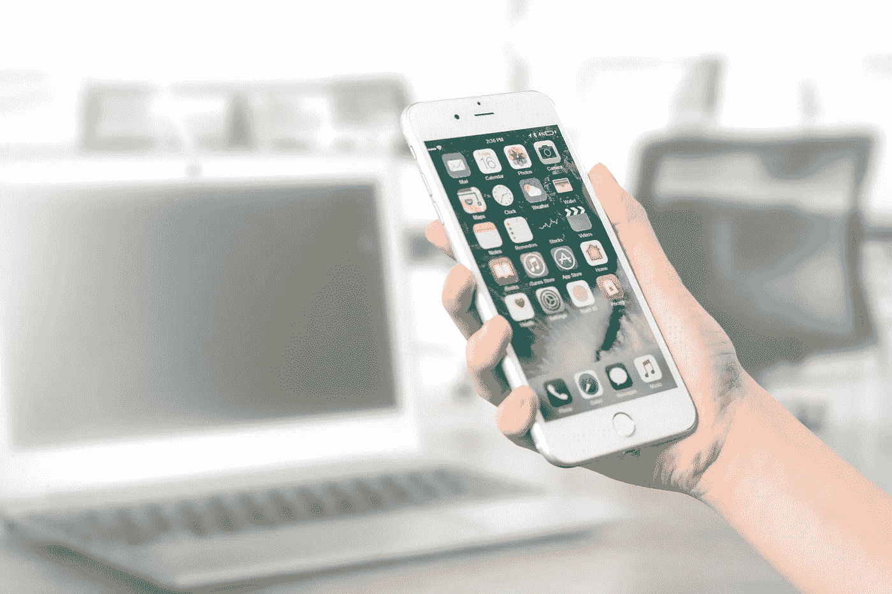
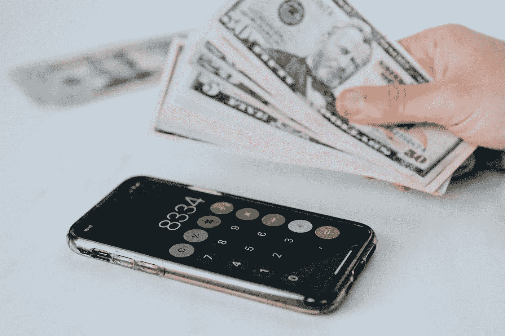
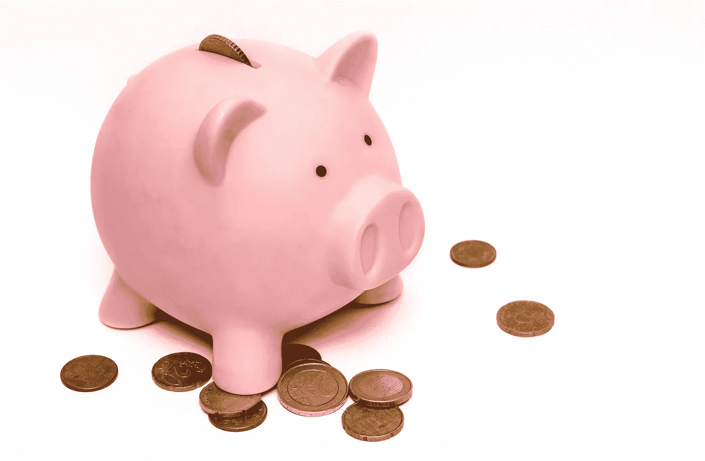

# 哪些应用绕过了苹果 30%的佣金

> 原文：<https://betterprogramming.pub/which-apps-bypass-apples-30-commission-6bc0c6aa9db>

## 苹果税并不适用于所有人，例外情况可能不是你所期望的

[PhotoMIX 公司](https://www.pexels.com/@wdnet?utm_content=attributionCopyText&utm_medium=referral&utm_source=pexels) | [Pexels](https://www.pexels.com/photo/person-holding-silver-iphone-7-887751/?utm_content=attributionCopyText&utm_medium=referral&utm_source=pexels)

苹果 30%的佣金，通常被称为“苹果税”，一直以来都存在于应用商店的应用程序中。然而，直到最近，当苹果 vs Epic/《我的世界》的法律战冲击主流媒体时，只有应用程序开发者听说过它。

最近，微软和 Spotify 等科技巨头与许多开发商和公司一起支持 epic 与苹果的(Epic)法律战。考虑到所有应用成本、订阅费和应用内购买都给苹果 30%的提成，这并不令人震惊。

虽然 Epic 试图绕过苹果的支付系统引发了近年来最激烈的企业技术摊牌之一，*苹果实际上确实允许一些公司避免支付 30%的佣金。*

有无数文章概述了 Epic 与苹果的法律之战，甚至有更多文章支持其中一方。在这一点上，众所周知，苹果从通过应用商店下载的所有应用(即所有 iOS 应用，因为苹果垄断了 iOS 应用商店)的所有支付中抽取 30%的佣金。

然而，鲜为人知的是，一些应用程序可以绕过这 30%的削减。是什么让这些应用如此特别，以至于苹果选择给它们一套不同的规则？

# 苹果什么时候申请收费？

根据苹果的规则，30%的佣金适用于所有“特定于 iOS 应用程序”的购买。(绝对不是最明确的指令！)

这里有一个简单的解释:如果购买允许使用 iOS 应用程序，或者增强应用程序本身的使用，苹果会收取费用。

因此，所有的应用商店购买和几乎所有的应用内购买都需要付费。比如你从 app store 买游戏，苹果就提成。此外，如果你购买更多子弹来玩堡垒之夜，或者在 Candy Crush 上购买更多生命，他们必须支付苹果税，因为这些款项都用于增强这种特定于应用程序的购买。

因此，虽然 Spotify 订阅(允许你在手机上播放音乐的应用程序)必须付费，但优步 rides 不收费(因为应用程序本身不是服务，而只是一个预订服务的平台)。

# 有哪些 app 免手续费

卡罗琳娜·格拉博斯卡 | [派克斯](https://www.pexels.com/photo/crop-faceless-person-with-cash-and-calculator-app-on-smartphone-4386292/?utm_content=attributionCopyText&utm_medium=referral&utm_source=pexels)

## 美食应用

和任何手机品牌一样，苹果的品牌本质上是基于方便和简单。说到方便和简单，作为顾客，我们依赖于通过手指滑动或点击按钮来订购快餐的能力。

所以想象一下，你不能在你的 iPhone 上做移动星巴克订单。或者你因为苹果税而无法下载麦当劳的应用程序。没有快餐的 iPhone 会毁掉苹果品牌。因此，食品应用——麦当劳、星巴克等——可以绕过苹果的佣金。

最终，我们的需求和钱包会直接进入苹果的钱包。

## 实物产品销售

当我们在 iPhones 上购买有形物品时——无论是亚马逊 Prime 发货、Indigo 移动应用程序上的一本书，还是介于两者之间的任何东西——我们是否也在支付苹果税的成本？

简而言之，答案是否定的。网络和手机的价格是一致的，因为没有产生额外的成本。

## 有形服务应用

任何在优步搭过车、在 Airbnb 上出租过房子、或者在 Turo 上借过车的人都知道，通过这些应用提供服务的佣金相当高。事实上，它们几乎完全符合苹果 30%的费用。

值得庆幸的是(为了你和顾客的钱包)，苹果不会在你已经支付的佣金之外收取额外的佣金。如上所述，这些都是苹果应用本身不通过 iOS 应用提供服务的例子。该应用程序只是让客户更容易使用这项服务。

因此，当你向朋友转账或将部分收入交给优步时，你可能需要向贝宝支付一小笔佣金，但苹果不收手续费。

# 如何避免缴纳苹果税

[突击摄影](https://www.pexels.com/@skitterphoto?utm_content=attributionCopyText&utm_medium=referral&utm_source=pexels) | [像素](https://www.pexels.com/photo/money-pink-coins-pig-9660/?utm_content=attributionCopyText&utm_medium=referral&utm_source=pexels)

## 在应用程序外强制订阅付款

虽然在你的 iOS 应用程序上购买订阅服务将被收取苹果税，但如果通过网络浏览器而不是苹果的支付系统进行支付，这些实际上是可以避免的。

你是否注意到有些应用程序不允许你在手机上订阅或续费，而是强迫你在网上购物？那大概是因为苹果税(当然还有 Google Play 的等价物)。

例如，如果你在他们的 iOS 应用程序上购买订阅，Spotify 只需向苹果公司纳税——如果你在网上购买，苹果公司(显然)不用缴税。Audible 要求您在将有声读物下载到 iOS 设备之前(免费)在线付费。

值得注意的是，只允许特定的变通方法。例如，订阅不是特定于应用程序的，可以在其他地方支付，因此苹果无法控制它们。然而，创建一个新的应用内支付系统，允许个人直接在 iOS 应用内进行金融交易，而无需向苹果支付，是一个大禁忌。我的意思是，我们看到了 Epic 的遭遇！

长话短说…小心点。除非你的名字是堡垒之夜，否则我不确定如果你被踢出 App Store，媒体会有多在意！

## 成为亚马逊

是的，没错。亚马逊是一家价值数十亿美元的公司，可能负担得起苹果税，但它以某种方式炮制了一项交易，减轻了苹果税的打击。

虽然苹果声称它平等对待所有应用程序开发者，但亚马逊和苹果达成了一项协议，亚马逊 Prime 订阅的苹果税仅为 15%——其他应用程序的一半。

我想成为一个全球性的商业和科技集团是值得的。难怪 Spotify 和其他流媒体服务在苹果税收战中坚定地站在 Epic 一边！