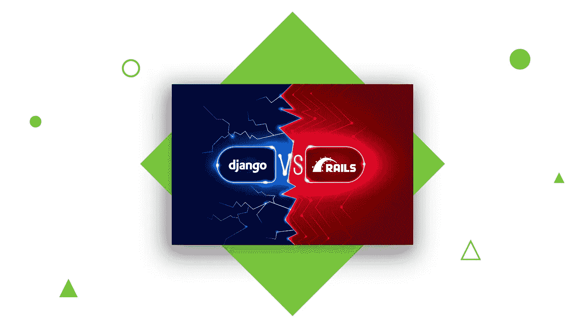
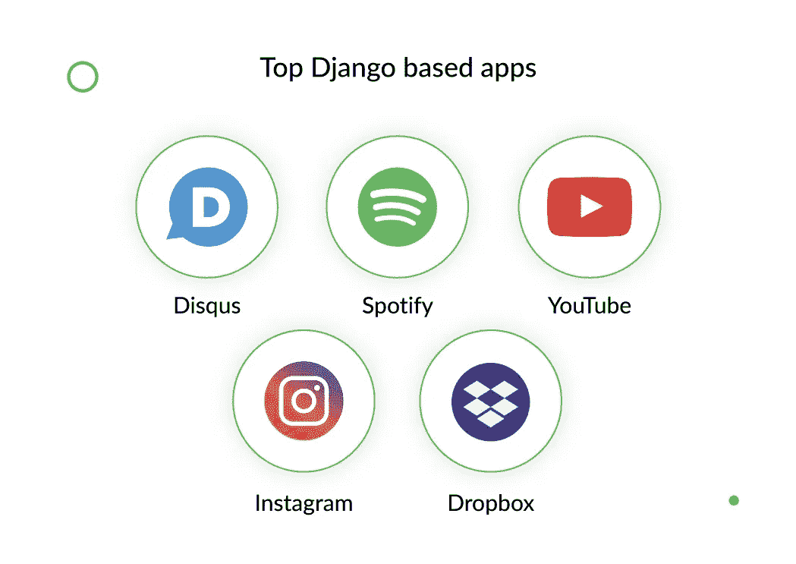
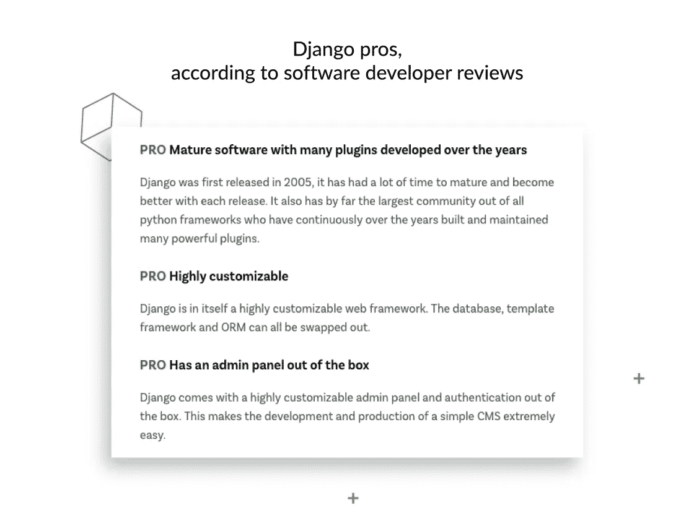
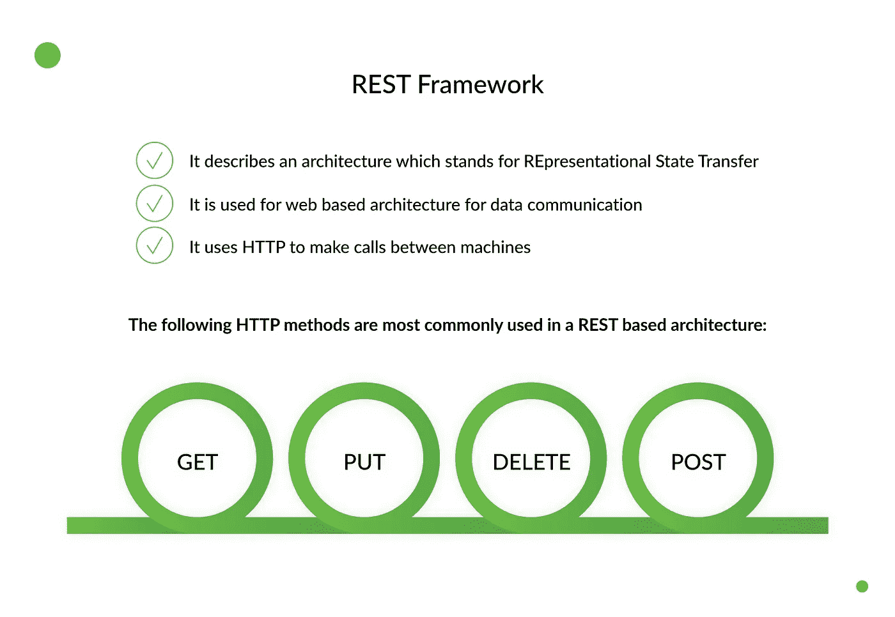
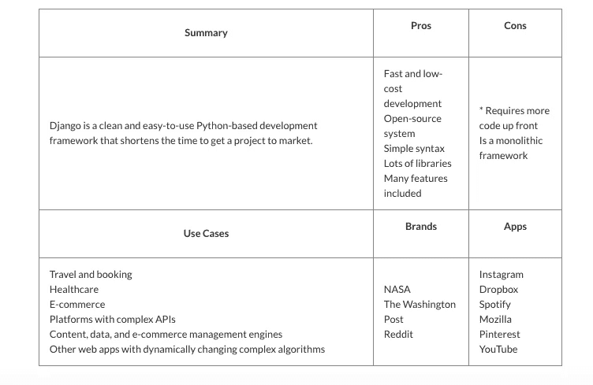
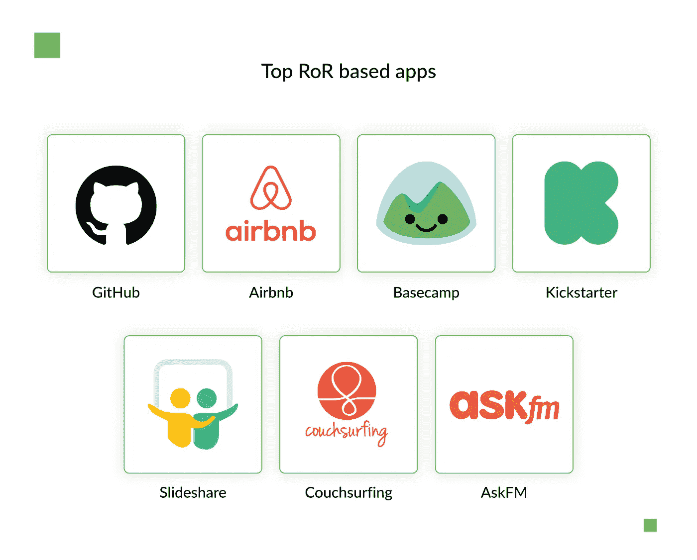
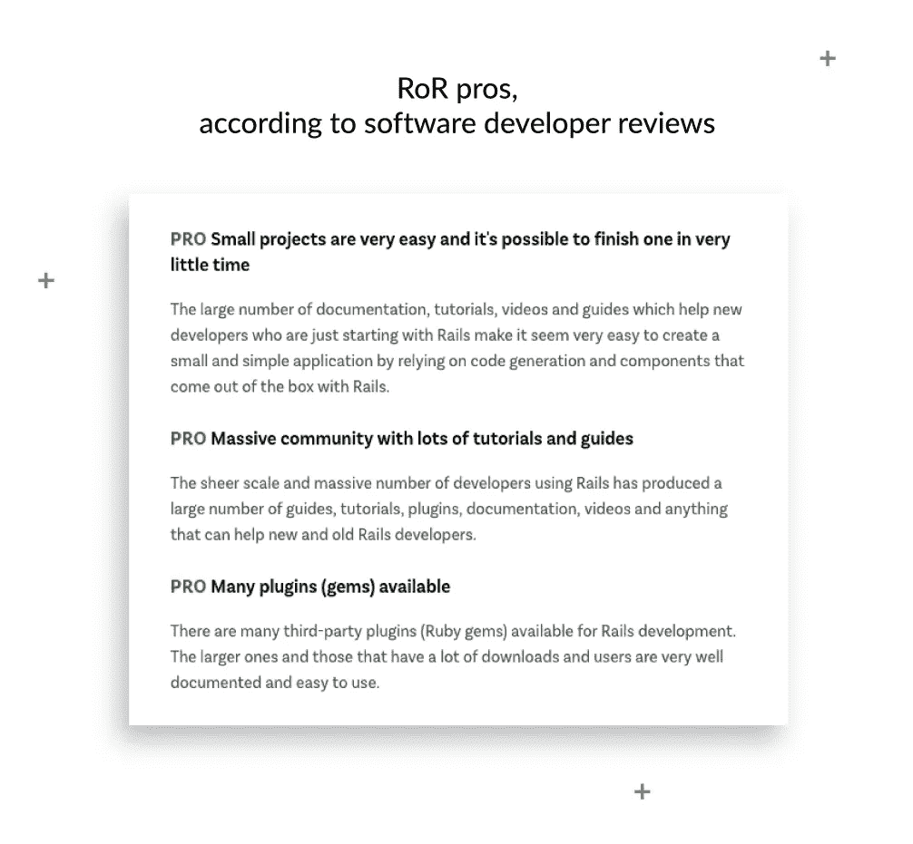
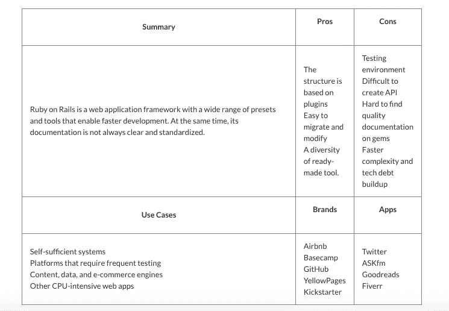
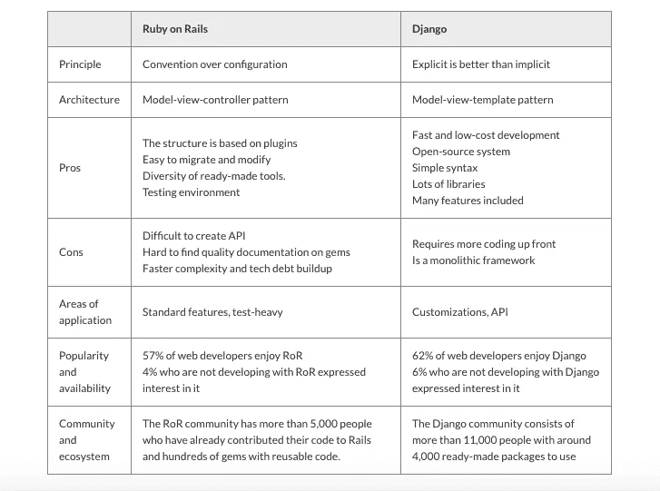

# 选择哪种框架:比较 Django 和 Ruby on Rails

> 原文：<https://betterprogramming.pub/which-framework-to-choose-comparing-django-vs-ruby-on-rails-21e40d92d981>

目前有超过 90 种网络开发框架。难怪很难选择最适合你的项目。尽管如此，至少有两个主要框架被当今的科技巨头广泛使用，而且理由充分。听说过 Django 或 Ruby on Rails 吗？如果两个 web 框架都相当不错，那么如何比较 Django 和 Ruby on Rails 来选择使用哪个进行 web 开发呢？

Instagram、YouTube、Spotify、Dropbox 以及我们日常使用的其他在线和基于应用的服务都是由 Django(一种 Python 编程语言框架)提供支持的。另一方面，Airbnb、彭博、Shopify 和其他领先公司使用 Ruby on Rails，这是一个 Ruby 编程语言框架。这两种语言都是为服务于 web 而创建的，并使 web 应用程序(包括移动 web 应用程序)成为可能。

在本文中，我们将比较这两种流行的框架。虽然 Django 和 Ruby on Rails 都很快且易于使用，但它们作为未来项目的开发框架各有利弊。

作为软件开发专业人员，我们发现比较 Django 和 Ruby on Rails 性能和速度的材料过于简单，因为速度和性能通常取决于每个项目的复杂性以及开发团队对各自技术的熟练程度。

我们的意思是说，即使 Python/Ruby/等。是解释型语言，对于与 web 框架相关的任务，在某些工作负载中速度较慢，但这并不重要。所以我们决定仔细看看它们的优缺点，以及用例来帮助您决定哪一个最适合您的需求。

# Django 的优点、缺点和用例

Django 是一个广泛使用的 Python web 开发框架。它是由 Adrian Holovaty 和 Simon Willison 在 2003 年秋天开发的，当时他们开始使用 Python 来构建应用程序。它从 Python 中获得了速度、安全性和可伸缩性。Pinterest Engineering，Mozilla，Udemy，NASA，Washington Post，以及其他强大的网站都依赖 Django。它为常见用例提供了最多的工具和库——例如，它的[认证](https://docs.djangoproject.com/en/dev/topics/auth/)、 [URL 路由、](https://docs.djangoproject.com/en/dev/topics/http/urls/)、[模板引擎](https://www.fullstackpython.com/object-relational-mappers-orms.html)、 (ORM)和[数据库模式迁移](https://docs.djangoproject.com/en/dev/topics/migrations/) (Django v.1.7+)。在接下来的部分，我们将讨论一些支持和反对 Django 的理由。

# Django Pros

有人说 Django 的优点多于缺点。让我们来看看它的主要优点:

## 快速低成本原型/MVP 开发

Django 有一个灵活的、结构良好的管理面板，可以让你从一个项目到另一个项目重用代码。此外，有许多现成的库可以帮助您快速构建产品原型或 MVP。

## 显式逻辑语法

Django 框架易于构建、易于使用和支持。它基于 Python，Python 被认为是最容易学习的开发语言之一。此外，它很容易调试和阅读，这意味着新团队成员在中途赶上项目不会有问题。

## 一个广泛的开源生态系统

作为一个开源生态系统，意味着任何人在任何时候都可以使用大量的工具和库，无论是免费的还是付费的。如果你遇到困难，Django 的官方文档足以找到解决方案。此外，还有很多有用的论坛，比如 Reddit 上的 [Stack Overflow](https://stackoverflow.com/) 或 [Django 社区](https://www.reddit.com/r/django/)，开发者可以在那里找到与 Django 相关问题的答案。

## Django 管理门户

这个内置的[管理面板](https://docs.djangoproject.com/en/2.2/ref/contrib/admin/)是一个很好的工具，可以更容易地管理后端用户界面。它结构良好，具有现成的权限和认证模块。此外，通过添加自定义 CSS 或替换默认模板，很容易进行自定义。

## Django 的 REST 框架

[REST](https://www.django-rest-framework.org/tutorial/quickstart/) 代表具象状态转移，它让你轻松地构建 API。它足够强大，只需三行代码就可以构建一个 API，并且足够灵活，可以返回多种数据格式并处理不同类型的调用。基本上，Django Rest 框架给了你很多便利，比如认证模块、JSON 序列化器/反序列化器、API 路由和文档。你可能会说，当在一个大量使用 API 的项目中比较 Django 和 Rails 的性能时，基于 REST 的架构是 Django/Python 最明显的优势之一。

# Django Cons

虽然 Django 有很多优点，但也有一些缺点:

## 需要更多的前期代码

Django 开发人员必须自己编写更多的代码。因此，他们对业务目标的意识更强，目标更明确，要求更高。

## 姜戈是铁板一块

Django 是一个采用单一方法的全栈框架。基本上，它是现成的、开箱即用的解决方案的另一面。Django 将开发人员推向框架内的特定模式。这也是 Django 成为大型紧耦合产品的选择的原因。Django 框架是一个单独的包，所有的组件都部署在一起，所以你不能挑选零碎的组件。

# Django 用例

Django 广泛应用于电子商务网站、医疗保健、[、金融应用](https://djangostars.com/industries/fintech/?utm_source=medium&utm_medium=medium.com%2Fbetter-programming&utm_campaign=django%20vs%20ruby%20on%20rails&utm_content=financial%20applications)、社交媒体网站、交通等领域。Django 的主要应用领域如下:

*   [旅行和预订](https://djangostars.com/industries/travel-booking/?utm_source=medium&utm_medium=medium.com%2Fbetter-programming&utm_campaign=django%20vs%20ruby%20on%20rails&utm_content=Travel%20and%20booking)系统，具有复杂的微调定制功能
*   依赖第三方数据的复杂 API 架构平台
*   具有自定义规则的内容、数据和电子商务管理引擎
*   具有动态变化的复杂算法的其他 web 应用程序

# Django 汇总表

# Ruby on Rails 的优点、缺点和用例

同样，Ruby on Rails (RoR)也是一个开源框架。它让开发人员使用现成的解决方案，帮助他们节省编程时间。Ruby on Rails 的创始人 David Heinemeier Hansson 用 Ruby 框架开发了自己的 web 应用 Basecamp。用 Ruby on Rails 构建的其他著名网站包括 Twitter、GitHub、黄页等等。那么如何比较 Ruby on Rails 和 Django 呢？

基于 Ruby 语言，Ruby on Rails 继承了其父代的逻辑和简单性。基本上，Rails 是 Ruby 之上的一层，帮助开发人员构建 web 应用程序。这是后端解决方案的一个非常受欢迎的选择，有一个全面的指南叫做*【Rails 之路】，它帮助用 Rails 构建生产质量的软件。*

*作为一个成熟的框架，它为业务数据和逻辑、应用程序管理和开箱即用的路由提供了一个[对象关系映射](https://stackoverflow.com/questions/2194915/what-is-orm-as-related-to-ruby-on-rails) (ORM)系统。这在硅谷是一个流行的选择(基于 RoR 的硅谷初创公司有 [Airbnb](https://www.airbnb.com/) 、 [Etsy](https://www.etsy.com/) 、 [Spotify](https://www.spotify.com/) 等)。).*

*现在我们要仔细看看它，知道为什么。*

**

# *Ruby on Rails Pros*

*Ruby on Rails 确实是最流行的 web 开发框架之一。以下是 Ruby on Rails 的主要优势:*

**

## *基于插件和宝石的组件结构*

*Ruby on Rails 的组件结构基于插件(应用程序级)和 gems(系统级)，让有经验的 RoR 开发人员用更少的代码快速组装高效的应用程序。这些插件都有很好的文档记录，并且易于使用。新的 gem 不断被添加到公共存储库中，例如流行的 [RubyGems](https://rubygems.org/stats) 资源，它目前包含超过 150，000 个可供下载的 gem。*

## *易于迁移和修改*

*事实上，对代码库的任何基本更改都不需要对应用程序代码进行太多更改。RoR 电码质量高，易于阅读。Ruby on Rails 开发人员不必对其进行微观管理。*

## *预置和工具的多样性*

*已经预先配置了许多必备功能。Ruby on Rails 为开发人员提供了多种标准的 web 特性和模式，这大大加快了开发过程。*

## *测试环境*

*当复杂的测试逻辑是产品的核心时，RoR 优越的测试环境是一个很大的帮助。开发人员可以使用测试和调试工具来确保他们的应用程序按预期工作，因为 RoR 使构建自动化测试和检查产品的各个方面变得很容易。*

# *Ruby on Rails 缺点*

*伴随优势而来的是负面影响。以下是其中的一些:*

## *更快的复杂性和技术债务积累*

*Ruby on Rails 的灵活性有一个缺点。基本上，由于有如此多的方法来编码相同的结果，代码可能变得难以阅读，并且可能需要更陡峭的学习曲线以及以后更多的返工。*

## *更难创建的 API*

*用 Ruby on Rails 构建一个 API 非常复杂，因为 RoR 没有与 Django 的 REST 框架等同的东西。*

## *文件质量和标准各不相同*

*对于 Ruby on Rails，可能很难找到好的文档，尤其是对于不太流行的 gem。大多数时候，测试套件是开发人员的主要信息来源。他们必须研究代码，而不是简单地阅读官方文档(那里没有)。*

# *Ruby on Rails 用例*

*RoR 被广泛用于创建原型和 MVP。最重要的是，它在创业社区非常受欢迎。根据 SimilarTech 的数据，超过 402，000 个网站使用 RoR。以下是使用 Ruby on Rails 的主要领域的概述:*

*   *相对自给自足的系统，没有太多的第三方数据交换*
*   *具有动态变化规则的平台，需要经常重新测试*
*   *具有相对标准的功能集要求的内容、数据和电子商务管理引擎*
*   *其他 CPU 密集型 web 应用*

# *Ruby on Rails 汇总表*

**

# *Django 框架与 Ruby on Rails 框架的比较*

*Django 和 Ruby on Rails 都是很棒的 web 开发框架。他们可以交付模块化的、干净的代码，并显著减少花费在普通 web 开发活动上的时间。它们都遵循模型-视图-控制器(MVC)原则，这意味着领域的建模、应用程序数据的呈现和用户交互都是相互独立的。接下来的问题是:如何选择使用哪个框架？*

*这个决定可以归结为您更喜欢哪种语言或者您想要遵循哪种软件开发原则:依赖合理的缺省值，比如 Ruby 的约定优于配置原则，或者遵循 Python 的显式优于隐式原则。答案很简单——选择任何一个都不会错。*

*下面是这两个框架的比较表，以提醒您各自的主要属性:*

**

*当考虑技术栈的长期前景时，通常会评估每个技术社区的优势，并比较 Django 和 Ruby on Rails 在软件开发人员中的受欢迎程度。事实上，没有完美的前端框架。您的选择应该始终基于您的业务目标。*

*您选择的框架应该服务于您的业务需求，并适合行业生态系统——不是因为炒作、朋友的建议或招聘的方便，而是因为它适合您的项目目标。事先研究一下框架的用途，因为有些框架非常适合游戏应用，而有些则倾向于电子商务网站。*

*你应该谨慎地、战略性地对待这个基本决定。在开发过程中很难简单地切换编程平台，因为这需要时间，有风险，而且也相当昂贵。所以选择主平台，但是要考虑它的核心库是否灵活，适应性强，万一以后需要做什么修改。*

*最重要的是，决定使用什么样的框架是公司的战略投资。它不应该仅仅是 CTO 或 It 部门的决定，而应该是考虑到所有级别的期望框架的元素的决定。*

> *这篇关于 [**比较 Django 与 Ruby on Rails**](https://djangostars.com/blog/django-or-rails/?utm_source=medium&utm_medium=medium.com%2Fbetter-programming&utm_campaign=django%20vs%20ruby%20on%20rails&utm_content=originally%20posted) 的文章最初发布在 **Django Stars 博客**上。*

**