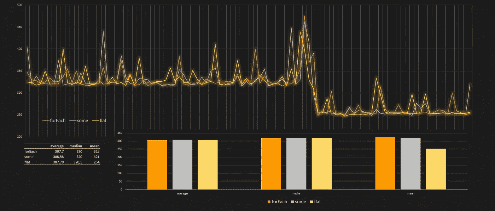
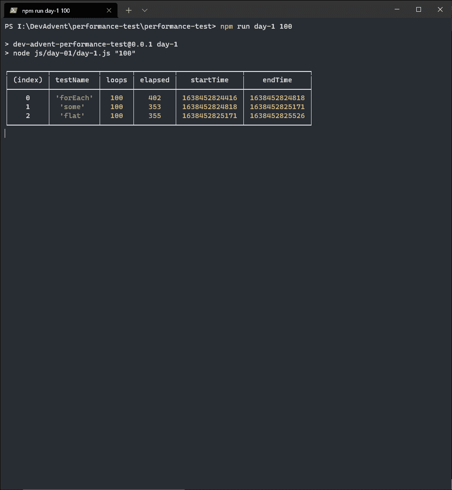
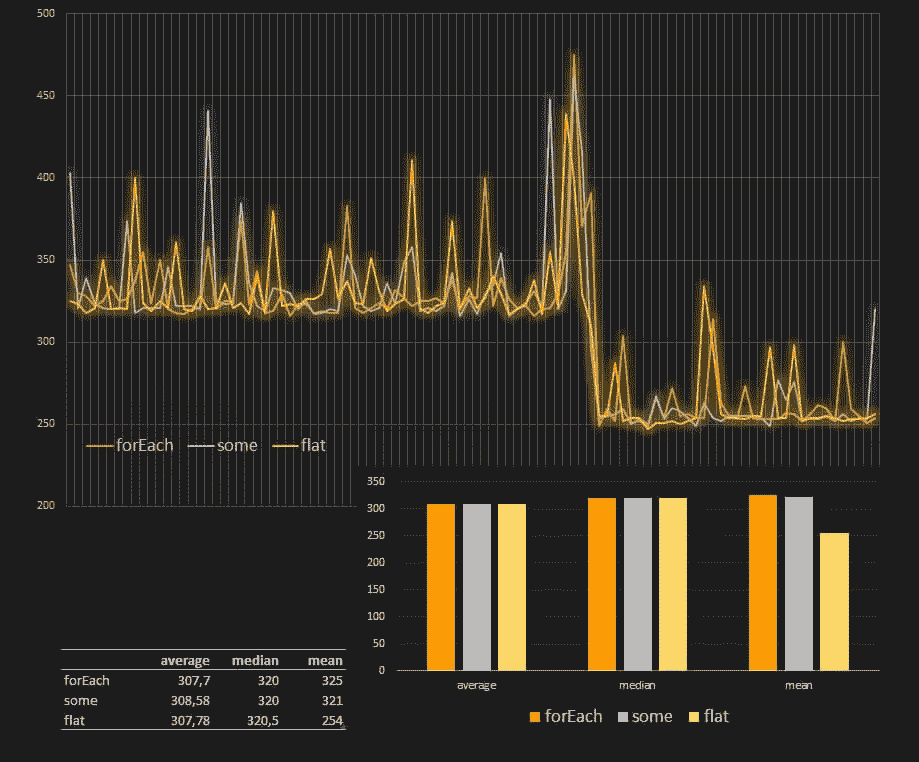

# 在 JavaScript 中，在数组的数组中查找项目的最佳方法是什么？

> 原文：<https://betterprogramming.pub/which-is-the-best-method-to-find-an-item-in-an-array-of-arrays-in-javascript-5f51589d2086>

## 比较三种方法



作者图片

每当圣诞节临近，我的妻子就开始她的*珠子降临日历*。我一直很羡慕她，她的坚定和毅力。在她的建议下，我也决定尝试类似的东西。显然与手工珠宝世界无关(这将是一场灾难)，但与编码有关。幸运的是，YouTube 向我推荐了马克·巴克斯的视频。我喜欢他对 2021 年 开发降临节日历的想法:

当然，我仍然不知道我是否能每天做作业。我甚至不知道我是否能够用我的解决方案写一篇文章。事先不知道谜题，也不知道会不会有什么有趣的事情说。对于第一个问题，是的，有一些有趣的想法。

# 第一个谜题:找到鲁道夫

```
Weeks before Christmas, Santa's reindeers start practicing their flying in order to be fit for the big night. Unfortunately, one of them (Rudolf) crashed and landed in the forest 🌲

Now, Santa 🎅 needs YOUR help to find him.
```

这是一个数组中的数组搜索问题。换句话说，我必须找到一个二维矩阵中元素的坐标。例如，如果我有一个这样的矩阵，我希望在坐标`(3, 2)`找到驯鹿鲁道夫:

相反在这样的“森林”中我会得到负坐标，`(-1, -1)`:

# 使用 forEach()查找数组中的元素

这个问题本身很简单。我们可以用几种方法解决它。最直观的方法是滚动穿过森林的每一条线来寻找鲁道夫:

[array . prototype . foreach()](https://developer.mozilla.org/en-US/docs/Web/JavaScript/Reference/Global_Objects/Array/forEach)方法为数组的每个元素执行相同的代码。该代码只是对索引 Rudolf(🦌)正在使用的[索引。如果索引是负的，Rudolf 就不在那一行。相反，如果我们得到一个正的索引，那么我们就找到了检索它的行和列。](https://developer.mozilla.org/en-US/docs/Web/JavaScript/Reference/Global_Objects/Array/indexOf)

# 使用 some()查找数组中的元素

我想知道是否有更快的方法来找到数组中的元素。在循环结束之前，无法停止 **forEach()** 循环。例如，如果鲁道夫在`(0, 0)`坐标，就没有必要在整个森林中寻找他。但是这段代码确实做到了这一点，即使已经找到了答案，它也会继续寻找。

为了解决这个问题，我决定使用另一种方法， [Array.prototype.some()](https://developer.mozilla.org/en-US/docs/Web/JavaScript/Reference/Global_Objects/Array/some) 。`some()`做的事情和`forEach`完全一样，但是有一个很小但很重要的区别:当它找到元素时就停止循环。或者，更好的是，当所定义的条件被证明为真时。

所以我重写了代码:

我将坐标值保存在两个变量中，`col`和`row`。但是我还保存了一个额外的变量，`found`，作为一个参考来确定我是否能够找到鲁道夫。然后，我对森林中的每个元素进行循环，并在`r.indexOf("🦌") > -1`时中断它，此时我已经找到了值”🦌“在阵中。

# 使用 flat()查找数组中的元素

一切都很好，但我还不满意。我希望能够同时避开`forEach()`和`some()`。所以我决定尝试另一种方式。基本的假设是森林是由大小相同的行组成的。如果是这样，那么我可以把二维数组转换成一维数组。然后我用`indexOf("🦌")`找到鲁道夫的位置。最后，我将索引转换成一对二维坐标。所有这些推理的基础是 [Array.prototype.flat()](https://developer.mozilla.org/en-US/docs/Web/JavaScript/Reference/Global_Objects/Array/flat) 方法。`flat()`方法创建一个新的数组，所有的子数组元素递归地连接在一起，直到指定的深度。

翻译成代码:

# 最好的方法是什么？

此时，我问自己:好吧，我有三种方法来寻找二维数组中的一个元素，但最有效的方法是什么？

为了回答这个问题，我去寻找一些聪明的方法来衡量一个函数的性能。最好的方法是最常见的:记录各种函数多次执行同一操作所用的时间，并进行比较。在我的研究中，我发现了一些非常有益的读物。我推荐阅读 Zell Liew 的这篇文章，[测试 JavaScript 性能](https://zellwk.com/blog/performance-now/)。

我创建了一个函数来计算单个函数的执行时间:

然后我创建了一组随机的森林来寻找驯鹿。我认为 1，000，000 个森林样本对我的测试来说已经足够了

我创建函数在每个森林中顺序搜索 Rudolf:

最后，我做了一些测试:

我得到这样的消息:



似乎没有一种方法明显优于另一种方法。我决定将测试值保存在一个文件中，并尝试看看原始数据是否有帮助。我安装了一个额外的包，`[jsonexport](https://www.npmjs.com/package/jsonexport)`来帮助我转换`resultGeneral`变量并创建一个 CSV 文件:

将结果导入 Excel 后，我得到了这个图表:



好吧，关于什么？这么多的努力都白费了:在我的测试中，三种方法的性能几乎相当。但现在是时候放下键盘，拿起灯笼，帮助森林里的精灵找到鲁道夫了。

感谢阅读！敬请关注更多内容。

***不要错过我的下一篇文章—报名我的*** [***中邮箱列表***](https://medium.com/subscribe/@el3um4s)

[](https://el3um4s.medium.com/membership) [## 通过我的推荐链接加入 Medium—Samuele

### 阅读萨缪尔的每一个故事(以及媒体上成千上万的其他作家)。不是中等会员？在这里加入一块…

el3um4s.medium.com](https://el3um4s.medium.com/membership) 

*原载于 2021 年 12 月 2 日 https://blog.stranianelli.com*[](https://blog.stranianelli.com/3-ways-to-find-an-item-in-an-array-of-arrays/)**。**