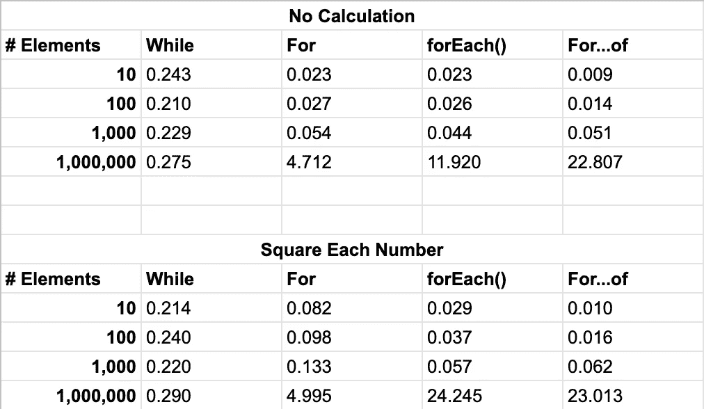

# While，For，forEach()，For…of 哪个最快？

> 原文：<https://betterprogramming.pub/which-is-the-fastest-while-for-foreach-for-of-9022902be15e>

## 比较 JavaScript 迭代结构的速度


照片由 [Max Nelson](https://unsplash.com/photos/KXkgOigCqj0) 在 [Unsplash](https://unsplash.com/) 上拍摄

我不是全职开发人员，所以我依靠我的基础知识来完成需要编写代码的项目。当我发现 JavaScript 的[时，我非常兴奋。forEach()](https://medium.com/better-programming/stop-using-for-loops-to-iterate-over-arrays-5c46940e79d1) 方法作为传统 for 循环的替代。然而，我因为没有及时更新 JavaScript 所提供的最新版本而受到了善意的斥责——参考循环的[for……。](https://medium.com/better-programming/use-for-of-to-loop-through-your-javascript-arrays-57ebb900ab5a)

根据那些评论我上一篇文章的人所说，`for...of`技术在速度和可读性上都优于`.forEach()`。因为我不编写处理时间真正起作用的大规模应用程序，所以我很想发现一些东西。每种类型的迭代结构有多快(或多慢)？

所以我决定测试一下，并分享我的结果。

# 环形引物

在我们开始之前，让我们对不同类型的迭代结构做一个 30 秒的回顾。

*   **While 循环**:最简单的循环机制。只要给定表达式的计算结果为`true`，while 循环就会执行。
*   **For 循环**:迭代次数已知时有用的迭代结构。for 循环的声明有三个组成部分:变量的初始化，确定循环是否结束的表达式，以及在每次迭代结束时执行的语句。
*   **。forEach()方法**:array 类的一个方法，它采用单个参数，即一个函数，并对数组中的每个元素执行该函数。
*   **For…of Loop** :最近添加的迭代结构，该语句要求指定一个临时变量名，数组中的每个元素在迭代时都将被赋予这个临时变量名。

```
let arr = [];// while loop
let i=0;
while(i < arr.length) {
  // do stuff
  i++;
}// for loop
for(let i=0; i<arr.length; i++) {
  // do stuff
}// .forEach() method
arr.forEach((element) => {
  // do stuff
});// for...of loop
for(const element of arr) {
  // do stuff
}
```

# 测试场景

为了测试每个循环的速度，我创建了 10、100、1，000 和 1，000，000 个整数的数组。**在每个循环中，不执行任何计算**。两种方法，`console.time()`和`console.timeEnd()`，用于报告每种技术的速度。

## 结果

结果很有趣，不是我所期待的。所有时间都以毫秒为单位。



以下是我从这个练习中得到的一些主要收获:

*   循环最适合大型数组。
*   对于小型数据集，循环无疑是最快的，但是对于大型数据集，它们的伸缩性很差。
*   `.forEach()`和`for...of`足够接近，任何一方都不应该在表现上孤立对方。
*   `.forEach()`的执行时间受到每次迭代中发生的事情的显著影响。
*   标准的`for`循环普遍表现平平。

我确信改变测试用例将会提供更深的洞察力。然而，作为一个生死相隔不到一毫秒的人，这足以满足我的好奇心。

请在下面的评论中告诉我你的想法。你有一个用例，其中一种方法远远优于其他方法吗？如何决定使用哪种迭代结构？