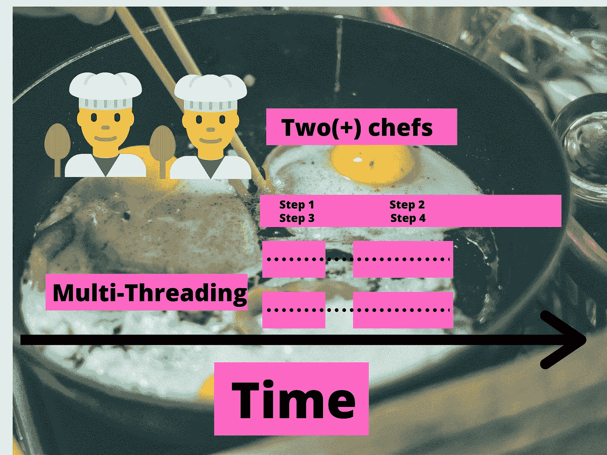

# 你应该使用哪个:异步编程还是多线程？

> 原文：<https://betterprogramming.pub/which-should-you-use-asynchronous-programming-or-multi-threading-7435ec9adc8e>

## 差异、常见误解和 Python 示例

图片来源:作者

说到软件工程，这两个概念经常会有点混淆。它们都是[并发、](https://en.wikipedia.org/wiki/Concurrency_(computer_science))的形式，但它们的含义不同，应用方式也不同，或者在相同的场景中使用也不同。

简单的解释就是 t [hreading 是关于工人的；异步是关于任务的](https://stackoverflow.com/questions/34680985/what-is-the-difference-between-asynchronous-programming-and-multithreading)。但是让我们稍微探索一下。

类似地，假设我们想做一份鸡蛋和烤面包的早餐。我们会怎么做？

# 同步方法

最简单的方法是按顺序进行:

1.  拿出鸡蛋、面包和平底锅，打开炉子。
2.  把鸡蛋敲碎，倒进锅里。
3.  等鸡蛋煮完。
4.  取出鸡蛋，加入调味料。
5.  将面包放入烤面包机。
6.  等待烤面包机完成。
7.  拿出烤面包。

早餐总时间:15 分钟。

够简单吧？如果我们说以这种方式烹饪鸡蛋类似于执行一个程序，我们会说这是一种[同步方式](https://stackoverflow.com/questions/748175/asynchronous-vs-synchronous-execution-what-does-it-really-mean)烹饪鸡蛋。

我们有一个人做所有的任务，在一系列([串行](https://en.wikipedia.org/wiki/Serialism))。我们按顺序进行每一步，不完成最后一步就不能进入下一步。一个更技术性的定义是，每个任务都被阻止执行前一个步骤，并且都是由一个工人完成的。不做好最后一步，我们就无法前进。在这个例子中，我们是计算机的中央处理器[或 CPU。完成的每一个任务都是一个人(一个 CPU)完成的。](https://en.wikipedia.org/wiki/Central_processing_unit)

单线程同步方式做早餐

好酷，我们煮了鸡蛋。但是如果我们想让早晨过得更快呢？你可能会对自己说，“我不会等我的鸡蛋吃完再把面包放进去。”

你现在像个工程师一样思考了。让我们再试一次，但这一次，我们决定要同时煮鸡蛋和烤面包，并默默地感谢烤面包计时器的发明者。

# **异步方式**

我们仍然可以让一个人做所有的事情，但是我们可以在等待另一个任务完成的同时做一个单独的任务。看起来是这样的:

1.  拿出鸡蛋、面包和平底锅，打开炉子。
2.  把鸡蛋敲碎，倒进锅里。
3.  等鸡蛋煮完。
4.  将面包放入烤面包机。
5.  等待烤面包机完成。
6.  **鸡蛋煮熟后**，取出鸡蛋，加入调味料。
7.  **一旦吐司完成**，取出吐司。

早餐总时间:八分钟。

看起来都是一样的步骤，对吧？除了一个重大升级。我们没有吃完鸡蛋然后开始烤面包，而是在等鸡蛋吃完的时候把烤面包放进去。我们仍然只有一个工人在做所有的任务，但是他们现在正在异步地做这件事。现在，只有两个任务来实现异步似乎不太可能，你可以想象一下，如果有成千上万的鸡蛋和烤面包，成千上万的煎锅和烤面包机，一次做一个任务会有多么荒谬！

这是[异步](https://en.wikipedia.org/wiki/Asynchrony_(computer_programming))工程的最大优势之一。通常我们不得不等待一个不受我们控制的动作完成。在这种情况下，它在等待鸡蛋和吐司煮熟。我们可以拥有这个星球上最有效率和最好的厨师，但在大多数情况下，这些鸡蛋只能坐着等着完成。等待这些数据被处理类似于[输入/输出(I/O)](https://en.wikipedia.org/wiki/Input/output) ，当我们在构建需要大量 I/O 等待的东西时，这是使用异步编程的最佳时机。

如果我们进行 API 调用，必须从用户那里获得输入，或者类似的事情，不管我们有多少处理器或者我们的计算机有多快，我们都必须等待。我们必须等待 API 调用完成，等待用户输入信息。这不在我们的控制范围之内，不是变得更快或投入资源就能有任何影响的事情。

单线程异步方式做早餐

太好了！现在我们有两种制作鸡蛋的方法。但是假设我们的室友凯文想帮忙做鸡蛋。这会是什么样子？

# **多线程方法**

1.  拿出鸡蛋、面包和平底锅，打开炉子。
2.  把鸡蛋敲碎，倒进锅里。 **1。凯文把面包放进烤面包机。**
3.  等鸡蛋煮完。 **2。凯文等待吐司完成。**
4.  取出鸡蛋，加入调味料。 **3。凯文拿出烤面包。**

早餐总时间:八分钟。

我们有两个人在做早餐，每个人都被分配了一系列的任务。这是同步[多线程](https://en.wikipedia.org/wiki/Multithreading_(computer_architecture))的一个例子，因为你和 Kevin 都不会同时执行多个任务(包括等待)。

在计算机科学中，一个进程可以有一个或多个线程。在这种情况下，我们有两个线程(人)。你可以在这里了解更多关于什么是线程[的信息。](https://www.computerhope.com/jargon/t/thread.htm)

你可能会说:“嗯，我只有在有两个人在的情况下才能做两个人的早餐。”电脑也是一样。如果您的计算机有足够的资源，您只能使用多线程。多线程通常用于计算更复杂、需要更多资源的任务，或者出于许多其他原因。

多线程同步烹饪早餐的方法

[那么多线程和异步哪个更好](https://www.quora.com/What-is-the-difference-between-asynchronous-programming-and-multi-threading)？这确实取决于很多因素，但如果你了解它们是如何工作的，那应该会给你一些关于使用哪一个的见解。[它有很多 I/O 吗？也许可以试试异步。计算量大吗？也许可以试试多线程。根据语言的不同，编写多线程应用程序比异步应用程序要容易得多，但这一点需要记住。能不能搭建一个](https://stackify.com/when-to-use-asynchronous-programming/)[多线程异步系统](https://codewala.net/2015/07/29/concurrency-vs-multi-threading-vs-asynchronous-programming-explained/)？当然啦！通常，这两个词会相互串联使用。

# Python 示例

让我们看看上面的三个例子(单线程同步、单线程异步和多线程同步)如何在 Python 例子中工作。

让我们看看使用 Python 包装器`pip install alpha_vantage`从 [Alpha Vantage](https://www.alphavantage.co/) API 获取股票数据的几种不同方法

## 同步的

我们想要得到四个 tickerss，`'AAPL', ‘GOOG’, ‘TSLA', ‘MSFT'`的当前价格，并且只有当我们得到所有四个 ticker 时才打印出来。最简单的方法是使用一个`for`循环。

这是最蛮力的方式。一旦我们从 API 调用中得到一个值(在``ts.get_quote_endpoint(symbol)``中完成),我们就把它打印出来，然后开始下一个符号。

但是在了解了异步和多线程之后，我们知道我们可以在等待返回值的同时启动另一个 API 调用。

## 异步的

在 Python 中，我们有关键字`await`和`async`，它们给了我们异步编程的新力量。这些是 Python 3.5 中的新特性，所以如果您仍在使用 Python 2，就需要进行更新。反正很多 Python 2 都在贬值，所以请更新。

这里发生的事情可能有点令人困惑，所以让我们来分析一下。`loop`是处理器在等待任务和执行其他任务之间不断循环的地方。这是为了不断检查任务(在我们的例子中是一个 API 调用)是否完成。

`tasks`变量是方法调用的列表。我们将这些任务放在一个为 asyncio 收集的列表中，称为`group1`，然后在`loop.run_until_complete`中运行它们。这比我们最初的同步版本快得多，因为我们可以进行多个 API 调用，而不必等待每个调用完成。

注意:Asyncio 在 Python 笔记本中是奇怪的，更多信息见这里的。

## 多线程

我已经写了一些关于多线程的更深入的文章，所以如果你想了解更多，看看 Python 中的一些例子，[查看这个链接](https://medium.com/alpha-vantage/data-is-taking-to-long-to-get-back-d48e3bf8f59b)来了解更多！

## 关于 Python 的一个简短说明…

对于初学者来说，文章结束了！但是对于更高级的用户来说，python 上有点星号。说到多线程，Python 实际上和其他语言有点不同。从技术上讲，它是并发运行的，而不是并行运行的，这是由它的创建方式决定的。这使得它非常适合 I/O 工作，但不适合需要高计算能力的任务。你可以通过[这篇文章](https://medium.com/@nhumrich/asynchronous-python-45df84b82434)更深入地了解这些概念。

还有几个层面需要学习，比如什么是并行，每个应用程序的更深层次的交互，如何同步线程和通道，以及每种语言如何以不同的方式处理它们。

觉得我错过了什么吗？不明白什么？请在下面留下您的问题、评论或见解！