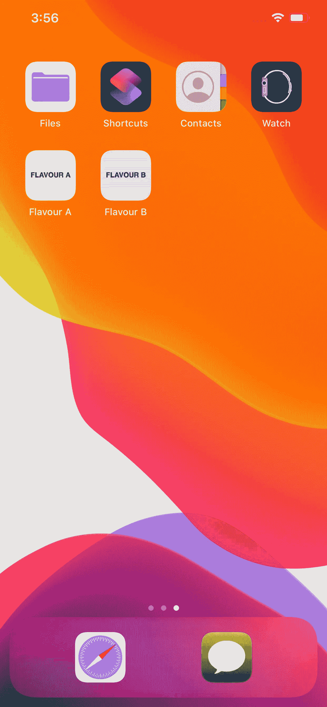

# Xcode 中的白色标签

> 原文：<https://betterprogramming.pub/white-labelling-in-xcode-a5ad66f30a8a>

## 给应用贴上白色标签，无需为每种风格复制一个目标



不同的口味

我们一直在准备建立一个白色标签的应用程序，不想为每种口味重复一个目标。

如果你有完全不同的产品，这是有意义的，但对于像白色标签这样的东西，随着你添加更多的目标，这就变成了一场噩梦。

# 为什么不应该复制目标？

这实际上和复制粘贴是一样的，你不会用代码来这样做(对吗？).

您最终会复制构建设置、构建阶段和构建规则。这很快变得难以管理，并导致重复工作— 每次你编辑其中一个，你都必须编辑它们。

如果您使用 [CocoaPods](https://cocoapods.org/) ，您还会使您的 Podfile 变得复杂，因为您还需要在那里添加每个目标。

每次将文件添加到项目中时，您都需要确保将引用添加到每个目标的编译源或复制包资源阶段。

由于这些都是手动过程，它们也容易出现人为错误，并可能导致运行时错误，特别是当弱链接框架或捆绑资源没有正确配置时。

# 你有什么选择？

您可以使用构建配置、构建设置、`info.plist`、方案和构建阶段的组合。我将在下面更详细地介绍每一个以及如何组合它们。

# 构建配置

在您的项目中，在 *Info* 下，您可以为每个风格复制/添加构建配置。

现在您已经添加了一个构建配置，您可以转到项目的构建设置，用箭头展开一个项，并查看您的构建配置可以为该设置定义自己的值。

您还可以在目标的构建设置中覆盖这些默认值(`$(inherited)`)。

# 构建设置

现在我们有了不同的构建配置，我们可以添加一个用户定义的构建设置来返回风格。

让我们称这个设置为`BUILD_FLAVOUR`，我们可以在我们的构建设置、构建阶段、`info.plist`或者计划中的任何地方引用它(稍后会详细介绍)。

# 信息列表

打开您的`Info.plist`文件，您会注意到一堆现有的构建设置，如`$(PRODUCT_BUNDLE_IDENTIFIER)`。

如果您转到项目的构建设置，您可以为每个构建配置编辑此设置—现在您已经有了一种以不同方式签署多个应用程序的方法。

现在，您可以添加自己的用户定义的构建设置来管理各种设置，如每个构建配置的 API 键或服务器 URL。您需要引用`Info.plist`中的构建设置，以与现有键相同的方式添加您自己的键。

然后，您可以像下面这样从包中访问它们:`Bundle.main.infoDictionary[EXAMPLE_API_KEY]`。

我通常忽略的另一个设置是包名，因为使用了`$(PRODUCT_NAME)`链接映射文件和模块名，所以最好保留这些作为项目名，并创建第二个用户定义的构建设置，称为`BUILD_DISPLAY_NAME`，并根据构建配置进行配置。

# 计划

为了构建正确的风格，我们需要为每个风格设置一个方案，指向`DEBUG`和`PRODUCTION`的正确构建配置。

# 包括和排除文件

假设我们已经为 A 和 b 两种口味配置了方案。

与`BUILD_FLAVOUR`设置(如上所述)结合使用时，两个设置非常强大:

## `1\. EXCLUDED_SOURCE_FILE_NAMES`

您可以使用模式或确切的文件名来排除所有风格中不应该捆绑的所有内容(如 xcassets、files)。

我发现模式是管理这些的最简单的方法，我们可以添加一个像`*Flavour*_*.*`这样的模式来排除所有前缀为`Flavour*_`的文件。

然后，我可以将`FlavourA_Assets.xcassets`和`FlavourB_Assets.xcassets`添加到项目中，并确信这两个都将从编译后的应用程序二进制文件中缺失(因为它们匹配这个模式)。

## 2.`INCLUDED_SOURCE_FILE_NAMES`

本身并不十分强大。它需要与此设置结合使用，以包含基于生成设置的文件。

我们可以加上这个图案:`*Flavour$(BUILD_FLAVOUR)_*.*`。

如果我们现在编译风味 A 方案，我们应该看到`Flavour**A**_Assets.xcassets`已经被复制到编译后的`.app`文件中，应该缺少`Flavour**B**_Assets.xcassets`。反之亦然，对于 flavor B 方案也是如此。

这也可以用于复制不同的代码，因此您可以通过拥有签名的同一实现的两个变体来定义稍微不同的行为。

您可以为风味 A 添加一个名为`FlavourA_Calculation.swift`的文件，它有一个以英镑( )为单位返回结果的函数；为风味 B 添加另一个名为`FlavourB_Calculation.swift`的文件，它有相同的函数，但以欧元(€)为单位返回结果。

# 构建阶段

构建阶段可以涵盖需要将文件复制到一个精确位置的场景，比如 Google Analytics 的`Google-Info.plist`。对于不同的风格，这个文件可能有不同的变体，但是 Fabric 要求这个文件叫做`Google-Info.plist`。

因此，您可以编写脚本，在将这些文件复制到包中之后(即复制包资源之后)对其进行重命名。

我发现一个有用的运行脚本是这样的:

```
function move {
 CFGROOT=”$CONFIGURATION_BUILD_DIR/$CONTENTS_FOLDER_PATH”
 CFGDEST=”$CFGROOT/GoogleService-Info.plist”
 CFGSRC=”$CFGROOT/Flavour$1_GoogleService-Info.plist”
 if [ -f “$CFGSRC” ]; then
   mv “$CFGSRC” “$CFGDEST”
 fi
}move A
move B
```

由于`BUILD_FLAVOUR`在构建阶段不可用，我们需要通过多次调用该方法来尝试复制每个文件。

另一个我似乎找不到解决方案的是启动屏幕，它必须是你的`Target`中的常规设置中提到的那个。这可以使用类似的脚本来解决。

```
function move {
    SBROOT="$CONFIGURATION_BUILD_DIR/$CONTENTS_FOLDER_PATH"
    # Storyboards are compiled directories after compilation (storyboardc)
    SBDEST="$SBROOT/Base.lproj/LaunchScreen.storyboardc"
    SBSRC="$SBROOT/Flavour$1_LaunchScreen.storyboardc"
    if [ -d "$SBSRC" ]; then
        rm -R "$SBDEST"
        mv "$SBSRC" "$SBDEST"
    fi
}

move A
move B
```

现在你已经拥有了给应用贴上白色标签所需的所有要素。

这里是一个[的示例项目](https://github.com/cjnevin/WhiteLabelled)。