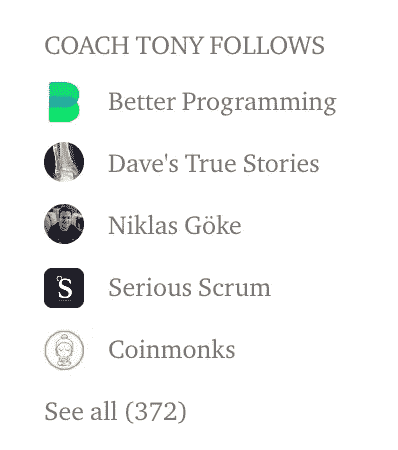

# 谁在你的博客上？

> 原文：<https://betterprogramming.pub/who-is-on-your-blogroll-689a3ab9625d>

## 在 Medium 上，程序员应该关注哪些作者和出版物？

Medium 有很多伟大的作者和出版物，在我看来，很难找到。所以我对 Medium 推出 Blogrolls 作为一种发现手段持乐观态度。如果你打开博客，它们就会出现在你的个人资料页面上([方向](https://blog.medium.com/blogrolls-making-writer-discovery-seamless-6c94270d5e68))，下面是我的博客的样子:

谁在你的博客上？你推荐关注谁？请在回复中告诉我，因为我想让更好的编程做得更好(没有双关语的意思),突出最好的媒体。

我们已经开始了。你可能已经注意到，当[务实的程序员](https://medium.com/pragmatic-programmers)发布时，我们帮助欢迎他们进入 Medium， [Anupam Chugh](https://medium.com/u/9833cc01f515?source=post_page-----689a3ab9625d--------------------------------) 对[最活跃的公司工程博客](/23-active-software-engineering-publications-on-medium-a17484223b9a)有很好的评价。