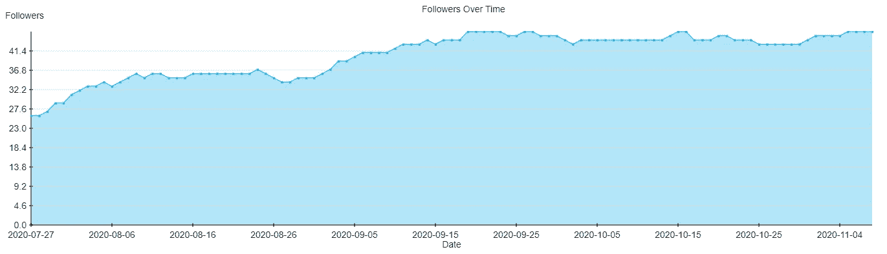

# 谁在 Twitter 上取消了对您的关注？

> 原文：<https://betterprogramming.pub/who-unfollowed-you-on-twitter-58f757420339>

## 如何使用 Twitter API 来跟踪你的关注和取消关注

照片由[openclipbart-Vectors](https://pixabay.com/vectors/twitter-tweet-bird-funny-cute-117595/)在 [Pixabay](https://pixabay.com/) 上拍摄。

你定期在推特上发帖吗？你偶尔会有追随者吗？是不是因为你没有跟踪他们，他们几天后就不跟踪了？够了！

让我们找出是谁没跟上，这样我们就可以用他们的名字烧掉巫毒娃娃…哦，对不起，我想得太多了。我是说，这样我们就可以学习 Twitter API 了！

自从我今年年初开始定期发帖以来，这就是我在 Twitter 上的许多经历。有人会跟踪我，几天后又不跟踪了——就像一个向前一步，向后一步的慢游戏。

所以几周前，我决定看看 Twitter API，以便更熟悉它并了解它的特性。随着时间的推移，跟踪关注者的数量似乎是一个很好的简单的起点。作为一个附带的好处，这也提供了不关注的人的名字。

# 寻找不关注者

当有人不关注你时，Twitter 不会通知你，这没关系。不应该。但是有时候知道谁不关注你的账户也不错。

有第三方工具可以跟踪取消关注。只要在谷歌上快速搜索一下。但是当你能养活自己的时候，为什么要养活别人的数据北海巨妖？

Twitter 有一个非常好和完整的 API，可以用于很多任务。为了了解它的一些特性，我决定使用自己的工具来跟踪有多少人关注和不关注我。

# 履行

除了公开可见的数据之外，API 不提供对更多数据的访问，因此也没有直接的方法来检索非关注者的用户名。

然而，从你的追随者列表中重建这些信息是非常容易的。把你的追随者找来，和前一天的名单对比一下。所有只在新名单里的名字都是新关注者，所有只在旧名单里的名字都是不关注者。

## OAuth

像大多数平台一样，Twitter 需要授权才能使用其 API。它使用 [OAuth](https://en.wikipedia.org/wiki/OAuth) ，一种互联网授权协议，在不泄露密码的情况下授权访问数据。你需要注册一个 [Twitter 开发者](https://developer.twitter.com/en)账户，并在你的仪表盘中创建一个应用，它将为 API 生成所需的密钥。

有一些库可以帮助 OAuth，但是我不喜欢维护太多的库依赖，所以我快速搜索了一个非库 OAuth 实现，[找到了一个我能够适应我的需要的](https://stackoverflow.com/questions/12684765/twitter-api-returns-error-215-bad-authentication-data)。

我添加了一个简单的 MySQL 数据库来跟踪每天的统计数据，并创建了一个每天调用一次脚本的 cronjob。下面是一个如何使用 Twitter API 的例子，你可以在 GitHub 上找到我的关注者/非关注者跟踪脚本[的完整代码:](https://gist.github.com/pingpoli/ae6c140001d82a5e94d772d7222f37ac)

另外，因为我喜欢统计数据和图表，我还让它创建了一个我的 Twitter 粉丝随时间变化的图表:

我的推特粉丝。作者照片。

# 为追随而追随

看起来跟风是小型 Twitter 账户增长的普遍方式。不喜欢也不想搞。

当我在 Twitter 上关注某人时，是因为我认为他们的内容很有趣，或者我想听听他们想说什么。我跟踪别人的唯一目的不是让他们跟踪我。所以我想对于那些考虑关注我的人来说也是一样的:像我的推文一样，关注。不喜欢我的古怪，不要跟着。很简单。如果他们所追求的都是追溯，他们还不如买几个机器人。

此外，如果我跟踪某人，我喜欢了解他们在做什么。即使我只关注了几个人，他们的一些推文也会被埋没在时间轴中。因此，当我看到一个账户关注 1K 以上的其他人时，他们甚至不可能记得他们关注的所有人——更不用说跟踪他们在做什么了。

# 结论

Twitter 拥有互联网上最完整、最强大的 API 之一，了解它的特性是非常有益的。创建一个脚本来跟踪你的追随者数量是一个很好的起点。了解谁取消了你的账户是一个不错的奖励。

# 资源

*   [推特开发者门户](https://developer.twitter.com/en)
*   [Twitter API 文档](https://developer.twitter.com/en/docs/twitter-api/early-access)
*   [脚本的完整源代码](https://gist.github.com/pingpoli/ae6c140001d82a5e94d772d7222f37ac)