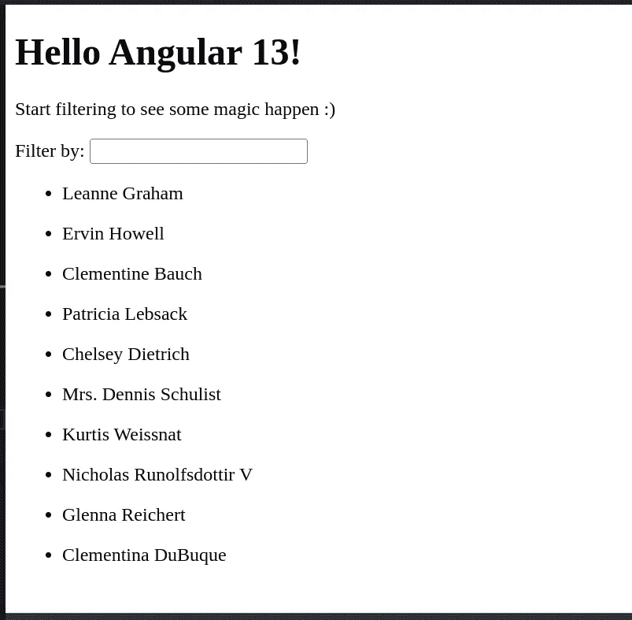

# 为什么以及如何创建一个角度不纯的过滤管

> 原文：<https://betterprogramming.pub/why-and-how-to-create-an-impure-filter-pipe-in-angular-a3916de5841f>

## [有角度的](https://medium.com/@lorenzozar/list/angular-5496c492a185)

## 了解为什么 Angular 不附带过滤和排序管道，以及如何创建自定义过滤管道


照片由 [Erlend Ekseth](https://unsplash.com/@er1end?utm_source=medium&utm_medium=referral) 在 [Unsplash](https://unsplash.com?utm_source=medium&utm_medium=referral) 上拍摄

Angular 为最常见的场景提供了几个内置管道。

最大的缺失之一是过滤管。Angular 不提供内置过滤管有一个很好的理由。

# 为什么 Angular 不附带过滤管

用于过滤和排序列表的管道在 Angular 中不可用，即使 AngularJS 过去提供了`filter`和`orderBy`。

这不是一个错误。

因为这种管道性能很差，并且禁止过度缩小，Angular 没有提供开箱即用的管道。过滤成本很高。

即使计算能力每年都在增长，数据和信息也在不断增长！


CPU。劳拉·奥克尔在 [Unsplash](https://unsplash.com?utm_source=medium&utm_medium=referral) 上的照片

一般来说，过滤需要对应于对象属性的参数。然而，一些场景要求管道是不纯的，这意味着 Angular 实际上每次发生变化检测循环时都会调用不纯的管道。

因此，筛选和排序成为成本高昂的操作，尤其是当数据量很大时。

当 Angular 每秒多次调用这些管道时，即使是中等大小的列表，用户体验也可能会受到严重影响。

# 如何创建一个纯过滤管道

首先，我们来看看模板和类。

## AppComponent 和数据

在模板中，我们有一个 input 元素，它使用双向绑定将用户输入存储在一个名为`filterBy`的属性中。记得导入`AppModule`中的`FormsModule`，在你的 app 中使用双向绑定。

下面，我们用`NgFor`列出来自`usersList`的一些用户的名字。代码如下:

包括模板和类的 AppComponent

用户列表`usersList`是十个项目的数组，例如，用户。它存储在类中，你可以在 [jsonplaceholder](https://jsonplaceholder.typicode.com/users) 或者这个应用的 StackBlitz 中找到它。

每个用户都是一个具有多个属性的对象。为了我们的目的，知道属性之一是`name`就足够了。

我们想按名字过滤用户。

初始应用程序如下所示:



使用过滤管的角度应用程序

# 创建 FilterPipe 类

让我们从使用 Angular CLI 命令`ng generate pipe filter`开始，其中`filter`是将在模板绑定中使用的管道名称。

作为旁注，你也可以使用`ng g p pipe`。

Angular 将负责创建一个文件，填充一些字段，并在`app.module.ts`中正确导入。

在转换方法中，`value`是模板中管道左侧的值，而`args?`是可选参数，我们将使用它来过滤`value`。

要使用此过滤器，我们可以简单地将其添加到模板中，如下所示:

```
<div *ngFor="let user of usersList | filter">
```

自然什么都不会发生。但是，请注意，`usersList`是通过管道的属性，并且与转换方法中的`value`参数相关联。

# 向 FilterPipe 添加过滤代码

我们现在将在 FilterPipe 的 transform 方法中工作。

## **变换方法的争论**

首先，我们用下面的代码更新转换方法的参数:

```
transform(value: User[], filterString: string, property: string)
```

我们在上面讨论过`value`。值类型是形状类似于`User`接口的对象数组。你可以在 StackBlitz 的`model.ts`中看到。

第二个参数是字符串类型的`filterString`。`filterString`的值必须来自模板。因此，我们将向管道添加一个参数。参数将是用户输入的`filterBy`，例如，用户想要用作过滤器的字符串。

第三个也是最后一个参数是`property`。由于我们的用户对象包含几个属性，我们需要指定我们想要使用哪个属性。为了简单起见，我将把字符串`name`硬编码为模板中过滤管道的第二个参数。

这是一个例子。通常，您不应该在代码中硬编码值。

在模板中，管道变成:

```
...
<div *ngFor="let user of usersList | filter: filterBy:'name'">
  <ul>
    <li>{{ user.name }}</li>
  </ul>
</div>
```

其中`filter`是管道的名称，`filterBy`是我们通过双向绑定从输入元素获得的属性，`'name'`是用户对象中的硬编码属性。

根据您的需要，您需要的参数数量是可选的。

## **过滤逻辑中的** **变换方法**

现在我们在 transform 方法内部工作。

我们首先添加一些代码，以便在没有过滤器时返回每个值。

```
if (value.length === 0 || !filterString) {
  return value;
}
```

然后，我们添加基于用户字符串的过滤逻辑。

```
let filteredUsers: User[] = [];for (let user of value) { if (user[property].includes(filterString)) {
    filteredUsers.push(user);
  }}return filteredUsers;
```

记住`property`是硬编码的，它的意思是`name`。`value`是来自`usersList`的用户列表，`filterString`是一个人想要用作过滤器的字符串，例如`filterBy`。

因此，您可以将这段代码理解为“对于来自`userList`的每个用户，如果用户名包含`filterBy`字符串，则将该用户添加到最终返回的`filteredUsers`数组中”。

这是`FilterPipe`到目前为止:

此时，管道允许我们很好地过滤名字。

注意，我添加了 [JavaScript](https://developer.mozilla.org/en-US/docs/Web/JavaScript/Reference/Global_Objects/String/toLowerCase) `[toLowerCase()](https://developer.mozilla.org/en-US/docs/Web/JavaScript/Reference/Global_Objects/String/toLowerCase)` [方法](https://developer.mozilla.org/en-US/docs/Web/JavaScript/Reference/Global_Objects/String/toLowerCase)，这样过滤器就不区分大小写了。这当然是完全可选的。

昂贵的过滤操作怎么办？

# 如何使过滤管不纯

让我们更进一步。

我们添加一个简单的按钮，用下面的代码向`usersList`添加一个新用户:

```
<button (click)="onAddUser()">Add user</button>
```

该方法如下所示:

```
onAddUser() {
  this.usersList.push({
    id: Math.floor(Math.random() * 10000),
    name: 'Leanne Graham',
    username: 'Bret',
    ...
  });
}
```

每点击一次，就有一个用户被推到`usersList`。

问题来了！

如果过滤符晓薇，然后点击按钮，用户被添加到`usersList`中，但过滤后的列表不会显示。因此，您不会在已筛选的列表中看到新用户，即使您在删除筛选器后会看到他们。

Angular 不会在每次复合数组或对象改变时重新运行数据管道。

## 纯净和不纯净的管道

更准确地说，我们需要谈论纯净和不纯净的管道。

当输入值有纯变化时，我们有一个纯管道。纯粹的变更可以是以下情况之一:

*   原始输入值的变化(`String`、`Number`、`Boolean`、`Symbol`)
*   对对象引用的更改(`Date`、`Array`、`Function`、`Object`)

纯管道使用纯函数。给定相同的输入，纯函数应该总是返回相同的输出。

默认情况下，管道是纯的，因为 Angular 忽略对象或数组内部的更改。因此，当我们添加到一个输入数组，或者更新一个输入对象属性时，它不会调用一个纯管道。

正如您所猜测的，对象引用检查比深层差异检查更快。此外，当 Angular 跳过管道执行时，它也会跳过视图更新。

由于这个原因，当常规的变化检测策略很好时，纯管道是更可取的。

当我们需要深度检查时，就像在当前的例子中，我们需要使用不纯的管道。

不纯管道在每个组件变化检测周期中运行。例如，它可以在每次击键或鼠标移动时运行。

正如你所猜测的，这将很快变得非常昂贵。

话虽如此，实现不纯管道就像在`Pipe`装饰器中声明`pure: false`一样简单。

```
@Pipe({
  name: 'filter',
  pure: false,
})
```

通过将`pure`属性添加到`Pipe`装饰器中，我们强制`FilterPipe`在每次数据改变时进行更新。

在管道内添加一个日志，以显示频率。

使用不纯的管道可能会导致性能和激进的最小化问题。所以要小心使用，只在真正需要的时候使用。

在 [StackBlitz](https://stackblitz.com/edit/angular-ivy-4oztra?file=src/app/filter.pipe.ts) 上找到代码或者从 [GitHub](https://github.com/lorenzojkrl/ng-filter-pipe) 上克隆应用。

# 异步管道

作为旁注，值得一提的是[异步管道](/go-reactive-with-angular-async-pipe-b290988f4000)是不纯的。粗略地说，我们可以认为“当管道总是检查新的输入数据时，它就是不纯的。”

虽然 Angular 异步管道优化了更改检测，但它也消除了手动使用订阅和取消订阅的必要性。

此外，在 Angular 中使用 [RxJS 声明模式是一个好方法。](/rxjs-declarative-pattern-in-angular-cafba3983d21)