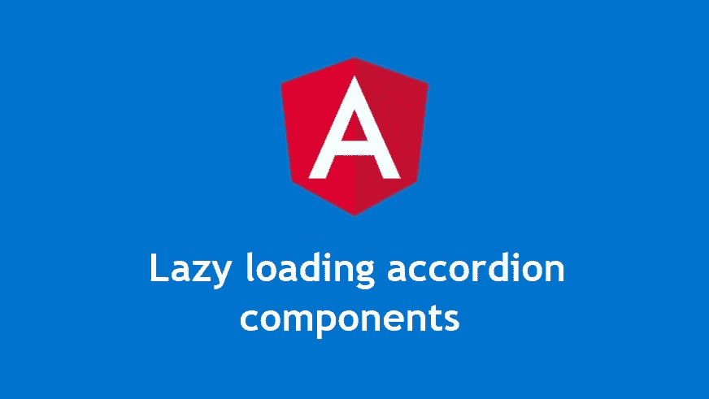
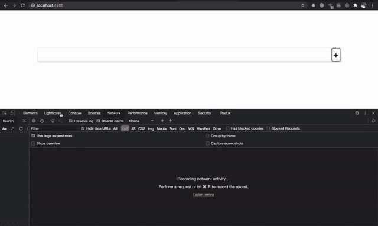
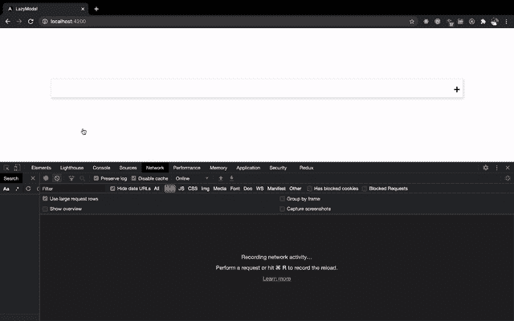

# 为什么以及如何在 Angular 中延迟加载组件

> 原文：<https://betterprogramming.pub/why-and-how-to-lazy-load-components-in-angular-b4aff3797c6d>

## 创建一个可重用的 Angular accordion 组件并延迟加载其内容



作者图片

> *“在软件可以重用之前，它首先必须是可用的。”*
> 
> *—拉尔夫·约翰逊*

*根据定义，延迟加载是一种按需加载的技术。*

*惰性加载可以应用于应用程序开发过程的不同层次，从模块到组件。模块级的延迟加载在 Angular 世界中非常有名，但是组件级的延迟加载却很少被提及。在本文中，我们将创建一个 accordion 组件并延迟加载内容。*

# *为什么要使用 Lazyload 组件？*

**

*戴夫·威尔海特在 [Unsplash](https://unsplash.com?utm_source=medium&utm_medium=referral) 上拍摄的照片*

*所以你已经发布了你的生产就绪的角度应用！*

*您确保在编写代码、重用组件、lazyloading 模块等等时使用最佳实践。经过几周的实际使用，用户已经开始抱怨应用程序的性能，特别是一些页面的初始加载时间。由于这个原因，你开始失去用户，并且统计数据持续下降。*

*您进行了一轮分析，发现有一个组件正在进行多个 API 调用，而这些调用对于最初的用户体验来说是不必要的(或不太重要的)。它可以是调式的，手风琴式的，甚至是滑块式的。这个特殊的 API 调用降低了应用程序的速度，并使用户体验变得迟缓。*

*这里更好的方法(以 accordion 为例)显然是只有当用户打开特定的 accordion 时才在 accordion 中加载内容。*

*以上是实现延迟加载的完美用例。*

*我们开始吧。*

# *最初的版本*

*为了实用起见，让我们假设一个应用程序场景，其中我们有一个博客文章列表，我们希望在一个手风琴下面显示。*

*在我们重构和实现延迟加载之前，下面是我们的典型应用程序设置。*

*我们有两个组件:*

1.  *博客帖子的帖子组件加载数据)*
2.  *手风琴部件*

*我们使用这两个组件在我们的`app-component`中向用户呈现博客文章。*

*我们使用了`app-accordion`组件，并将`app-post`组件传递给它进行内容投影。*

*对于手风琴的实现:*

*在我们的`post`组件中，我们对`[jsonplaceholder](https://jsonplaceholder.typicode.com/)`进行 HTTP 调用，获取一个假的博客帖子，并将其显示在模板上。*

*这将导致如下结果:*

**

*惰性加载前的初始应用*

*正如您可以清楚地看到的，数据现在是在页面的初始加载时加载的，这在某些情况下并不理想，比如我们上面讨论的情况。*

# *实现延迟加载*

*这是我们让内容延迟加载的计划。*

*我们将使用@angular/core 中的`@[ContentChild](https://angular.io/api/core/ContentChild)`来抓取 accordion 主体，使用的是`<ng-template>`上的指令语法(我们正在替换早期版本中的内容投影技术)。我们使用`<ng-template>`而不是`<div>`是因为它的特殊性质，我们可以利用它。*

*来自[文档](https://angular.io/guide/structural-directives#the-ng-template):*

> *“`<ng-template>`是一个用于呈现 HTML 的有角元素。它从不直接显示。事实上，在渲染视图之前，Angular *用一个注释替换了`<ng-template>`和它的内容*。
> 如果没有结构指令，你只是将一些元素包装在一个`<ng-template>`中，这些元素就会消失。*

*首先，让我们为 accordion 主体创建一个新的指令。*

```
*ng generate directive accordion*
```

*让我们将选择器重命名为`[accordion-body]`。该指令的目的是仅作为我们的`<ng-template>`的选择器，它支撑着我们的手风琴身体。我们对该指令所做的唯一更改是将其重命名。*

*现在让我们将`[accordion-body]`指令添加到我们的`app-component`中。*

*如果您现在导航到我们的应用程序，您将看到`app-post`组件根本没有显示——因此，我们的 API 也没有被触发。*

*太好了！*

*现在剩下的唯一部分是重构`app-accordion`组件。*

*我们正在扩展现有的手风琴组件。我们已经使用了`@ContentChild`来访问`app-accordion`中包含`AccordionDirective`(即`[accordion-body]`)的第一个子节点。注意，我们使用了`read: TemplateRef`，因为我们正在访问一个模板引用。您可以在[文档](https://angular.io/api/core/ViewChild)中了解更多选项。*

*现在我们可以简单地在我们的`app-accordion`组件模板中使用它。*

*就这么简单！*

*注意`*[ngTemplateOutlet](https://angular.io/api/common/NgTemplateOutlet)` [、](https://angular.io/api/common/NgTemplateOutlet)的用法，用于从准备好的`[TemplateRef](https://angular.io/api/core/TemplateRef)(accordionBodyRef)`中插入一个嵌入视图。*

*就这些了！现在，您拥有了一个延迟加载的 accordion 组件和一个加载速度更快的应用程序。*

**

*在延迟加载实现之后*

# *扩展解决方案以支持快速加载*

*我们的 accordion 的当前实现只支持延迟加载。您不可能急切地加载(在应用程序内容的初始加载时)当前的实现。但是有时，您可能需要 accordion 来支持急切地加载内容。在这种情况下，您可能需要创建另一个组件来实现这一点。*

*让我们通过添加延迟加载和急切加载功能，使现有的 accordion 组件真正可重用。*

*这可以通过在我们的 accordion 模板中添加另一个`*ngIf`条件来轻松完成。*

*我们正在检查`accordionBodyRef`模板是否存在。如果是的话，我们就显示组件，内容会延迟加载。如果没有，我们只需使用内容投影选择`accordionBody`。*

*现在在`app-component`:*

*这就对了。您现在可以使用相同的`app-accordion`组件根据需要延迟或急切地呈现内容。*

*你可以在 GitHub 上找到已经完成的项目[。](https://github.com/BharathRavi27/lazy-loaded-accordion)*

*黑客快乐！*