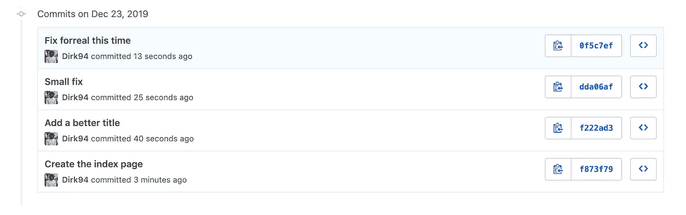
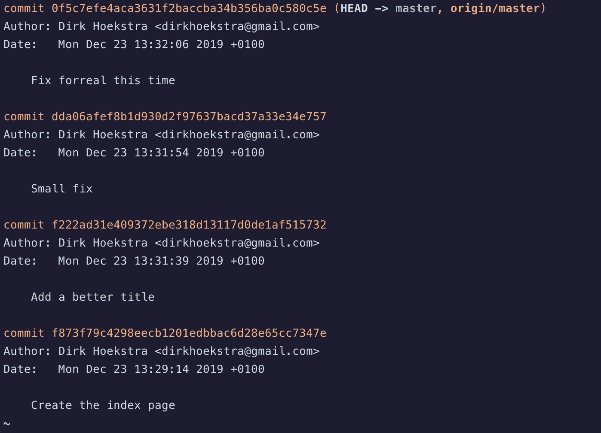
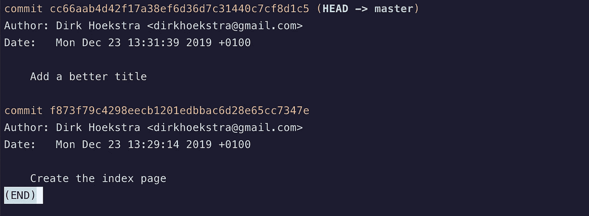
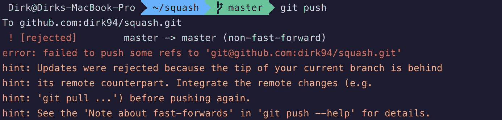
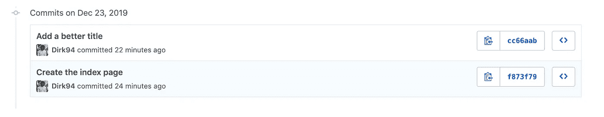

# 为什么以及如何挤压 Git 提交

> 原文：<https://betterprogramming.pub/why-and-how-to-squash-git-commits-b508b3b0dba>

## 简单的指导性指南


挤压一名骑士——照片由[詹姆斯·庞德](https://unsplash.com/@jamesponddotco?utm_source=unsplash&utm_medium=referral&utm_content=creditCopyText)在 [Unsplash](https://unsplash.com/s/photos/crush?utm_source=unsplash&utm_medium=referral&utm_content=creditCopyText) 上拍摄

如果你是一名开发人员，你可能有过这样的经历:你试图修复一个 bug，在这个过程中，你最终会多次提交——通常会出现诸如“修复”、“真正修复”和“最终修复，我保证”这样的消息。



当您的 Git 历史包含大量这类消息时，找到相关的提交就变得更加困难。

清理混乱的一种方法是在一次提交中压缩多次提交。

# 挤压 Git 提交

使用命令`git log`，您可以看到您最近的提交。



在这种情况下，我想将“这次修复”和“小修复”提交压缩到“添加更好的标题”提交中。

为此，我告诉 Git 我想对最近的三次提交进行重新排序。

```
git rebase -i HEAD~3
```

`-i`标志让我在交互模式下重设基础。

输入该命令时，将打开默认的终端文本编辑器。在这里，您可以选择要保留的提交。

在这个例子中，我为最后两次提交输入`squash`。

```
pick   f222ad3 Add a better title
squash dda06af Small fix
squash 0f5c7ef Fix forreal this time
```

我想保留“添加一个更好的标题”提交，所以我为该提交输入了`pick`。

另外两个提交将被压缩到那个提交中，保留我的所有代码，但是将 Git 历史从三个提交转换为一个。我们将在我们的终端中点击`:wq`来写-退出以继续。

在下一个屏幕中，我们可以编辑和更改挤压提交的提交消息。在这种情况下，我只需输入相同的消息。

```
Add a better title
```

一旦完成，您就可以使用`git log`来验证提交是否已经被终止。



# 推动变革

好了，提交已经被压缩了，让我们将更改推送到远程分支。

然而，当执行`git push`时，命令失败。



出现此错误是因为我们在本地更改了 Git 历史记录。试图推动这一新的历史会导致冲突。

为了克服这一点，您可以强制推送至远程分支。

```
git push origin +master
```

结果只有两次提交。



# 提醒一句

您应该只挤压本地分支上的 Git 提交。因为您更改了 Git 历史，所以您可能会给在同一个分支上工作的队友带来严重的问题！

就这样，祝你愉快粉碎 Git 提交！