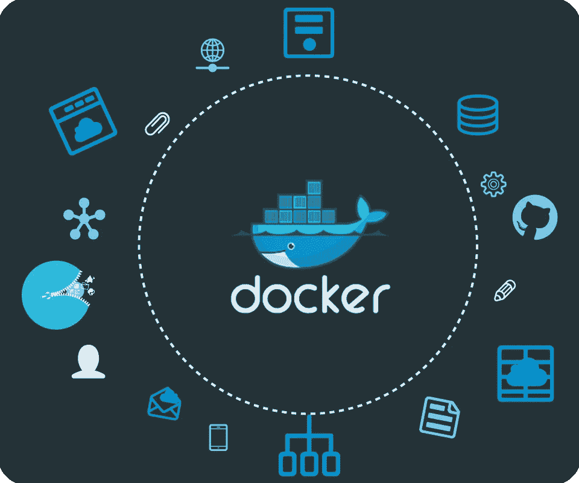

# 为什么以及如何使用 Docker 进行开发

> 原文：<https://betterprogramming.pub/why-and-how-to-use-docker-for-development-a156c1de3b24>

## Docker 不仅仅用于部署，它对于开发来说也很棒

我们在 [Iron.io](http://iron.io) 的 [Docker](https://www.docker.com/) 上进行了大量投资，在那里我们使用它来部署我们所有的 API 和应用程序，[在我们的 IronWorker 基础设施上运行其他人的代码](http://blog.iron.io/2014/10/docker-in-production-what-weve-learned.html)，为我们的用户进行本地测试，并交付我们新的 [IronMQ v3](http://dev.iron.io/mq/3/) 本地产品。我们还将它用于开发，下面是原因和方法。

# 为什么要使用 Docker 进行开发？

以下是您可以/应该使用 Docker 进行开发的一些原因。

*   为您的整个团队提供一致的开发环境。所有开发人员都使用相同的操作系统、相同的系统库和相同的语言运行时，不管他们使用什么主机操作系统(甚至是 Windows，如果你相信的话)。
*   开发环境与生产环境完全相同。这意味着您可以部署它，它将“正常工作”。
*   如果你在构建某个东西时遇到了困难(构建，我指的是编译)，在 Docker 内部构建它。这主要适用于使用 MacOS 和 Windows 的开发者。
*   你只需要 Docker 来开发。你不需要在你的机器上安装一堆语言环境。想运行一个 Ruby 脚本但是没有安装 Ruby？在 Ruby Docker 映像中运行它。
*   您可以使用多种语言版本，而不必求助于针对您的语言的所有规避措施( [python](https://pypi.python.org/pypi/virtualenv) 、 [python](https://github.com/yyuu/pyenv) 、 [ruby](https://rvm.io/) 、 [ruby](https://github.com/sstephenson/rbenv) 、 [java](http://superuser.com/questions/135580/multiple-java-environment-on-the-same-linux-machine) 、 [node](https://github.com/creationix/nvm) )。想在 Python 3 中运行您的 Python 程序，但只安装了 Python 2？使用 Python 3 image 运行它。想用 Java 1.6 而不是你机器上安装的 1.7 来编译你的 Java 程序吗？将其编译成 Java 1.6 Docker 映像。
*   部署很容易。如果它在你的容器中运行，它也会在你的服务器上运行。只需将您的代码打包并使用相同的映像部署在服务器上，或者推送一个包含您的代码的新 Docker 映像并运行该新映像。
*   仍然可以像平常一样使用您最喜欢的编辑器/IDE。不需要在 VirtualBox 中运行 VM，也不需要在 shell 中运行和开发，就可以在 Linux 机器上构建/运行。

# 如何使用 Docker 进行开发

这与您通常为开发所做的事情没有太大的不同，除了两件事:

1.  确保您的所有依赖项都在您的工作目录中，还有您的代码。
2.  将构建和运行命令更改为在 Docker 容器中运行。

我将展示如何用几种不同的语言做到这一点，首先用 Ruby 做一个详细的解释，然后用其他语言快速浏览。

## 红宝石

让我们从一个非常简单的 Hello World 示例开始。你甚至不需要安装 Ruby 来运行它。

复制下面的代码，放到一个名为 *hello.rb* 的文件中。

现在运行它:

它应该打印“你好，鲁比！”。很简单。**这真是一个神奇的命令，你几乎可以用它来做任何事情。**现在，让我们添加一个依赖项，以展示如何销售您的依赖项，以便您可以在容器内轻松运行它，而不必将依赖项安装到容器中。将这个拷贝到一个名为 *Gemfile* 的文件中:

并将 *hello.rb* 改为:

如果您运行 *bundle install* 来安装 gems，然后运行 *ruby hello.rb* ，这将会工作——但是如果您在 Docker 容器中运行它，它将会失败，因为容器中没有安装 *iron_mq* gem。我们可以把它安装在容器中，但是你必须管理容器，记住容器的状态，以及在把你的代码部署到另一个服务器之前，你如何让它达到那个状态，等等。我喜欢短暂的容器。你最好出售你的依赖项，把你所有的代码和依赖项放在一个漂亮的小包装里。所以，让我们运行这个:

这将把您的依赖项安装到工作目录中，另外，如果有任何东西需要编译(本机扩展)，它们将构建在正确的架构上！

现在对 *hello.rb* 的最后一个更改是使用这个新的包，注意顶部的 require_relative 行:

现在，让我们用新的依赖项再次运行它:

一切都好！在不同版本的 Ruby 上运行怎么样，比如 Ruby 1.9？只是在不同的容器中运行它:

## 网络应用

如果您正在制作一个 web 应用程序，并且需要打开端口，只需将 *-p PORT:PORT* 标志传递给 *docker run。这里有一个示例 web 应用程序可以试用。*

将此内容复制到 webapp.rb:

将*gem‘Sinatra’*添加到你的 gem 文件中，再次运行上面的*捆绑安装*命令。然后运行以下命令:

并前往 [http://localhost:8080](http://localhost:8080) 查看。

差不多就是这样！除了一些细微的差别，这些东西大部分都适用于每一种语言。下面还有一些语言示例，没有全部细节，这里是所有这些的[完整源代码](https://github.com/treeder/docker-for-development)。

## Java 语言(一种计算机语言，尤用于创建网站)

与 Ruby 的例子类似，将依赖项(jar 文件)放入工作目录，然后在容器中编译程序并运行它。[示例 repo](https://github.com/treeder/docker-for-development/tree/master/java) 具有该示例的依赖性。

将此内容复制到 Hello.java:

在容器中编译它:

在容器中运行它:

## 结节

Node 非常好，因为 *npm install* 默认在工作目录中安装依赖项。首先，安装我们的依赖项:

现在将程序复制到一个名为`hello.js`的文件中:

并运行它:

## 去

将这段代码复制到一个名为`hello.go`的文件中:

现在运行下面几行来获取依赖项，构建并运行它:

嘣。

# 最后一个提示

在前面的所有示例中，容器在运行(— rm)标志后立即被删除。无论出于什么原因，也许你需要一段时间来建立一个依赖关系，比如 RocksDB，你可以使用这个技巧来保存容器:

这将在您第一次启动容器时运行 docker，并在第一次运行后在现有容器上启动 docker。

如果你尝试了上面的任何一个例子，你可以看到它并没有改变你的开发过程太多，并且可以提供许多好处，如本文开头所列。显然，所有这些也适用于其他语言。试一试——很想听听你的想法。