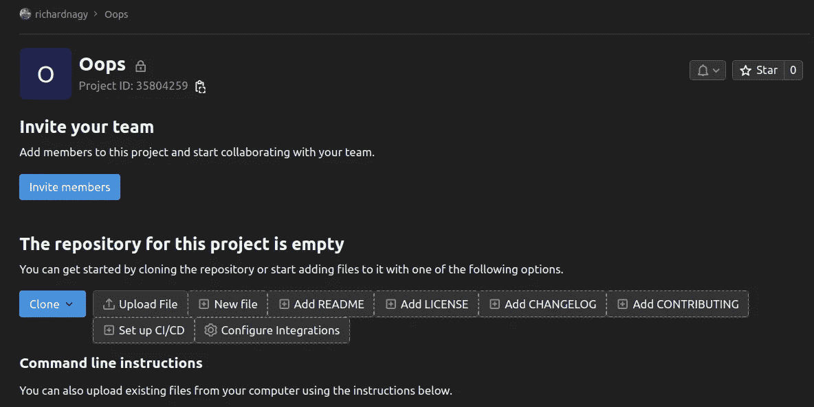
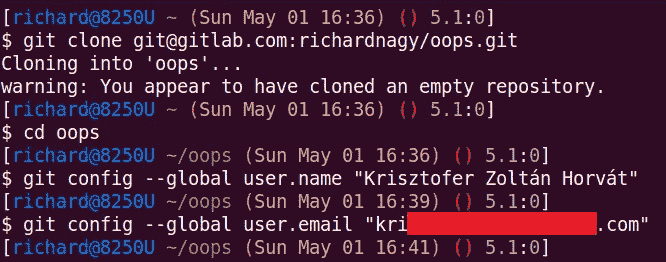
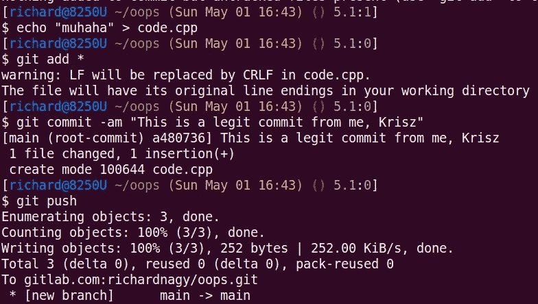
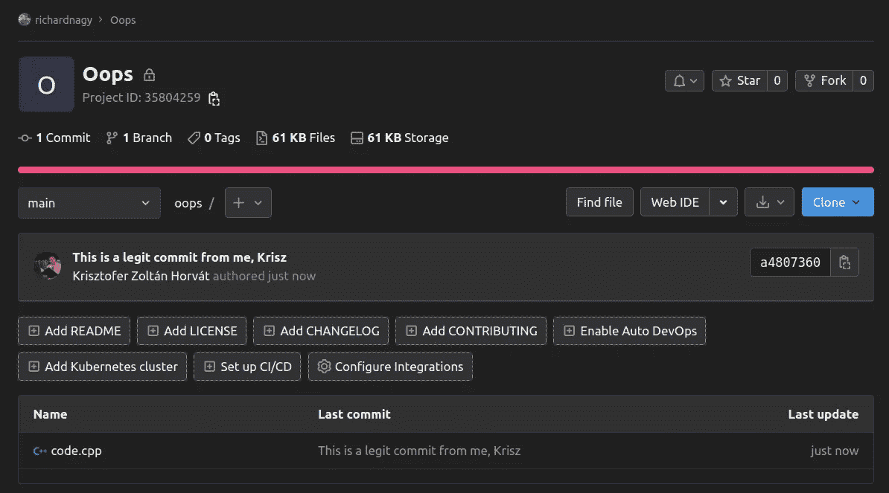

# 为什么以及如何签署所有的 Git 提交

> 原文：<https://betterprogramming.pub/why-and-how-you-should-sign-all-your-git-commits-94435516edae>

## 保护您的存储库


卡斯帕·卡米尔·鲁宾在 [Unsplash](https://unsplash.com?utm_source=medium&utm_medium=referral) 上的照片

如果你花了一些时间在公共在线知识库上，比如 GitLab 或 GitHub，你可能会注意到贡献者提交的绿色“已验证”徽章。


GitLab 中提交旁边的已验证徽章

除了美观之外，它们还有一个真正的用途。Git 本身并不跟踪和验证用户的提交操作。这意味着您可以轻松地冒充其他人并以他们的名义提交。

让我举个例子来说明这一点。

在这里，我在 GitLab 个人资料中创建了一个名为“Oops”的新存储库:



新的远程存储库

然后，我克隆了存储库，并将我的身份设置为与我的一个朋友相同的名称和电子邮件地址，他也有一个 GitLab 帐户。



将我的身份设置给其他人

之后，我可以只做一些更改，然后提交并将它们推送到中央存储库。如您所见，git 没有进行额外的验证来确保我确实是我所声称的用户。



添加提交和推送

之后，我返回到我的存储库的 web UI，这是我的提交。



GitLab 上可见假冒提交作者

如你所见，GitLab(或任何其他相关的存储库)甚至还额外添加了其他账户的图片，使得提交看起来更加合法。

这导致了两个严重的问题:

*   用户可以“匿名”提交，这使得跟踪谁真正提交了(有时是恶意的)变更变得几乎不可能。
*   它让用户对他们的工作有了可信的否认。他们可能会声称犯下这一罪行的不是他们，谁又能说是他们干的呢？

这是一个严重的问题，尤其是当存储库有多人在处理它的时候。

也就是说，我们如何签署我们的提交，这到底意味着什么？

如果不了解公钥加密的数学知识，当您发出 commit 命令时，您会保存更改以及对具体更改内容的简短描述。然后，您可以计算每封邮件的散列值，并用您的密钥对它们进行加密。如果有人看到您的加密签名并用您的公钥解密，并且哈希匹配，那么有两种可能:

*   提交是由他们声称的人发出的，
*   用户的私钥被盗。

显然，我们仍然不能确定这不是第二种选择，但是仅仅从某人的计算机中窃取密钥并不是一件容易的事情，尤其是如果你想要一个特定的人的密钥。

简而言之，如果它是用有效的签名签署的，我们可以确定它是由他们声称的那个人发出的。

既然我们已经确定了为什么您应该始终为每个人设置一个策略来签署他们的提交，那么让我们看看您如何能够做到这一点。

我们将使用免费的 GNU 隐私卫士 GPG，它经常被用来加密、解密和签署信息，并被认为是这类任务的行业标准。

您需要的工具:

*   本地安装的 Git 客户端
*   一个你用起来得心应手的终端软件(bash，Windows 终端)
*   远程存储库帐户(例如:GitLab、GihHub、…)
*   软件包管理器(用于 Linux 或 Windows 的 apt/winget)

解决这个问题后，按照以下步骤设置您的 GPG 和 git 环境。

## **1。在你的系统上安装 GPG**

Linux : `sudo apt install -y gnupg`

> 视窗:`winget install GnuPG.Gpg4Win`

## **2。生成密钥对**

```
gpg --full-generate-key
```

GPG 会问你几个关于密钥性质的问题。我不会介绍所有的步骤，但是我建议(在 2022 年)使用一个 4096 位的 RSA 密钥，没有有效期，有一个强密码。此外，确保您的真实姓名和电子邮件地址值与您在远程存储库中使用的完全匹配。

## **3。获取您的密钥 ID**

```
gpg --list-secret-keys --keyid-format=long
```

这个命令应该产生类似如下的输出:(当然不会相同，因为您的密钥与我的不同):

```
gpg: checking the trustdb
gpg: marginals needed: 3  completes needed: 1  trust model: pgp
gpg: depth: 0  valid:   1  signed:   0  trust: 0-, 0q, 0n, 0m, 0f, 1u
/home/richard/.gnupg/pubring.kbx
------------------------------
sec   rsa4096/9CA6B5740A261A53 2022-04-27 [SC]
      F84FEAA74A29DE3A029275529C66B1749A561A22
uid                 [ultimate] Richard Antal Nagy (gitlab.com/richard-nagy) <nagy.richard.antal@gmail.com>
ssb   rsa4096/9238CFF755296971 2022-04-27 [E]
```

现在记下您在以`sec`开头的行中找到的密钥 ID，不包括您生成的密钥类型。我的情况是:`9CA6B5740A261A53`

## **4。导出公钥**

```
gpg --armor --export KEY_ID
```

用您的密钥 ID 替换`KEY_ID`部分，并复制包括破折号在内的输出。进入您的存储库配置文件，并在帐户设置中添加此 GPG 键。在 GitLab 中，可以通过以下链接访问:[https://gitlab.com/-/profile/gpg_keys](https://gitlab.com/-/profile/gpg_keys)

如果您在密钥中添加了过期日期，那么在您的个人资料中设置该日期也很有用。

现在您已经添加了您的公钥，任何人都可以公开验证您的签名。我的公钥在以下链接中:

[https://gitlab.com/richard-nagy.gpg](https://gitlab.com/richard-nagy.gpg)

这是预期的行为，因此得名:“公钥”。任何人都可以看到。

## **5。设置 git 签名**

最后，我们需要告诉我们的本地 git 客户端我们想要签署所有的提交。发出以下命令，但记住再次替换`KEY_ID`。

```
git config --global user.signingkey KEY_ID
git config --global commit.gpgsign true
```

如果您使用的是 Windows 系统，有时 git 找不到 gpg 实用程序。如果您在提交后得到一个错误，说没有找到私钥，那么您需要在 PowerShell 中显式设置可执行文件路径:

```
git config --global gpg.program "C:\Program Files (x86)\GnuPG\bin\gpg.exe"
```

如果没有使用默认安装目录，请确保替换该路径。

至此，你大功告成！我建议建立一个快速测试存储库，并尝试发布一个签名的 commit 来检查一切工作是否正常。

如果您在您的私钥中添加了一个密码短语，您可能会发现如此频繁地写入您的密钥是很乏味的。为了给自己一些时间缓冲，只需在`~/.gnupg/gpg-agent.conf`中添加以下几行即可

```
default-cache-ttl 86400
max-cache-ttl 86400
```

这将设置一个 1 天的时间窗口(以秒为单位),让您的 gpg 记住您的密码。如果给定的文件不存在，就自己创建。

如果超时似乎不起作用，您可以重新启动系统或只重新启动 GPG 服务:

```
gpgconf --kill gpg-agent
```

感谢您阅读文章，希望您觉得有用！

如果你有，请考虑[请我喝咖啡](https://www.buymeacoffee.com/dubniczky)，☕干杯！

# 问题和答案

## 当我想迁移到新系统时，我可以运送密钥吗？

可以，但请确保不要将私钥上传到任何在线网站或服务。使用加密的笔驱动器或安全的通信通道。

导出:`gpg --export-secret-keys KEY_ID > private.gpg`

进口:`gpg --import private.gpg`

## 我可以在我不信任的系统上安装它吗？

不。不要让任何系统访问你不管理和不信任的私钥。

## 为什么这是安全的？

RSA 利用素数[整数分解问题](https://en.wikipedia.org/wiki/Integer_factorization)，这意味着如果使用非量子方法在合理的时间内数字足够大，则无法使用加密数据和公钥(即使我们知道原始消息)来计算私钥。这些数字相当大。在开发时，您通常使用 32 或 64 位整数，您的密钥将使用 4096 位。