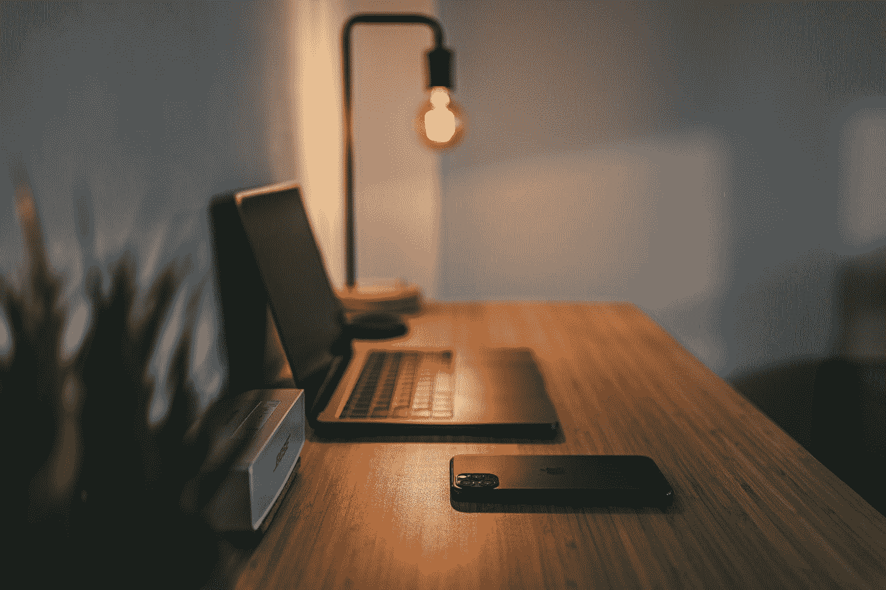

# 为什么我们如此害怕没有生产力？

> 原文：<https://betterprogramming.pub/why-are-we-so-afraid-of-being-unproductive-7f3624d4776f>

## 生产力被高估了。我们不需要一直成长和进化，懒惰也没关系

照片由[雷米 _ 洛兹](https://unsplash.com/@axellvak?utm_source=medium&utm_medium=referral)在 [Unsplash](https://unsplash.com?utm_source=medium&utm_medium=referral) 上拍摄

在开始我的咆哮之前，一些免责声明:我不鼓励懒惰。我不同意没有做好你该做的工作。你不应该每顿饭都吃垃圾食品，但是如果你想的话，偶尔吃吃也是可以的。只要你能在日常生活中进行一些体育活动，花时间在沙发上什么也不做也没关系。

一个简单的词描述了我想说的一切:适度。生活中的一切都要适度。你喜欢你的工作，你喜欢汉堡包，但是吃太多会让你生病的。

让我们也诚实地面对自己，接受我们不能一直 100%的付出。

# 第 1 部分:一些流行的心态

如今，一切都必须高度优化，每个人都必须尽可能多产。我们所做的每一个行动都必须提升我们自己。我们必须一直学习；我们必须避免无助于我们成长的活动。电子游戏？网飞？伙计，你疯了吗？

作为一名软件开发人员，你应该把所有的空闲时间都花在阅读技术文章和研究最新的工具和技术上。当你不做那件事的时候，你应该锻炼。睡眠被高估了，但是如果你真的睡了，那就放上播客，这样就不会浪费时间。

你是前端开发人员？哦，伙计，那你应该开始使用现在风靡一时的新后端工具了。学习机器学习！不要忘记你每天在`blockchain`上的阅读，尽管你从未计划在这方面做任何事情。你一点都不打算用吗？但是你必须学会所有的东西。你是一个永远的学生。你必须时刻进化，你必须追求成长，你必须不惜一切代价避免懒惰！

…以及其他让人们自我感觉不好的信念。

# 第二部分:悲伤和懒惰是可以的

我厌倦了当今主导世界的生产力崇拜。为什么我们的生活要缺少任何懒惰和悲伤？

我们需要停工！我们需要处理我们的情绪；我们需要倾听自己的心声。哭，喊，吃一桶冰淇淋。你不可能每天都快乐。那将是可怕的。

> 为了衡量我们的幸福，我们到处都需要一些悲伤。

有些日子会很有成效，我们会因为喜欢而拼命工作，但有些日子会慢一些。你昨晚没怎么睡觉，没关系。周一你的工作效率会降低，但周三你会有所弥补。只要你对自己和周围的人诚实——并且你确保你的职责已经完成——你就很好。

工作不应该控制我们的生活——但如果这对你有用，那也没关系！对我来说，就是不行。我不认为自己是工作狂。我喜欢我的工作，我喜欢把它做好。我对自己的职业生涯有未来的计划，但我不认为这些计划值得让我紧张，让我筋疲力尽。

# 第三部分:工作生活平衡

你的雇主希望你一天工作八小时，仅此而已。在这八个小时里，你不应该玩电子游戏或者看《网飞》——你应该工作。

但是在那八个小时之后，享受你的生活。因为我们工作是为了生活，而不是相反。我不认为自己是一个铁杆程序员，我也从来没有想成为一个。我非常尊敬那些一天能工作八个小时以上的人，但是我并不是这样，可能你，也就是读到这篇文章的人，也不是这样。

如果你从未享受到成长的成果，为什么你会成长得如此之快？

# 第四部分:为什么我们称之为“工作-生活平衡”？

工作-生活平衡这个词本质上意味着我们的工作完全不属于我们的生活，但这是不正确的。我们活着，为了生存，我们需要住所、食物和娱乐(以及许多其他东西)。为了购买食物和支付房租或抵押贷款，我们需要钱。我们如何得到钱？我们工作。

把工作视为生活不可或缺的一部分是没问题的。当你工作时，你工作。说我们工作得到报酬或者说钱是我们工作的原因(或者希望是原因之一)并不是什么禁忌。

我知道不是每个人都喜欢自己的工作，但我认为没有人完全喜欢。有些工作比其他工作更讨人喜欢，但没有一份工作是完美的。

因为说到底，说实话:你有工作是因为你需要钱。世界就是这样运转的。当然，如果你喜欢这份工作，这是一份丰厚的奖金。如果你喜欢，你会在空闲时间阅读科技文章，但你的工作毕竟是一份工作，它不应该消耗你。你不应该仅仅为了向雇主证明你在乎而过度工作。如果为了证明你的价值，加班是必要的，那就离开。

# 第五部分:同样，适度

我们需要学会适度。我们可以喝酒，我们可以吃不健康的食物，我们可以偷懒，玩电子游戏，做任何我们想做的事情。但这些不能成为我们的主要职业。我们还必须做一些有回报的事情，一些让我们走出舒适区的困难的事情。但那些东西不应该是我们唯一的关注点！

我想说的是每个人都应该做自己觉得对的事情。

不要仅仅为了提高工作效率而用与工作相关的事情来填满你的空闲时间。躺在你的沙发上，看电视，玩电子游戏，只是和人们在一起，而不做任何与成长相关的事情，这很好。是的，成长必须是我们生活的一部分，但不是生活本身。

仅仅因为你一直让自己忙碌，并不意味着你是有效率的。你只是在累自己，为了什么？

# 第六部分:结论

做你自己，听你想听的。努力工作，但不要太努力。找到你自己的极限——如果你一直感到疲倦，放慢速度。休息一下。只要你的行为没有伤害到你周围的人，你就不会有事。对自己和周围的人诚实。

你对现在的工作很满意，你不打算离开你的舒适区？酷，做自己的事！没有人知道什么对你是最好的，也没有人会因为你做了你想做的事情而让你感觉不好(同样，只要你没有做伤害别人或自己的事情)。

生活中没有什么是永远不变的——无论是好是坏。所以我们不能以一种让我们感到痛苦的方式生活。增长是需要的，但不应该是持续的。有时候你只想享受你所在的地方，这很酷。

我们永远不知道我们会在目前的情况或目前的心态下呆多久。如果你是工作狂，那太好了！如果你不是，那也很好！这个月你只能勉强在规定的时间内完成工作，但是也许下个月，你将成为一台不可阻挡的机器。

# 结尾注释

注意安全，照顾好自己。你可以按照你想要的方式生活，这很好。你不应该自我感觉不好，害怕错过什么，或者害怕自己做得不够。不要拿自己和别人比较——我们每个人都有自己的节奏，现在你在你应该在的地方。

非常感谢你的阅读！你有什么想法？