# 为什么 Art Blocks 在其智能合约中使用 JavaScript

> 原文：<https://betterprogramming.pub/why-art-blocks-uses-javascript-in-its-smart-contract-e252ceb4cf93>

## 艺术阻碍智能合同分解

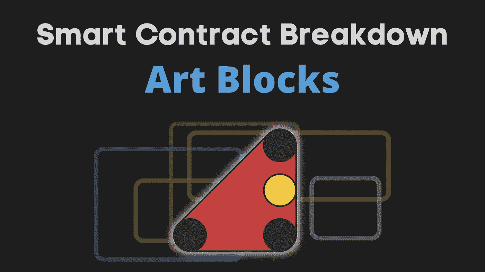

Art Blocks 是一个创建链上创成式 NFT 的平台。但是你知道什么是真正的内链和外链吗？为什么他们的智能合约中需要 JavaScript？

我们将通过打破艺术块的智能合约来找出答案。我们还将了解图像是如何生成/渲染的，以及艺术块在哪里获得生成它们所需的随机性。

这是这篇文章的大纲

*   NFT 标准 ERC-721 的背景
*   艺术块合同源代码
*   创造艺术

# ERC-721—NFT 标准

首先，一点艺术块的背景。

Art Blocks 是一个平台(实际上只是一个智能合同)，在这里你可以创建生成性 NFT。艺术家提交可以生成图像的脚本。Art Blocks 存储这些脚本，当有人想要铸造 NFT 时，它会创建一个独特的哈希。该散列被用作图像生成算法的种子，并且所生成的图像对于 minter 是唯一的。

以下是一些生成图像的示例:

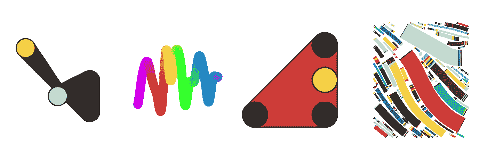

流行艺术块收集:Ringers，铬曲线，Fidenza。

为了理解艺术块智能合同，我们首先需要了解 ERC-721。ERC-721 是用于实现 NFT 智能合同的标准。为了被认为符合 ERC-721 协议，合同需要实现这些功能:

*   `name`和`symbol`是 NFT 描述符。比如对于艺术街区来说，就是“艺术街区”和“街区”。
*   `tokenUri` -令牌元数据的路径(图像 url、稀有属性等)
*   `totalSupply` -统计该合同跟踪的 NFT
*   `tokenByIndex` -返回指定索引处令牌的 tokenId。索引为[0，totalSupply。
*   `tokenOfOwnerByIndex` -枚举所有者的令牌并返回索引处的令牌 Id
*   `balanceOf`-NFTs 所有者的数量
*   `ownerOf` -指定令牌的所有者
*   `approve` -允许他人管理(转让、出售等)自己的代币。由 OpenSea 等第三方用来管理令牌。(有一个类似的函数`setApprovalForAll(address _operator, bool _approved)`，它类似于 approve，但是为所有令牌而不是一个令牌提供许可。为简洁起见跳过)
*   `transferFrom` -转移令牌。呼叫者需要是预先批准的地址。

所有 NFT 智能合同都需要实施 ERC-721 标准。这允许像 OpenSea 这样的第三方以一种标准化的方式与 NFT 合同进行交互(例如，所有的合同将具有相同的`ownerOf`功能)。查看我关于 [BoredApeYachtClub 智能合同分解](https://ilamanov.medium.com/bored-ape-yacht-club-smart-contract-breakdown-6c254c774394)的文章，了解更多关于 ERC-721 标准的信息。

现在让我们来了解 Art Blocks 是如何实现这个标准并创建创成式 NFT 的。

# 艺术块合同源代码

艺术板块的区块链后台仅由一个名为`GenArt721Core.sol`的大型智能合同组成。这份智能合同分为两部分:

1.  实施 ERC-721 标准的合同
2.  主合同`GenArt721Core.sol`负责存储呈现 NFTs 所需的数据

`GenArt721Core.sol`继承自 ERC-721 合同。源代码可以在 [Etherscan](https://etherscan.io/address/0xa7d8d9ef8d8ce8992df33d8b8cf4aebabd5bd270#code) 和 [Github](https://gist.github.com/ilamanov/e4241e5b8afd0cb2341c544363899f8b) 上找到。

> *Art Blocks 还有另外 2 个轻量级合约:* `[*GenArt721Minter*](https://etherscan.io/address/0x091dcd914fceb1d47423e532955d1e62d1b2daef#code)` *(铸造代币并接受支付)和* `*Randomizer*` *(生成伪随机数)。但这些不会在本文中涉及。*

## ERC-721 实施

Art Blocks 使用 OpenZeppelin 的现成[实现来实现 ERC-721 接口。OpenZeppelin 是最常见标准的实现库。](https://github.com/OpenZeppelin/openzeppelin-contracts/blob/master/contracts/token/ERC721/ERC721.sol)

这个实现没有任何惊喜。您期望从标准实施中获得的一切:

*   他们使用映射来管理令牌的所有权:

*   所有权是如何转移的:

*   以及如何管理批准:

*   虽然不是 ERC-721 标准的一部分，但 OpenZeppelin 的 ERC-721 实现包括`mint`和`burn`功能:

*   该实现还有一些映射来存储附加信息(为了简洁起见，将省略这些映射的 setter/getter 函数):

*   最后，这里是 ERC 721 的其余功能:

*   ERC-721 规范剩下的一个函数`tokenUri`，将在本文后面解释。

# 主合同:`GenArt721Core.sol`

man 合同扩展了 ERC-721 合同，增加了艺术块特有的功能:“存储项目信息”和“生成 NFT”。让我们从存储项目信息部分开始。

## 存储项目信息

每个 NFT 系列都被认为是一个独立的项目(如 Chromie Squiggle、Ringers 等)。主合同定义了项目的数据结构:

所有项目的 NFT 都存储在一个大的智能契约中——我们不会为每个集合创建一个新的契约。所有的项目都存储在一个叫做`projects`的大映射中，这里的键就是项目的索引(0，1，2，…):

您可能已经从上面的屏幕截图中注意到，该合同使用了更多的数据结构来跟踪一切:

让我解释一下最后 4 行:

*   `tokenId`是 NFT 的 ID，`projectId`是项目的 ID。该协定跟踪两者之间的双向映射。
*   `hash`是[1]NFT 的索引，2)块号，prev 的块散列的组合的 keccak256 散列值。块，minter 的地址，5)来自随机发生器契约的随机值]。我们一会儿会谈到随机数发生器合同。`hash`值是在 mint 函数中计算的:

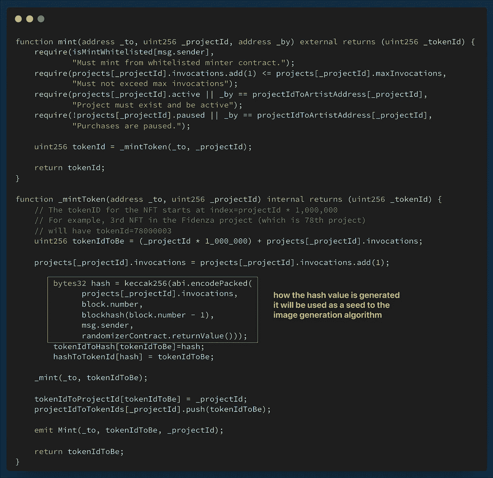

艺术家可以通过一系列设置器来更改项目参数，例如:

但是项目一旦锁定，很多变量就永远无法改变。

这就是“存储项目信息”功能。让我们继续讨论由`GenArt721Core.sol`契约实现的下一个功能。

# 创造艺术

生成艺术的入口点是`tokenUri`函数。这是 ERC-721 标准中的函数之一，应该返回 NFT 的元数据(如图像或属性)。下面是`tokenUri`的实现:

它有许多 if 条件，但本质上只是有条件地构造元数据路径。项目可以选择在 IPFS 上存储元数据(作为图像或 JSON 文件)，或者，如果项目是动态的，元数据可以从传统的 HTTP API 提供。大多数项目都是动态的，所以我们将关注这种情况。

例如，Fidenza 集合(`projectId` =78)具有以下元数据路径:

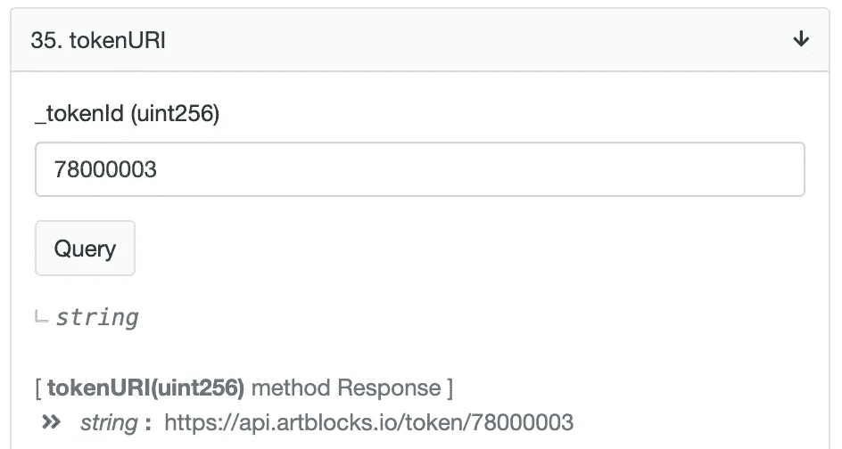

您可以从[以太扫描](https://etherscan.io/address/0xa7d8d9ef8d8ce8992df33d8b8cf4aebabd5bd270#readContract)中获得此信息。只需向下滚动到“tokenURI”。如果我们导航到这个 HTTP 路径，就会得到这个 JSON 文件:

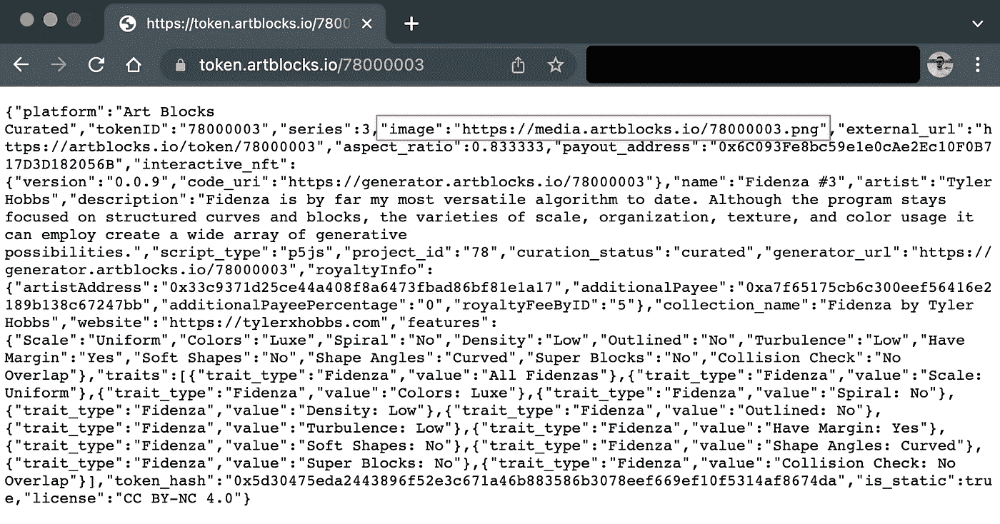

注意，JSON 文件有一堆不同的特征类型和项目描述的信息。它还有一个到实际图像的链接:

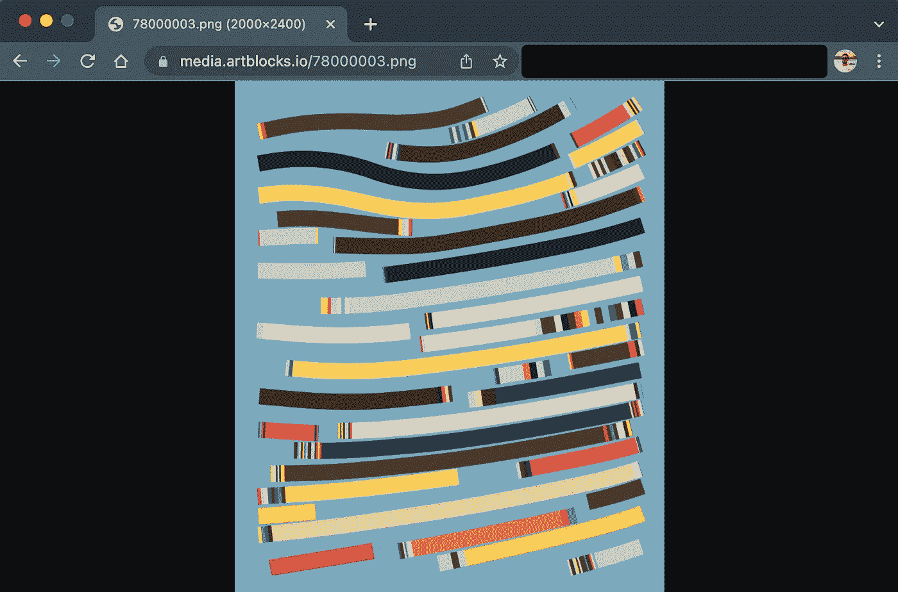

那么，当你购买 NFT 时，你真正拥有的是什么？在这种情况下，您只拥有`tokenId`。`tokenUri`函数然后根据项目设置将`tokenId`映射到 IPFS 或 HTTP 链接。这个链接或者直接指向图像，或者指向一个 JSON，这个 JSON 有属性和一个到图像的嵌套链接。

但是图像是如何生成/渲染的呢？不幸的是，图像不是在链上生成的。智能契约只存储渲染图像所需的 JavaScript 脚本。艺术块的前端然后查询这个脚本，并在其传统的后端，而不是区块链后端按需生成图像。

为什么图像没有在链上生成/渲染？这是因为脚本依赖于库。这些脚本依赖于常见的 JavaScript 库，如 *p5.js* 和 *processing* ，它们通常被设计者用来创建创成式图像。将这些依赖库放在链上是非常昂贵的，这就是为什么图像是离线生成的。

渲染图像的指令(渲染脚本)存储在链上。您可以通过导航到 [Etherscan](https://etherscan.io/address/0xa7d8d9ef8d8ce8992df33d8b8cf4aebabd5bd270#readContract) 上的`projectScriptInfo`来查看存储的脚本。这将向您显示项目脚本需要什么库依赖以及它有多少个脚本(如果脚本太长，它将被分成许多部分):

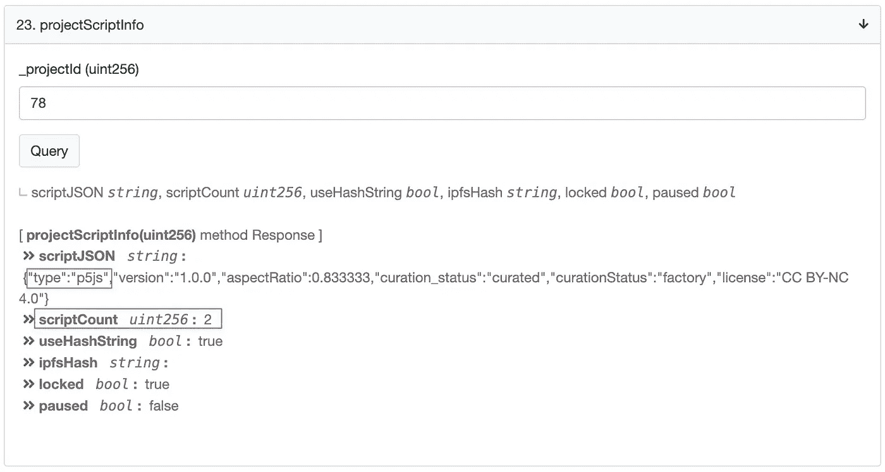

实际的剧本在`projectScriptByIndex`:

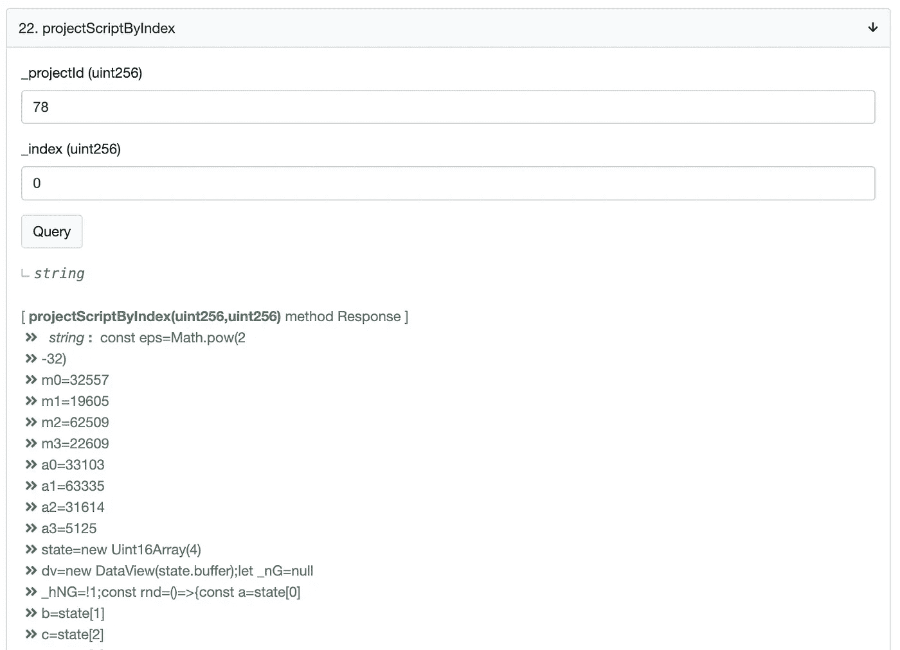

脚本作为普通字符串存储在项目数据结构中:

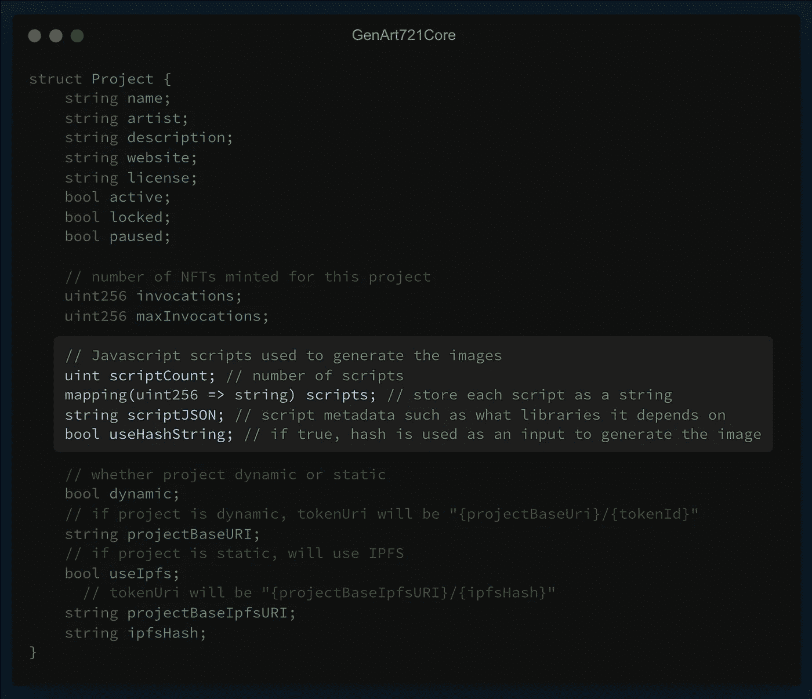

# 随机性是如何产生的？

你可能想知道 NFT 收藏品中的随机图案是如何产生的。当生成图像时，前端不仅仅从智能合同中提取脚本。它还提取散列字符串。还记得哈希字符串吗？

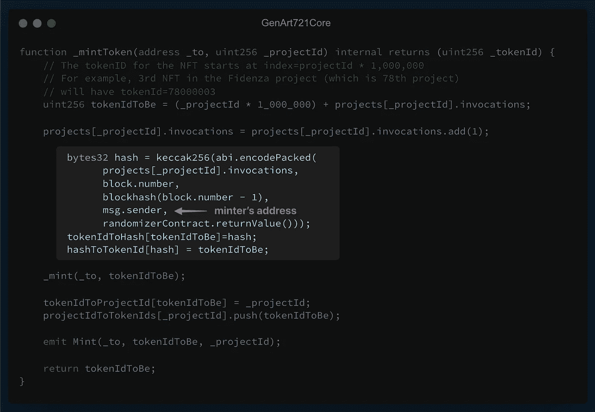

这个散列可以从`tokenIdToHash`映射的契约中读取。哈希字符串在图像生成过程中用作输入/种子。哈希字符串控制图像的参数(例如，铬黄曲线的弯曲程度)。

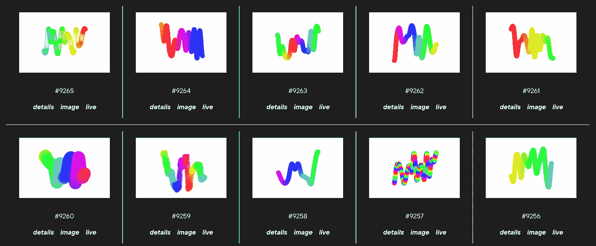

大量的信息被组合起来产生散列。其中一个输入是 minter 的地址。这样，minter 参与图像生成过程，并且 NFT 对于 minter 来说变得唯一。(如果其他人在完全相同的条件下铸造相同的代币，他会得到不同的图像，因为他的地址会不同)。

散列的另一个输入是来自`randomizerContract`的`returnValue`。这个合同似乎不是开源的(没有在 Etherscan 上验证)，所以我们看不到它的代码。但它最有可能是一个伪随机数生成器，它从诸如最后一个铸币厂的块号等来源生成链上的随机数。

这就是艺术块合同的破裂！我希望这有所帮助。如果你有任何问题，请在评论中告诉我。

我计划对流行的智能合约进行更多的分解，比如 UST 算法稳定币和 thirdweb 的 NFT 工厂。

你还可以在 solidnoob.com 的[查看其他智能合同的细目表和更多关于 Solidity noobs 的东西。](https://www.solidnoob.com/)

```
**Want to Connect?**Follow me on [Twitter](https://twitter.com/nazar_ilamanov).
```