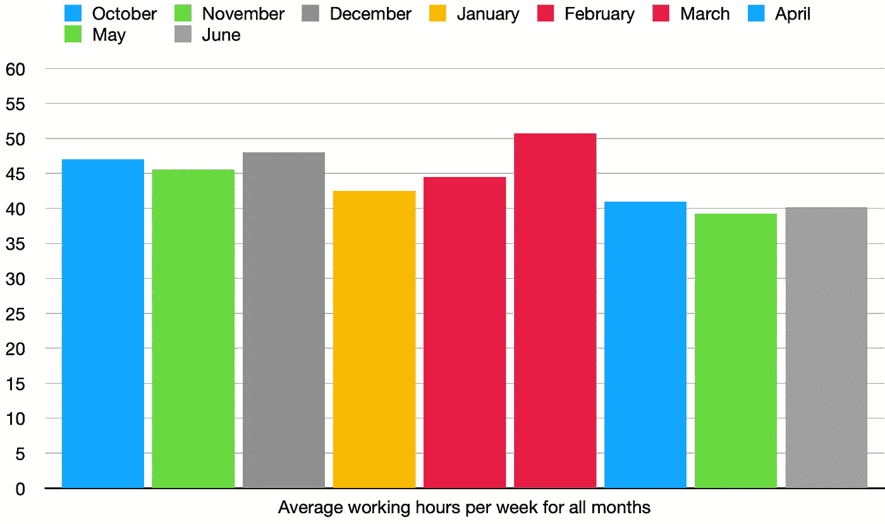

# 为什么咨询公司是软件工程师的好选择

> 原文：<https://betterprogramming.pub/why-consulting-firms-are-a-good-choice-for-a-software-engineer-6be62030b351>

## 一个新的时代即将到来

[JESHOOTS.COM](https://unsplash.com/@jeshoots?utm_source=unsplash&utm_medium=referral&utm_content=creditCopyText)在 [Unsplash](https://unsplash.com/s/photos/business?utm_source=unsplash&utm_medium=referral&utm_content=creditCopyText) 上拍照

我已经在一家咨询公司做了几个月的软件工程师。在这篇文章中，我解释了为什么根据我的经验，为咨询公司工作是一个好的选择。

我们可以将公司分为以下几类:

*   启动
*   大型技术
*   基于产品的公司
*   咨询公司

去年我结束求职时，我收到了柏林一家初创公司、一家基于产品的公司(Zalando)和一家咨询公司的邀请。尽管我听到了一些关于咨询的坏消息，我还是决定去咨询公司。

# 咨询公司重新思考他们的经营方式

咨询公司典型的一周是这样的:

*   周一早上:去见客户(对我来说:从柏林到纽伦堡)
*   周四下午:回到你的家
*   星期五:在家办公或在办公室工作

这个想法是因为员工花很多时间在他们的家乡之外，他们花更多的时间工作。

然而，新冠肺炎改变了它。旅行停止了，它不会回来了。至少不像疫情之前那样。这是为什么呢？

几天前，我们进行了一次公司内部调查。员工们回答了关于商务旅行和工作前景的问题。

结果非常清楚。大多数员工更喜欢在他们的家乡工作，而不是去客户那里。这绝对是事情不会回到疫情之前的主要原因。

另一个原因是咨询公司节省了很多钱。派遣员工到全国各地是昂贵的。

让我们来看看不派我去纽伦堡，我的公司每周节省了多少钱:

*   一家四星级酒店:85€ * 3 晚= **255€** 。
*   从柏林到纽伦堡的单程票价格为:89€。双程机票的价格是 178€。
*   买食物的钱是 150€。
*   从酒店到客户办公室的单程票:2.5€。我们周一、周二、周三和周四每天需要两张，所以:2.5€* 2 * 4 =**20€**。

这加起来就是每周 603€或每月 2412€。

对于像 Senacor 这样年收入 1.4 亿€的公司来说，这似乎不算什么。但是让我们把这个计算扩展到 Senacor 的整个尺寸。

Senacor 目前拥有 650 名员工。假设每周有 475 名员工出差。475 * 2412€ =1 145 700€.这相当于每月 100 多万€。或者每年将近 1400 万€，仅仅是为了把员工送到正确的地点。

我只能从一个软件工程师的角度来说，但这绝对是浪费钱。无论我是在纽伦堡还是在柏林戴上降噪耳机都没有关系。

# 如果工作不令人兴奋，就没有必要跳槽

所有的咨询公司都在不同的行业工作，拥有不同的客户。就我而言，有三个行业:保险、汽车和银行。

从一开始，我就在银行部门为同一个客户工作。但是在咨询公司工作让我可以转换项目，让自己接触新的技术和团队。

我相信其他公司也可以提供这种选择。然而，在咨询行业，切换到另一个项目通常伴随着你正在工作的客户的切换。

这改变了你的整个工作环境。这相当于换了一份工作。在其他公司，你可以内部调动到另一个团队，那里的工作环境很可能与你的旧团队相似。

当然，并不是每个人都喜欢改变工作环境的想法。但它绝对是一个很好的附件。

# 工作生活平衡存在

我们都知道谣言:

> 在咨询业，你每周将工作 60 个小时，拥有工作与工作的平衡，而不是工作与生活的平衡。

在我签合同之前，我和人力资源部的负责人通了电话。我们通过电话澄清了我所有的疑问。在那次电话中，我问了一些关于工作与生活平衡的问题，以及是否有关于平均工作时间的统计数据。

没有。所以我记录了自己过去几个月的工作时间。

老实说，在写这篇博客文章之前，我认为我的平均工作时间会更短。

不过，让我们记住几件事。

这是我大学毕业后的第一份工作。所以在最初的三个月里，一切对我来说都非常令人兴奋和新鲜。显然，我想好好表现。正如我们从图表中看到的，我每周总是工作超过 45 个小时。

唯一一个我每周工作超过 50 小时的月份是三月。这样做的原因是，我负责 2021 最重要的功能之一的初始设计。

由于其他开发人员的许多代码贡献都是基于我最初的设计决策，所以我必须从一开始就把它做好。否则，重构一切的代价将会太大。

但是我意识到，从长远来看，这么多的工作是不可持续的。所以我在四月、五月和六月缩小了规模。

当我工作时，我希望尽可能高效和专注地工作。我工作得越多，注意力就越不集中。这就是我每周平均工作时间保持在 40 小时左右的原因。

通过做生活中的其他事情来给自己充电让我保持动力。每个公司都应该知道，长时间工作是没有意义的。

然而，如果需要的话，我并不害怕投入额外的时间和高强度的工作。

# 旅行其实没那么糟糕

我只有一周典型的疫情之前的咨询生活，在那里我拜访了客户的办公室。

老实说，旅行并没有那么糟糕。一切都为我准备好了。火车票和酒店都给我订好了。我每天都在酒店吃美味的早餐。午餐和晚餐，我在外面吃。每天我的房间和床都被打扫。我有桑拿浴室和游泳池。

我不介意一周的旅行。但是如果我不得不每周都做，那就太麻烦了。

未来还会有混动车型。我们会去客户的办公室，但不是每周都去。更像是每个月一周。这对我来说是合理的，只会对员工和地球产生积极的影响。

# 学会和商务人士一起工作

我当前团队的工作是实现客户 IT 基础设施的现代化。我们在一个高度敏捷的 scrum 团队中工作。我们有九个工程师，两个产品负责人，一个技术产品负责人和一个 scrum 大师。

所有的工程师要么来自我的公司，要么来自另一家咨询公司。产品负责人和 scrum master 来自客户的公司。

这种团队设置会导致利益冲突。产品所有者希望我们尽快完成功能。对他们来说，有时很难理解为什么某些看似琐碎的任务会比他们预期的时间长。

作为工程师，我们总是希望以最好的方式构建新功能，将技术债务保持在最低水平，并拥有一个长期可持续的解决方案。

以这种方式构建解决方案需要花费大量时间。他们付钱给我们的时间。因此，我们必须通过快速给出一个好的解决方案来找到一个折衷方案，但这在将来也是可维护的。

以下是我在过去几个月里学到的一些有价值的东西:

*   如何轻松解释复杂的技术概念:每当我与非技术人员交流时，我都会尽量选择简单的词语。我做得越多，就越好。
*   **如何说“不”:**我们团队的工作关系非常好。然而，产品负责人有一些小技巧来挤出额外的工作。如果我认为这一点点额外的工作太费事，并且延误了其他功能的实现，我会发表我的意见。
*   **取悦客户:**是的，有时候说“不”很重要。然而，有时候我想额外工作两个小时，让我的实施脱颖而出。特别是当涉及到 UI 和前端工程时，有很多可能让客户高兴。
*   学会相信自己的技术能力:有时客户会要求我帮忙解决问题。我尽量避免说:“我不知道。”相反，我想通过说出我知道的和不知道的来给出有用的建议。如果我真的不知道如何解决这个问题，我会大声说出我的大脑在想什么。我称之为“想法反弹”客户可能会领会我说的一些东西，并在此基础上形成一个新的想法。然后我根据他的想法得到了一些新的见解。这将持续下去，直到我们一起找到解决办法。

# 结论

当我开始找工作时，我没想到我会进入咨询行业，但我不后悔我的决定。由于新冠肺炎，典型的“4 天客户周”结束了。这使得咨询对软件工程师来说更有吸引力。对我来说，工作与生活的平衡很好，有很大的空间让我成长和证明自己。拥有一个由两家公司组成的团队很有趣，并且提供了很多机会来提高我的工程技能和软技能。